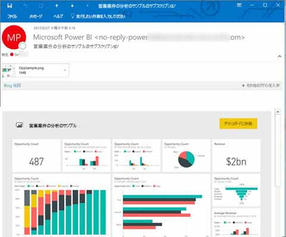
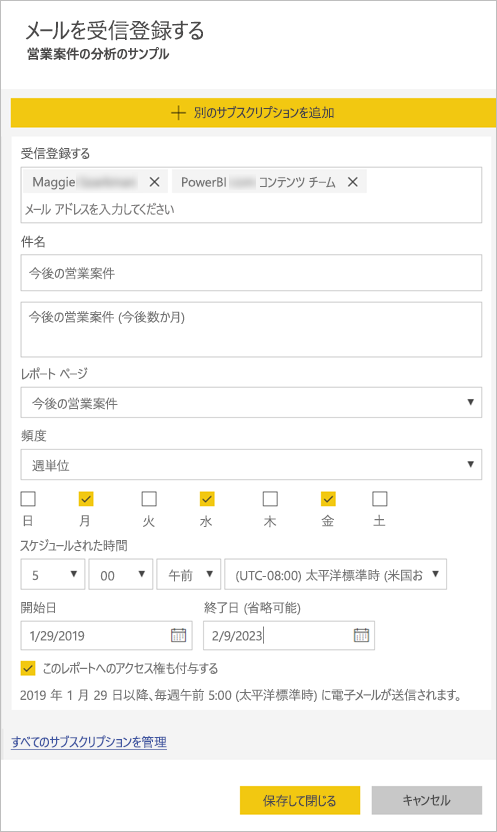

# Power BI サービスのレポートとダッシュボードを自分および他のユーザーがサブスクライブする

最も重要なレポート ページ、ダッシュボード、およびページ分割されたレポートを自分と同僚がサブスクライブすることができます。 スナップショットは Power BI によってメールで自分の受信トレイに送信されます。 メールを受信する頻度 (毎日、毎週、最初のデータ更新後に 1 日 1 回) を Power BI に指示します。  毎日または毎週を選択する場合は、サブスクリプションを実行する時刻を選択できます。  いずれの場合も、すべてのレポート ページとダッシュボードに、1 日あたり最大 24 個の異なるサブスクリプションを設定できます。

 

サブスクリプションを作成できるのは、Power BI サービスでのみとなります。 レポートまたはダッシュボードを開くためのリンクを含む、レポート ページまたはダッシュボードのスナップショットを含むメールを受信します。 Power BI アプリがインストールされたモバイル デバイスでこのリンクを選ぶと、Power BI Web サイトでレポートまたはダッシュボードが開くのではなく、Power BI アプリが起動します。

## 要件

- サブスクリプションの**作成**は、Power BI Pro の機能です。
- ご自分のサブスクリプションを作成する場合は、コンテンツ (ダッシュボードまたはレポート) に対する編集アクセス許可は必要ありませんが、他のユーザー用に作成する場合は、編集アクセス許可が必要です。 

## ダッシュボード、レポート ページ、またはページ分割されたレポートをサブスクライブする

ダッシュボード、レポート、またはページ分割されたレポートのいずれをサブスクライブする場合でも、そのプロセスは似ています。 同じボタンで、Power BI サービスのダッシュボードとレポートをサブスクライブすることができます。

ページ分割されたレポートのサブスクライブの場合、若干異なります。 詳細については、「[Subscribe yourself and others to a paginated report in the Power BI service](paginated-reports-subscriptions.md)」(Power BI サービスのページ分割されたレポートを自分および他のユーザーがサブスクライブする) を参照してください。
 
.

1. ダッシュボードまたはレポートを開きます。
2. 上部のメニュー バーで **[受信登録する]** または封筒アイコン ![[受信登録する] アイコン](media/service-report-subscribe/power-bi-icon-envelope.png) を選択します。
   
   

3. 黄色のスライダーを使うと、サブスクリプションのオン/オフを切り替えることができます。  スライダーを **[オフ]** にしても、サブスクリプションは削除されません。 サブスクリプションを削除するには、ごみ箱アイコンを選択します。

4. メールは既に **[受信登録する]** ボックスにあります。 他のメール アドレスをサブスクリプションに追加することもできますが、それは同じドメインの場合のみとなります。 レポートまたはダッシュボードが [Premium 容量](service-premium-what-is.md)でホストされている場合は、他の個別のメール アドレスとグループのエイリアスをサブスクライブすることができます。 レポートまたはダッシュボードが Premium 容量でホストされていない場合は、他の個別のものをサブスクライブすることはできますが、Power BI Pro のライセンスも必要になります。 詳細については、「[考慮事項とトラブルシューティング](#considerations-and-troubleshooting)」を参照してください。 

5. メールの **[件名]** と **[メッセージ]** の詳細を入力します。 

5. サブスクリプションの **[頻度]** ( **[毎日]** 、 **[毎週]** 、 **[データ更新後 (毎日)]** ) を選択します。  特定の日にのみ、サブスクリプション メールを受信するには、 **[毎週]** を選択し、受信する曜日を選びます。  たとえば、平日にのみサブスクリプション メールを受信する場合は、 **[毎週]** を選択し、 **[土]** と **[日]** のボックスをオフにします。  

6. **[毎日]** または **[毎週]** を選択する場合は、サブスクリプションの **[スケジュールされた時間]** を選ぶこともできます。  毎時 0 分、15 分、30 分、または 45 分に実行するようにします。  午前 (AM) または午後/夜間 (PM) を選択します。 タイム ゾーンも指定できます。

7. 既定では、サブスクリプションの開始日は、作成日となります。 終了日を選ぶこともできます。 終了日を設定しない場合は、自動的に終了日が開始日から 1 年後となります。 サブスクリプションが終了する前に、(9999 年までの) 将来の任意の日付に変更することができます。 サブスクリプションは、終了日に達すると、再度有効にするまで停止します。 スケジュールされた終了日の前に、延長するかどうかを確認する通知を受信します。    

    下のスクリーンショットでは、レポートをサブスクライブすると、実際にはレポート *ページ*をサブスクライブしていることがわかります。  レポートの複数のページをサブスクライブするには、 **[Add another subscription]\(別のサブスクリプションを追加\)** を選択し、別のページを選択します。 
      
     

7. **[保存して閉じる]** を選びます。 サブスクライブしているユーザーは、選択された頻度と時刻で、ダッシュボードまたはレポート ページのメールとスナップショットを受信します。 いずれの場合も、レポートまたはダッシュボードごとに最大 24 個のサブスクリプションを作成でき、サブスクリプションごとに一意の受信者、時刻、および頻度を指定できます。  ダッシュボードまたはレポートの **[データ更新後]** に設定されたすべてのサブスクリプションでは、最初のスケジュールされた更新後にのみ、引き続きメールが送信されます。   
      
   > [!TIP]
   > サブスクリプションからすぐに、またはオンデマンドで随時、メールを送信したいですか。 送信したいダッシュボードまたはレポートのサブスクリプションの **[今すぐ実行]** を選択してください。 その特定のサブスクリプションに対するすべてのユーザーにメールが送信されていることを示す通知が表示されます。  これは必要に応じて何度でも実行できます。 これは、レポートまたはダッシュ ボードごとに設けられている 1 日あたり 24 回のスケジュールされたサブスクリプション実行の制限にはカウントされません。 これにより基になるデータセットのデータ更新がトリガーされることはありません。 
   > 
   > 
   
## メールの言語

メールとスナップショットでは、Power BI 設定で指定されている言語が使用されます (「[Power BI でサポートされる言語と国/地域](supported-languages-countries-regions.md)」を参照)。 言語が定義されていない場合、Power BI では現在のブラウザーのロケール設定に基づいて言語を使用します。 言語の優先順位を表示または設定するには、歯車アイコン  >  **> [設定] > [全般] > [言語]** の順に選択します。 

## サブスクリプションを管理する
サブスクリプションを管理できるのは、それを作成したユーザーのみです。  サブスクリプションの管理画面には、2 とおりの方法でアクセスできます。  最初の方法は、 **[メールを受信登録する]** ダイアログから **[すべてのサブスクリプションを管理]** を選択することです (上記の手順 4 の下にあるスクリーンショットを参照)。 2 つ目の方法は、上部のメニュー バーから Power BI 歯車アイコン  を選択し、 **[設定]** を選択することです。

![[設定] の選択](media/service-report-subscribe/power-bi-subscribe-settings.png)

表示される特定のサブスクリプションは、現在アクティブになっているワークスペースによって変わります。  すべてのワークスペースのすべてのサブスクリプションを一度に表示するには、 **[マイ ワークスペース]** をアクティブにします。 ワークスペースの概要については、「[Workspaces in Power BI](service-create-workspaces.md)」 (Power BI のワークスペース) を参照してください。

Pro ライセンスの有効期限が切れた場合、所有者がダッシュボードまたはレポートを削除した場合、またはサブスクリプションの作成に使われたユーザー アカウントが削除された場合、サブスクリプションは終了します。

## 考慮事項とトラブルシューティング

* ダッシュボードに含まれるピン留めされたタイルが 25 個より多い場合、またはピン留めされたライブ レポート ページが 4 個より多い場合は、ユーザーに送信されたサブスクリプション電子メールで完全にレンダリングされない可能性があります。  これらのタイル数を超えたダッシュボードのサブスクリプションはブロックされません。 ただし、問題が発生した場合はサポート対象外と見なされます。 サポートされている範囲内となるよう適宜修正することを検討してください。
* これはサブスクリプション ジョブが開始するタイミングです。 特定のシナリオでは電子メールが受信トレイに配信されるまで数分かかる場合があります。
* まれに、電子メール サブスクリプションが受信者に配信されるのに 15 分以上かかる場合があります。 これが発生した場合、データ更新と電子メール サブスクリプションを別のタイミングで実行し、確実にタイムリーに配信されるようにすることをお勧めします。 問題が解決しない場合は、Power BI サポートにお問い合わせください。
* ダッシュボード メールのサブスクリプションについては、行レベルのセキュリティ (RLS) が適用されているタイルがある場合、そのタイルは表示されません。  
* レポート メールのサブスクリプションについては、データセットで RLS が使用されている場合、自分用のサブスクリプションを作成することができます。 行レベルのセキュリティ (RLS) を適用しているレポートに対して他のユーザーをサブスクライブすることはできません。
* レポート ページのサブスクリプションは、レポート ページの名前に関連付けられています。 レポート ページにサブスクライブしてから、名前を変更する場合は、サブスクリプションを再作成する必要があります。
* 所属組織が Azure Active Directory 内の特定の設定を構成することで、Power BI でメール サブスクリプションを使用するための機能が制限される場合があります。  これらの制限には、リソースにアクセスするときの多要素認証や IP 範囲の制限が含まれますが、その限りではありません。
* 現時点では、自分以外のユーザーがサブスクライブしているときに、ライブ接続データセットを使用してのレポート/ダッシュ ボードのメール サブスクリプションがサポートされていません。
* メール サブスクリプションでは、ほとんどの[カスタム ビジュアル](power-bi-custom-visuals.md)がサポートされていません。  例外は[認定](power-bi-custom-visuals-certified.md)されているカスタム ビジュアルです。  
* メール サブスクリプションでは、この時点では、R を利用したカスタム ビジュアルはサポートされていません。  
* メール サブスクリプションは、レポートの既定のフィルターとスライサーの状態で送信されます。 サブスクライブした後に既定値を変更しても、メールには反映されません。    
* ダッシュボードのサブスクリプションに限り、特定の種類のタイルはまだサポートされていません。  ストリーミング タイル、ビデオ タイル、カスタム Web コンテンツ タイルなどです。     
* 同僚とテナントの外部でダッシュボードを共有する場合、その同僚のサブスクリプションも作成できません。 そのため、たとえば、aaron@xyz.com は anyone@ABC.com と共有はできますが、anyone@ABC.com をサブスクライブできず、共有コンテンツもサブスクライブできません。      
* Power BI では、2 か月より長くアクセスされていないダッシュボードおよびレポートに関連付けられているデータセットの更新を自動的に一時停止します。  しかし、ダッシュボードまたはレポートにサブスクリプションを追加した場合は、アクセスがなくても一時停止されません。    
* サブスクリプション メールが送られてこない場合は、ユーザー プリンシパル名 (UPN) でメールを受信できることを確認してください。 [Power BI チームはこの要件を緩和する作業を行っている](https://community.powerbi.com/t5/Issues/No-Mail-from-Cloud-Service/idc-p/205918#M10163)ので、お待ちください。 
* ダッシュボードまたはレポートが Premium 容量にある場合は、一度に同僚の 1 件の電子メール アドレスをサブスクライブする代わりに、サブスクリプションのグループのメール エイリアスを使用できます。 このエイリアスは現在の Active Directory に基づいています。 

## 次の手順

- [Power BI サービスのページ分割されたレポートを自分および他のユーザーがサブスクライブする](paginated-reports-subscriptions.md)
- 他にわからないことがある場合は、 [Power BI コミュニティで質問してみてください](http://community.powerbi.com/)。    
- [ブログの投稿をお読みください](https://powerbi.microsoft.com/blog/introducing-dashboard-email-subscriptions-a-360-degree-view-of-your-business-in-your-inbox-every-day/)
