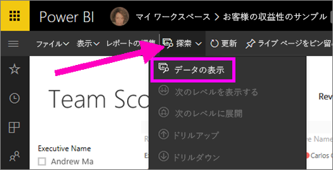
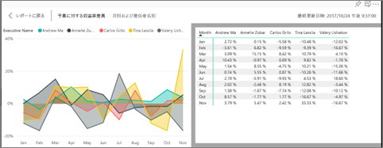
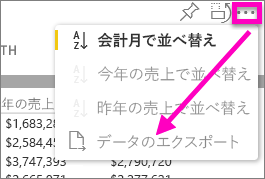

# ビジュアルの作成に使用されたデータを表示する
## データの表示
Power BI のビジュアルは、データセットからのデータを使用して作成されます。 目に見えない部分を確認する場合は、ビジュアルの作成に使用されているデータを Power BI によって*表示*することができます。 **[データの表示]** を選択すると、ビジュアルの下 (または横に) データが表示されます。

また、ビジュアルの作成に使用されているデータを .xlsx ファイルまたは .csv ファイルとしてエクスポートして Excel で表示することもできます。 詳細については、「[Power BI ビジュアルからデータをエクスポートする](power-bi-visualization-export-data.md)」を参照してください。

> [!NOTE]
> [*データの表示*] と [*データのエクスポート*] は両方とも、Power BI サービスと Power BI Desktop で使用できます。 ただし、Power BI Desktop では、詳細を示すレイヤーが 1 つ追加されています。[[*レコードの表示*] にはデータセットからの実際の行が表示されます](desktop-see-data-see-records.md)。
> 
> 

## Power BI サービスでの [*データの表示*] の使用
1. Power BI サービスの[読み取りビュー](service-report-open-in-reading-view.md)または[編集ビュー](service-reading-view-and-editing-view.md)でレポートを開き、ビジュアルを選択します。  Power BI Desktop でレポート ビューを開きます。
2. ビジュアルの背後にあるデータを表示するには、**[探索]** > **[データの表示]** の順に選択します。
   
   
3. 既定では、データはビジュアルの下に表示されます。
   
   
4. 向きを変更するには、ビジュアルの右上隅にある縦レイアウト  を選びます。
   
   
5. データを .csv ファイルにエクスポートするには、省略記号を選択し、**[データのエクスポート]** を選択します。
   
    
   
    Excel へのデータのエクスポートの詳細については、「[Power BI ビジュアルからデータをエクスポートする](power-bi-visualization-export-data.md)」を参照してください。
6. データを非表示にするには、**[探索]** > **[データの表示]** の選択を解除します。

### 次の手順
[Power BI ビジュアルからデータをエクスポートする](power-bi-visualization-export-data.md)    
[Power BI レポートでの視覚化](power-bi-report-visualizations.md)    
[Power BI レポート](service-reports.md)    
[Power BI - 基本的な概念](service-basic-concepts.md)    
他にわからないことがある場合は、 [Power BI コミュニティを利用してください](http://community.powerbi.com/)。

