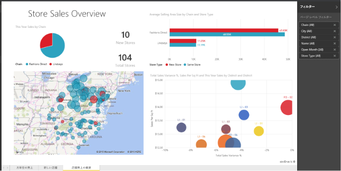

# Power BI のレポート
## Power BI レポートとは
Power BI ***レポート***は、データセットのマルチパースペクティブ表示で、視覚化によってデータセットからのさまざまな発見や洞察を表します。  レポートでは、単独の視覚化を使用することも、各ページでさまざまな視覚化を使用することもできます。 職務に応じて、レポートの*作成者*になる場合と、レポートの*コンシューマー*、つまり使用者になる場合があります。

このレポートには 3 つのページ (またはタブ) があり、現在表示されているのは [Store Sales Overview (店舗売上の概要)] ページです。 このページには 6 つの異なる視覚化とページ タイトルがあります。 視覚化をダッシュボードに*ピン留め*し、ピン留めした視覚化が選択されたときに、その視覚化を使用している元のレポートを開くことができます。

Power BI を初めて使うときは、「[Power BI - 基本的な概念](service-basic-concepts.md)」を読むと基礎がよくわかります。

レポートは Power BI サービスと Power BI Desktop の機能です。 レポートの使用方法は、ほぼ同じです。 ただしモバイルの場合、レポートを作成することはできませんが、[レポートを表示、共有し、注釈を付ける](consumer/mobile/mobile-reports-in-the-mobile-apps.md)ことができます。

## レポートの利点
レポートは、単一のデータセットに基づいています。 レポート内の視覚化は、それぞれがひとかたまりの情報を表します。 視覚化は静的なものではありません。データを追加および削除することや、視覚化の種類を変更することができます。また、フィルターやスライサーを適用してデータを詳しく考察し、洞察を得たり、答えを見つけたりすることもできます。 レポートはダッシュボードと同様に、あるいはそれ以上に、高度な対話機能とカスタマイズ機能を備え、基になっているデータが変化すると視覚化が更新されます。

## ダッシュボードとレポート
[ダッシュボード](service-dashboards.md)も視覚化が表示されたキャンバスであるため、レポートと混同されることがよくあります。 しかし、大きな違いがいくつかあります。  

| **機能** | **ダッシュボード** | **レポート** |
| --- | --- | --- |
| ページ |1 ページ |1 ページ以上 |
| データ ソース |ダッシュボードごとに、1 つ以上のレポートおよび 1 つ以上のデータセット |レポートごとに 1 つのデータセット |
| Power BI Desktop での使用可能性 |いいえ |はい、Desktop でレポートを作成して表示できます |
| ピン留め |現在のダッシュボードの既存の視覚化 (タイル) を他のダッシュボードにピン留めすることだけが可能です |任意のダッシュボードに視覚化を (タイルとして) ピン留めできます。 任意のダッシュボードにレポート ページ全体をピン留めできます。 |
| 購読 |ダッシュボードをサブスクライブすることはできません。 |レポート ページはサブスクライブできます。 |
| フィルター処理 |フィルター処理またはスライスはできません |さまざまな方法でフィルター処理、強調表示、スライスできます |
| 通知の設定 |特定の条件が満たされたときにユーザーにメールを送る通知を作成できます |いいえ |
| おすすめ |1 つのダッシュボードを "おすすめの" ダッシュボードとして設定できます |おすすめのレポートを作成することはできません |
| 自然言語クエリ |ダッシュボードから利用できます |レポートからは利用できません |
| 視覚化の種類の変更 |いいえ。 つまり、レポートの所有者がレポートの視覚化の種類を変更した場合でも、ダッシュボードにピン留めされた視覚化は更新されません |はい |
| 基になっているデータセットのテーブルとフィールドの表示 |いいえ。 データをエクスポートすることはできますが、ダッシュボード自体でテーブルとフィールドを表示することはできません。 |はい。 データセットのテーブル、フィールド、値を表示することができます。 |
| 視覚化の作成 |[タイルの追加] を使ってダッシュボードにウィジェットを追加ことだけできます |編集アクセス許可があれば、さまざまな種類のビジュアルの作成、カスタム ビジュアルの追加、ビジュアルの編集、その他が可能です |
| カスタマイズ |視覚化 (タイル) の移動と配置、サイズ変更、リンクの追加、名前の変更、削除、全画面表示などを行うことができます。 ただし、データと視覚化自体は読み取り専用です。 |読み取りビューでは、発行、埋め込み、フィルター、エクスポート、.pbix としてのダウンロード、関連コンテンツの表示、QR コードの生成、Excel での分析、その他を行うことができます。  編集ビューでは、これまで説明したこと、およびさらに多くのことを実行できます。 |

## レポート***作成者***とレポート ***コンシューマー***
自分の役割に応じて、自分で使用するためにレポートを作成する場合と、同僚と共有するためにレポートを作成する場合があります。 レポートを作成して共有する方法を覚えておく必要があります。 また、他のユーザーからレポートを受け取る場合もあるため、 レポートを理解し、処理する方法を知る必要があります。

役割別にダッシュボードを使い始めるときに役立つトピックを以下に示します。

### レポートを作成して共有する場合
* まず、[Power BI サービスのツアー](service-basic-concepts.md)を利用して、レポートとレポート ツールをどこで探せばよいかを理解します。
* [レポート エディター](service-the-report-editor-take-a-tour.md)のツアーを実行します。
* [データセットから新しいレポートを作成](service-report-create-new.md)する方法を学習します。
* [視覚化レベル、ページ レベル、レポート レベルのフィルターの使用方法を学習します](power-bi-how-to-report-filter.md)。
* [同僚とレポートを共有する](service-share-dashboards.md)さまざまな方法を理解します。

### レポートを受け取って利用する場合
* まず、[Power BI サービスのツアー](service-basic-concepts.md)を利用して、レポートとレポート ツールをどこで探せばよいかを理解します。
* [レポートを開く](service-report-open.md)方法と、[読み取りビュー](service-reading-view-and-editing-view.md)で実行できるすべての対話的操作について学習します。
* いずれかの[サンプル](sample-tutorial-connect-to-the-samples.md)のツアーを利用してレポートに慣れます。  
* レポートが不要になりましたか? その場合は、[削除](service-delete.md)できます。
* レポートでどのデータセットが使われているか、また、どのダッシュボードにレポートからタイルがピン留めされているかを確認するには、[関連するコンテンツを表示](service-related-content.md)します。

> [!TIP]
> 知りたいことがここで見つからない場合は、左側の目次を使用して、*レポート*に関するすべてのトピックから探してください。
> 
> 

## 次の手順
[Power BI とは?](power-bi-overview.md) 

[Power BI - 基本的な概念](service-basic-concepts.md)

他にわからないことがある場合は、 [Power BI コミュニティを利用してください](http://community.powerbi.com/)。

