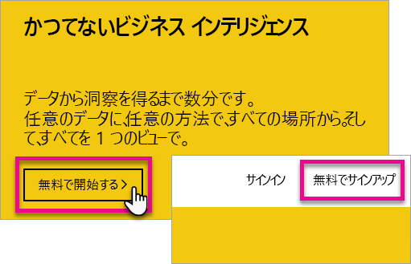
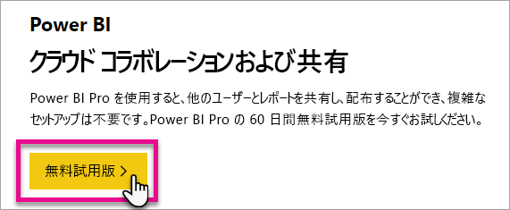
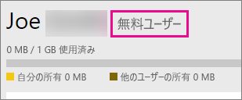
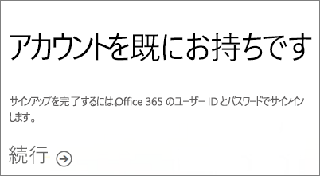

# 個人として Power BI にサインアップする
Power BI にサインアップして、個人用レポートおよび視覚エフェクトのニーズに応じて、Power BI の使用を開始する方法について説明します。

Power BI は、個人用レポートおよび視覚エフェクト ツールのほか、グループ プロジェクト、部門、または会社全体の背後にある分析および意思決定エンジンとしても使用できます。

この記事では、Power BI サービスにサインアップして、サービスの使用を開始する方法について説明します。 Power BI 無料版と Power BI Pro との違いについては、「[Power BI 無料版対 Power BI Pro](service-free-vs-pro.md)」を参照してください。

## 使用できるオプション
個人としてサインアップし、Power BI の使用を開始するためのオプションはいくつかあります。 たとえば、無料でサインアップしたり、Power BI Pro サブスクリプションを購入したりできます。 無料アカウントにサインアップする場合は、サービス内で、Power BI Pro の 60 日間無料試用版を選択できます。

所属する組織で Office 365 が採用されている場合でも、無料アカウントにサインアップできます。 IT 管理者が Power BI Pro を購入して、ライセンスを割り当てるオプションもいくつかあります。 IT 管理者が使用できるオプションについて詳しくは、「[Power BI Pro を購入する](service-admin-purchasing-power-bi-pro.md)」をご覧ください。

> [!NOTE]
> 組織によっては、個々のサインアップが無効になっている場合があります。 サインアップが無効になっていることを示すエラーが表示された場合は、IT 部門に詳細をお問い合わせください。

## サインアップに必要なものは?

Power BI にサインアップするには、職場の電子メール アドレスが必要です。 個人用の電子メール アドレスでは、Power BI にサインアップできません。

### Power BI で使用できる電子メール アドレス
Power BI では、職場または学校用の電子メール アドレスを使用する必要があります。 コンシューマー電子メール サービスまたは通信プロバイダーが提供している電子メール アドレスでは、Power BI にサインアップできません。 これには、outlook.com、hotmail.com、gmail.com などが含まれます。

個人用電子メール アドレスでサインアップしようとすると、職場または学校用の電子メール アドレスの使用を求めるメッセージが表示されます。

> [!NOTE]
> .gov または .mil のアドレスでは、Power BI にサインアップできます。 詳細については、「[Power BI サービスに米国政府組織を登録する](https://docs.microsoft.com/en-us/power-bi/service-govus-signup)」をご覧ください。
>

> [!NOTE]
> サインアップ後に[ゲスト ユーザーを招待](https://docs.microsoft.com/en-us/azure/active-directory/active-directory-b2b-what-is-azure-ad-b2b)すると、個人アカウントを含む任意の電子メール アドレスで Power BI テナントのコンテンツを見ることができます。
>

## 必要なライセンス
各ライセンスの種類の内容を確認して、どれが必要かを判断してください。 無料ユーザーでも、サービスのほとんどの機能を利用できますが、共有およびコラボレーション機能は使用できません。 Power BI Pro ユーザーは、サービスのすべての機能を利用できますが、無料ではありません。 コンテンツを共有する必要がない場合は、無料が適切だと思われます。 詳しくは、[Power BI の料金ページ](https://powerbi.microsoft.com//pricing/)をご覧ください。

この記事の残りの部分では、サインアップ方法をオプションごとに説明します。

## 個人として Power BI (無料) にサインアップする
Power BI にサインアップする最も簡単な方法は、Power BI (無料) アカウントにサインアップすることです。 このアカウントにコストはかからず、サービスで利用できる機能の多くを使用することができます。

> [!NOTE]
> 既に登録されていることを示すメッセージが表示された場合は、 https://app.powerbi.com に移動してサインインをお試しください。
> 
> 

Power BI にサインアップするには、次の操作を行うことができます。

1. [powerbi.com](https://powerbi.microsoft.com) を参照します。
2. **[無料で開始する]** または **[無料でサインアップ]** を選択します。

    
3. 開始ページで、Power BI の **[無料で試す]** を選択します。

    
4. サインアップに使用するメール アドレスを入力して、**[サインアップ]** を選択します。 サインアップで許可される電子メール アドレスを使用してください。 使用できるメール アドレスについて詳しくは、「[Power BI で使用できる電子メール アドレス](#what-email-address-can-be-used-with-power-bi)」をご覧ください。

    
5. メールの確認を求めるメッセージが表示されます。

    
6. メール内のリンクを選択して、メール アドレスを確認します。 これにより、サインアップ フローに戻ります。 自身に関する追加情報を提供しなければならない場合があります。
7. https://app.powerbi.com に戻り、無料のユーザーとして Power BI の使用を開始できます。

### サービス内での表示例
サービス内で無料アカウントがあることを確認するには、**歯車**アイコンをクリックして **[パーソナル ストレージの管理]** を選択します。

### 既存の組織の一部である場合
アカウントが既存の組織の一部である場合は、そのアカウントでサインインするように求めるメッセージが表示されます。 **[続行]** を選択し、Office 365 のログイン情報を使用してサインインします。

**[開始]** を選択するように求めるメッセージが表示されます。

## 現在の Power BI Pro の 60 日間試用版
無料アカウントにサインアップした後、Pro 版を 60 日間無料で試用することができます。 試用期間中は Pro 版のすべての機能にアクセスできます。 Power BI Pro は、無料版 Power BI のすべての機能を備えているだけでなく、新たな共有機能やコラボレーション機能も備えています。 詳しくは、[Power BI の料金](https://powerbi.microsoft.com/pricing)に関するページをご覧ください。 60 日間無料試用版の Power BI Pro を試用するには、Power BI にサインインし、Power BI Pro 機能の 1 つを試してみてください。

* [アプリ ワークスペースの作成](service-create-distribute-apps.md)
* [ダッシュボードの共有](service-share-dashboards.md)

これらの機能を試そうとすると、無料試用版を開始するように求められます。 また、歯車アイコンをクリックして **[パーソナル ストレージの管理]** を選択することによっても使用できます。 その後、右側にある **[Pro を無料でお試しいただけます]** を選択します。

その後、**[無料体験する]** を選択します。

>[!NOTE]
>この製品内 Power BI Pro 試用版を利用するユーザーは、Office 365 の管理ポータルでは Power BI Pro 試用版ユーザーとして表示されません (Power BI 無料版ユーザーとして表示されます)。 ただし、Power BI の **記憶域の管理** ページでは Power BI Pro 試用版ユーザーとして表示されます。

>[!NOTE]
>組織内の各ユーザーに試用期間を個別に設定するのではなく、複数のユーザー向けに Power BI 試用版ライセンスを取得し導入することをお考えの IT 管理者の皆さまは、[Power BI Pro サブスクリプション試用版](https://portal.office.com/Signup/MainSignup15.aspx?OfferId=d59682f3-3e3b-4686-9c00-7c7c1c736085&dl=POWER_BI_PRO)にサインアップしてください。 管理者向け試用版にサインアップするためには、Office 365 グローバル管理者または課金管理者であるか、あるいは新しいテナントを作成する必要があります。 詳しくは、「[Power BI Pro を購入する](service-admin-purchasing-power-bi-pro.md)」をご覧ください。
> 
> [!NOTE]
> Power BI Premium が利用可能になり、2017 年 6 月 1 日に Power BI 無料プランが変更されたことで、Extended Pro Trial の対象となる可能性があります。 詳しくは、「[Extended Pro Trial activation](service-extended-pro-trial.md)」 (Extended Pro Trial のアクティブ化) をご覧ください。
> 
> 

### サービス内での表示例
サービス内で Pro 版の試用アカウントがあることを確認するには、<strong>歯車*アイコンをクリックして **[パーソナル ストレージの管理]</strong> を選択します。

## 完全な Power BI Pro が必要な場合
Power BI Pro ライセンスを個人として取得することはできません。 IT 管理者に連絡して、ライセンスを購入してもらい、さらに自分のアカウントに割り当ててもらう必要があります。 詳しくは、「[Power BI Pro を購入する](service-admin-purchasing-power-bi-pro.md)」をご覧ください。

## トラブルシューティング
多くの場合、Power BI への登録は、上記の単純なセルフサービスのサインアップ プロセスに従うことによって実行できます。 ただし、いくつかの理由で、セルフサービスのサインアップを完了できない場合があります。  サインアップを完了できない場合の一般的な理由の一部と、これらの問題を回避するための方法を次の表にまとめます。

|                                                                                                                                                                                                                          **現象またはエラー メッセージ**                                                                                                                                                                                                                           |                                                                                                                                                                                                                                                                                                                                                **原因と回避策**                                                                                                                                                                                                                                                                                                                                                |
|--------------------------------------------------------------------------------------------------------------------------------------------------------------------------------------------------------------------------------------------------------------------------------------------------------------------------------------------------------------------------------------------------------------------------------------------------------------------------------|------------------------------------------------------------------------------------------------------------------------------------------------------------------------------------------------------------------------------------------------------------------------------------------------------------------------------------------------------------------------------------------------------------------------------------------------------------------------------------------------------------------------------------------------------------------------------------------------------------------------------------------------------------------------------------------------------------------------|
| <strong>個人のメール アドレス (例: nancy@gmail.com)</strong> サインアップ時に次のようなメッセージが表示されます。    "*You entered a personal email address: Please enter your work email address so we can securely store your company's data. (個人のメール アドレスが入力されました: 会社のデータに安全に保存できるように、職場の電子メール アドレスを入力してください。)*"    または    "*That looks like a personal email address. (個人の電子メール アドレスが指定された可能性があります。)Enter your work address so we can connect you with others in your company. (勤務先の他のユーザーと接続できるよう、勤務先のメール アドレスをご入力ください。)And don’t worry. (ご心配なさる必要はありません。)We won't share your address with anyone. (Microsoft では、あなたのメール アドレスを他のだれかと共有することは一切ありません。)*" |                          Power BI は、コンシューマー電子メール サービスまたは通信プロバイダーが提供している電子メール アドレスをサポートしていません。    サインアップを完了させるには、あなたの勤務先または学校から割り当てられているメール アドレスを使用して、もう一度お試しください。    それでもサインアップできず、より高度なセットアップ プロセスを実行する場合は、[新しい Office 365 試用版サブスクリプションに登録して、そのメール アドレスを使用してサインアップしてください](service-admin-signing-up-for-power-bi-with-a-new-office-365-trial.md)。    ユーザー アカウントが [Azure B2B ゲスト](https://docs.microsoft.com/en-us/azure/active-directory/active-directory-b2b-what-is-azure-ad-b2b)として招待されていますか。                           |
|            **セルフサービスのサインアップが無効** サインアップ時に次のようなメッセージが表示されます:     "*We can't finish signing you up. (サインアップを完了できません。)Your IT department has turned off signup for Microsoft Power BI. (あなたの勤務先の IT 部門が、Microsoft Power BI のサインアップを無効にしています。)Contact them to complete signup. (IT 部門に連絡して、サインアップを完了させてください。)*"    または    "*That looks like a personal email address. (個人の電子メール アドレスが指定された可能性があります。)Enter your work address so we can connect you with others in your company. (勤務先の他のユーザーと接続できるよう、勤務先のメール アドレスをご入力ください。)And don’t worry. (ご心配なさる必要はありません。)We won't share your address with anyone. (Microsoft では、あなたのメール アドレスを他のだれかと共有することは一切ありません。)*"             |                             組織の IT 管理者によって、Power BI のセルフサービス サインアップが無効にされています。    サインアップを完了させるには、IT 管理者に連絡して、既存のユーザーが Power BI にサインアップできるようにしたり、新しいユーザーが既存のテナントに参加できるようにしたりするために、下のページの手順を実行するようにご依頼ください。    パートナーを通じて Office 365 にサインアップする場合に、この問題が発生する可能性があります。 [詳細情報](service-admin-syndication-partner.md)    [組織内の Power BI](https://support.office.com/en-ca/article/Power-BI-in-your-Organization-d7941332-8aec-4e5e-87e8-92073ce73dc5#BKMK_HowCanIAllowO365Tenant)                              |
|                                                                                          **メール アドレスが Office 365 の ID ではない** サインアップ時に次のようなメッセージが表示されます:     "*We can't find you at contoso.com. (contoso.com であなたを見つけることができません。)Do you use a different ID at work or school? (勤務先または学校の別の ID を使用しますか?)  Try signing in with that, and if it doesn't work, contact your IT department. (その ID を使用してサインインしてみてください。その ID が機能しない場合は、IT 部門にお問い合わせください。)*"                                                                                           | お客様の組織では、Office 365 と他の Microsoft サービスにサインインするために、メール アドレスと異なる ID を使用しています。  たとえば、メール アドレスが Nancy.Smith@contoso.com で、ID が nancys@contoso.com の場合です。    サインアップを完了させるには、Office 365 または他の Microsoft サービスにサインインするために組織から割り当てられている ID を使用してください。  この ID が分からない場合は、IT 管理者にお問い合わせください。    それでもサインアップできず、より高度なセットアップ プロセスを実行できる場合は、[新しい Office 365 試用版サブスクリプションに登録して、そのメール アドレスを使用してサインアップしてください](service-admin-signing-up-for-power-bi-with-a-new-office-365-trial.md)。 |

## 次の手順
[組織内の Power BI (無料)](service-admin-service-free-in-your-organization.md)  
[Power BI Pro を購入する](service-admin-purchasing-power-bi-pro.md)  
[個々のユーザーに対する Power BI サービス契約](https://powerbi.microsoft.com/terms-of-service/)  
[Power BI Premium とは](service-premium.md)  
[Power BI Premium ホワイト ペーパー](https://aka.ms/pbipremiumwhitepaper)  

他にわからないことがある場合は、 [Power BI コミュニティで質問してみてください](http://community.powerbi.com/)。

