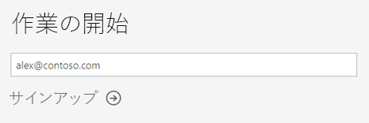
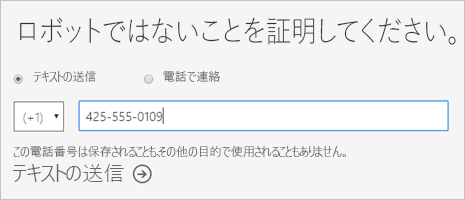
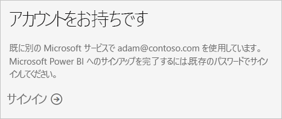
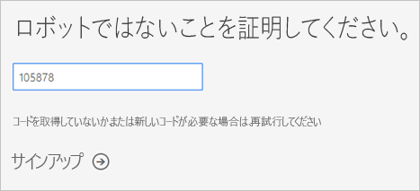
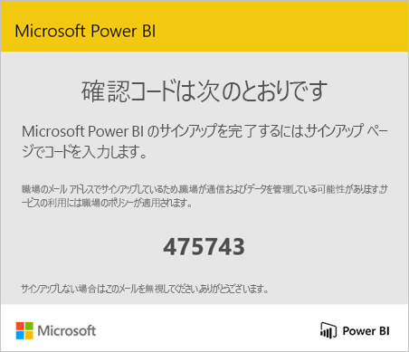
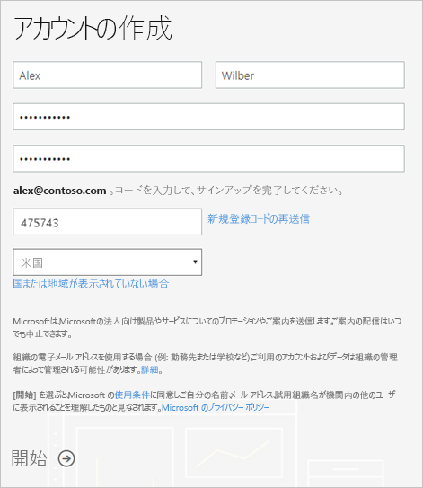
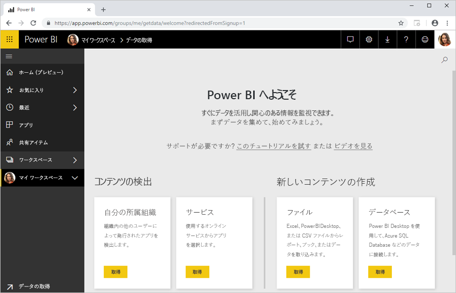

# 個人として Power BI にサインアップする

Power BI は、個人用レポートおよび視覚エフェクト ツールのほか、グループ プロジェクト、部門、または会社全体の背後にある分析および意思決定エンジンとしても使用できます。 この記事では、個人として Power BI Pro 試用版にサインアップする方法について説明します。 Power BI 管理者にする場合を参照してください。 [、組織内の Power BI ライセンス](service-admin-licensing-organization.md)します。

## サポートされているメール アドレス

サインアップ プロセスを開始する前にすることが重要 Power BI で使用できる電子メール アドレスの種類について説明します。

* Power BI では、職場または学校のメール アドレスを使用する必要があります。 コンシューマー向け電子メール サービスまたは通信プロバイダーによって提供される電子メール アドレスを使用サインインできません。 これには、outlook.com、hotmail.com、gmail.com、およびその他のユーザーが含まれます。

* サインアップ後は個人アカウントなど、メール アドレスの種類を問わず、[ゲスト ユーザーを招待](https://docs.microsoft.com/azure/active-directory/active-directory-b2b-what-is-azure-ad-b2b)し、自分の Power BI コンテンツを見せることができます。

* .gov または .mil のアドレスで Power BI にサインアップすることはできますが、プロセスが異なります。 詳細については、次を参照してください。 [Power BI サービスで米国政府組織を登録](service-govus-signup.md)します。

## 試用版にサインアップする

Power BI Pro の試用版には、以下の手順でサインアップします。 次のセクションを参照してください。[試用版の有効期限](#trial-expiration)をこの試用版の有効期限が切れるときにあるオプションの詳細について確認してください。

1. Power BI の[サインアップ ページ](https://signup.microsoft.com/signup?sku=a403ebcc-fae0-4ca2-8c8c-7a907fd6c235)にアクセスします。

1. メール アドレスを入力し、 **[サインアップ]** を選択します。

    

1. このいずれかのようなメッセージが表示された場合、確認コードを受信し、この手順では、次の手順を続行するためのオプションを選択します。

    

    このいずれかのようなメッセージが表示された場合は、サインインし、Power BI を使用する手順を完了します。

    

1. 受け取ったコードを入力し、 **[サインアップ]** を選択します。

    

1. 次のようなメッセージは、電子メールを確認します。

    

1. 次の画面で自分の情報とメールに記載されている確認コードを入力します。 リージョンを選択し、この画面からリンク先に移動してポリシーを確認し、 **[開始]** を選択します。

    

1. 移動し[Power BI のサインイン ページで](https://powerbi.microsoft.com/landing/signin/)、Power BI の使用を開始できます。

    

## 試用期限

Power BI Pro の試用版は、期限が切れたとき、Power BI (無料) ライセンス、ライセンスの変更。 このような場合は、不要になった、Power BI Pro ライセンスが必要な機能へのアクセスがあります。 詳細については、[ライセンス タイプ別機能](service-features-license-type.md)に関する記事を参照してください。

Power BI (無料) ライセンスが十分である場合は、他に行う必要はありません。 Power BI Pro の機能を利用するには、Power BI Pro ライセンスの購入に関する IT 管理者にお問い合わせください。

## サインアップ プロセスのトラブルシューティング

ほとんどの場合で説明されているプロセスに従って Power BI にサインアップすることができます。 サインアップできない可能性がある問題のいくつかについては、可能な回避策で、次の表で説明します。

| 現象またはエラー メッセージ | 原因と回避策 |
| ----------------------- | -------------------- |
| <strong>個人用の電子メール アドレス (たとえばnancy@gmail.com)</strong>サインアップ時にこの 1 つのようなメッセージが表示されます。    *You entered a personal email address:Please enter your work email address so we can securely store your company's data.* (個人のメール アドレスが入力されました: 会社のデータに安全に保存できるように、職場の電子メール アドレスを入力してください。)    または    "*That looks like a personal email address. (個人の電子メール アドレスが指定された可能性があります。)Enter your work address so we can connect you with others in your company. (勤務先の他のユーザーと接続できるよう、勤務先のメール アドレスをご入力ください。)And don’t worry. (ご心配なさる必要はありません。)We won't share your address with anyone. (Microsoft では、あなたのメール アドレスを他のだれかと共有することは一切ありません。)* " | Power BI では、コンシューマー向け電子メール サービスまたは通信プロバイダーによって提供される電子メール アドレスをサポートしていません。    サインアップを完了するには、もう一度 職場または学校によって割り当てられた電子メール アドレスを使用してお試しください。    それでもサインアップできず、より高度なセットアップ プロセスを実行する場合は、[新しい Office 365 試用版サブスクリプションに登録して、そのメール アドレスを使用してサインアップしてください](service-admin-signing-up-for-power-bi-with-a-new-office-365-trial.md)。    既存ユーザーに[自分をゲストとして招待](service-admin-azure-ad-b2b.md)してもらうこともできます。 |
| **セルフ サービス サインアップを無効になっている**:サインアップ時に、次のようなメッセージが表示されます。    "*We can't finish signing you up. (サインアップを完了できません。)Your IT department has turned off signup for Microsoft Power BI. (あなたの勤務先の IT 部門が、Microsoft Power BI のサインアップを無効にしています。)Contact them to complete signup. (IT 部門に連絡して、サインアップを完了させてください。)* "    または    "*That looks like a personal email address. (個人の電子メール アドレスが指定された可能性があります。)Enter your work address so we can connect you with others in your company. (勤務先の他のユーザーと接続できるよう、勤務先のメール アドレスをご入力ください。)And don’t worry. (ご心配なさる必要はありません。)We won't share your address with anyone. (Microsoft では、あなたのメール アドレスを他のだれかと共有することは一切ありません。)* " | 組織の IT 管理者が Power BI のセルフ サービス サインアップを無効にします。    サインアップを完了するには、IT 管理者に連絡を依頼して[サインアップできるようにする手順に従って](service-admin-licensing-organization.md#enable-or-disable-individual-user-sign-up-in-azure-active-directory)します。    [パートナーを通じて Office 365 にサインアップする](service-admin-syndication-partner.md)場合に、この問題が発生する可能性があります。 |
| **電子メール アドレスが Office 365 ID**サインアップ時に、次のようなメッセージが表示されます。    "*We can't find you at contoso.com. (contoso.com であなたを見つけることができません。)Do you use a different ID at work or school? (勤務先または学校の別の ID を使用しますか?)  Try signing in with that, and if it doesn't work, contact your IT department. (その ID を使用してサインインしてみてください。その ID が機能しない場合は、IT 部門にお問い合わせください。)* " | お客様の組織では、Office 365 と他の Microsoft サービスにサインインするために、メール アドレスと異なる ID を使用しています。  たとえば、メール アドレスが Nancy.Smith@contoso.com で、ID が nancys@contoso.com の場合です。    サインアップを完了するには、組織が Office 365 または他の Microsoft サービスにサインインするために割り当てられている ID を使用します。  これはわからない場合は、IT 管理者にお問い合わせください。    それでもサインアップできず、より高度なセットアップ プロセスを実行する場合は、[新しい Office 365 試用版サブスクリプションに登録して、そのメール アドレスを使用してサインアップしてください](service-admin-signing-up-for-power-bi-with-a-new-office-365-trial.md)。 |

## 次の手順

[Power BI Pro を購入する](service-admin-purchasing-power-bi-pro.md)  
[個々のユーザーに対する Power BI サービス契約](https://powerbi.microsoft.com/terms-of-service/)  

他にわからないことがある場合は、 [Power BI コミュニティで質問してみてください](http://community.powerbi.com/)。