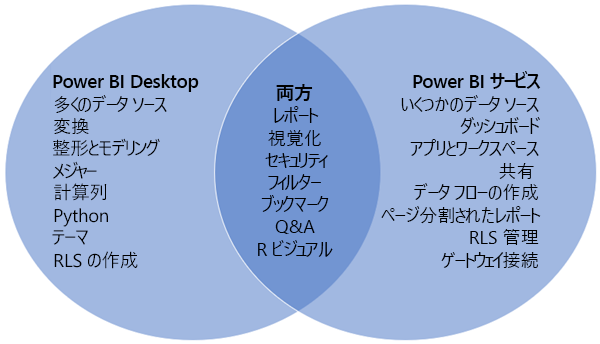
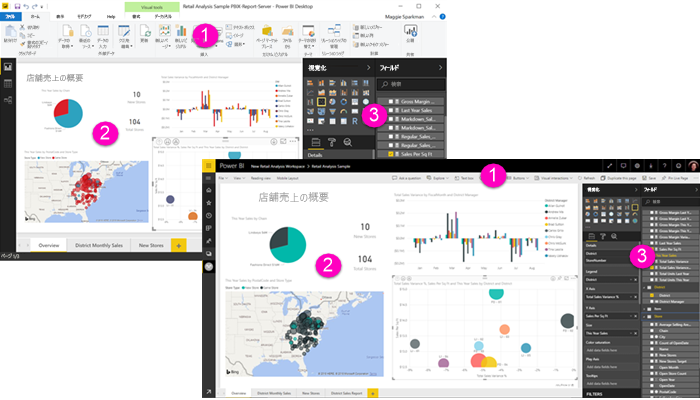

# Power BI Desktop と Power BI サービスの比較

Power BI Desktop と Power BI サービスを比較したベン図では、中央の領域にこの 2 つが重なる部分が示されます。 一部のタスクは Power BI Desktop でも Power BI サービスでも実行できます。 しかしながら、ベン図の右側と左側で、アプリケーション固有の機能とサービス固有の機能がそれぞれ示されます。  

**Power BI Desktop** は包括的なデータ分析/レポート作成ツールです。 この無料アプリケーションをローカル コンピューターにインストールすると、さまざまなデータ ソースに接続し、それらを 1 つのデータ モデルに結合できます (これはモデリングと呼ばれることがあります)。 「[Power BI Desktop 概要ガイド](desktop-getting-started.md)」でこのプロセスが説明されています。

**Power BI サービス**は、チームや企業が簡単なレポート編集や共同作業を行うためのクラウドベースのオンライン サービスです。 Power BI サービスでもデータ ソースに接続できますが、モデリングに制限があります。 

Business Intelligence プロジェクトに取り組んでいるほとんどのレポート デザイナーは、**Power BI Desktop** を使用してレポートを作成した後、**Power BI サービス**を使用して、レポートを他のユーザーと共有します。

## レポートの編集

アプリケーションとサービスの両方で、*レポート*を構築し、編集できます。 レポートには任意の数のページとビジュアルを含めることができます。 レポート内の移動機能を強化する目的で、ブックマーク、ボタン、フィルター、ドリルスルーを追加できます。

Power BI Desktop と Power BI サービスのレポート エディターは同じようなものです。 3 つのセクションから構成されています。  

1. 上部のナビゲーション バー。これは Power BI Desktop と Power BI サービスで異なります    
2. レポート キャンバス     
3. **フィールド**、**視覚化**、**フィルター**の各ウィンドウ

この動画では、Power BI Desktop のレポート エディターをご覧いただけます。 

<iframe width="560" height="315" src="https://www.youtube.com/embed/IkJda4O7oGs" frameborder="0" allowfullscreen></iframe>

## Power BI サービスの共同作業

レポートを作成したら、それを **Power BI サービス**の*ワークスペース*に保存し、そこで同僚と共同作業できます。 このレポートの上に*ダッシュボード*を構築します。 その後、組織内外のレポート利用者とダッシュボードやレポートを共有します。 レポート利用者は Power BI サービスの編集ビューではなく、[読み取りビュー](consumer/end-user-reading-view.md)でダッシュボードやレポートを閲覧します。 レポート作成者が利用できる機能をすべて利用することはできません。 

## 次の手順

[Power BI Desktop とは何ですか?](desktop-what-is-desktop.md)

Power BI サービスで[レポートを作成する](service-report-create-new.md)

[レポート デザイナーの基本的な概念](service-basic-concepts.md)

他にわからないことがある場合は、 [Power BI コミュニティを利用してください](http://community.powerbi.com/)。

