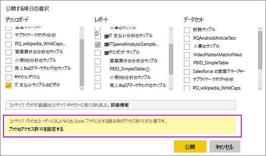

# OneDrive の Excel ファイルにリンクする Power BI ダッシュボードを共有する
Power BI では、[OneDrive for Business 上にある Excel ブックに接続](service-excel-workbook-files.md)し、そのブックからダッシュボードにタイルをピン留めできます。 そのダッシュボードを共有した場合か、そのダッシュボードを含むコンテンツ パックを作成した場合、次のようになります。

* 仕事仲間は、そのブックそのものに対するアクセス許可がなくても、タイルを見ることができます。 そのため、コンテンツ パックを作成する際は、仕事仲間が OneDrive 上の Excel ブックから作成したタイルを見ることができることを理解したうえで作成してください。
* タイルをクリックすると、Power BI 内でブックが開きます。 ブックが開くのは、仕事仲間が OneDrive for Business 上のブックに対して少なくとも[読み取りアクセス許可](https://support.office.com/en-us/article/Share-documents-or-folders-in-Office-365-1fe37332-0f9a-4719-970e-d2578da4941c)を持っている場合だけです。

## ブックのタイルを含むダッシュボードを共有する
OneDrive for Business 上の Excel ブックにリンク バックしているダッシュボードを共有する方法については、[ダッシュボードの共有](service-share-dashboards.md) に関するページをご覧ください。 両者の違いは、共有する前に、リンク対象の Excel ブックのアクセス許可を必要に応じて変更できる点です。

  ![[ダッシュ ボードの共有] ダイアログ ボックス](media/service-share-dashboard-that-links-to-excel-onedrive/pbi_share_workbk.png)

1. 仕事仲間のメール アドレスを入力します。
2. 仕事仲間が Power BI から Excel ブックを表示できるようにするには、 **[OneDrive for Business に移動してブックのアクセス許可を設定する]** を選びます。
3. OneDrive 上で、必要に応じて[アクセス許可を変更します](https://support.office.com/en-US/article/Share-files-and-folders-and-change-permissions-9fcc2f7d-de0c-4cec-93b0-a82024800c07)。
4. **[共有]** を選択します。

>[!NOTE]
>仕事仲間は、そのブックから他のタイルをピン留めすることや、Power BI から Excel ブックに変更を加えることはできません。
> 
> 

## ブックのタイルを含むダッシュボードを組み込んだ組織のコンテンツ パックを作成する
[コンテンツ パックを公開する](service-organizational-content-pack-create-and-publish.md)時点で、個々の仕事仲間やグループにアクセス許可を付与します。 ブックへのリンクを含むコンテンツ パックを公開するときに、公開前にリンク先の Excel ブックのアクセス許可を必要に応じて変更できます。

1. **[コンテンツ パックの作成]** 画面で、メール アドレスを入力し、コンテンツ パックのタイトルと説明を入力し、イメージをアップロードします。
2. OneDrive for Business 上の Excel ブックにリンクされているダッシュボードやレポートを選びます。
   
    
3. **[OneDrive for Business に移動してブックのアクセス許可を設定する]** を選びます。
4. OneDrive 上で、必要に応じて[アクセス許可を変更します](https://support.office.com/en-US/article/Share-files-and-folders-and-change-permissions-9fcc2f7d-de0c-4cec-93b0-a82024800c07)。
5. **[公開]** を選びます。

## Power BI ワークスペースからダッシュボードを共有する
Power BI のワークスペースからのダッシュボードの共有は個人のワークスペースからのダッシュボードの共有と似ていますが、ファイルの保存場所が個人の OneDrive for Business ではなく Office 365 のワークスペース サイトになる点が異なります。 ダッシュボードをワークスペース外のユーザーと共有する場合は、事前に Excel ブックのアクセス許可を変更してください。

## 次の手順
* [Excel から Power BI ダッシュボードにタイルをピン留めする](service-dashboard-pin-tile-from-excel.md)
* [Power BI - 基本的な概念](service-basic-concepts.md)
* 他にわからないことがある場合は、 [Power BI コミュニティを利用してください](http://community.powerbi.com/)。

