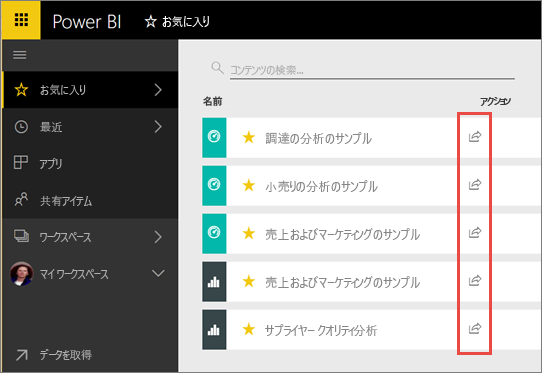
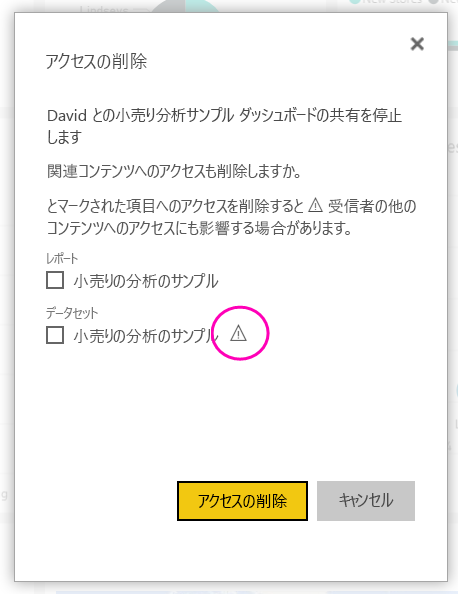
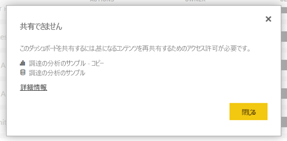

# 同僚や他のユーザーと Power BI ダッシュボードやレポートを共有する
"*共有*" は、自分のダッシュボードおよびレポートに他のユーザーがアクセスできるようにするのによい方法です。 Power BI では、[複数の異なる方法でダッシュボードでの共同作業を行ったり、ダッシュボードやレポートを配布](service-how-to-collaborate-distribute-dashboards-reports.md)したりできます。

共有を行うには、コンテンツの共有先が組織内でも組織外でも、共有元に [Power BI Pro ライセンス](service-features-license-type.md)が必要です。 コンテンツがない限りに受信者が Power BI Pro のライセンスにも必要です、 [Premium 容量](service-premium-what-is.md)します。 

Power BI サービスのほとんどの場所からのレポートとダッシュ ボードを共有できます。お気に入り、最近、私 (所有者が可能) の場合、マイ ワークスペースで、または他のワークスペースと共有します。 同僚とダッシュボードやレポートを共有した場合、共有された相手はそれを表示して操作することはできますが、編集することはできません。 [行レベル セキュリティ (RLS)](service-admin-rls.md) を適用しない限り、自分のダッシュボードやレポートに表示されるものと同じデータが同僚にも表示されます。 共有元のユーザーが許可した場合、共有先のユーザーも同僚と共有できます。 組織できます外のユーザーも表示と対話ダッシュ ボードまたはレポートが共有を変更することはできません。 

[任意の Power BI モバイル アプリからダッシュボードを共有する](consumer/mobile/mobile-share-dashboard-from-the-mobile-apps.md)こともできます。 ただし、Power BI Desktop からダッシュ ボードを共有することはできません。

## ビデオ:ダッシュボードの共有
Amanda が社内および社外の同僚とダッシュボードを共有するところをご覧ください。 その後、ビデオで説明されている手順に従って、ご自分でやってみてください。

<iframe width="560" height="315" src="https://www.youtube.com/embed/0tUwn8DHo3s?list=PL1N57mwBHtN0JFoKSR0n-tBkUJHeMP2cP" frameborder="0" allowfullscreen></iframe>

## ダッシュボードまたはレポートを共有する

1. ダッシュボードかレポートの一覧、または開いているダッシュボードかレポート内で、 **[共有]** を選択します。

2. 上部のボックスに、個々のユーザーの完全なメール アドレス、配布グループ、またはセキュリティ グループを入力します。 動的配布リストと共有することはできません。 
   
   アドレスが組織外のユーザーとも共有できますが、警告が表示されます。
   
    
 
   >[!NOTE]
   >最大で 100 のユーザーまたはグループ入力のボックスがサポートします。 多数のユーザーと共有する必要がある場合は、ワークスペースでダッシュ ボードを作成することを検討してくださいと[アプリとして配布する、](service-create-distribute-apps.md)します。
   > 
   > 

3. 必要な場合はメッセージを追加します。 これはオプションです。
4. 同僚が他のユーザーとコンテンツを共有できるように、チェック**受信者がダッシュ ボード (またはレポート) を共有できるようにする**します。
   
   他のユーザーに共有を許可することを "*再共有*" と呼びます。 共有を許可すると、そのユーザーは Power BI サービスやモバイル アプリから再共有したり、組織内の他のユーザーにメール招待状を転送したりできます。 招待状は 1 か月後に期限が切れます。 組織外のユーザーは、再共有を行えません。 コンテンツの所有者として、再共有を無効にしたり、再共有を個別に取り消したりできます。 参照してください[共有または他のユーザーから共有停止](#stop-sharing-or-stop-others-from-sharing)します。

5. **[共有]** を選択します。
   
   ![[共有] ボタンを選ぶ](media/service-share-dashboards/power-bi-share-dialog-share.png)  
   
   Power BI は、グループ、共有コンテンツへのリンクではなく、個人にメール招待状を送信します。 **[成功]** 通知が表示されます。 
   
   組織内の受信者がリンクをクリックすると、Power BI はダッシュボードまたはレポートをそのユーザーの **[自分と共有]** リスト ページに追加します。 ユーザーが自分の名前を選択すると、そのユーザーと自分とで共有されているすべてのコンテンツが表示されます。 
   
   ![[自分と共有] リスト ページ](media/service-share-dashboards/power-bi-shared-with-me-dashboards-reports.png)
   
   組織外の受信者がリンクをクリックすると、ダッシュボードまたはレポートが表示されますが、通常の Power BI ポータルではありません。 詳細については、次を参照してください。[組織外のユーザーとダッシュ ボードまたはレポートを共有](#share-a-dashboard-or-report-with-people-outside-your-organization)します。

## 自分が共有したダッシュボードまたはレポートにアクセスできるユーザー
場合がありますを使用すると、共有したし、共有しているユーザーを表示するユーザーを確認する必要があります。

1. ダッシュボードかレポートの一覧、またはダッシュボードかレポート自体で、 **[共有]**  を選びます。 
2. **ダッシュ ボードの共有**または**レポート共有**ダイアログ ボックスで、**アクセス**します。
   
    ![[ダッシュボードの共有] ダイアログ ボックスの [アクセス] タブ](media/service-share-dashboards/power-bi-share-dialog-access.png)

    組織外のユーザーは、 **[ゲスト]** として一覧に含められます。

## 共有または他のユーザーによる再共有を停止する
再共有をオンおよびオフにできるのは、ダッシュボードまたはレポートの所有者のみです。

### 共有の招待をまだ送信していない場合
* クリア、**受信者がダッシュ ボード (またはレポート) を共有できるようにする**送信する前に、招待の下部にあるチェック ボックス。

### ダッシュボードまたはレポートを既に共有している場合
1. ダッシュボードかレポートの一覧、またはダッシュボードかレポート自体で、 **[共有]**  を選びます。 
2. **ダッシュ ボードの共有**または**レポート共有**ダイアログ ボックスで、**アクセス**します。
   
    ![[ダッシュボードの共有] ダイアログ ボックスの [アクセス] タブ](media/service-share-dashboards/power-bi-share-dialog-access.png)
3. **[読み取りと共有し直し]** の横にある省略記号 **[...]** をクリックして、以下を選択します。
   
   ![[読み取りと共有し直し] の省略記号](media/service-share-dashboards/power-bi-change-access.png)
   
   * そのユーザーが他のユーザーと共有できないようにするには、 **[読み取り]** を選びます。
   * そのユーザーが共有されたコンテンツをまったく表示できないようにするには、 **[アクセスの削除]** を選びます。

4. **アクセスを削除する** ダイアログ ボックスで、レポートやデータセットなどの関連コンテンツへのアクセス権を削除するかどうかも決定します。 警告アイコンが付いた項目を削除する場合も正しく表示されないため、関連するコンテンツを削除することをお勧めします。

    

## 組織外のユーザーとダッシュボードまたはレポートを共有する
組織外のユーザーと共有する電子メールを共有ダッシュ ボードまたはレポートを表示する Power BI にサインインする必要がありますがへのリンクが表示されます。 Power BI Pro ライセンスがない共有相手は、リンクをクリックした後でライセンスにサインアップできます。

サインインした後、共有ダッシュ ボードまたはレポートをブラウザー ウィンドウで、通常、Power BI ポータルではなく、参照してください。 後でこのダッシュ ボードまたはレポートにアクセスするには、リンクをブックマークする必要があります。

共有相手は、このダッシュボードまたはレポートのコンテンツを編集できません。 グラフとの対話、フィルターまたはスライサーを変更することができます、変更を保存できません。 

共有されたダッシュボードまたはレポートを表示できるのは、直接の共有相手だけです。 たとえば、Vicki@contoso.com にメールを送信した場合、ダッシュボードを見ることができるのは Vicki だけです。 リンクがある場合でも、ダッシュ ボードで、誰も確認できます。 Vicki は、同じ電子メール アドレスを使用してそれにアクセスする必要があります。他の電子メール アドレスでサインアップした場合は、ダッシュ ボードへのアクセスはありません。

オンプレミスの Analysis Services の表形式モデルでロール レベルまたは行レベルのセキュリティが実装されている場合、組織外のユーザーはデータを何も表示できません。

ブラウザーで、Power BI モバイル アプリではなく、リンクをクリックしてリンクを送信する Power BI モバイル アプリからユーザーを組織外場合、に、ダッシュ ボードを開きます。

場合する[編集および管理する外部ゲスト ユーザーの組織のコンテンツを許可する](service-admin-portal.md#export-and-sharing-settings)、それらに既定の従量課金のみのエクスペリエンスは適用されません。 [詳細情報](service-admin-azure-ad-b2b.md)

## 制限事項と考慮事項
ダッシュボードとレポートの共有について留意すべき事項:

* 一般に、自分と同僚はダッシュボードまたはレポート内の同じデータを表示することになります。 そのため、自分の方がより多くのデータを表示できるアクセス許可を持っている場合、相手はこちらのダッシュボードまたはレポートのすべてのデータを表示できることになります。 ただし、ダッシュボードまたはレポートの基になるデータセットに[行レベル セキュリティ (RLS)](service-admin-rls.md) が適用されている場合は、各ユーザーの資格情報を使用して各々がアクセスできるデータが決定されます。
* ダッシュ ボードを共有するすべてのユーザーを表示し、関連するレポートと対話[読み取りビュー](consumer/end-user-reading-view.md#reading-view)します。 同僚はレポートを作成したり、既存のレポートへの変更を保存したりすることはできません。
* 参照してくださいまたはデータセットをダウンロードできないことができます、データセットの分析を in Excel 機能を使用して直接アクセスできます。 管理者は、グループ内のすべてのユーザーに対して、Excel で分析を使用する機能を制限できます。 ただし、これはそのグループ内の全員に対して、そのグループが属しているすべてのワークスペースに対して制限されます。
* [データの更新](refresh-data.md)はだれでも手動で行えます。
* 電子メールに Office 365 を使用している場合は、配布グループに関連付けられた電子メール アドレスを入力することにより、配布グループのメンバーと共有できます。
* お使いの電子メール ドメインを共有する同僚やドメインが異なっていても、同じテナント内で登録されている同僚は、他のユーザーとダッシュ ボードを共有できます。 たとえば、ドメイン contoso.com と contoso2.com が同じテナントとメール アドレスで登録されている場合はkonrads@contoso.com、どちらも、ravali@contoso.comとgustav@contoso2.comを共有する許可を指定した場合に限り、共有できます。
* 場合は、同僚が既にあるは、特定のダッシュ ボードまたはレポートへのアクセス、ダッシュ ボードまたはレポートにいるときに、URL をコピーして直接リンクを送信できます。 例: `https://powerbi.com/dashboards/g12466b5-a452-4e55-8634-xxxxxxxxxxxx`
* 同様に、同僚が既にあるは、特定のダッシュ ボードへのアクセス、できます[基になるレポートに送信された直接リンク](service-share-reports.md)します。 
* 使用すると、共有するには、最大で 100 人のユーザーまたはグループの 1 つの共有動作。 ただし、項目へのアクセス権は、500 を超えるユーザーに付与できます。 これを行うには、ユーザーを個別に指定することで複数回を共有するか、すべてのユーザーを含むユーザー グループと共有します。

## 共有のトラブルシューティング

### ダッシュボードの受信者に、タイルまたは「アクセス許可が必要」のメッセージにロック アイコンが表示される

共有相手がレポートを表示しようとしたときに、ダッシュボードにロックされたタイルが表示されたり、"アクセス許可が必要です" というメッセージが表示されたりすることがあります。

そうである場合は、基になるデータセットへのアクセス許可を付与する必要があります。

1. コンテンツ リストの **[データセット]** タブに移動します。

1. 省略記号を選択します ( **.** )、データセットの横にあるを選択し、**アクセス許可の管理**します。

    

1. **[ユーザーの追加]** を選びます。

    ![[ユーザーの追加] を選択](media/service-share-dashboards/power-bi-share-dataset-add-user.png)

1. 個々のユーザーの完全なメール アドレス、配布グループ、またはセキュリティ グループを入力します。 動的配布リストと共有することはできません。

    

1. **[追加]** を選択します。

### ダッシュボードまたはレポートを共有できない

ダッシュ ボードまたはレポートを共有するには、基になるコンテンツを再共有するアクセス許可が必要です。つまり、いずれかの関連レポートやデータセットです。 提供するレポート作成者に依頼を共有できませんというメッセージが表示された場合、これらのレポートとデータセットに対するアクセス許可が再共有します。

## 次の手順
* ご意見およびご提案がある場合は、 [Power BI コミュニティ サイト](https://community.powerbi.com/)をご利用ください。
* [ダッシュボードとレポートを共有する方法](service-how-to-collaborate-distribute-dashboards-reports.md)
* [フィルター処理された Power BI レポートを共有](service-share-reports.md)します。
* わからないことがある場合は、 [Power BI コミュニティを利用してください](http://community.powerbi.com/)。

