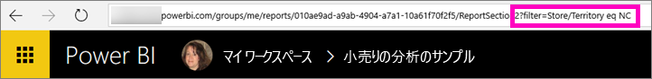

# フィルター処理された Power BI レポートを同僚と共有する
"*共有*" は、自分のダッシュボードおよびレポートに他のユーザーがアクセスできるようにするのによい方法です。 Power BI では、[レポートを使って共同作業を行ったりレポートを配布したりする方法も他にいくつか](service-how-to-collaborate-distribute-dashboards-reports.md)用意されています。

共有する際、共有元と共有先の双方に [Power BI Pro ライセンス](service-features-license-type.md)が必要です。または、コンテンツを [Premium 容量](service-premium.md)に格納する必要があります。 

Power BI サービスのほとんどの場所から、自分と同じメール ドメインの同僚とレポートを共有できます。たとえば、[お気に入り]、[最近]、[自分と共有]\(所有者が許可していれば)、[マイ ワークスペース]、または他のワークスペースから共有できます。 レポートを共有すると、共有相手の同僚はそのレポートを閲覧できますが、編集はできません。 [行レベル セキュリティ (RLS)](service-admin-rls.md) が適用されていない限り、自分のレポートに表示されるものと同じデータが同僚にも表示されます。 

フィルター処理されたバージョンのレポートを共有したい場合は、どうすればよいでしょうか。 たとえば、特定の都市や販売員、または特定の年のデータだけを表示するレポートを共有したい場合があります。 カスタム URL を作成してみてください。 受信者が初めてレポートを開くと、フィルターが適用されます。 URL を変更することでフィルターを解除できます。

## レポートのフィルター処理と共有

1. [編集ビュー](consumer/end-user-reading-view.md)でレポートを開き、フィルターを適用して、レポートを保存します。
   
   この例では、[小売の分析のサンプル](sample-tutorial-connect-to-the-samples.md)をフィルター処理して、**Territory** が **NC** の値のみを表示します。
   
   ![[レポート フィルター] ウィンドウ](media/service-share-reports/power-bi-filter-report2.png)
2. レポート ページの URL の末尾に以下を追加します:
   
   ?filter=*tablename*/*fieldname* eq *value*
   
    このフィールドの型は**文字列**にする必要があります。 *tablename* 値または *fieldname* 値にはスペースを含めることができません。
   
   この例では、テーブルの名前が **Store**、フィールドの名前が **Territory**、フィルター処理の対象の値が **NC** です。
   
    ?filter=Store/Territory eq 'NC'
   
   
   
   スラッシュ、スペース、およびアポストロフィを表すために、ブラウザーによって特殊文字が追加されるため、最終的に次のようになります。
   
   app.powerbi.com/groups/me/reports/010ae9ad-a9ab-4904-a7a1-xxxxxxxxxxxx/ReportSection2?filter=Store%252FTerritory%20eq%20%27NC%27

3. [レポートを共有](service-share-dashboards.md)しますが、**[受信者に電子メールの通知を送信する]** チェック ボックスはオフにします。 

    ![[レポートの共有] ダイアログ ボックス](media/service-share-reports/power-bi-share-report-dialog.png)

4. 先ほど作成したフィルターを使用して、リンクを送信します。

## 次の手順
* ご意見およびご提案がある場合は、 [Power BI コミュニティ サイト](https://community.powerbi.com/)をご利用ください。
* [ダッシュボードとレポートを共有する方法](service-how-to-collaborate-distribute-dashboards-reports.md)
* [ダッシュボードの共有](service-share-dashboards.md)
* 他にわからないことがある場合は、 [Power BI コミュニティを利用してください](http://community.powerbi.com/)。

