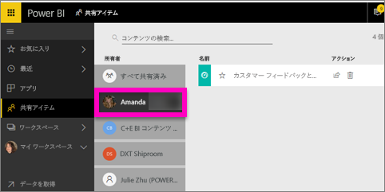

# 自分と共有の Power BI ダッシュボードを表示する
## 自分と共有
![[共有] アイコン](media/service-shared-with-me/power-bi-share-dash.png)

同僚がダッシュボードを自分と共有した場合、そのタイトルは **[自分と共有]** の一覧に追加されます。 このダッシュボードは **[自分と共有]** からのみ使用でき、ワークスペースや**アプリ**からは使用できません。

Amanda による**自分と共有**コンテンツの一覧の説明と、一覧を移動およびフィルター処理する方法のデモンストレーションをご覧ください。 その後、ビデオで説明されている手順に従って、ご自分でやってみてください。 共有されたダッシュボードを表示するには、Power BI Pro ライセンスが必要です。 詳しくは、[Power BI Premium](service-premium.md) に関するページをご覧ください。

<iframe width="560" height="315" src="https://www.youtube.com/embed/G26dr2PsEpk" frameborder="0" allowfullscreen></iframe>

ダッシュボードとその基となるレポートを操作するオプションは、所有者より付与されたアクセス許可に応じて多数あります。 これらには、ダッシュボードのコピーの作成、レポートの[読み取りビュー](service-reading-view-and-editing-view.md)での表示、他の同僚と再共有があります。

## **[自分と共有]** 画面から使用できるアクション
* 星のアイコンを選択して[ダッシュボードをお気に入り](service-dashboard-favorite.md)にします。
* [ダッシュボードの除去](service-delete.md)  
* 一部のダッシュボードは再共有できます  
* また、ダッシュボードが多数ある場合、[検索フィールドと並べ替えを使用して検索することも](service-navigation-search-filter-sort.md)できます。
  
  > [!NOTE]
  > EGRC の分類の詳細については、[分類] ボタンを選択するか、「[ダッシュボードのデータの分類](service-data-classification.md)」を参照してください。
  > 
  > 
* 表示するダッシュボードの名前を選択し、確認します。 共有ダッシュボードを一度開くと、Q&A を使用して基になるデータに関する質問をしたり、開くタイルを選択して読み取りビューでレポートを対話的に処理することができます。

## 所有者で共有ダッシュボードをフィルター処理する
**[自分と共有]** 画面内のコンテンツは、コンテンツ所有者でさらにフィルター処理できます。 たとえば、**[Amanda]** を選択した場合、Amanda が自分と共有するダッシュボードのみを表示できます。

## 次の手順
[Power BI - 基本的な概念](service-basic-concepts.md)  
[Power BI Premium とは](service-premium.md)  

他にわからないことがある場合は、 [Power BI コミュニティで質問してみてください](http://community.powerbi.com/)。

