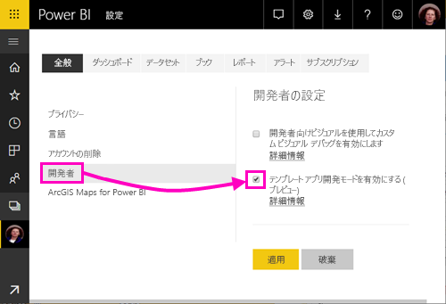
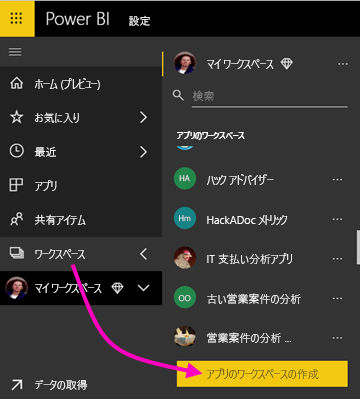
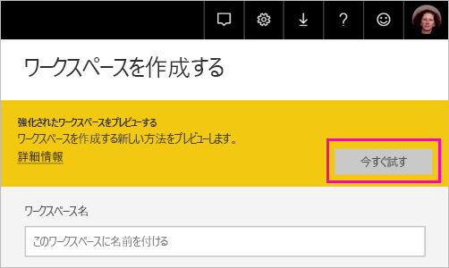
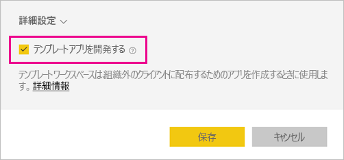
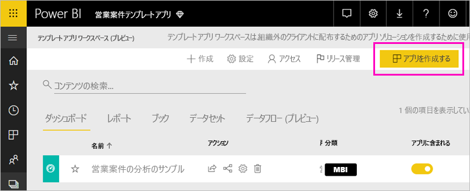
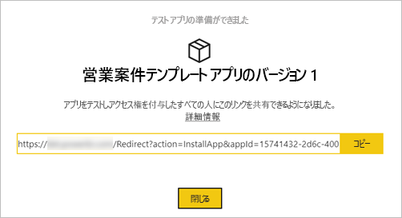
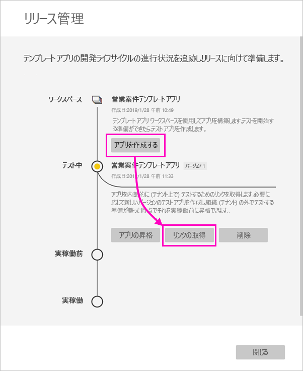
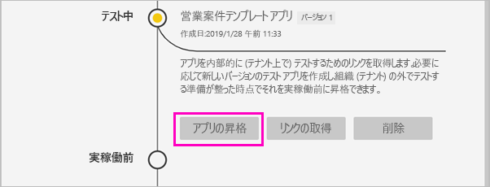
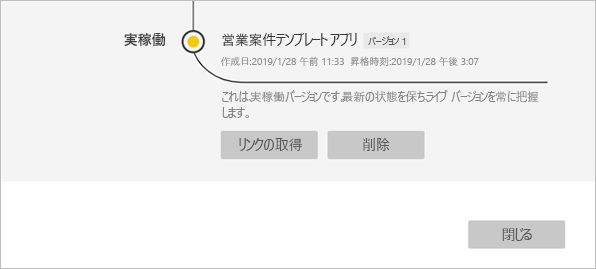
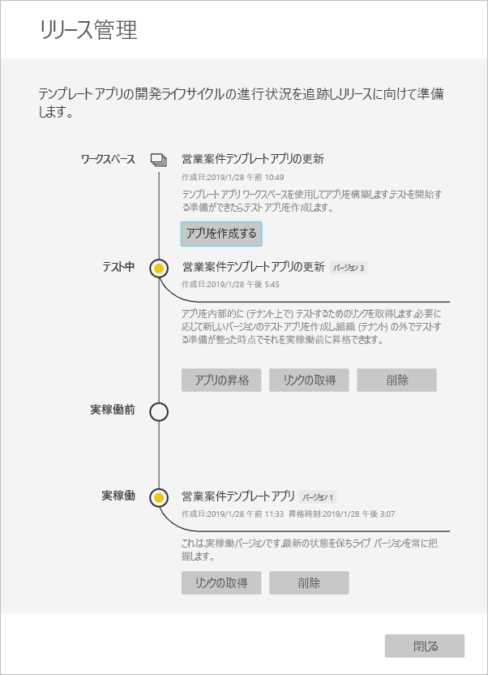

# Power BI でテンプレート アプリを作成する (プレビュー)

新しい Power BI *テンプレート アプリ*を利用すれば、Power BI パートナーはコードをほとんど、あるいはまったく記述せずに Power BI アプリを作成し、Power BI の顧客に配布できます。  この記事には、Power BI テンプレート アプリを段階的に作成する手順が含まれています。

なる場合、Power BI レポートとダッシュ ボードを作成することができます、*テンプレート アプリ ビルダー*ビルドして分析コンテンツをパッケージ化し、*アプリ*します。 など、AppSource、または独自の web サービスで使用することによって、使用可能なプラットフォームを通じて他の Power BI テナントにアプリをデプロイすることがあります。 ビルダーとしては、配布用の保護された分析パッケージを作成する可能性があります。

Power BI テナント管理者は、組織においてテンプレート アプリを作成できる人とそれをインストールできる人を管理します。 許可されたユーザーは、テンプレートのアプリをインストールに変更を組織で Power BI のコンシューマーに配布します。

## 前提条件

テンプレート アプリの作成要件:  

- [Power BI Pro ライセンス](service-self-service-signup-for-power-bi.md)
- [Power BI Desktop をインストールしておくこと](desktop-get-the-desktop.md) (任意)
- 知識、 [Power BI の基本的な概念](service-basic-concepts.md)
- テンプレート アプリを作成する許可。 詳細については、Power BI [管理ポータルのテンプレート アプリの設定](service-admin-portal.md#template-apps-settings-preview)に関するセクションを参照してください。

## アプリ開発者モードを有効にする

他の Power BI テナントに配布できるテンプレート アプリを作成するには、アプリ開発者モードに入る必要があります。 入らない場合、自分の組織の Power BI 利用者のためにアプリを作成することになります。

1. ブラウザーで Power BI サービスを開きます。
2. **[設定]** 、 **[全般]** 、 **[開発者]** 、 **[テンプレート アプリ開発モードを有効にする]** の順に選択します。

    

    このオプションが表示されない場合、管理ポータルで[テンプレート アプリ開発の許可](service-admin-portal.md#template-apps-settings-preview)を与えるよう、Power BI 管理者に連絡してください。

3. **[適用]** を選びます。

## テンプレート アプリ ワークスペースを作成する

他の Power BI テナントに配布できるテンプレート アプリを作成するには、それを新しいアプリ ワークスペースで作成する必要があります。

1. Power BI サービスで、 **[ワークスペース]** 、 **[アプリのワークスペースの作成]** の順に選択します。

    

2. **[アプリ ワークスペースを作成する]** の **[強化されたワークスペースをプレビューする]** で **[今すぐ試す]** を選択します。

    

3. アプリ ワークスペースの名前、説明 (任意)、ロゴ画像 (任意) を入力します。

4. **[テンプレート アプリを開発する]** を選択します。

    

5. **[保存]** を選択します。
>[!NOTE]
>テンプレート アプリに昇格する Power BI 管理者からアクセス許可が必要です。

## テンプレート アプリでコンテンツを作成する

通常の Power BI アプリ ワークスペースと同様に、次の手順はワークスペースでコンテンツを作成することです。  このプレビュー版のテンプレート アプリでは、データセット、レポート、ダッシュボードという種類のうち、いずれかを 1 つだけ作成できます。

- アプリ ワークスペースで [Power BI コンテンツを作成します](power-bi-creator-landing.md)。

Power Query でパラメーターを使用している場合、型を明確に定義します (Text など)。 Any 型と Binary 型はサポートされていません。

「[Power BI でのテンプレート アプリの作成に関するヒント (プレビュー)](service-template-apps-tips.md)」には、テンプレート アプリのためにレポートやダッシュボードを作成するときに考慮してほしい事項が提案されています。

## テスト テンプレート アプリを作成する

ワークスペースにコンテンツを用意できたので、次はテンプレート アプリでそれをパッケージ化できます。 最初の手順は、テナントで組織内からのみアクセスできるテスト テンプレート アプリを作成することです。

1. テンプレート アプリ ワークスペースで **[アプリの作成]** を選択します。

    

    ここでは、する追加の構成オプションで、テンプレートのアプリでは、5 つのカテゴリを入力します。

    **ブランド**

    
    - アプリ名
    - 説明
    - サポート サイト (リンクは、組織のアプリとしてアプリをテンプレートの再配布した後は [アプリ情報] 表示)
    - アプリのロゴ (45 K ファイル サイズの上限、縦横比 1:1、.png .jpg .jpeg 形式)
    - アプリのテーマの色

    **コンテンツ**

    **アプリのランディング ページ。** レポートまたはダッシュ ボードをアプリのランディング ページは、適切な印象を与えるランディング ページを使用して定義します。

    

    **コントロール**

    制限と、アプリケーションのコンテンツを含む、アプリケーションのユーザーが持つ制約を設定します。 このコントロールを使用すると、アプリで知的財産を保護します。

    

    >[!NOTE]
    >.Pbix 形式へのエクスポートは常に、アプリをインストールするユーザーのブロックされます。

    **パラメーター**

    このカテゴリを使用すると、データ ソースに接続するときに、パラメーターの動作を管理できます。 詳細については[クエリ パラメーターを作成する](https://powerbi.microsoft.com/blog/deep-dive-into-query-parameters-and-power-bi-templates/)します。

    
    - **値**: 既定パラメーター値。
    - **必要な**: これを使用して、インストーラーをユーザーに固有のパラメーターを入力する必要があります。
    - **ロック**:ロックすると、インストーラーでパラメーターを更新できなくなります。
    - **静的**:アプリに含まれる場合に有効にする*のみ*サンプル データ。 選択すると**静的**、インストール ウィザードがデータ ソースに接続するユーザーを確認しません。

    **アクセス**テスト フェーズで、組織内の他のユーザーをインストールして、アプリのテストを決定します。 ご心配なく、常に戻るし、これらの設定を後で変更できます (設定には、分散テンプレート アプリへのアクセスも影響しません)。

2. **[アプリの作成]** を選択します。

    テスト アプリが準備できたというメッセージが、コピーしてアプリ テスターと共有するためのリンクと共に表示されます。

    

    後続のリリース管理プロセスの最初の手順も完了しています。

## テンプレート アプリのリリースを管理する

このテンプレート アプリを公開する前に、準備完了を確認することが望まれます。 Power BI には、リリース管理ウィンドウが作成されています。このウィンドウでアプリ公開までの道のりを完全に追跡し、調査できます。 ステージ間の移行をトリガーすることもできます。 共通ステージ:

- テスト アプリの生成: 組織内でのみテストします。
- テスト パッケージを実稼働前ステージに昇格させる: 組織外でテストします。
- 実稼働前パッケージを実稼働に昇格させる: 運用版です。
- パッケージを削除するか、前のステージからやり直します。

リリース ステージ間を移動すると、URL は変更されません。 プロモーションは、URL 自体に影響しません。

各ステージを見ていきましょう。

1. テンプレート アプリ ワークスペースで **[リリース管理]** を選択します。

    ![[リリース管理] アイコン](media/service-template-apps-create/power-bi-release-management-icon.png)

2. **[アプリの作成]** を選択します。

    上記の **[テスト テンプレート アプリを作成する]** でテスト アプリを作成した場合、 **[テスト]** の隣に黄色の点が既に入っています。ここで **[アプリの作成]** を選択する必要はありません。 選択した場合、テンプレート アプリの作成プロセスに戻ります。

3. **[リンクの取得]** を選択します。

    

4. アプリのインストール体験をテストするには、通知ウィンドウのリンクをコピーし、新しいブラウザー ウィンドウに貼り付けます。

    ここからは、顧客が実行する手順と同じ手順を実行することになります。 バージョンについては、[組織でのアプリのインストールと配布](service-template-apps-install-distribute.md)に関するページを参照してください。

5. ダイアログ ボックスで **[インストール]** を選択します。

    インストールが正常に完了すると、新しいアプリの準備ができたことが通知されます。

6. **[アプリに移動]** を選択します。
7. **[新しいアプリを開始する]** に自分のアプリが表示されます。これと同じ画面を顧客が見ることになります。

    
8. **[アプリを探索]** を選択し、テスト アプリとサンプル データを確認します。
9. 変更を行うには、元のワークスペースでアプリに戻ります。 納得できるまでテスト アプリを修正します。
10. さらに、テナントの外部テストの実稼働の前に、アプリを昇格する準備ができたらと、に戻ります、 **Release Management**ペイン**昇格アプリ**します。 

    

    >[!NOTE]
    > アプリを昇格するときに公開されている、組織外になります。

11. **[昇格]** を選択し、選択を確定します。
12. この新しい URL をコピーし、テスト目的でテナントの外と共有します。 このリンクは作成して AppSource にアプリの配布のプロセスを開始する送信する 1 つでも、[新しいクラウド パートナー ポータルのプラン](https://docs.microsoft.com/azure/marketplace/cloud-partner-portal/power-bi/cpp-publish-offer)します。 クラウド パートナー ポータルへの運用の前のリンクを送信します。 アプリは承認され、AppSource に公開通知の取得後でのみ、Power BI での運用環境には、このパッケージを昇格できます。
13. アプリを運用する、あるいは AppSource 経由で共有する準備ができたら、 **[リリース管理]** ウィンドウに戻り、 **[実稼働前]** の隣にある **[アプリの昇格]** を選択します。
14. **[昇格]** を選択し、選択を確定します。

    これでアプリは実稼働に入りました。いつでも配布できます。

    

自分のアプリを世界中に何千人といる Power BI ユーザーに広く利用してもらうために、アプリを AppSource に提出することをお勧めします。 詳細については、「[Power BI アプリケーション プラン](https://docs.microsoft.com/azure/marketplace/cloud-partner-portal/power-bi/cpp-power-bi-offer)」を参照してください。

## アプリを更新する

これでアプリが実稼働に入りました。実稼働のアプリを邪魔することなく、テスト段階を繰り返すことができます。

1. **[リリース管理]** ウィンドウで **[アプリの作成]** を選択します。
2. アプリ作成プロセスを繰り返します。
3. **[ブランド]** 、 **[コンテンツ]** 、 **[コントロール]** 、 **[アクセス]** を設定し、もう一度 **[アプリの作成]** を選択します。
4. **[閉じる]** を選択し、 **[リリース管理]** に戻ります。

   これで実稼働のバージョンとテスト中の新しいバージョンという 2 つのバージョンが表示されます。

    

5. さらに、テナントの外部テストの実稼働の前に、アプリを昇格する準備ができたら、リリース管理 ウィンドウに戻るし、選択**昇格アプリ**横に**テスト**します。
6. リンクは、現在に送信してもう一度クラウド パートナー ポータルでの手順に従って[プランの更新を Power BI アプリ](https://docs.microsoft.com/azure/marketplace/cloud-partner-portal/power-bi/cpp-update-existing-offer)します。

>[!NOTE]
>クラウド パートナー ポータルで、アプリが承認され、発行した後にのみ、アプリを実稼働ステージを昇格させます。

## 次の手順

顧客がテンプレート アプリを操作するしくみについては、[組織でのアプリのインストールと配布](service-template-apps-install-distribute.md)に関するページをご覧ください。

アプリ配布の詳細については、「[Power BI アプリケーション プラン](https://docs.microsoft.com/azure/marketplace/cloud-partner-portal/power-bi/cpp-power-bi-offer)」をご覧ください。
