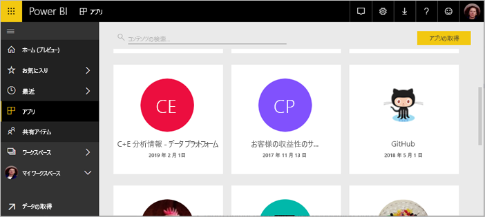
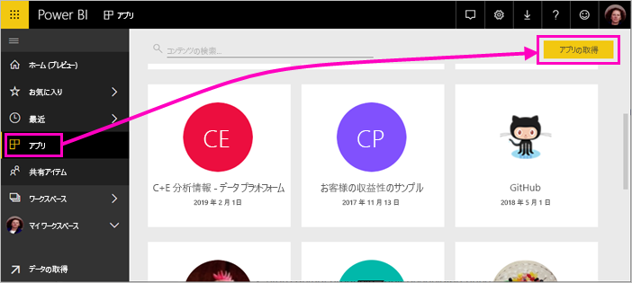
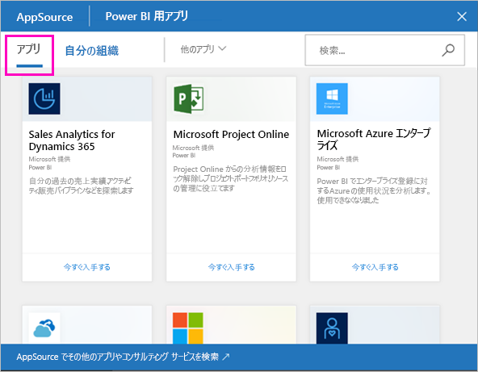
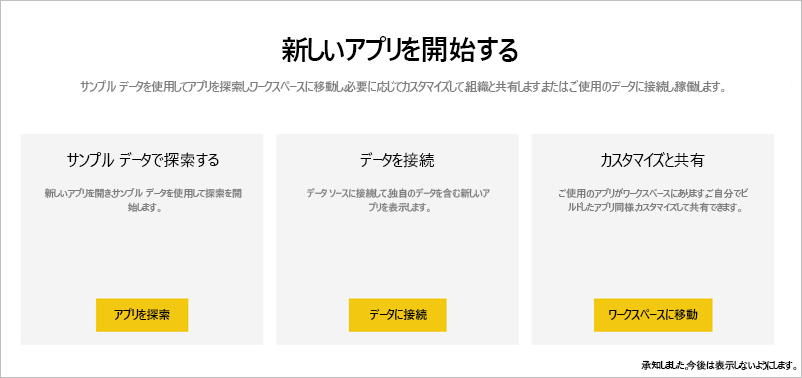
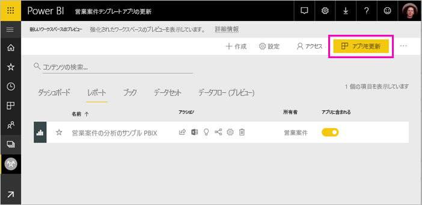
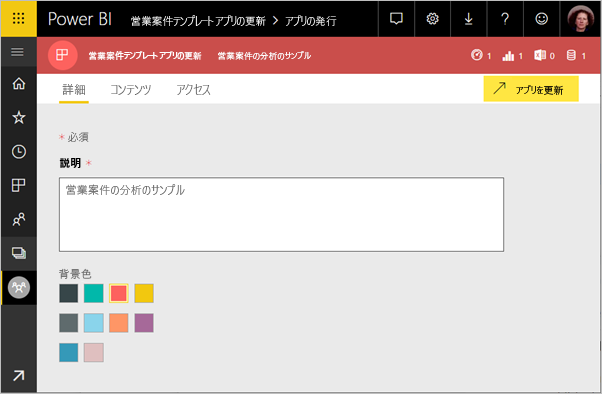
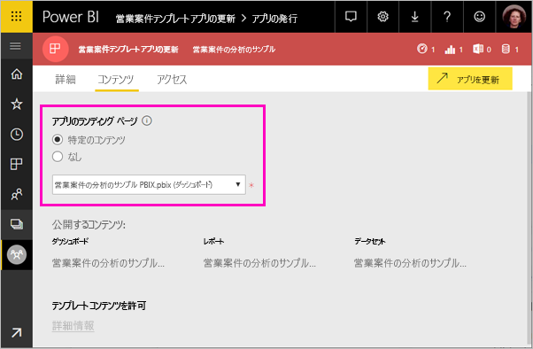
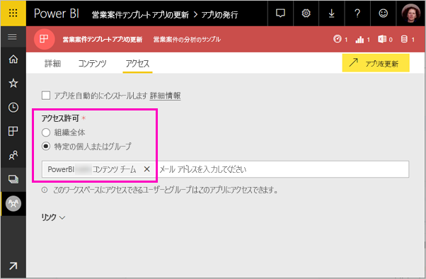

# 組織でテンプレート アプリをインストールし、配布する - Power BI (プレビュー)

新しい Power BI *テンプレート アプリ*を利用すれば、Power BI パートナーはコードをほとんど、あるいはまったく記述せずに Power BI アプリを作成し、Power BI の顧客に配布できます。 この記事は Power BI アナリスト向けに作成されました。 Power BI パートナーが作成したテンプレート アプリをインストールし、カスタマイズし、配布する方法について説明しています。 自分で配布するテンプレート アプリを作成する場合、「[Create a template app in Power BI](service-template-apps-create.md)」 (Power BI でテンプレート アプリを作成する) を参照してください。

Power BI パートナーが作成したテンプレート アプリをインストールするとき、組織のニーズに合わせてそれを変更し、アプリとして同僚に配布できます。  

## 前提条件  

テンプレート アプリをインストールし、カスタマイズし、配布するための要件:  

- [Power BI Pro ライセンス](service-self-service-signup-for-power-bi.md)
- [Power BI の基本的概念](service-basic-concepts.md)に関する知識
- テンプレート アプリの作成者または AppSource から受け取った有効なインストールのリンク 
- テンプレート アプリをインストールする許可 

## テンプレート アプリをインストールする

テンプレート アプリのリンクは送られてくることがあります。 そうでない場合、興味のあるテンプレート アプリを AppSource で探すことができます。 いずれの方法でも、インストール後、変更し、自分の組織に配布できます。

### ブラウザーから AppSource を検索する

ブラウザーで下のリンクを選択し、AppSource を開きます。Power BI アプリに絞り込まれています。

- https://appsource.microsoft.com/marketplace/apps?product=power-bi

### Power BI サービスから AppSource を検索する

1. Power BI サービスの左側のナビゲーション ウィンドウで、**[アプリ]**、**[アプリの取得]** の順に選択します。

    

2. AppSource で **[アプリ]** を選択します。

    

3. アプリを参照するか、検索し、**[今すぐ入手する]** を選択します。

2. ダイアログ ボックスで **[インストール]** を選択します。

    Power BI Pro ライセンスを持っている場合、アプリとそれに関連するアプリ ワークスペースがインストールされます。 関連ワークスペースでアプリをカスタマイズします。

    インストールが正常に完了すると、新しいアプリの準備ができたことが通知されます。 

3. **[アプリに移動]** を選択します。
4. **[新しいアプリを開始する]** で 3 つの選択肢のいずれかを選択します。

    

    - **アプリを探索**:基本的なサンプル データの探索。 アプリのルックアンドフィールはここから取得します。 
    - **データに接続**:データ ソースをサンプル データから独自のデータ ソースに変更します。 データセット パラメーターとデータ ソースの資格情報を再定義できます。 テンプレート アプリのヒント記事で「[既知の制限事項](service-template-apps-tips.md#known-limitations)」をご覧ください。 
    - **ワークスペースに移動** (最も細かく設定する場合): アプリ ビルダーが許可しているあらゆる変更を実行できます。

    あるいは、このダイアログ ボックスをスキップし、左側のナビゲーション ウィンドウにある **[ワークスペース]** から直接、関連ワークスペースにアクセスします。   
 
5. 同僚と共有する前に、独自のデータに接続することをお勧めします。 また、組織に合わせてレポートやダッシュボードを修正することもお勧めします。 この段階で他のレポートやダッシュボードも追加できます。

## アプリを更新し、配布する

組織に合わせてアプリを調整したら、それを公開できます。 手順は、他のアプリを公開する場合と同じです。 

1. カスタマイズが終わったら、ワークスペース リスト ビューの右上隅にある **[アプリを更新]** を選択します。  

    

2. **[詳細]** では、説明や背景色を変更できます。

   

3. **[コンテンツ]** では、ランディング ページとしてダッシュボードかレポートを選択できます。

   

4. **[アクセス]** では、選んだユーザーか組織全体にアクセスを与えます。  

   

5. **[アプリを更新]** を選択します。 

6. 正常に公開されたら、リンクをコピーし、アクセスを与えている人と共有できます。 共有すると、共有相手にも、AppSource の **[組織]** タブでそのアプリが表示されます。

## 次の手順 

[Power BI で同僚と一緒にワークスペースを作成する](service-create-workspaces.md)

 

 
