# Power BI サービス内の移動

Power BI サービスを使ってみると、ユーザー インターフェイスが大幅に変更されたことがわかるはずです。  これらの変更のほとんどで、コンテンツの編成方法 (ダッシュボード、レポート、データセット) と、そのコンテンツに関するタスクを実行するためのパス (クリック) が影響を受けています。 

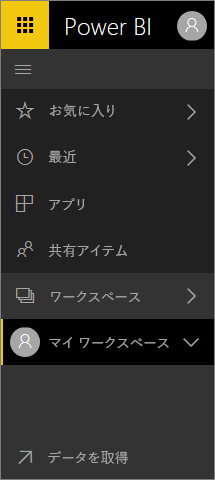

## 操作方法
以前の Power BI サービスのインターフェイスに慣れている場合、このリファレンス ガイドを見ると新しいインターフェイスでの実行方法がわかります。 最初は戸惑うかもしれませんが、使っているうちに、新しいレイアウトでの多くの時間節約のメリットがわかるはずです。 

**クイック リファレンス ガイド**

| 操作 | 新しい (現在) のパス |
| --- | --- | --- |
| ダッシュボードをお気に入りにする |ワークスペース > ダッシュボードに移動し、星型アイコンを選んで黄色にする |
| お気に入りのダッシュボードの一覧を表示する |左側のナビゲーションで **[お気に入り]** を選ぶ |
| 最近表示したダッシュボードとレポートの一覧を表示する |左側のナビゲーションで **[最近]** を選ぶ |
| 他のユーザーから共有を受けているダッシュボードの一覧を表示する |左側のナビゲーションで **[自分と共有]** を選ぶ |
| ダッシュボードの共有 |ダッシュボードを開いて **[共有]** を選ぶか、アプリを作成して発行する |
| ダッシュボードの削除 |[マイ ワークスペース] > [ダッシュボード] > ごみ箱アイコン |
| レポートの削除 |[マイ ワークスペース] > [レポート] > ごみ箱アイコン |
| データセットの削除 |[マイ ワークスペース] > [データセット] > ... > [削除] |
| ダッシュボードを開く |[ワークスペース] > [ダッシュボード] > ダッシュボードの名前を選ぶ |
| レポートを開く |[ワークスペース] > [レポート] > レポートの名前を選ぶ |
| データセットを開く |[ワークスペース] > [データセット] > データセットの名前を選ぶ |
| ダッシュボードの作成 |上部ナビゲーション バーから [作成] > [ダッシュボード] を選ぶ |
| レポートの作成 |上部ナビゲーション バーから [作成] > [レポート] を選ぶ |
| データセットの作成 |上部ナビゲーション バーから [作成] > [データセット] を選ぶ |
| アプリの作成 |[ワークスペース] > [アプリのワークスペースの作成] |
| 自分が所有するすべてのダッシュボード、レポート、データセットの一覧を表示する |[ワークスペース] > [マイ ワークスペース] |

## Power BI サービスのナビゲーション環境を変更した理由
* ダッシュボード、レポート、ブック、データセットのリストが効率化されました    
* お気に入り、最近、選択したワークスペースのクイック アクセス フライアウト メニューが追加されました    
* ダッシュボード、レポート、およびデータセットの関連コンテンツを識別する方法が追加されました    
* ブック用に独立したコンテンツ領域が追加されました    
* お気に入りダッシュボード用に独立した領域が作成されました    
* 共有されているコンテンツ用に独立した領域が作成されました 
* 最新のコンテンツ用に独立した領域が作成されました  
* タスクの実行に必要なクリック回数が減りました -- コンテンツのリストと、そのコンテンツに対して実行できるアクションが、同じ画面にまとめられました。 これは、ダッシュボードとレポートを切り替える場合などです。</td></tr></table>

Amanda による新しいナビゲーション機能、機能強化の説明およびデモを行うツアーをご覧ください。  その後、ビデオで説明されている手順に従って、ご自分でやってみてください。

<iframe width="560" height="315" src="https://www.youtube.com/embed/G26dr2PsEpk" frameborder="0" allowfullscreen></iframe>

## 新しく追加された機能
手順に従って、ご自分でやってみてください。

### コンテンツの表示 (ダッシュボード、レポート、ワークスペース、データセット、ワークスペース、アプリ)
最初に、基本コンテンツ (ダッシュボード、レポート、データセット、ブック) がどのようにまとめられるか確認してみましょう。 これ以前は、すべてのコンテンツは左側のナビゲーション ウィンドウに一覧表示されていました。 そのオプションは現在でもありますが、既定ではワークスペースのコンテキストでコンテンツの種類が表示されます。 左側のナビゲーション ウィンドウ (左ナビゲーション) でワークスペースを選ぶと、関連するコンテンツのタブ (ダッシュボード、レポート、ブック、データセット) が右側の Power BI キャンバスに表示されます。

Power BI Free を所有している場合は、1 つのワークスペース (**[マイ ワークスペース]**) のみが表示されます。

### お気に入りのダッシュボード
**[お気に入り]** を使用すると、最も重要なダッシュボードに迅速にアクセスできます。  

1. ダッシュボードを開き、右上隅から **[お気に入り]** を選びます。
   
   
   
   **[お気に入り]** が **[お気に入りから外す]** に変わり、星形アイコンが黄色になります。
   
   
2. お気に入りとして追加したすべてのダッシュボードの一覧を表示するには、左側のナビゲーションで、**[お気に入り]** の右にある矢印を選びます。 左側のナビゲーションは Power BI サービスの固定機能であるため、Power BI サービス内のどこからでもこの一覧にアクセスできます。
   
    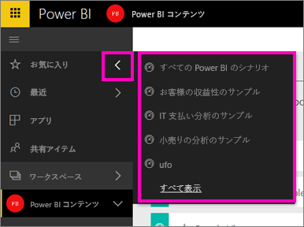
   
    ここからは、ダッシュボードを選んで開くことができます。
3. **[お気に入り]** ウィンドウを開くには、左ナビゲーションで、**[お気に入り]** を選ぶか、[お気に入り] アイコン  を選びます。
   
   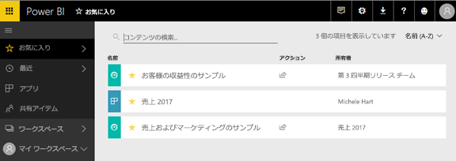
   
   ここからは、ダッシュボードを選んで開いたり、ダッシュボードの所有者を確認したり、ダッシュボードをお気に入りから外したり、仕事仲間とダッシュボードを共有したりできます。
4. または、**[ダッシュボード]** タブからダッシュボードをお気に入りにすることもできます。だけ、ダッシュボードが含まれるワークスペースを開き、ダッシュボード名の左側にある星形のアイコンを選びます。
   
   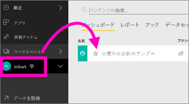

詳しくは、[お気に入りのダッシュボード](service-dashboard-favorite.md)に関するページをご覧ください。

### 最近
最後にアクセスしたレポートやダッシュボードにすばやくアクセスするには、**[最近]** ウィンドウを使います。 すべてのワークスペースのコンテンツが含まれます。

  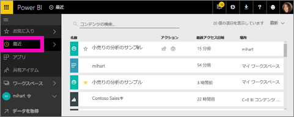

[お気に入り] と同様に、左ナビゲーションの **[最近]** の矢印を選んで、Power BI サービス内のどこからでも最近使ったものにすばやくアクセスできます。

  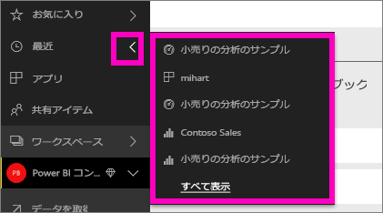

詳しくは、「[Power BI サービスの [最近] のコンテンツ](service-recent.md)」をご覧ください。

### アプリ
アプリは、主要な指標を全部 1 か所で提供するために作成されたダッシュボードとレポートの集まりです。 組織内部用のアプリと、Google アナリティクスや Microsoft Dynamics CRM など、[外部サービス用アプリ](service-connect-to-services.md)を用意できます。 

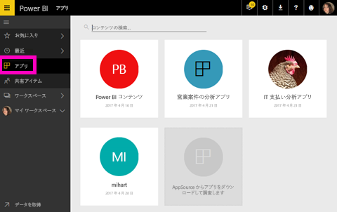

詳細については、後の「**アプリ ワークスペース**」および「[Power BI のアプリについて](service-install-use-apps.md)」をご覧ください。

### 自分と共有
**[自分と共有]** には、同僚から共有されているすべてのダッシュボードが表示されます。  ダッシュボードの所有者でフィルター処理し、検索フィールドを使って関連するものを検索し、日付でアイテムを並べ替えます。  頻繁にアクセスする共有コンテンツの場合、**[自分と共有]** ビューからお気に入りにした方が簡単です。

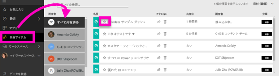

詳しくは、[自分と共有](service-shared-with-me.md)に関するページをご覧ください。

### ワークスペースの使用
次の左ナビゲーションに*ワークスペース*があります。 ワークスペースは、Power BI コンテンツの "*コンテナー*" のようなものです。 ワークスペースには、**マイ ワークスペース**とアプリ ワークスペースの 2 種類があります。

アプリ ワークスペースのメンバーまたは管理者ではない場合、アプリ ワークスペースが左ナビゲーションに表示されない場合があります。 また、Power BI 無料ユーザーの場合は、どのアプリ ワークスペースも表示されません。

#### マイワークスペース
**[マイ ワークスペース]** には、ユーザーが所有しているすべてのコンテンツが格納されます。 これは、個人用サンドボックスまたはユーザーのコンテンツの作業領域と考えることができます。 [マイ ワークスペース] のコンテンツは同僚と共有できます。 [マイ ワークスペース] でコンテンツは、ダッシュボード、レポート、ブックおよびデータセットの 4 つのタブにまとめられます。

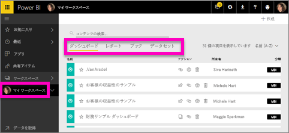

#### アプリ ワークスペース
アプリとアプリ ワークスペースは、Power BI Pro の機能です。 他のユーザー向けにダッシュボードとレポートを作成する場合は、それはアプリ ワークスペースで行います。 アプリ ワークスペースは、アプリを作成する場所です。そのため、アプリを作成するには、最初にアプリ ワークスペースを作成する必要があります。 アプリ ワークスペースはグループ ワークスペースが進化したもので、アプリのコンテンツのステージング領域とコンテナーが含まれています。  ユーザーと同僚は、より多くの対象ユーザー、場合によっては組織全体への配布を計画しているダッシュボード、レポート、その他のコンテンツを共同で作業することができます。

詳しくは、「[Power BI でのアプリの作成および配布](service-create-distribute-apps.md#app-workspaces)」をご覧ください。

**[マイ ワークスペース]** と同様、コンテンツは、ダッシュボード、レポート、ブックおよびデータセットの 4 つのタブにまとめられます。

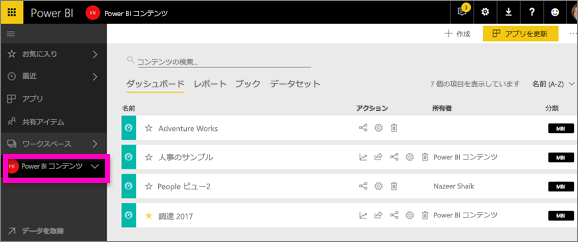

左ナビゲーションで **[ワークスペース]** を選択すると、ワークスペースを切り替えることができます。

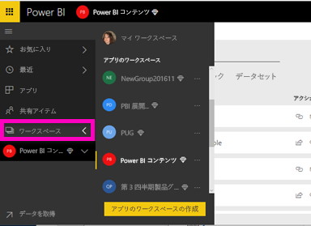

### コンテンツの検索と並べ替え
新しいコンテンツ ビューでは、コンテンツの検索、フィルター処理、並べ替えがいっそう簡単になります。 ダッシュボード、レポート、またはブックを検索するには、検索領域に入力します。 名前の一部に検索文字列が含まれるコンテンツだけが表示されます。

コンテンツは、名前または所有者で並べ替えることもできます。  

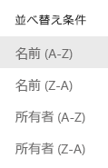

詳しくは、「[Power BI でコンテンツを検索したり並べ替える](service-navigation-search-filter-sort.md)」をご覧ください。

## 次の手順
質問やフィードバックがある場合は、 [Power BI のコミュニティ フォーラムを利用してください](http://community.powerbi.com/t5/Navigation-Preview-Forum/bd-p/NavigationPreview)。

