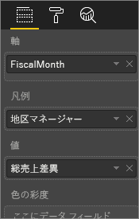

# レポート エディター...紹介を見る
Power BI サービスのレポート エディターと Power BI Desktop のレポート エディターは、よく似ています。 ビデオでは Power BI Desktop のレポート エディターを、この記事では Power BI サービスのレポート エディターを説明します。 

<iframe width="560" height="315" src="https://www.youtube.com/embed/IkJda4O7oGs" frameborder="0" allowfullscreen></iframe>

Power BI サービスでは、*レポート エディター*は[編集ビュー](service-reading-view-and-editing-view.md)でのみ使用できます。 編集ビューでレポートを開くには、レポートの所有者である必要があります。

Power BI レポート エディターは、3 つのセクションで構成されています。  

1. **フィールド**、**視覚化**、**フィルター**の各ウィンドウ
2. 上部のナビゲーション バー    
3. レポート キャンバス     

## 1.レポート エディターのウィンドウ

レポートを開くと、最初に視覚化、フィルター、フィールドという 3 つのウィンドウが表示されます。 左側にある視覚化ウィンドウとフィルター ウィンドウは、視覚化がどのように表示されるか (種類、色、フィルター、書式) を制御します。  右側にあるフィールド ウィンドウは、視覚化の際に使用される基になるデータを管理します。 

レポート エディターに表示されるコンテンツは、レポート キャンバスで選択した内容によって異なります。  たとえば、個々のビジュアルを選択すると、 

|  |  |
| --- | --- |
|  |<ul><li>視覚化ウィンドウの上部に、使用中のビジュアルの種類が識別されます。この例では、集合縦棒グラフです。  </li> <li>視覚化ウィンドウの下部に、ビジュアルに使用されているフィールドが表示されます (表示されない場合、下にスクロールしてください)。 このグラフでは FiscalMonth、DistrictManager、Total Sales Variance が使用されています。   </li><li>フィルター ウィンドウには、適用されているすべてのフィルターが表示されます (表示されない場合、下にスクロールしてください)。   </li><li>フィールド ウィンドウには、使用可能なテーブルが表示されます。テーブル名を展開すると、そのテーブルを構成しているフィールドが表示されます。 黄色のフォントは、そのテーブルの少なくとも 1 つのフィールドが視覚エフェクトで使用されていることを示します。  </li><li> 選択した視覚化の書式ウィンドウを表示するには、ペイント ローラーのアイコンを選択します。  </li><li> 分析ウィンドウを表示するには、拡大鏡アイコンを選択します。</ul> |
|  | |

## 視覚化ウィンドウ (上から下)

ここで視覚化の種類を選択します。 小さい画像は*テンプレート*と呼ばれます。 上の画像では集合縦棒グラフが選択されています。 最初に視覚化の種類を選択しないで、フィールドを選択して視覚化の作成を始めた場合、Power BI によって視覚化の種類が自動的に選択されます。 Power BI による選択をそのまま使用することも、別のテンプレートを選んで種類を変更することもできます。 必要なだけ何度でも種類を切り替えて、データを最も的確に表現できる視覚化の種類を見つけてください。

### ビジュアルで使用されているフィールドを管理する。

このウィンドウに表示されるバケット (*ウェル*と呼ばれることもあります) は、どの種類の視覚化を選択したかによって異なります。  たとえば、横棒グラフを選択した場合は、値、軸、および凡例のバケットが表示されます。 フィールドを選択するか、または、キャンバス上にドラッグすると、Power BI はバケットのいずれかにそのフィールドを追加します。  フィールドの一覧からバケットにフィールドを直接ドラッグすることもできます。  いくつかのバケットは、特定の種類のデータにしか使用できません。  たとえば、 **値** は数値以外のフィールドを受け付けません。 つまり、 **employeename** フィールドを **値** バケットにドラッグすると、Power BI によって **employeename の数**に変更されます。

### フィールドの削除
視覚化からフィールドを削除するには、フィールド名の右にある **[X]** を選択します。

詳細については、「[Power BI レポートへの視覚化の追加](power-bi-report-add-visualizations-i.md)」を参照してください。

### ビジュアルの書式設定
ペイント ローラー アイコンを選択して書式ウィンドウを表示します。 使用可能なオプションは、選んだ視覚化の種類によって異なります。

書式設定の可能性は、ほぼ無限です。  詳しくは、実際に使ってみるか、次の記事を参照してください。

* [視覚化タイトル、背景、および凡例のカスタマイズ](power-bi-visualization-customize-title-background-and-legend.md)
* [色の書式設定](service-getting-started-with-color-formatting-and-axis-properties.md)
* [X 軸と Y 軸のプロパティのカスタマイズ](power-bi-visualization-customize-x-axis-and-y-axis.md)

### 視覚化に分析を追加する
拡大鏡アイコンを選択して分析ウィンドウを表示します。 使用可能なオプションは、選んだ視覚化の種類によって異なります。

    
Power BI サービスの分析ウィンドウでは、視覚化に動的な基準線を追加し、重要な傾向や洞察にフォーカスを設定できます。 詳細については、「[Power BI サービスの [分析] ウィンドウ](service-analytics-pane.md)」または「[Power BI Desktop の [分析] ウィンドウ](desktop-analytics-pane.md)」を参照してください。

- - -
## フィルター ウィンドウ
ページ、レポート、ドリルスルー、ビジュアル レベルのフィルターを表示、設定、変更します。

詳細については、「[レポートへのフィルターの追加](power-bi-report-add-filter.md)」を参照してください。

- - -
## フィールド ウィンドウ
フィールド ウィンドウには、データ内に存在するテーブルとフィールドが表示されます。これらのテーブルとフィールドを使用して、視覚化を作成できます。

|  |  |
| --- | --- |
|  |<ul><li>ページにフィールドをドラッグして、新しい視覚化を作成します。  既存の視覚化にフィールドをドラッグし、その視覚化にフィールドを追加することもできます。  </li> <li>フィールドの横にチェックマークを追加すると、そのフィールドがアクティブな (または新しい) 視覚化に追加されます。 また、そのフィールドをどのバケットに配置するかも決定されます。  たとえば、フィールドを凡例、軸、値のいずれに使用するかについて決定されます。 Power BI で最良の判断が行われますが、配置されたフィールドを必要に応じて別のバケットに移動できます。   </li><li>どちらの方法でも、選択された各フィールドは、レポート エディターの視覚化ウィンドウに追加されます。</li></ul> |

**注**: Power BI Desktop を使用している場合は、フィールドの表示/非表示、計算の追加などのオプションも使用できます。

### フィールドのアイコンの意味
* **∑ 集計** 集計とは、合計や平均などが計算される数値です。 集計は、データと一緒にインポートされます (レポートの基となるデータ モデルで定義されます)。
  詳細については、「[Power BI レポートの集計](service-aggregates.md)」を参照してください。
*  **計算メジャー (計算フィールドとも呼ばれています)**  
   それぞれの計算フィールドには、独自のハードコーディングされた式があります。 計算を変更することはできません、たとえば、合計であれば、合計のままにしかできません。 詳細については、「[メジャーについて](desktop-measures.md)」を参照してください。
*  **一意のフィールド**  
   このアイコンのフィールドは、Excel からインポートされ、重複するものがあっても、すべての値が表示されるように設定されています。 たとえば、データに 'John Smith' という名前のユーザーのためのレコードが 2 つあったとしても、それぞれが一意として扱われ、合計が計算されることはありません。  
* ** 地理フィールド**  
   地図の視覚化を作成するために使用できる場所フィールドです。 
* ** 階層**  
   方向キーを選択し、階層を構成するフィールドを表示します。 

- - -
## 2.上部のナビゲーション バー
上部のナビゲーション バーからさまざまな操作を実行できます。新しい操作が常時追加されています。 特定の操作については、Power BI ドキュメントの目次や検索ボックスを使用してください。

## 3.レポート キャンバス
レポート キャンバスは、作業内容が表示される場所です。 フィールド、フィルター、視覚化のウィンドウを使用してビジュアルを作成すると、ビジュアルはレポート キャンバスで構築され、表示されます。 キャンバスの下部にあるタブは、それぞれレポートのページを表します。 タブを選択すると、そのページが開きます。 

## 次の手順:
[レポートの作成](service-report-create-new.md)

[レポートの編集](service-interact-with-a-report-in-editing-view.md)

[Power BI のレポート](service-reports.md)で詳細を確認する

[Power BI の概要](service-get-started.md)

[Power BI - 基本的な概念](service-basic-concepts.md)

他にわからないことがある場合は、 [Power BI コミュニティを利用してください](http://community.powerbi.com/)。

