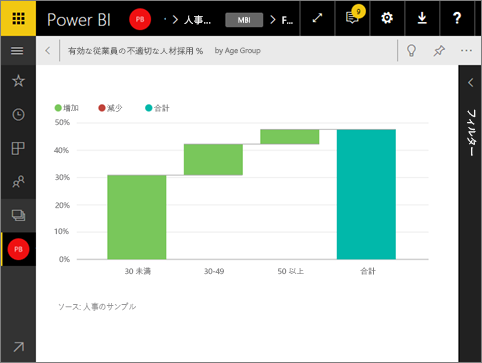

# 全画面表示モードでダッシュボード タイルを表示する
タイルを全画面モードで表示するには、その前にタイルを[フォーカス モード](service-focus-mode.md)にする必要があります。

## 全画面表示モードの概要
メニューやナビゲーション ボタンを表示せずに、[ダッシュボード、レポート](service-fullscreen-mode.md)、タイルを表示します。  いつでもひと目でビジネスの全体図のみを把握できます。 このモードはテレビ モードとも呼ばれます。

全画面表示モードの使用例:

* 会議やカンファレンスでタイルを表示する
* オフィスの専用の大型画面やプロジェクターにタイルを表示する
* 小さい画面でタイルを見る
* ロック モードでタイルを表示する -- 画面をタッチしたり、マウスでタイルをポイントしたりしても元のレポートが開きません

## 全画面モードをオン (またはオフ) にする方法
1. [タイルをポップアウトしてフォーカス モードで表示](service-focus-mode.md)します。
   
    
   
    キャンバスにタイルが表示され、詳細を確認できます。 ダッシュボード タイル用のフォーカス モードでは、このビジュアルを作成したときに適用したフィルターを表示および変更できます。
   
    
2. 上部のメニュー バーから、このアイコン  を選択してタイルを全画面表示モードで表示します。
3. 全画面モードでは、メニューとナビゲーション ボタンが表示されず、画面全体にタイルが表示されます。  いつでもひと目でタイルの全体図のみを把握できます。 このモードはテレビ モードとも呼ばれます。
   
   
4. マウスを動かすと、メニューが表示されます。 全画面表示モードを終了するまで、メニューは右下隅に表示され続けます。 消えた場合は、カーソルを動かすか画面をタップするだけで再び表示されます。
   
    
   
   * 前のページに移動するには、ブラウザーの **[戻る]** ボタンをクリックします。 前のページが Power BI サービス ページの場合は、全画面表示モードで表示されます。  全画面表示モードは、全画面表示を閉じるまで保持されます。
   * 全画面表示モードからタイルを印刷するには、[印刷] アイコンを選択します。
     
   * 全画面表示モードを終了するには、**[全画面表示を閉じる]** アイコン  を選択します。

## 次の手順
[Power BI のダッシュボード](service-dashboards.md)

[全画面モードでダッシュボードとレポートを表示する](service-fullscreen-mode.md)

[Power BI のフォーカス モード](service-focus-mode.md)

他にわからないことがある場合は、 [Power BI コミュニティを利用してください](http://community.powerbi.com/)。

