# Power BI における色の書式設定に関するヒントとコツ
Power BI は、ダッシュボードとレポートをカスタマイズするためのさまざまな方法を提供しています。 この記事では、Power BI の視覚化を、説得力のある興味をひくものにして、お客様のニーズに合わせてカスタマイズできる各種ヒントについて詳しく説明しています。

ヒントには次のものがあります。 優れた別のヒントをお持ちですか。 それは素晴らしいことです。 そのヒントを是非マイクロソフトまでお送りください。この一覧への追加を検討させていただきます。

* 1 つのデータ ポイントの色を変更する
* グラフの色を 1 つの数値に基づいて決める
* データ ポイントの色を 1 つのフィールドの値に基づいて決める
* カラー スケールで使用する色をカスタマイズする
* 左右逆方向のカラー スケールを使用する
* Power BI で元に戻す方法

変更を行うには、レポートを編集している必要があります。つまり、次の図に示すように、**[マイ ワークスペース]** ウィンドウから **[レポート]** を選んでから、上部のメニュー領域で **[レポートの編集]** を選びます。

**[視覚化]** ウィンドウが **[レポート]** キャンバスの右側に表示されたら、カスタマイズを開始できます。

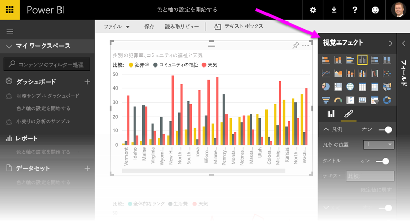

## 1 つのデータ ポイントの色を変更する
特定の 1 つのデータ ポイントを強調表示したい場合があります。 このようなデータ ポイントには、発売した新製品の売上高や、新しい計画が開始した後に向上した品質のスコアなどがあります。 Power BI を使用すれば、特定のデータ ポイントの色を変更することで、それを強調表示できます。

次の視覚化では、生活費に関する状態を順位付けしています。 

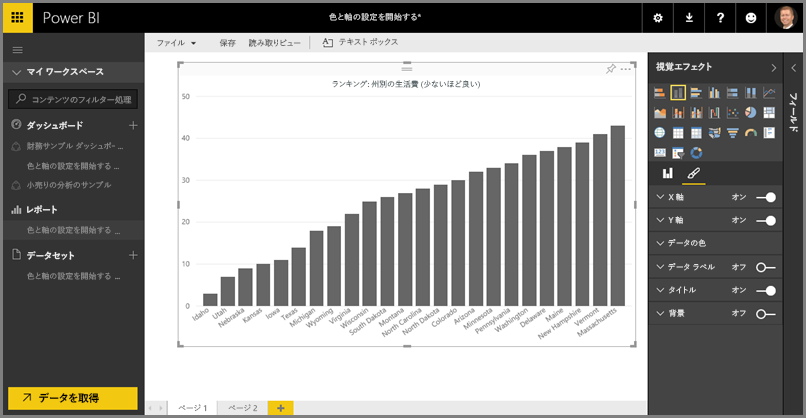

ここで、この順位付けされた一覧での Washington の位置を、色を使用してすばやく示したいとします。 この手順を以下に示します。

**[データの色]** セクションを展開します。 次のように表示されます。

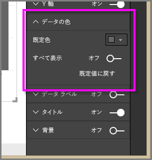

**[すべて表示]** を **[オン]** に設定します。 これにより、視覚化内の各データ要素の色が表示されます。 データ ポイントにポインターを合わせるとスクロールが有効になり、任意のデータ ポイントを変更できるようになります。

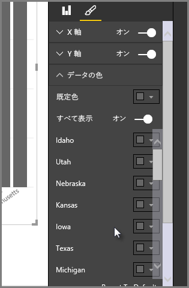

ここでは、 **Washington** を緑に変更してみましょう。 **Washington** までスクロールして、その色のボックス内の下矢印を選ぶと、色を選ぶためのウィンドウが表示されます。

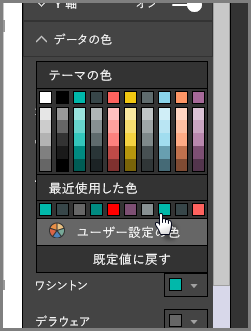

緑を選ぶと、 **Washington** のデータ ポイントが緑の網掛けになり、確実に目立ちます。

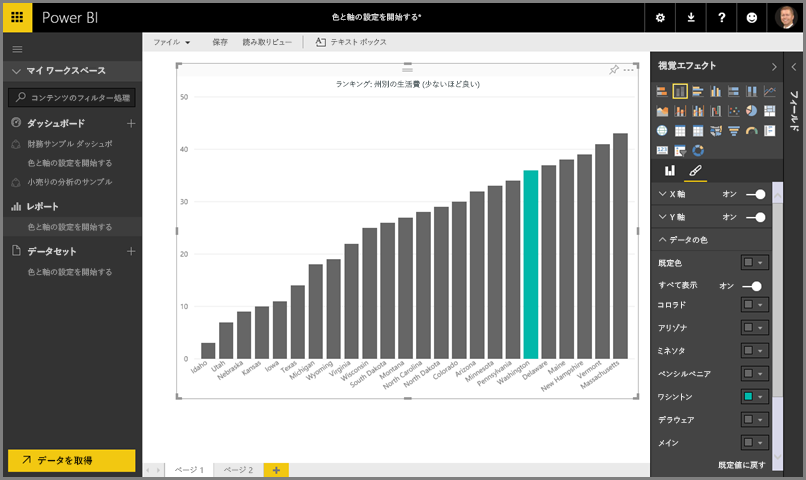

視覚化の種類を変更してから処理を終了した場合でも、Power BI では選んだ内容が記憶され、 **Washington** を緑のままに保ちます。

複数のデータ要素のデータ ポイントの色を変更することもできます。 次の図では、 **Arizona** が赤で **Washington** は緑のままです。

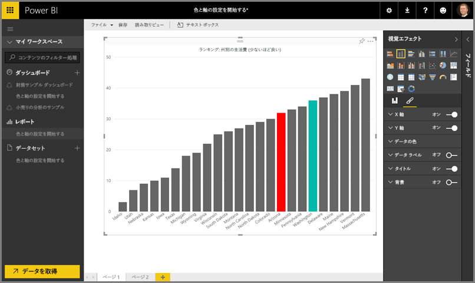

色を使用すると、さまざまなことを行えます。 次のセクションでは、グラデーションを確認してみましょう。

## グラフの色を 1 つの数値に基づいて決める
あるフィールドの数値に基づいてグラフの色を動的に設定すると役立つ場合がよくあります。 このように色を設定すると、1 つの横棒のサイズに使用された値とは異なる値を示して、1 つのグラフに 2 つの値を表示できます。 また、このような設定を使用して、特定の値の上 (または下) のデータ ポイントを強調表示することもできます (低い収益性の領域を強調表示するような場合)。

次のセクションでは、ある数値に基づいて色を決めるためのさまざまな方法を示します。

## データ ポイントの色を 1 つの値に基づいて決める
1 つの値に基づいて色を変更するには、色の基準となるフィールドを、 **[フィールド]** ウィンドウの **\[Color Saturation] \(色の彩度)** 領域にドラッグします。 次の図では、 **Profit before tax (税引き前利益)** が **\[Color Saturation] \(色の彩度)** にドラッグされています。 グラフを見れば分かるように、 **Velo** の方が **Gross Sales (総売上)** は高い (縦棒がより高い) ものの、 **Amarilla** の方が **Profit before tax (税引き前利益)** はより大きくなっています (縦棒の色の彩度が高い)。

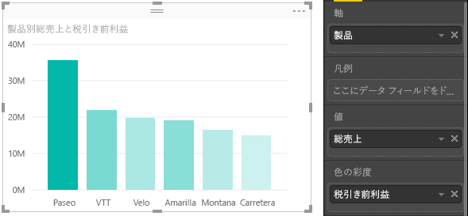

## カラー スケールで使用する色をカスタマイズする
カラー スケールで使用する色もカスタマイズすることができます。 **[データの色]** を展開すると、データの視覚化に使用する色のグラデーションが表示されます。 既定では、データ内の最小値が最も低い彩度の色にマップされ、最大値が最も彩度の高い色にマップされます。

色の範囲は、 **[最小]** と **[最大]** の色の値の間にスペクトルが表示されるグラデーション バーに示され、 **最小** 値の色が左側、 **最大** 値の色が右側になります。

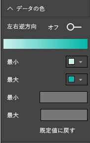

異なる範囲の色を使用するためにスケールを変更するには、 **[最小]** または **[最大]** の横にある色のドロップダウンを選んでから、色を選びます。 次の図では、黒に変更された **[最大]** の色が示され、グラデーション バーには、**[最小]** と **[最大]** の間に新しい色のスペクトルが示されています。

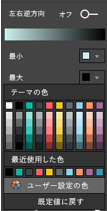

また、値をこれらの色にマップする方法を変更することもできます。 次の図では、 **[最小]** と **[最大]** の色がオレンジ色と緑に、それぞれ設定されています。

この最初の図で、横棒に示されたグラデーションがどのようにグラフの縦棒に反映されているかにご注目ください。つまり、最大値が緑、最小値がオレンジ色で、それらの間の各縦棒は、緑とオレンジ色の間のスペクトルの網掛けで色が設定されています。

ここで、**[最小]** と **[最大]** の各値ボックスに数値を指定した場合にどうなるか見てみましょう。これらのボックスは、**[最小]** と **[最大]** の各色セレクターの下にあります (次の図を参照)。 **[最小]** を 20,000,000 に設定し、**[最大]** を 20,000,000 に設定してみましょう。

これらの値を設定すると、**[最小]** よりも低いか、または **[最大]** よりも高いグラフの値には、グラデーションが適用されなくなります。つまり、**[最大]** 値よりも高い値を持つすべての縦棒には緑、**[最小]** 値よりも低い値を持つすべての縦棒には赤が設定されます。

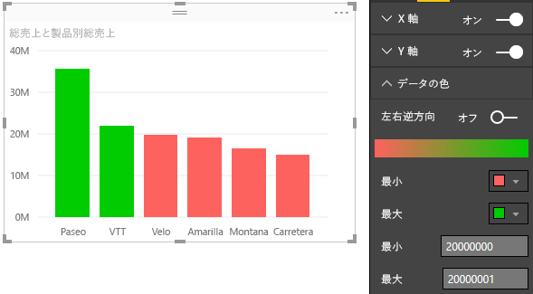

## [左右逆方向] のカラー スケールを使用する
データに、もともと左右逆方向の尺度がある場合があります。 たとえば、温度の範囲には氷点に中央があり、収益性スコアには中間点 (ゼロ) があります。

左右逆方向のカラー スケールを使用するには、 **[左右逆方向]** スライダーを **[オン]** にスライドさせます。 **[左右逆方向]** がオンの場合、追加のカラー セレクターと値ボックス (ともに **[中央]** という) が次の図のように表示されます。

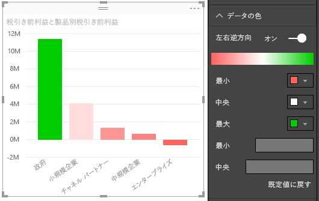

**[左右逆方向]** スライダーがオンの場合、 **[最小]**、 **[最大]** 、および **[中央]** の色を別々に設定することができます。 次の図では、 **[中央]** が 1 に設定されているため、1 を超える値を持つ縦棒は緑のグラデーションの網かけ、1 を下回縦棒は赤の網かけになります。

## Power BI で元に戻す方法
他の多くの Microsoft のサービスやソフトウェアと同様に、Power BI には、最後のコマンドを元に戻すための簡単な方法が備わっています。 たとえば、データ ポイントの色または一連のデータ ポイントを変更した場合に、それらが視覚化に表示されるときの色が好みでない場合があります。 そして、前にどの色だったか正確には思い出せないけれども、その色に戻したいことがあります。

直前の操作または最近のいくつか操作を **元に戻す** には、次の操作を行うだけです。

- CTRL + Z を入力します

## フィードバック
共有したいヒントがありますか? そのヒントを是非マイクロソフトまでお送りください。このページに記載することを検討させていただきます。

>[!NOTE]
>上記の色、軸、関連するカスタマイズは、**[書式]** アイコンが選ばれている場合に使用できます。また、Power BI Desktop でも使用できます。

## 次の手順
[色の書式設定と軸のプロパティの概要](service-getting-started-with-color-formatting-and-axis-properties.md)

