# <a name="tutorial-use-cognitive-services-in-power-bi"></a>チュートリアル:Power BI での Cognitive Services の使用

Power BI で Azure Cognitive Services からの一連の関数にアクセスし、データフロー用のセルフ サービスのデータ準備でデータを強化することが可能です。 現在サポートされているサービスは、[感情分析](https://docs.microsoft.com/azure/cognitive-services/text-analytics/how-tos/text-analytics-how-to-sentiment-analysis)、[キー フレーズ抽出](https://docs.microsoft.com/azure/cognitive-services/text-analytics/how-tos/text-analytics-how-to-keyword-extraction)、[言語検出](https://docs.microsoft.com/azure/cognitive-services/text-analytics/how-tos/text-analytics-how-to-language-detection)、および[イメージのタグ付け](https://docs.microsoft.com/azure/cognitive-services/computer-vision/concept-tagging-images)です。 変換は Power BI サービス上で実行されます。Azure Cognitive Services サブスクリプションは不要です。 この機能には、Power BI Premium が必要です。

Cognitive Services の変換は、[データフロー用のセルフ サービスのデータ準備](https://powerbi.microsoft.com/blog/introducing-power-bi-data-prep-wtih-dataflows/)でサポートされます。 最初に、以下に示すテキスト分析およびイメージのタグ付けに関するステップ バイ ステップの例を使用します。

このチュートリアルで学習する内容は次のとおりです。

> [!div class="checklist"]
> * データフロー内にデータをインポートする
> * センチメントをスコア付けし、データフロー内のテキスト列のキー フレーズを抽出する
> * Power BI Desktop から結果に接続する


## <a name="prerequisites"></a>前提条件

このチュートリアルでは、以下のものが必要です。 

- Power BI アカウント。 Power BI にサインアップしていない場合は、[無料の試用版にサインアップ](https://app.powerbi.com/signupredirect?pbi_source=web)してください。
- AI ワークロードが有効な Power BI Premium 容量へのアクセス権。 プレビュー中、既定では、このワークロードはオフになります。 Premium 容量を使用しているのに AI Insights が表示されない場合は、Premium 容量の管理者に連絡し、管理ポータルで AI ワークロードを有効にしてもらってください。

## <a name="text-analytics"></a>テキスト分析

チュートリアルのテキスト分析の部分を完了するには、このセクションの手順に従ってください。

### <a name="step-1-apply-sentiment-scoring-in-power-bi-service"></a>手順 1:Power BI サービスでセンチメント スコアリングを適用する

最初に、Premium 容量を持つ Power BI ワークスペースに移動します。次に、画面右上の **[作成]** ボタンを使用して、新しいデータフローを作成します。

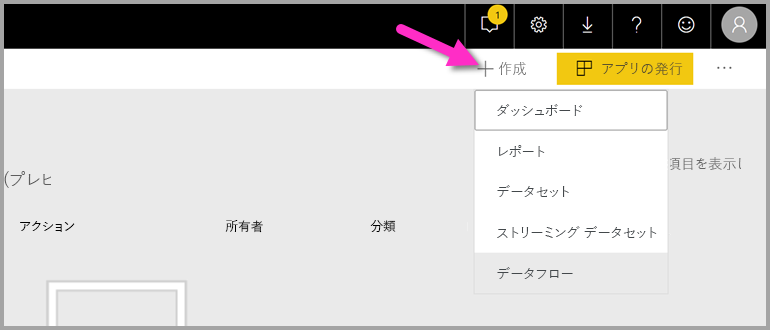

データ フロー ダイアログには、新しいデータ フローを作成するためのオプションが表示されます。**[新しいエンティティを追加]** を選択します。 次に、データ ソースのメニューから **[テキスト/CSV]** を選択します。

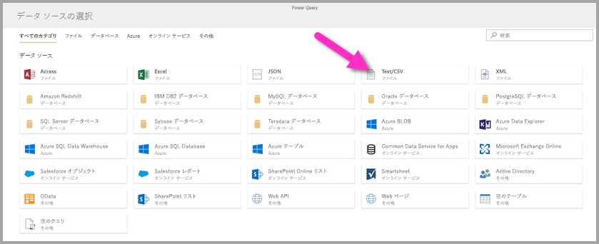

URL フィールドに [https://pbiaitutorials.blob.core.windows.net/textanalytics/FabrikamComments.csv](https://pbiaitutorials.blob.core.windows.net/textanalytics/FabrikamComments.csv) を貼り付けて、**[次へ]** をクリックします。

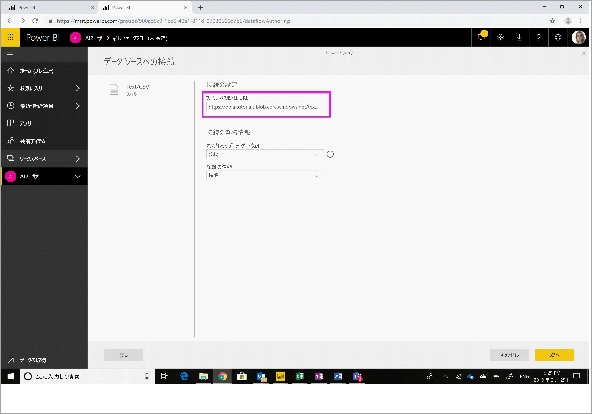

上部のリボン内で **[テーブルの変換]** を選択してから、**[先頭の行を見出しとして使用]** を選択します。 これでデータがテキスト分析に使用できるようになり、顧客のコメント列でセンチメント スコアリングとキー フレーズ抽出が使用可能になります。

Power Query エディターで、**[AI Insights]** を選択します。

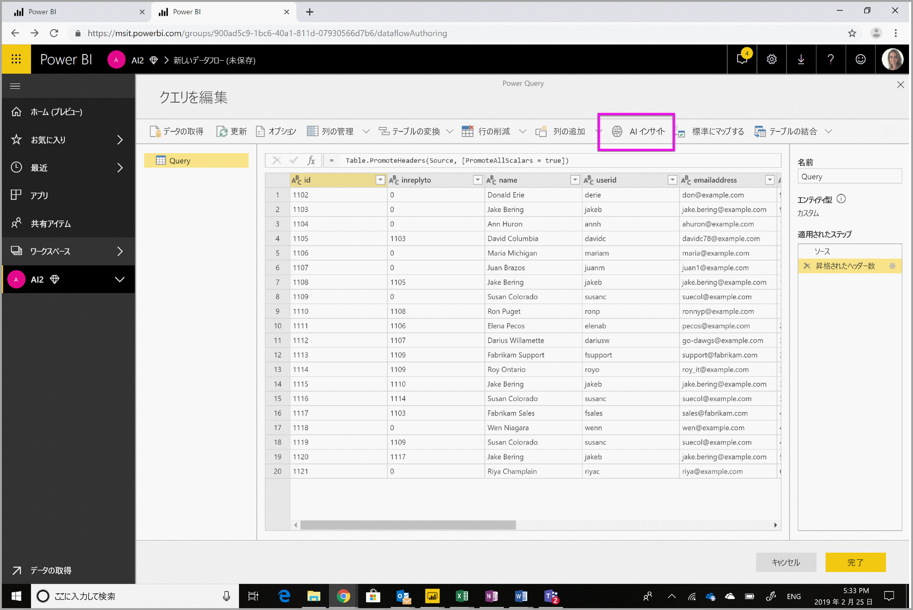

**[Cognitive Services]** フォルダーを展開し、使用する関数を選択します。 この例では、コメント列のセンチメントをスコア付けしていますが、同じ手順に従って、言語検出とキー フレーズ抽出を試すことができます。

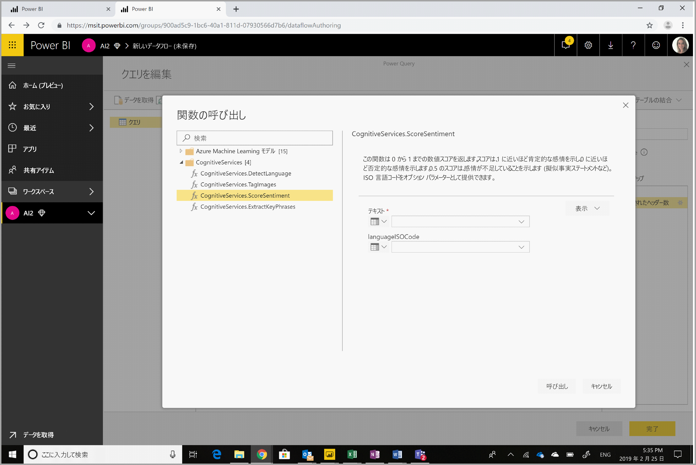

関数を選択すると、必須フィールドと省略可能フィールドが表示されます。 例のレビューのセンチメントをスコア付けするには、レビュー列をテキスト入力として選択します。 カルチャ情報は省略可能な入力で、ISO 形式で入力する必要があります。 たとえば、テキストを英語として処理する場合は、「en」 と入力します。 フィールドを空白のままにした場合、Power BI は、最初に入力値の言語を検出してから、センチメントをスコア付けします。

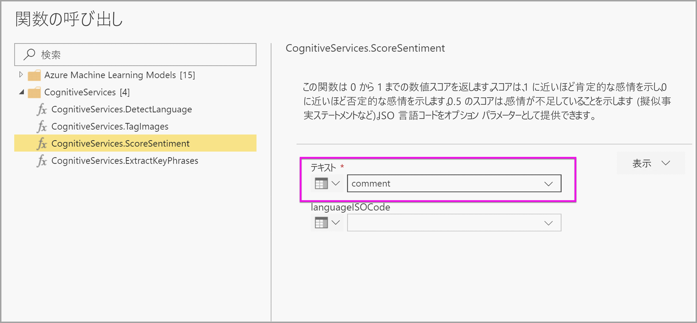

ここで **[Invoke]\(呼び出し\)** を選択すると、関数が実行されます。 各行のセンチメント スコアを含む新しい列がテーブルに追加されます。 **[AI insights]** に戻ると、レビュー テキストのキー フレーズを同じ方法で抽出できます。

変換が完了したら、クエリ名を "Customer comments" (顧客のコメント) に変更して、**[完了]** を選択します。

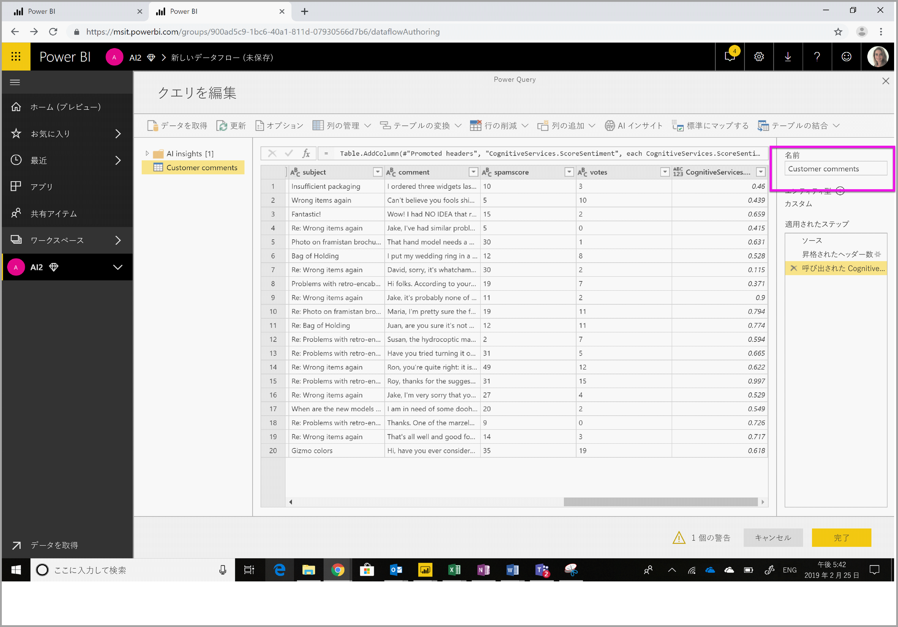

次に、データフローを**保存**して、その名前を Fabrikam に設定します。 データ フローを保存した後にポップアップ表示される **[今すぐ更新]** ボタンを選択します。

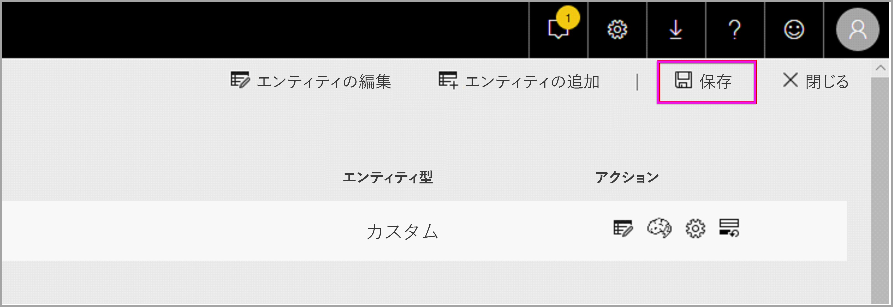

データ フローを保存して更新すると、そのデータフローを Power BI レポート内で使用できるようになります。

### <a name="step-2-connect-from-power-bi-desktop"></a>手順 2:Power BI Desktop から接続する

Power BI Desktop を開きます。 [ホーム] リボンで **[データの取得]** を選択します。

[Power BI] セクションの **[Power BI dataflows (Beta)]\(Power BI データフロー (ベータ版)\)** に移動して、**[接続]** を選択します。

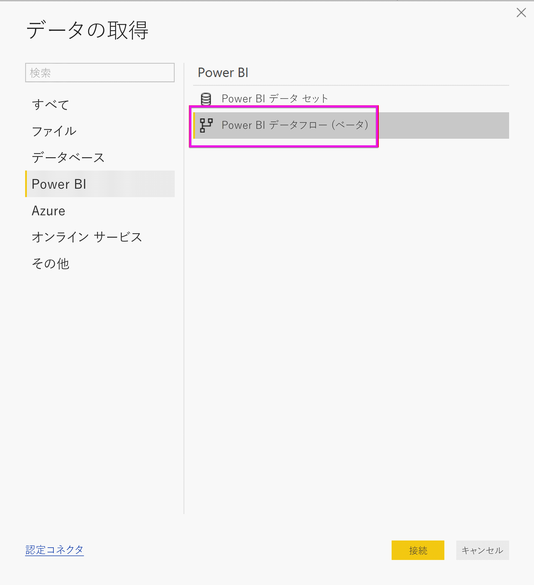

これはプレビュー機能であるため、プレビューの条件を受け入れるようにコネクタから求められます。 条件を受け入れたら、組織のアカウントでサインインします。

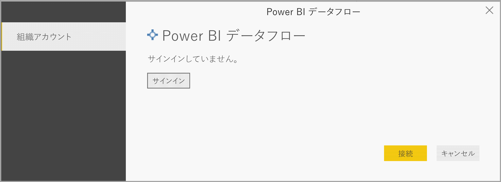

先ほど作成したデータ フローを選択します。 [Customer comments]\(顧客のコメント\) テーブルに移動して、**[読み込み]** をクリックします。

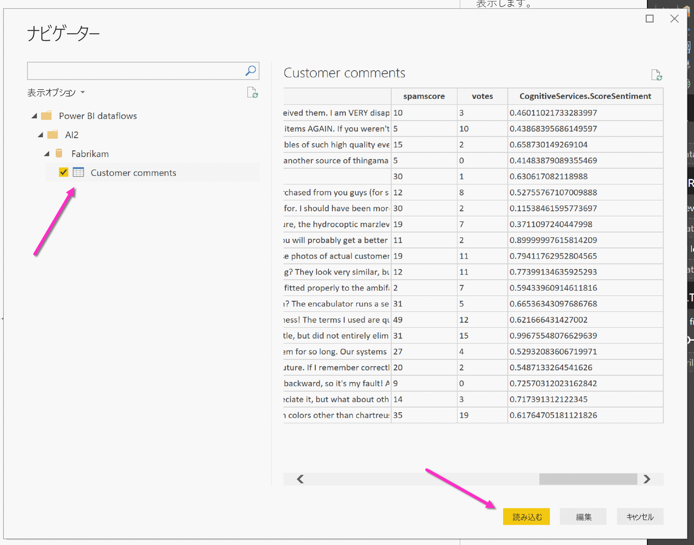

以上でデータが読み込まれ、レポートの作成を開始できるようになります。

## <a name="image-tagging"></a>イメージのタグ付け

Premium 容量を持つ Power BI ワークスペースに移動します。 画面右上の **[作成]** ボタンを使用して、新しいデータフローを作成します。

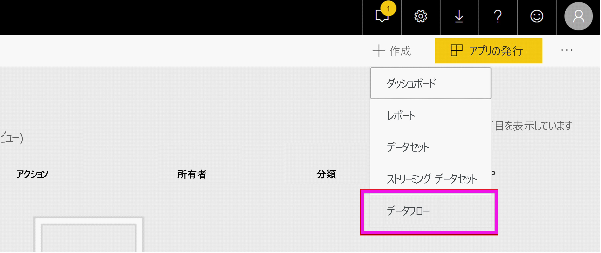

**[新しいエンティティを追加]** を選択します。

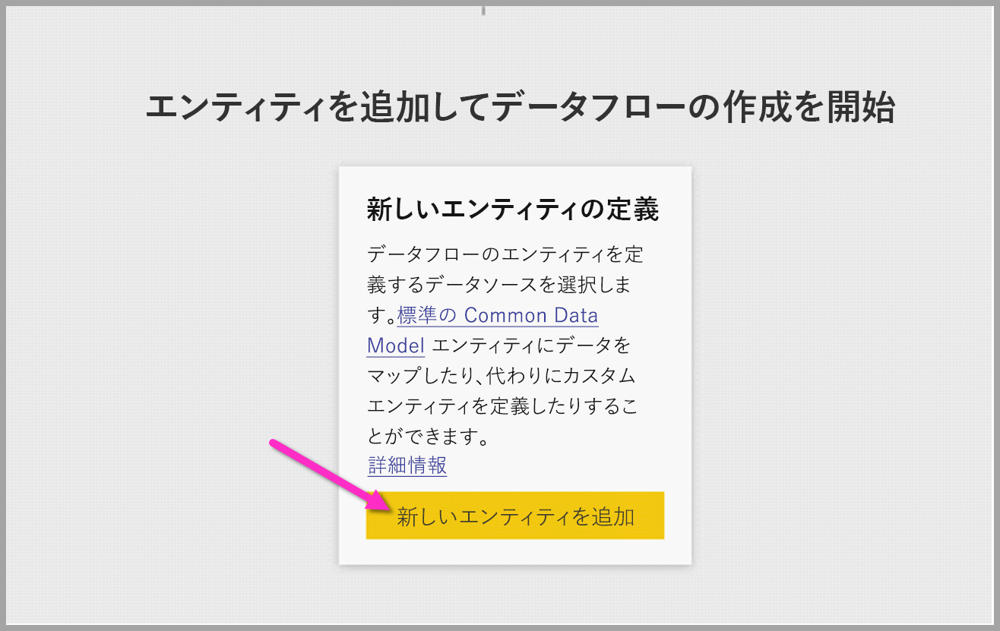

データ ソースの選択を求められたら、**[空のクエリ]** を選択します。

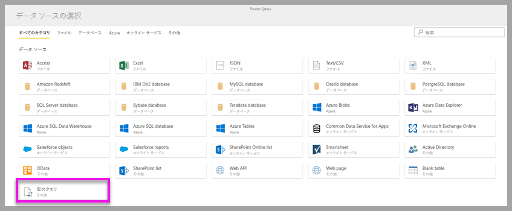

クエリ エディターで以下のクエリをコピーし、[次へ] をクリックします。 以下の URL パスを他のイメージに置き換えるか、さらに行を追加します。 "*Web.Contents*" 関数は、イメージの URL をバイナリとしてインポートします。 データ ソースにイメージがバイナリとして保存されている場合は、それを直接使用することもできます。


```python
let
  Source = Table.FromRows({
  { Web.Contents("https://images.pexels.com/photos/87452/flowers-background-butterflies-beautiful-87452.jpeg") },
  { Web.Contents("https://upload.wikimedia.org/wikipedia/commons/5/53/Colosseum_in_Rome%2C_Italy_-_April_2007.jpg") }}, { "Image" })
in
  Source
```

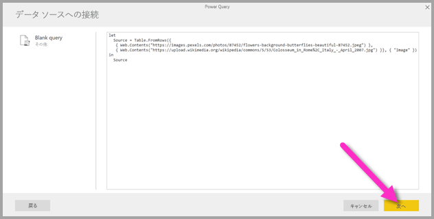

資格情報の入力を求められたら、*[匿名]* を選択します。

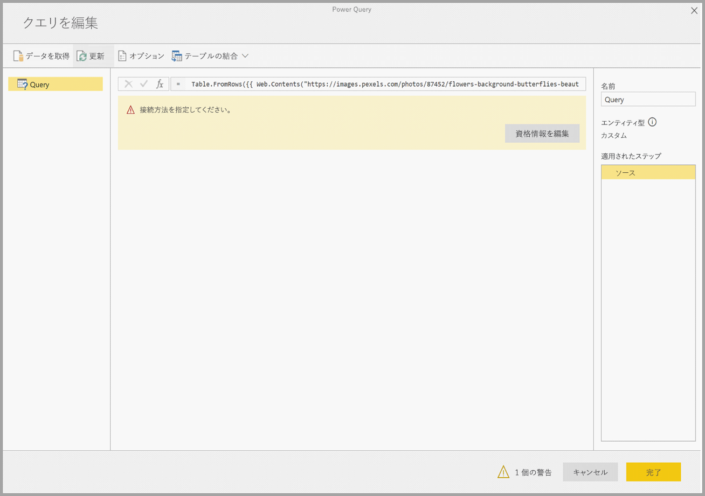

以下の画像が表示されます。

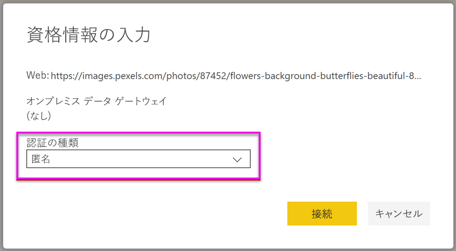

Web ページごとに資格情報の入力を求められます。

クエリ エディターで **[AI Insights]** を選択します。

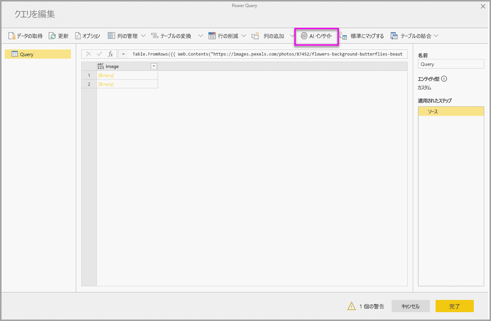

次に、**組織のアカウント**でサインインします。

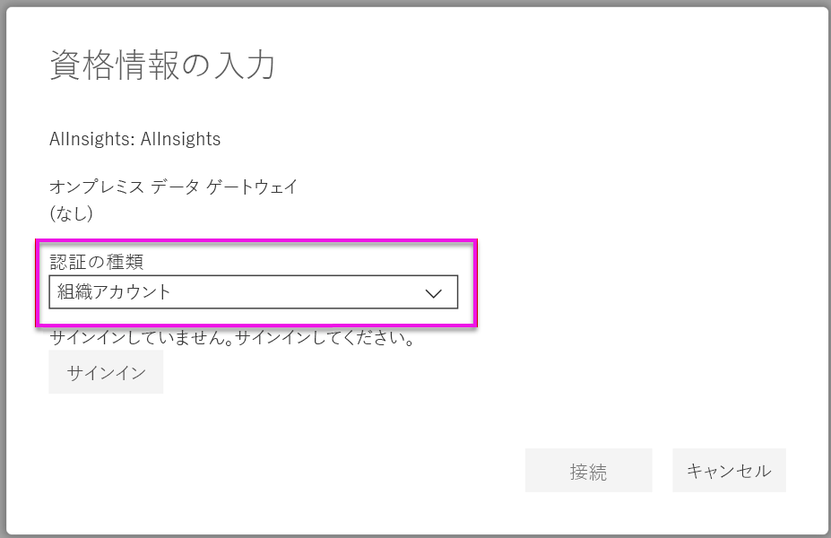

Tag Images 関数を選択し、列フィールドに「_[バイナリ]_」、カルチャ情報フィールドに「_en_」と入力します。 

> [!NOTE]
> 現在のところ、ドロップダウンを使用して列を選択することはできません。これは、プライベート プレビュー期間中にできるだけ早く解決される予定です。

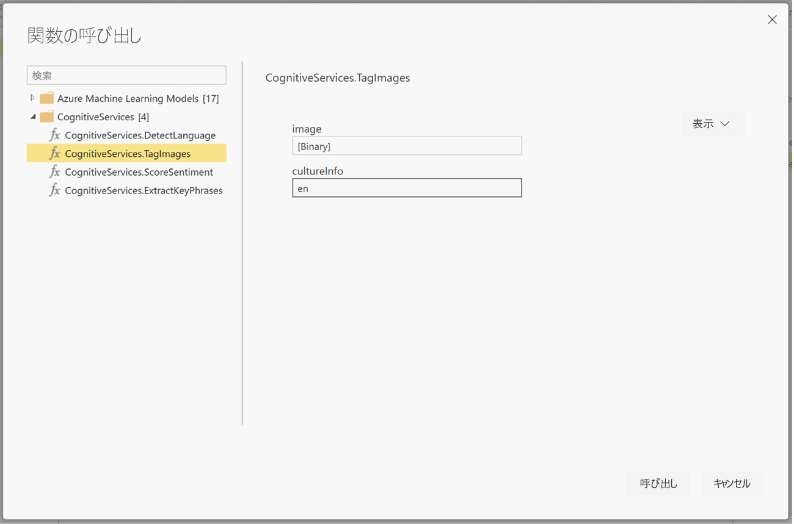

関数エディターで、列名を囲む引用符を削除します。 

> [!NOTE]
> 引用符の削除は、一時的な回避策です。プレビュー期間中にできるだけ早く解決される予定です。

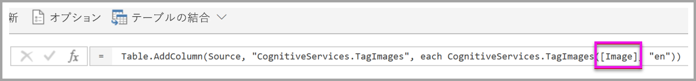

この関数では、コンマ区切り形式のタグと json レコードとしてのタグの両方を含むレコードが返されます。 展開ボタンを選択すると、その一方または両方を、列としてテーブルに追加できます。

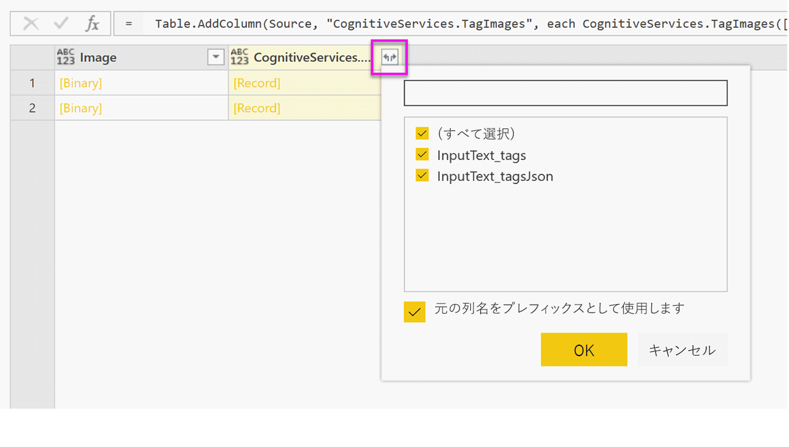

**[完了]** を選択し、データフローを保存します。 データフローを更新すると、データフロー コネクタを使用して Power BI Desktop からそれに接続できます。 (このドキュメントの 5 ページの手順を参照してください)。

## <a name="clean-up-resources"></a>リソースをクリーンアップする

不要になったクエリは、Power Query エディターでクエリ名を右クリックし、**[削除]** を選択して削除します。

## <a name="next-steps"></a>次の手順

このチュートリアルでは、Power BI のデータ フロー上でセンチメント スコアリングおよびイメージのタグ付け関数を適用しました。 Power BI での Cognitive Services の詳細については、以下の記事を参照してください。

* [Azure での Cognitive Services](https://docs.microsoft.com/azure/cognitive-services/)
* [データフロー上でのセルフサービスのデータ準備](service-dataflows-overview.md)の開始
* [Power BI Premium](https://powerbi.microsoft.com/power-bi-premium/) の詳細について

次の記事にも興味をもたれるかもしれません。

* [チュートリアル:Power BI での Machine Learning Studio モデルの呼び出し (プレビュー)](service-tutorial-invoke-machine-learning-model.md)
* [Azure Machine Learning の Power BI への統合 (プレビュー)](service-machine-learning-integration.md)
* [Power BI での Cognitive Services (プレビュー)](service-cognitive-services.md)