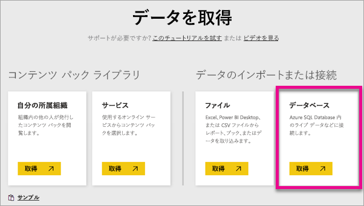
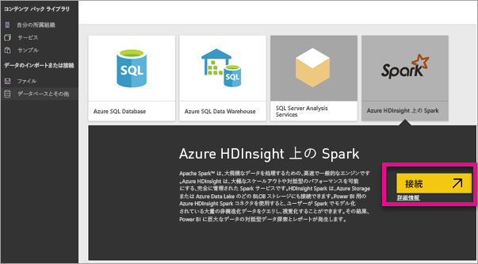
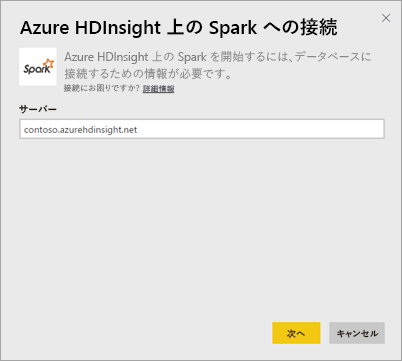
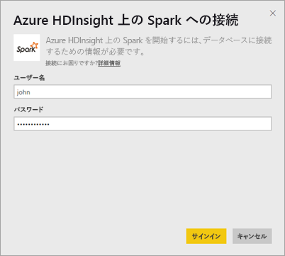
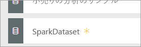
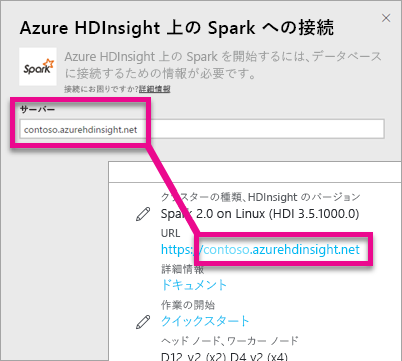
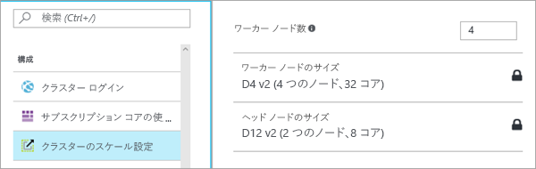

# DirectQuery を使用する HDInsight 上の Spark
DirectQuery を使用する Azure HDInsight 上の Spark を使えば、Spark クラスターにすでに保持してあるデータとメトリックに基づいて、動的なレポートを作成できます。 DirectQuery があれば、レポート ビューでデータを探索するときに、Azure HDInsight Spark クラスターにクエリが送り返されます。 この操作は、接続先のエンティティに精通しているユーザーにお勧めします。

> [!WARNING]
> Spark ベースのデータセットに基づいて作成されたダッシュボードのタイルでは、タイルの自動更新は無効になっています。 **[ダッシュボード タイルの更新]** を選択して手動で更新できます。 レポートは影響を受けず、最新の状態のままです。 
> 
> 

次の手順を使用すると、Power BI サービス内の DirectQuery を使用して、Azure HDInsight のデータ ソースで Spark に接続できます。

1. 左側のナビゲーション ウィンドウの下部にある **[データの取得]** を選択します。
   
     
2. **[データベースとその他]** を選択します。
   
     
3. **[Spark on HDInsight]** コネクタを選択して、 **[接続]**を選択します。
   
     
4. 接続先の**サーバー**の名前と、**ユーザー名**および**パスワード**を入力します。 このサーバーは、常に \<クラスター名\>.azurehdinsight.net という形式になります。これらの値を見つける方法については後述します。
   
     
   
     
5. 接続すると、"SparkDataset" という名前の新しいデータセットが表示されます。 このデータセットには、作成されたプレースホルダーのタイルからアクセスすることもできます。
   
     
6. データセットをドリルダウンすると、データベースに含まれるすべてのテーブルと列を探索できます。 列を選択すると、クエリがソースに送り返されて、ビジュアルが動的に作成されます。 これらのビジュアルは、新しいレポートに保存したり、ダッシュボードに戻してピン留めしたりできます。

## HDInsight 上の Spark のパラメーターを検索する
サーバーは、常に \<クラスター名\>.azurehdinsight.net の形式になります。これは、Azure Portal で確認できます。

ユーザー名とパスワードについても、Azure Portal で確認できます。

## 制限事項
これらの制限および注意事項については、エクスペリエンスの向上に伴い変更される可能性があります。 その他のドキュメントは、「[Azure HDInsight の Apache Spark での BI ツールの使用](https://azure.microsoft.com/documentation/articles/hdinsight-apache-spark-use-bi-tools/)」をご覧ください。

* Power BI サービスでは、Spark 2.0 および HDInsight 3.5 の構成のみをサポートしています。
* 列の選択やフィルターの追加など、各操作からクエリがデータベースに送信されるようになりました。サイズの大きなフィールドを選択する前に、適切なビジュアルの種類を選択してください。
* DirectQuery データセットの Q&A は使用できません。
* スキーマ変更は自動選択されません。
* Power BI では、データセット内の**テーブル全体で** 16,000 の列がサポートされています。 また、Power BI には、テーブルごとに内部の行番号列も含まれています。 つまり、データセット内にテーブルが 100 個ある場合は、使用可能な列数は 15,900 になるということです。 Spark データ ソースから使用しているデータの量によって、この制限は異なる場合があります。

## トラブルシューティング
クラスターに対するクエリの実行に問題が発生する場合は、アプリケーションがまだ実行されているかどうかを確認し、必要な場合は再起動します。

**[構成]** > **[クラスターのスケール設定]** で Azure Portal 内の他のリソースを割り当てることもできます。

## 次の手順
[概要: HDInsight Linux で Apache Spark クラスターを作成し、Spark SQL を使用して対話型のクエリを実行する](https://azure.microsoft.com/documentation/articles/hdinsight-apache-spark-jupyter-spark-sql)  
[Power BI の概要](service-get-started.md)  
[Power BI のデータの取得](service-get-data.md)  
他にわからないことがある場合は、 [Power BI コミュニティを利用してください](http://community.powerbi.com/)。

