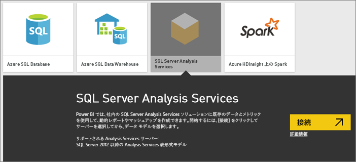
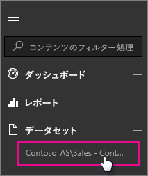

# Power BI の SQL Server Analysis Services ライブ データ
Power BI では、ライブ SQL Server Analysis Services サーバーに接続できる方法が 2 つあります。 **[データの取得]** で SQL Server Analysis Services サーバーに接続する方法と、既に Analysis Services サーバーに接続している [Power BI Desktop ファイル](service-desktop-files.md)または [Excel ブック](service-excel-workbook-files.md)に接続する方法です。 ベスト プラクティスとして、Power BI Desktop を使用することを強くお勧めします。これは、ツールセットが豊富で、Power BI Desktop ファイルのバックアップ コピーをローカルで維持できるためです。

 >[!IMPORTANT]
 >* ライブ Analysis Services サーバーに接続するには、オンプレミス データ ゲートウェイが管理者によってインストールおよび構成されている必要があります。 詳細については、「[オンプレミス データ ゲートウェイ](service-gateway-onprem.md)」をご覧ください。
 >* ゲートウェイを使用する場合、データはオンプレミスに残ります。  そのデータに基づいて作成されたレポートは、Power BI サービスに保存されます。 
 >* [Q&A 自然言語クエリ](service-q-and-a-direct-query.md)は、Analysis Services ライブ接続に対するプレビュー段階です。

## [データの取得] からモデルに接続するには
1. **マイ ワークスペース**で、**[データの取得]** を選択します。 グループワーク スペースが利用可能である場合、グループワーク スペースに変更することもできます。
   
   
2. **[データベースとその他]** を選択します。
   
   
3. **[SQL Server Analysis Services]** > **[接続]** を選択します。 
   
   
4. サーバーを選択します。 一覧にサーバーが表示されていない場合、それは、ゲートウェイとデータソースが構成されていないか、アカウントがゲートウェイのデータソースの **[ユーザー]** タブにリストされていないことを意味します。 管理者に確認してください。
5. 接続するモデルを選択します。 表形式または多次元モデルのいずれかを選択できます。

モデルに接続すると、Power BI サイトの **マイ ワークスペース/データセット**に表示されます。 グループ ワークスペースに切り替わると、データセットがグループ内に表示されます。

## データのプッシュ時の
レポートからダッシュ ボードにビジュアルをピンで固定すると、そのピンで固定されたタイルは 10 分間隔で自動的に更新されます。 オンプレミスの Analysis Services サーバー データが更新されると、タイルは 10 分後に自動更新されます。

## 一般的な問題

* "モデル スキーマを読み込めません" エラー - このエラーは、SSAS に接続しているユーザーに、SSAS のデータベース、キューブ、およびモデルへのアクセス権がない場合に発生します。

## 次の手順
[オンプレミス データ ゲートウェイ](service-gateway-onprem.md)  
[Analysis Services データ ソースの管理](service-gateway-enterprise-manage-ssas.md)  
[オンプレミス データ ゲートウェイのトラブルシューティング](service-gateway-onprem-tshoot.md)  
他にわからないことがある場合は、 [Power BI コミュニティを利用してください](http://community.powerbi.com/)。