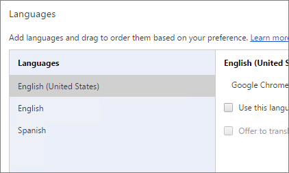
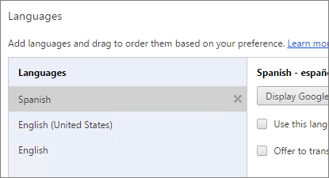
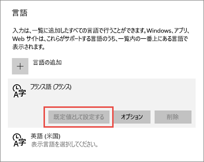
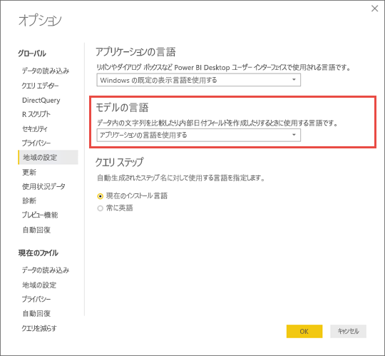

# Power BI でサポートされる言語と国または地域

この記事では、Power BI サービス、Power BI Desktop、および Power BI ドキュメントでサポートされている言語と国/地域の一覧を示します。

## Power BI が利用可能な国と地域
Power BI が利用可能な国と地域の一覧については、[ご利用いただける国と地域の一覧](https://products.office.com/business/international-availability)をご覧ください。 

## Power BI サービスの言語
ブラウザーでの Power BI サービスは、次の 44 の言語で提供されています。

* アラビア語
* バスク語 - Basque
* ブルガリア語 - Български
* カタルニア語 - català
* 簡体字中国語 - 中文 (简体)
* 繁体字中国語 - 中文 (繁體)
* クロアチア語 - hrvatski
* チェコ語 - čeština
* デンマーク語 - dansk
* オランダ語 - Nederlands
* 英語 - English
* エストニア語 - eesti
* フィンランド語 - suomi
* フランス語 - français
* ガリシア語 - galego
* ドイツ語 - Deutsch
* ギリシャ語 - Ελληνικά
* ヘブライ語
* ヒンディー語 - हिंदी
* ハンガリー語 - magyar
* インドネシア語 - Bahasa Indonesia
* イタリア語 - italiano
* 日本語 - 日本語
* カザフ語 - Қазақ
* 韓国語 - 한국어
* ラトビア語 - latviešu
* リトアニア語 - lietuvių
* マレー語 - Bahasa Melayu
* ノルウェー語ブークモール - norsk (bokmål)
* ポーランド語 - Polski
* ポルトガル語 (ブラジル) - Português
* ポルトガル語 (ポルトガル) - português
* ルーマニア語 - română
* ロシア語 - Русский
* セルビア語 (キリル) - српски
* セルビア語 (ラテン) - srpski
* スロバキア語 - slovenčina
* スロベニア語 - slovenski
* スペイン語 - español
* スウェーデン語 - svenska
* タイ語 - ไทย
* トルコ語 - Türkçe
* ウクライナ語 - українська
* ベトナム語 - Tiếng Việt

### 翻訳対象
メニュー、ボタン、メッセージ、エクスペリエンスの他の要素がユーザーの言語に翻訳され、移動や Power BI との対話が容易になります。

現時点では、一部の機能は英語でのみ使用可能です。

* Microsoft Dynamics CRM、Google 分析、Salesforce などのサービスに接続するときに Power BI が作成するダッシュボードおよびレポート。 (独自のダッシュボードとレポートは、ユーザーが自分の言語で作成できます。)
* Q&A を使用したデータ探索。

追加の機能も他の言語に順次翻訳されています。時折ご確認ください。 

### Power BI サービスでの言語の選択
1. Power BI サービスで、**[設定]** アイコン ![[設定] アイコン](media/supported-languages-countries-regions/pbi_settings_icon.png) > **[設定]** の順に選びます。
2. **[全般]** タブ > **[言語]** で、。
3. 言語を選択し、**[適用]** をクリックします。

### ブラウザーでの言語の選択
Power BI では、コンピューターの言語設定を基に言語を検出します。 これらの設定へのアクセス、および変更方法は、オペレーティング システムやブラウザーによって異なる場合があります。 次に、Internet Explorer および Google Chrome から設定にアクセスする方法を示します。

#### Internet Explorer (バージョン 11)
1. ブラウザー ウィンドウの右上隅にある **[ツール]** ボタンをクリックします。
   
   ![Internet Explorer の [ツール] ボタン](media/supported-languages-countries-regions/languages1.png)
2. **インターネット オプション**をクリックします。
3. [インターネット オプション] ダイアログの [全般] タブの [デザイン] の下の、 **[言語]** ボタンをクリックします。

#### Google Chrome (バージョン 42)
1. ブラウザー ウィンドウの右上隅にある [メニュー] ボタンをクリックします。
   
   
2. **[設定]** をクリックします。
3. **[詳細設定を表示]** をクリックします。
4. [言語] の下の、 **[言語と入力の設定]** ボタンをクリックします。
5. **[追加]** をクリックし、言語を選択して **[OK]** をクリックします。
   
   
   
   新しい言語が一覧の末尾に表示されます。 
6. 新しい言語を一覧の最上部にドラッグし、**[Google Chrome をこの言語で表示]** をクリックします。
   
   
   
   変更内容を表示するには、ブラウザーを閉じて再度開かなければならない場合があります。

## Power BI Desktop の言語またはロケールを選択する
Power BI Desktop を入手するには、ダウンロードする方法と、Windows ストアからインストールする方法の 2 つがあります。

* [Windows ストアから Power BI Desktop をインストールする](#choose-a-language-for-power-bi-desktop-installed-from-the-windows-store)と、すべての言語がインストールされて、Windows の既定の言語に対応する言語が表示されます。
* [Power BI Desktop をダウンロードする](#choose-a-language-when-you-download-power-bi-desktop)ときは、ダウンロード時に言語を選択します。 
* 特定のレポートの[データをインポートするときに使うロケールを選択する](#choose-the-locale-to-be-used-when-importing-data-into-power-bi-desktop)こともできます。 

### Windows ストアからインストールされた Power BI Desktop の言語を選択する
1. Windows ストアから [Power BI Desktop をインストール](http://aka.ms/pbidesktopstore)します。
2. 言語を変更するには、コンピューターで **[Windows の設定]** を探します。 
3. **[時刻と言語]** を選択します。
   
     ![[Windows の設定] ダイアログ ボックス](media/supported-languages-countries-regions/power-bi-service-windows-settings.png)
4. **[地域と言語]** を選択し、言語を選択して、**[既定値として設定]** を選択します。
   
     
   
     次に Power BI Desktop を起動すると、既定値として設定した言語が使用されます。 

### Power BI Desktop をダウンロードするときに言語を選択する
Power BI Desktop で言語を選択すると、レポートでの数値と日付の表示形式に影響します。 

* [Power BI Desktop をダウンロードする](https://powerbi.microsoft.com/desktop)ときに言語を選択します。 

Power BI Desktop の言語を変更するには、ダウンロード ページに戻り、別の言語でダウンロードします。

### Power BI Desktop にデータをインポートするためのロケールを選択する
Power BI Desktop をダウンロードした場合でも Windows ストアからインストールした場合でも、特定のレポートのロケールとして、Power BI Desktop のバージョンのロケールとは異なるものを選ぶことができます。 このようにすると、データ ソースからインポートされるときのデータの解釈方法が変わります (たとえば、"3/4/2017" が 4 月 3 日と解釈されるか、3 月 4 日のどちらとして解釈されるか)。 

1. Power BI Desktop で、**[ファイル]** > **[オプションと設定]** > **[オプション]** の順に移動します。
2. **[現在のファイル]** の下にある **[地域の設定]** を選択します。
3. **[インポート用のロケール]** ボックスで、別のロケールを選びます。 
   
   ![Power BI Desktop の [オプション] ダイアログ ボックス](media/supported-languages-countries-regions/power-bi_supptdlangs-locale.png)
4. **[OK]** を選択します。

### Power BI Desktop のモデルの言語を選択する

Power BI Desktop アプリケーション用の言語を設定するだけでなく、モデルの言語を設定することもできます。 モデルの言語は、主に 2 つの部分に影響します。

- 文字列の比較や並べ替えの方法。 たとえば、トルコ語には文字 i が 2 種類あるので、データベースの照合順序によっては、並べ替えたときに異なる順序になる場合があります。 
- 日付フィールドから非表示の日付テーブルを作成するときに Power BI Desktop が使う言語。 たとえば、フィールドは Month/Monat/Mois などという名前になります。

> [!NOTE]
> Power BI のモデルでは、現在、大文字と小文字を区別しない (またはひらがなとカタカナを区別しない) ロケールが使用されているため、"ABC" と "abc" は同等に扱われます。 ABC が最初にデータベースに読み込まれた場合、"Abc" のように大文字と小文字だけが異なる他の文字列は、別の値として読み込まれません。
> 
>

モデルの言語を設定する方法を次に示します。

1. Power BI Desktop で、**[ファイル]** > **[オプションと設定]** > **[オプション]** の順に移動します。
2. **[グローバル]** で **[地域の設定]** を選びます。
3. **[モデルの言語]** ボックスで、別の言語を選びます。 

    

> [!NOTE]
> Power BI モデルの作成後に言語を変更することはできません。
> 
>

## ヘルプ ドキュメントの言語
ヘルプは、次の 10 の言語にローカライズされています。 

* 簡体字中国語 - 中文 (简体)
* 繁体字中国語 - 中文 (繁體)
* フランス語 - français
* ドイツ語 - Deutsch
* イタリア語 - italiano
* 日本語 - 日本語
* 韓国語 - 한국어
* ポルトガル語 (ブラジル) - Português
* ロシア語 - Русский
* スペイン語 - español

## 次の手順
* Power BI モバイル アプリを使っている場合、 詳しくは「[Power BI モバイル アプリでサポートされる言語](mobile-apps-supported-languages.md)」をご覧ください。
* わからないことがある場合は、 [Power BI コミュニティ](http://community.powerbi.com/)で質問してみてください。
* それでも解決しない場合は、 [Power BI のサポート ページ](https://powerbi.microsoft.com/support/)をご覧ください。

