# Power BI でのマトリックス ビジュアルの使用
**マトリックス** ビジュアル機能を使って、**Power BI Desktop** レポートおよび **Power BI サービス** レポートでマトリックス ビジュアル ("*テーブル*" という場合もある) を作成し、他のビジュアルを使用してマトリックス内の要素をクロス強調表示することができます。 また、行、列、さらには個々のセルを選択して、クロス強調表示することができます。 個々のセルおよび複数のセルの選択範囲をコピーして他のアプリケーションに貼り付けることができます。 最終的に、レイアウト スペースをより有効に利用するために、マトリックス ビジュアルでは階段状レイアウトがサポートされます。

マトリックスに関連付けられている機能は多数あります。この記事の以下のセクションでそれらの機能について説明します。

## レポートのテーマ
マトリックス ビジュアルおよびテーブル ビジュアルには、適用された**レポートのテーマ**からのスタイル設定 (色を含む) が反映されます。 マトリックス ビジュアルについては目的の色にならない可能性がありますが、**[レポートのテーマ]** 構成で変更することができます。 テーマの詳細については、「[**Power BI Desktop でレポートのテーマを使用する**](../desktop-report-themes.md)」を参照してください。

## Power BI の合計計算方法を理解する

**マトリックス** ビジュアルの使用方法に移動する前に、Power BI ではテーブルとマトリックスの合計値と小計値がどのように計算されるのか理解しておくことが大切です。 合計行や小計行については、基になるデータのすべての行に対してメジャーが評価されます。表示されている行に値が追加されるだけでは*ありません*。 つまり、合計行の値が予想とは異なる可能性があります。 

次の**マトリックス** ビジュアルをご覧ください。 

この例では、一番右にある**マトリックス** ビジュアルに販売員/日付の組み合わせ別の*金額*が表示されています。 ただし、販売員は複数の日付で表示されるため、数値が複数回登場します。 そのため、基になるデータから得た正確な合計値と表示される値の単純な加算は等しくありません。 これは、総計する値が一対多の関係の ‘一’ のときに一般的なパターンとなります。

合計と小計を見るときは、それらの値は目に見える値だけでなく、潜在するデータにも基づいていることに注意してください。 

<!-- use Nov blog post video

## Expanding and collapsing row headers
There are two ways you can expand row headers. The first is through the right-click menu. You’ll see options to expand the specific row header you clicked on, the entire level or everything down to the very last level of the hierarchy. You have similar options for collapsing row headers as well.

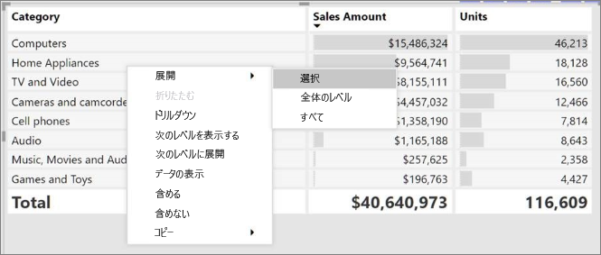

You can also add +/- buttons to the row headers through the formatting pane under the row headers card. By default, the icons will match the formatting of the row header, but you can customize the icons’ color and size separately if you want. 
Once the icons are turned on, they work similarly to the icons from PivotTables in Excel.

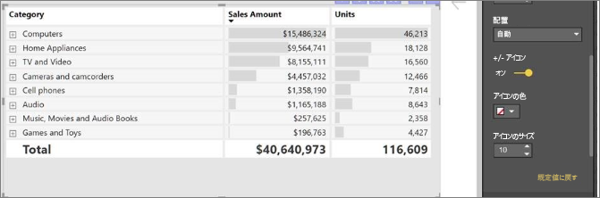

The expansion state of the matrix will save with your report. It can be pinned to dashboards as well, but consumers will need to open up the report to change the state. Conditional formatting will only apply to the inner most visible level of the hierarchy. Note that this expand/collapse experience is not currently supported when connecting to AS servers older than 2016 or MD servers.

Watch the following video to learn more about expand/collapse in the matrix:

-->
## マトリックス ビジュアルでドリルダウンを使用する
**マトリックス** ビジュアルを使って、これまで使用できなかった興味深いさまざまなドリルダウン操作を行うことができます。 また、行、列、さらには個々のセクションやセルを使用して、ドリルダウンすることもできます。 これらのそれぞれのしくみを見てましょう。

### 行ヘッダーでのドリルダウン
**[視覚化]** ウィンドウで、**[フィールド]** の **[行]** セクションに複数のフィールドを追加する場合は、マトリックス ビジュアルの行のドリルダウンを有効にします。 これは階層の作成と似ています。これにより、その階層からドリルダウン (およびバックアップ) して、各レベルのデータを分析できます。

次の図の **[行]** セクションには、*[Category]* (カテゴリ) と *[SubCategory]* (サブカテゴリ) が含まれています。ドリルスルーできる行でグループ (または階層) を作成します。

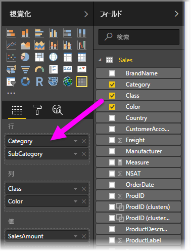

ビジュアルの **[行]** セクションに作成されたグループがある場合、ビジュアル自体の左上隅に *ドリル*  アイコンと *展開* アイコンが表示されます。

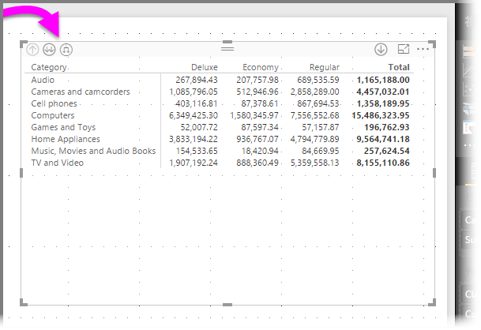

他のビジュアルのドリルと展開の動作と同じように、そのボタンを選択すると、階層をドリルダウン (またはバックアップ) できます。 この場合、次の図のように、*[Category]* (カテゴリ) から *[SubCategory]* (サブカテゴリ) にドリルダウンできます。ここでは、ドリルダウンの 1 つのレベル アイコン (熊手) が選択されています。

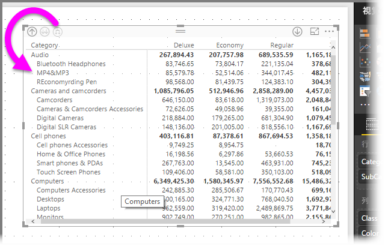

これらのアイコンを使用する代わりに、行ヘッダーのいずれかを右クリックし、表示されるメニューから選択してドリルダウンすることもできます。

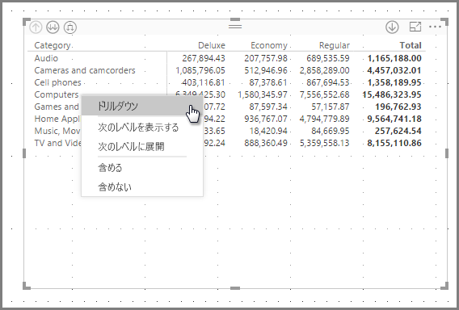

表示されるメニューから選択できるオプションはいくつかあり、次のように結果がそれぞれ異なることに注意してください。

**[ドリルダウン]** を選択すると、 *その* 行レベルのマトリックスが展開されます。右クリックした行ヘッダー以外の他のすべての行見出しは *除外* されます。 次の図では、 *Computers* を右クリックし、 **[ドリルダウン]** を選択しています。 マトリックスに他のトップレベルの行が表示されなくなっていることに注意してください。 このようにドリルは便利な機能です。**クロス強調表示**セクションを表示する場合に特に有効です。

**[ドリルアップ]** アイコンをクリックすると、前のトップレベル ビューに戻ることができます。 その後、右クリック メニューから **[次のレベルを表示する]** を選択した場合、次のレベルの項目 (この例の場合は、*[SubCategory]* (サブカテゴリ) フィールド) がすべてアルファベット順にリストされます。高レベルの階層カテゴリはありません。

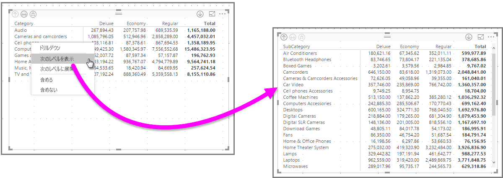

左上隅にある **[ドリルアップ]** アイコンをクリックし、トップレベルのカテゴリをすべてマトリックスで表示する場合は、もう一度右クリックして、**[次のレベルに展開]** を選択します。結果の視覚化は次のようになります。

**[含める]** および **[含めない]** のメニュー項目を使用して、マトリックスから右クリックした行 (およびすべてのサブカテゴリ) を維持 (またはそれぞれ削除) することもできます。

### 列ヘッダーでのドリルダウン
行でのドリルダウンの場合と同じように、**列**でドリルダウンすることもできます。 次の図の **[列]** フィールドには 2 つのフィールドがあります。この記事で前述した行の場合と同じように階層を作成します。 **[列]** フィールドには、*[Class]* (クラス) と *[Color]* (色) があります。

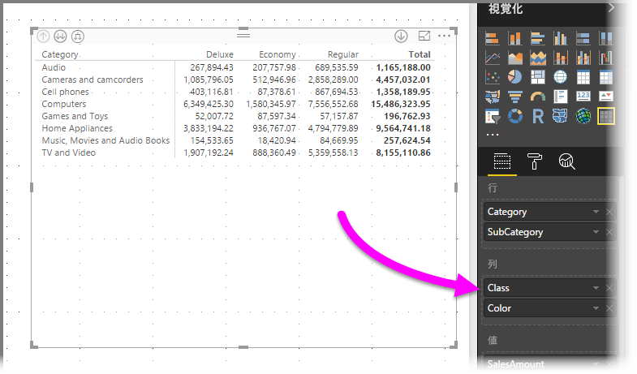

**マトリックス** ビジュアルでは、列を右クリックすると、ドリルダウン オプションが表示されます。 次の図では、*Deluxe* を右クリックし、**[ドリルダウン]** を選択しています。

**[ドリルダウン]** を選択すると、*Deluxe* の列階層の次のレベルが表示されます。この例の場合は、*[Color]* (色) です。

列の他の右クリック メニュー項目は、行の場合と同じように動作します (前述の「**行ヘッダーでのドリルダウン**」をご覧ください)。 行の場合と同じように、列に対して **[次のレベルを表示する]**、**[次のレベルに展開]**、**[含める]**、または **[含めない]** を実行することができます。

> [!NOTE]
> マトリックス ビジュアルの左上にあるドリルダウンとドリルアップのアイコンは行にのみ適用されます。 列でドリルダウンするには、右クリック メニューを使用する必要があります。
> 
> 

## マトリックス ビジュアルでの階段状レイアウト
**マトリックス** ビジュアルでは、階層の各親の下にサブカテゴリが自動的にインデントされます。これを**階段状レイアウト**といいます。

*元の* バージョンのマトリックス ビジュアルでは、サブカテゴリはまったく別の列に表示され、ビジュアルのかなり多くのスペースを占めていました。 次の図には元の**マトリックス** ビジュアルのテーブルが表示されています。サブカテゴリは別の列にあることに注意してください。

次の図では、**マトリックス** ビジュアルが表示されており、**階段状レイアウト**になっています。 *Computers* というカテゴリのサブカテゴリ (Computers Accessories、Desktops、Laptops、Monitors など) は若干インデントされており、ビジュアルの占有スペースがかなり小さくなっています。

階段状レイアウトの設定は簡単に調整できます。 **マトリックス** ビジュアルを選択した状態で、**[視覚化]** ウィンドウの **[書式]** セクション (ペイント ローラーのアイコン) の **[行見出し]** セクションを展開します。 **[階段状レイアウト]** トグル (オンとオフを切り替える) および **[階段状レイアウトのインデント]** (ピクセル単位でインデント量を指定する) という 2 つのオプションがあります。

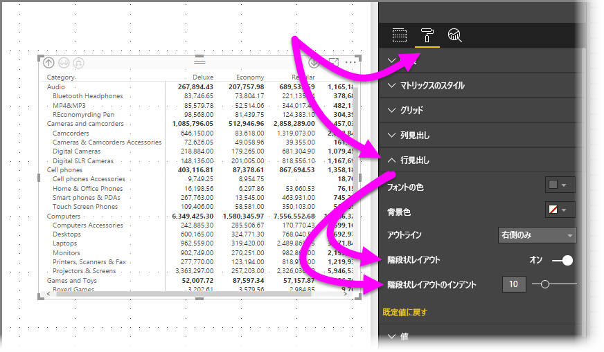

**[階段状レイアウト]** をオフにすると、サブカテゴリは親カテゴリの下にインデントされず、別の列に表示されます。

## マトリックス ビジュアルと小計
マトリックス ビジュアルでは、行と列両方の小計をオンまたはオフにできます。 次の図では、行の小計が**オン**に設定されています。

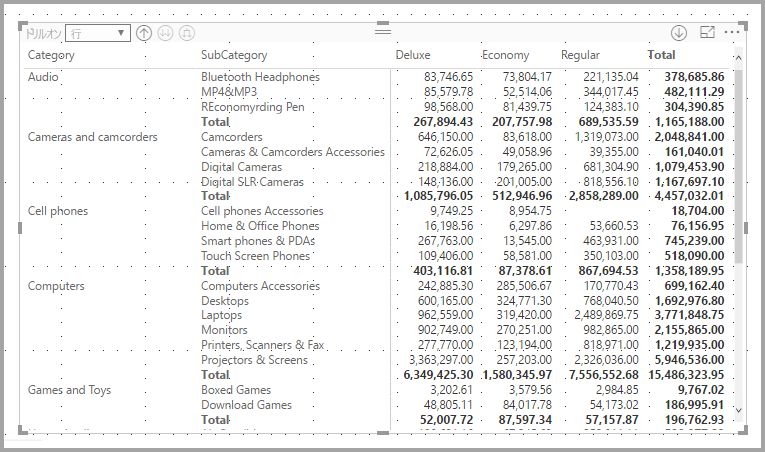

**[視覚化]** ウィンドウの **[書式]** セクションで、**[小計]** カードを展開し、**[行の小計]** スライダーを **[オフ]** にします。 このようにすると、小計が表示されなくなります。

列の小計も同じ方法で変更できます。

## マトリックス ビジュアルでのクロス強調表示
**マトリックス** ビジュアルを使って、クロス強調表示の基準としてマトリックスの要素を選ぶことができます。 **マトリックス**で列を選ぶと、レポート ページの他のビジュアルと同じように、その列が強調表示されます。 この種のクロス強調表示は、他のビジュアルやデータ ポイントの選択で一般的な機能となってきているので、現在は**マトリックス** ビジュアルでも同じ機能が提供されています。

さらに、Ctrl キーを押しながらクリックすることで、クロス強調表示機能を使用することもできます。 たとえば、次の図では、一連のサブカテゴリが**マトリックス** ビジュアルから選ばれています。 ビジュアルから選ばれなかった項目は灰色表示されており、ページの他のビジュアルに、**マトリックス** ビジュアルでの選択内容がどのように反映されるかがわかります。

## Power BI から値をコピーして他のアプリケーションで使用する

ご利用のマトリックスまたはテーブルには、Dynamics CRM レポート、Excel レポート、さらにはその他の Power BI レポートなど、他のアプリケーションで使用したいコンテンツが含まれている場合があります。 Power BI で右クリックすると、単一のセルまたはセルの選択範囲をクリップボードにコピーして、他のアプリケーションに貼り付けることができます。

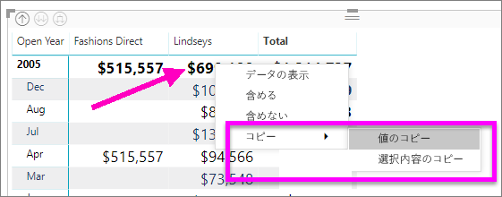

* 単一のセルの値をコピーするには、セルを選択し、右クリックしてから、**[値のコピー]** を選択します。 書式設定されていセル値がクリップボード上にある場合でも、その値を別のアプリケーションに貼り付けることができるようになりました。

    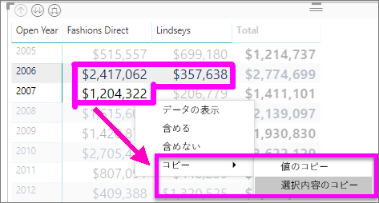

* 複数のセルをコピーするには、セルの範囲を選択するか、または Ctrl キーを使用して 1 つまたは複数のセルを選択します。 コピーには、列および行のヘッダーが取り込まれます。

    

## マトリックス ビジュアルでの網掛けとフォントの色
**マトリックス** ビジュアルでは、**条件付き書式** (色、網掛け) をマトリックス内のセルの背景に適用したり、テキストや値自体に条件付き書式を適用したりできます。

条件付き書式を適用するには、マトリックス ビジュアルを選んで次のいずれかを行います。

* **[フィールド]** ウィンドウで、フィールドを右クリックして、メニューから **[条件付き書式]** を選びます。
  
  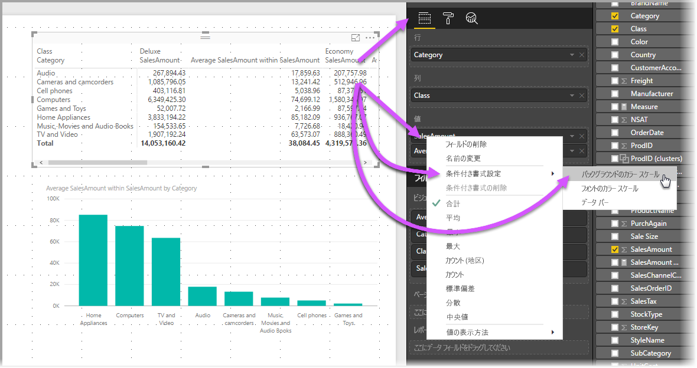
* または、**[書式]** ウィンドウで **[条件付き書式]** カードを展開し、**[バックグラウンドのカラー スケール]** または **[フォントのカラー スケール]** のスライダーを **[オン]** にします。 どちらかのオプションをオンにすると表示される *[詳細コントロール]* リンクをクリックして、色および色書式の値をカスタマイズすることができます。
  
  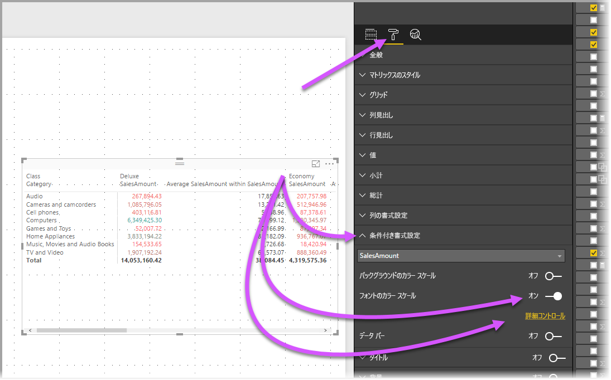

どちらの方法でも結果は同じです。 *[詳細コントロール]* を選ぶと次のダイアログ ボックスが表示され、調整を行うことができます。

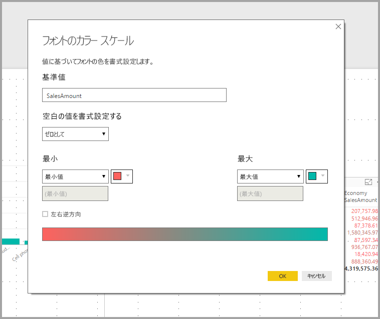

## 次の手順

[Power BI の散布図とバブル チャート](power-bi-visualization-scatter.md)

[Power BI での視覚化の種類](power-bi-visualization-types-for-reports-and-q-and-a.md)