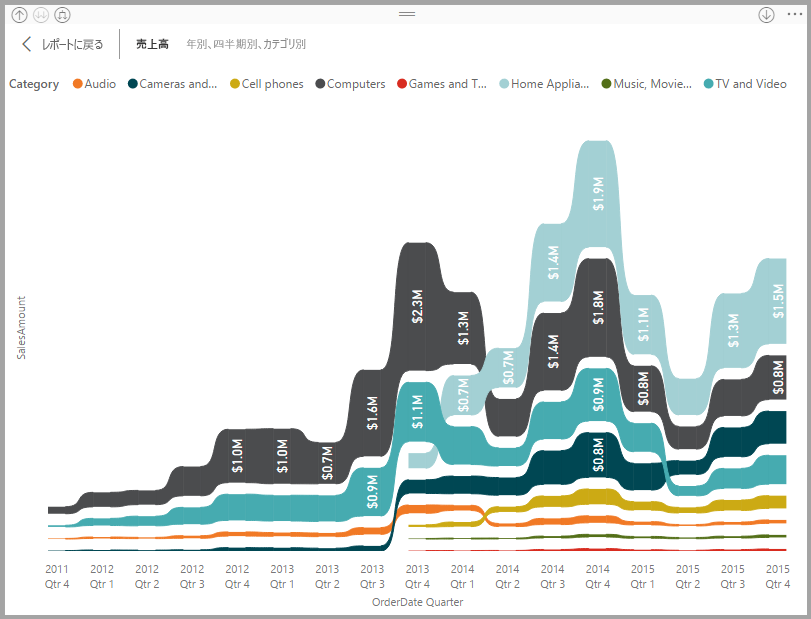
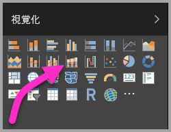
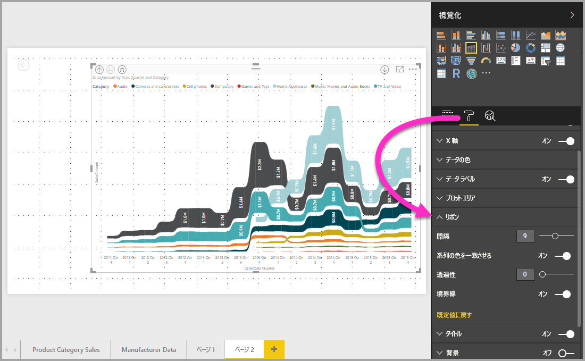

# Power BI のリボン グラフを使用する
**Power BI** のリボン グラフを利用してデータを視覚化し、ランクが最も高い (最大値の) データ カテゴリをすばやく判断できます。 リボン グラフでは、ランクの変化を効果的に確認できます。各期間を対象に、最高位の範囲 (値) が常に一番上に表示されます。 リボン グラフは 2017 年 9 月リリース以降の **Power BI Desktop** と **Power BI サービス**の後続更新プログラムで利用できます。

## リボン グラフを作成する
リボン グラフを作成するには、**[視覚化]** ウィンドウで **[リボン グラフ]** を選択します。

リボン グラフでは、リボンによりデータのカテゴリがつながり、その連続する時間が視覚化されます。グラフの X 軸 (通常、時系列) 期間全体での特定のカテゴリのランク変化を確認できます。

## リボン グラフを書式設定する
リボン グラフを作成するとき、**[視覚化]** ウィンドウの **[書式]** セクションの書式設定オプションを利用できます。 リボン グラフの書式設定オプションは、積み上げ縦棒グラフのそれと似ています。リボンに固有の追加書式設定オプションがあります。

リボン グラフの書式設定オプションで、次の項目を調整できます。

* **[間隔]** では、リボン間の間隔を調整できます。 この数値は、列の最大の高さの割合になります。
* **[系列の色を一致させる]** では、リボンの色を系列の色に合わせることができます。 オフにした場合、リボンは灰色になります。
* **[透過性]** では、リボンの透明度が指定されます。初期設定は 30 です。
* **[罫線]** では、リボンの上下に濃い色の罫線を引くことができます。 既定では、罫線はオフになっています。

## 次の手順
**Power BI Desktop** と作業の開始方法の詳細については、次の記事を確認してください。

* [Power BI Desktop とは何ですか?](../desktop-what-is-desktop.md)
* [Power BI Desktop でのクエリの概要](../desktop-query-overview.md)
* [Power BI Desktop のデータ ソース](../desktop-data-sources.md)
* [Power BI Desktop におけるデータへの接続](../desktop-connect-to-data.md)
* [Power BI Desktop でのデータの整形と結合](../desktop-shape-and-combine-data.md)
* [Power BI Desktop での一般的なクエリ タスク](../desktop-common-query-tasks.md)   

