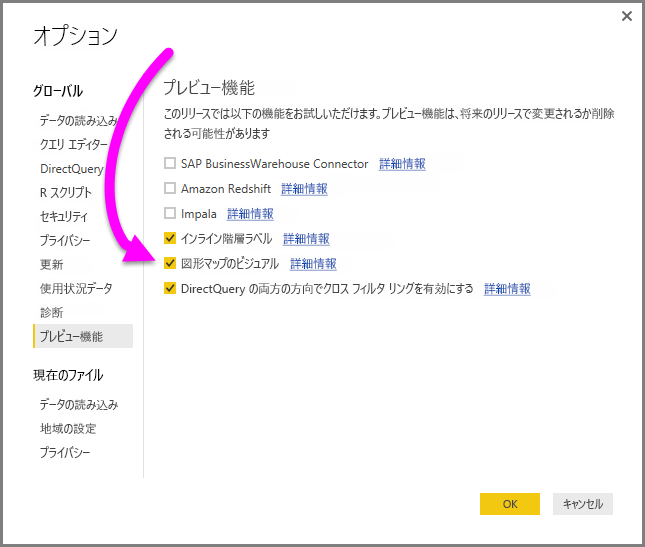
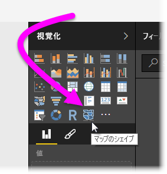
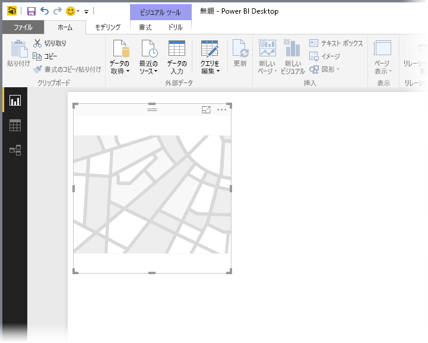
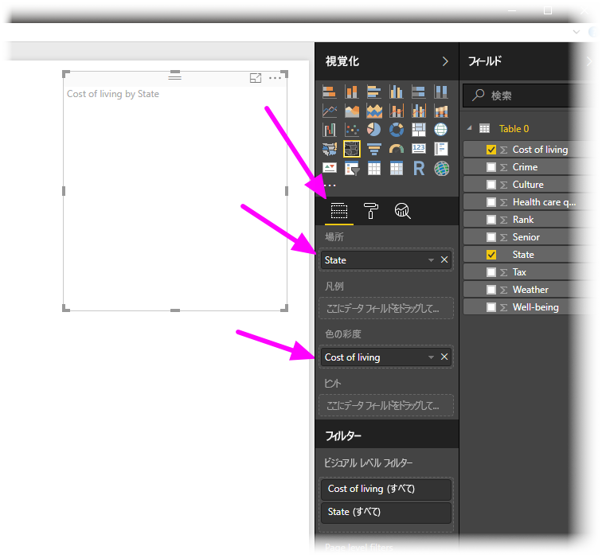
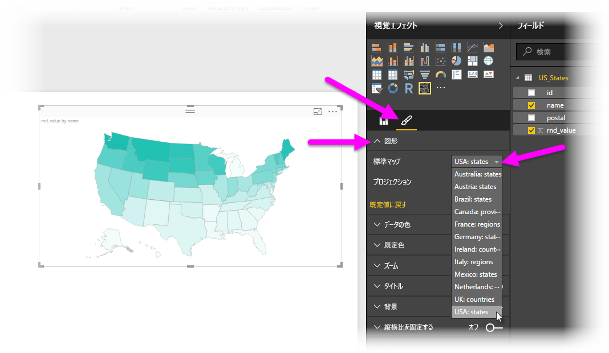
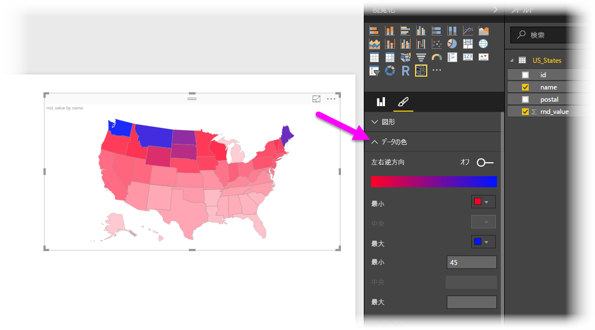
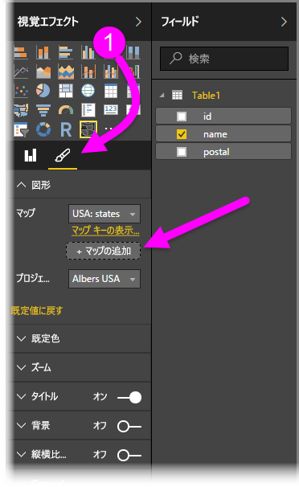
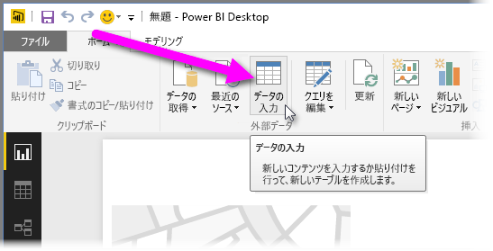
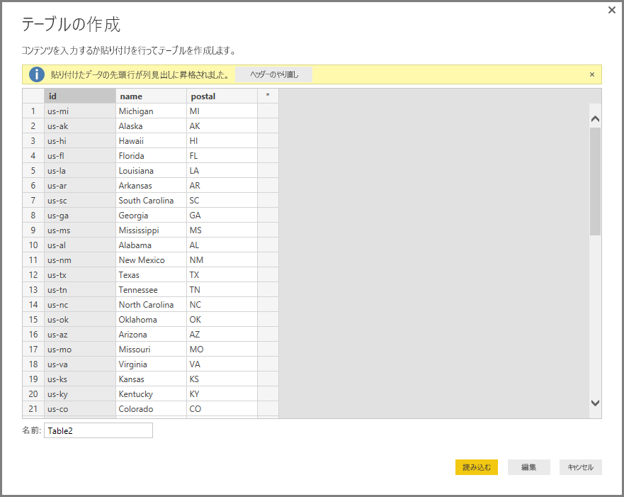

# Power BI Desktop での図形マップ (プレビュー)
色を使用して、マップで領域を比較するために **[図形マップ]** ビジュアルを作成します。 **[マップ]** ビジュアルとは異なり、**[図形マップ]** ではマップ上の地理的な場所を正確には表示できません。 代わりに、これの主な用途は、違う色を適用することにより、マップ上の領域を相対的に比較できます。

**[図形マップ]** のビジュアルは ESRI/TopoJSON マップをベースにしています。このマップの強みは、ユーザー作成のカスタム マップを使用できることです。 地理、座席配置、フロア プランなどがカスタム マップの例です。 カスタム マップを利用する機能は、このプレビュー リリースの**マップのシェイプ**では使用できません。

## 図形マップを作成する
このプレビュー リリースに付属するマップで**マップのシェイプ** コントロールをテストできます。あるいは、次のセクション (**カスタム マップの使用**) にある要件を満たす限り、独自のカスタム マップを使用できます。

**[マップのシェイプ]** のビジュアルは、プレビュー段階にあるため、Power BI Desktop でこれを有効にする作業が必要です。 **[マップのシェイプ]** を有効にするには、**[ファイル] > [オプションと設定] > [オプション] > [プレビュー機能]** の順に選択し、**[図形マップのビジュアル]** チェック ボックスをオンにします。 選択を行った後、Power BI Desktop を再起動する必要があります。

**[マップのシェイプ]** が有効になったら、**[視覚化]** ウィンドウで **[マップのシェイプ]** コントロールをクリックします。

Power BI Desktop は、**[マップのシェイプ]** のビジュアルのデザイン キャンバスを作成します。

次の手順に従って、**[マップのシェイプ]** を作成します。

1. **[フィールド]** ウィンドウで、地域名 (または省略形) が含まれているデータ フィールドを **[地域]** バケットにドラッグし、データ メジャー フィールドを **[色の彩度]** バケットにドラッグします (地図はまだ表示されません)。

   > [!NOTE]
   > **[マップのシェイプ]** をテストするためのマップ データを迅速に取得する方法については、後述する「**マップ データの取得**」セクションを参照してください。
   > 
   > 

   
2. **[形式]** 設定ウィンドウで、**[図形]** を展開し、**[標準マップ]** ドロップダウンから選択して、目的のデータを表示します。 この時点で、次の図に示すようにレンダリングが行われます。

   

   > [!NOTE]
   > この記事の最後に記載した「**地域キー**」セクションは、**[マップのシェイプ]** のビジュアルをテストするのに使用できる地図の地域キーが含まれる表のコレクションです。
   > 
   > 
3. **[形式]** 設定ウィンドウでは、データ ポイントの色に加えて、地図の投影やズームの設定も変更できます。 ズーム設定を変更することもできます。 たとえば、色の変更、最大値と最小値の設定などを行うことができます。

   
4. また、カテゴリ データ列を **[凡例]** バケットに追加し、カテゴリに基づいて地図の地域を分類することもできます。

## カスタム マップの使用
それが **TopoJSON** 形式であれば、**マップのシェイプ**でカスタム マップを使用できます。 マップが別の形式の場合、[**Map Shaper**](http://mapshaper.org/) などのオンライン ツールを使用し、*シェイプ ファイル*や *GeoJSON* マップを **TopoJSON** 形式に変換できます。

**TopoJSON** マップ ファイルを使用するには、ShapeMap ビジュアルをレポートに追加し、データを *[場所]* バケットと *[色の彩度]* バケットに追加します。 その後、**[視覚化]** ウィンドウで **[形式]** セクションを選択し (次の画像の (1))、**[図形]** セクションを展開し、**[+ マップの追加]** を選択します。

## サンプル カスタム マップ
*米国連邦地検* は、訴訟および取扱件数データに関する年次会計報告を公表しました。  これらすべてのレポートは以下のリンクで確認できます。

https://www.justice.gov/usao/resources/annual-statistical-reports

州は複数の区に分けられるため、カスタム シェイプ マップを使用する必要があります。  米国司法管轄区の **TopoJSON** マップを **Power BI Desktop** にインポートすることで、地区検事長の年次会計報告データを視覚化できます。  次の画像はこのマップの例を示しています。

個々の州マップについても、含まれる区に基づいて詳細を表示することができます。 

このデータセットと視覚エフェクトを試したい場合は、以下のリンクを使用して、このレポートの生成に使用された元の PBIX ファイルをダウンロードできます。

* [カスタム シェイプ マップのデモ .PBIX ファイル](http://download.microsoft.com/download/1/2/8/128943FB-9231-42BD-8A5D-5E2362C9D589/DistrictAttorneyFiscalReport.pbix)

## マップ データの取得
**[マップのシェイプ]** をテストできるようにモデルに迅速にデータを入力するには、**[ホーム]** リボンから **[データの入力]** を選択します。

データに複数の列がある場合は、Excel などのエディターを使用してデータを貼り付け、各データ列を個別にコピーする必要があります。 このデータは Power BI Desktop に貼り付けることができます。 一番上の行は、自動的に見出しとして識別されます。

新しい列は簡単に入力できます。新しい列名を入力し (右側の空の列に)、各セルに値を追加します。この方法は Excel で行う操作と同じです。 列の作成が完了したら、**[読み込み]** を選択します。表が Power BI Desktop のデータ モデルに追加されます。

> [!NOTE]
> 国または地域を扱うとき、3 文字の省略形を使用し、マップ視覚エフェクトでジオコーディングが正しく機能するようにします。 2 文字の省略形は *使用しない* でください。正しく認識されない国や地域があります。
> 
> 省略形が 2 文字しかない場合、[この外部ブログ投稿](https://blog.ailon.org/how-to-display-2-letter-country-data-on-a-power-bi-map-85fc738497d6#.yudauacxp)を参照してください。2 文字の国/地域コードを 3 文字の国/地域コードに関連付ける方法が紹介されています。
> 
> 

## プレビューの動作と要件
**[マップのシェイプ]** 機能を提供するこのプレビュー リリースには、いくつかの考慮事項と要件があります。

* **[マップのシェイプ]** のビジュアルは、プレビュー段階にあるため、Power BI Desktop でこれを有効にする作業が必要です。 **[マップのシェイプ]** を有効にするには、**[ファイル] > [オプションと設定] > [オプション] > [プレビュー機能]** の順に選択し、**[図形マップのビジュアル]** チェック ボックスをオンにします。
* 現時点で、**[凡例]** の分類が適切に機能するには、**[色の彩度]** バケットも設定されている必要があります。
* **マップのシェイプ**の最終リリース版には、現在選択されているマップのマップ キーが表示されるユーザー インターフェイスが搭載される予定です (最終リリースの日付は未定であり、**マップのシェイプ**はまだプレビュー段階です)。 このプレビュー リリースでは、この記事の次の「**地域キー**」セクションにある表のマップの地域キーを参照してください。
* **マップのシェイプ** ビジュアルで最大 1,000 個のデータ ポイントが描かれます。

## 地域キー
このプレビュー リリースでは、次の**地域キー**を使用して、**[マップのシェイプ]** をテストしてください。

### オーストラリア:州

| `id` | `abbr` | `iso` | `name` | `postal` |
| --- | --- | --- | --- | --- |
| au-wa |WA |AU-WA |Western Australia |WA |
| au-vic |Vic |AU-VIC |Victoria |VIC |
| au-tas |Tas |AU-TAS |Tasmania |TAS |
| au-sa |SA |AU-SA |South Australia |SA |
| au-qld |Qld |AU-QLD |Queensland |QLD |
| au-nt |NT |AU-NT |Northern Territory |NT |
| au-nsw |NSW |AU-NSW |New South Wales |NSW |
| au-act |ACT |AU-ACT |Australian Capital Territory |ACT |

### オーストリア:州

| `id` | `iso` | `name` | `name-en` | `postal` |
| --- | --- | --- | --- | --- |
| at-wi |AT-9 |Wien |Vienna (ウィーン) |WI |
| at-vo |AT-8 |Vorarlberg |Vorarlberg (フォアアールベルク) |VO |
| at-tr |AT-7 |Tirol |Tyrol (チロル) |TR |
| at-st |AT-6 |Steiermark |Styria (シュタイアーマルク) |ST |
| at-sz |AT-5 |Salzburg |Salzburg (ザルツブルク) |SZ |
| at-oo |AT-4 |Oberösterreich |Upper Austria (オーバーエスターライヒ) |OO |
| at-no |AT-3 |Niederösterreich |Lower Austria (ニーダーエスターライヒ) |NO |
| at-ka |AT-2 |Kärnten |Carinthia (ケルンテン) |KA |
| at-bu |AT-1 |Burgenland |Burgenland (ブルゲンラント) |BU |

### ブラジル:州

| `id` |
| --- |
| Tocantins |
| Pernambuco |
| Goias |
| Sergipe |
| Sao Paulo |
| Santa Catarina |
| Roraima |
| Rondonia |
| Rio Grande do Sul |
| Rio Grande do Norte |
| Rio de Janeiro |
| Piaui |
| Parana |
| Paraiba |
| Para |
| Minas Gerais |
| Mato Grosso |
| Maranhao |
| Mato Grosso do Sul |
| Distrito Federal |
| Ceara |
| Espirito Santo |
| Bahia |
| Amazonas |
| Amapa |
| Alagoas |
| Acre |
| Litigated Zone 1 |
| Litigated Zone 2 |
| Litigated Zone 3 |
| Litigated Zone 4 |

### カナダ:州

| `id` | `iso` | `name` | `postal` |
| --- | --- | --- | --- |
| ca-nu |CA-NU |Nunavut |NU |
| ca-nt |CA-NT |Northwest Territories |NT |
| ca-yt |CA-YT |Yukon |YT |
| ca-sk |CA-SK |Saskatchewan |SK |
| ca-qc |CA-QC |Quebec |QC |
| ca-pe |CA-PE |Prince Edward Island |PE |
| ca-on |CA-ON |Ontario |ON |
| ca-ns |CA-NS |Nova Scotia |NS |
| ca-nl |CA-NL |Newfoundland and Labrador |NL |
| ca-nb |CA-NB |New Brunswick |NB |
| ca-mb |CA-MB |Manitoba |MB |
| ca-bc |CA-BC |British Columbia |BC |
| ca-ab |CA-AB |Alberta |AB |

### フランス:地域

| `id` | `name` | `name-en` |
| --- | --- | --- |
| Alsace (アルザス) |Alsace |Alsace (アルザス) |
| Rhone-Alpes |Rhône-Alpes |Rhone-Alpes (ローヌアルプ) |
| Provence-Alpes-Cote d'Azur |Provence-Alpes-Côte d'Azur |Provence-Alpes-Cote d'Azur (プロヴァンス=アルプ=コート ダジュール) |
| Poitou-Charentes |Poitou-Charentes |Poitou-Charentes (ポアトゥー=シャラント) |
| Picardie |Picardie |Picardy (ピカルディー) |
| Pays de la Loire |Pays de la Loire |Pays de la Loire (ペイ ド ラ ロワール) |
| Nord-Pas-de-Calais |Nord-Pas-de-Calais |Nord-Pas-de-Calais (ノール=パ ド カレー) |
| Midi-Pyrenees |Midi-Pyrenees |Midi-Pyrenees (ミディ=ピレネー) |
| Lorraine |Lorraine |Lorraine (ロレーヌ) |
| Limousin |Limousin |Limousin (リムーザン) |
| Languedoc Roussillon |Languedoc Roussillon |Languedoc-Roussillon (ラングドック=ルシヨン) |
| Ile-del-France |Île-de-France |Ile-de-France (イル ド フランス) |
| Haute-Normandie |Haute-Normandie |Upper Normandy (オート ノルマンディー) |
| Franche-Comte |Franche-Comté |Franche-Comte (フランシュ＝コンテ地域圏) |
| Corse |Corse |Corse (コルシカ島) |
| Champagne-Ardenne |Champagne-Ardenne |Champagne-Ardenne (シャンパーニュ=アルデンヌ) |
| Centre-Val de Loire |Centre-Val de Loire |Centre-Val de Loire (サントル=ヴァル ド ロワール) |
| Bretagne |Bretagne |Brittany (ブルターニュ) |
| Bourgogne |Bourgogne |Burgundy (ブルゴーニュ) |
| Basse-Normandie |Basse-Normandie |Lower Normandy (バス ノルマンディー) |
| Auvergne |Auvergne |Auvergne (オーベルニュ) |
| Aquitaine |Aquitaine |Aquitaine |

### ドイツ:州

| `id` | `iso` | `name` | `name-en` | `postal` |
| --- | --- | --- | --- | --- |
| de-be |DE-BE |Berlin |Berlin (ベルリン) |BE |
| de-th |DE-TH |Thüringen |Thuringia (チューリンゲン) |TH |
| de-st |DE-ST |Sachsen-Anhalt |Saxony-Anhalt (ザクセン=アンハルト) |ST |
| de-sn |DE-SN |Sachsen |Saxony (サクソニー) |SN |
| de-mv |DE-MV |Mecklenburg-Vorpommern |Mecklenburg-Vorpommern (メクレンブルク=フォアポンメルン) |MV |
| de-bb |DE-BB |Brandenburg |Brandenburg (ブランデンブルク) |BB |
| de-sh |DE-SH |Schleswig-Holstein |Schleswig-Holstein (シュレスウィヒ=ホルシュタイン) |SH |
| de-sl |DE-SL |Saarland |Saarland (ザールラント) |SL |
| de-rp |DE-RP |Rheinland-Pfalz |Rhineland-Palatinate (ラインラント=プファルツ) |RP |
| de-nw |DE-NW |Nordrhein-Westfalen |North Rhine-Westphalia (ノルトライン=ウェストファーレン) |NW |
| de-ni |DE-NI |Niedersachsen |Lower Saxony (ニーダーザクセン) |NI |
| de-he |DE-HE |Hessen |Hesse (ヘッセン) |HE |
| de-hh |DE-HH |Hamburg |Hamburg (ハンブルク) |HH |
| de-hb |DE-HB |Bremen |Bremen (ブレーメン) |HB |
| de-by |DE-BY |Bayern |Bavaria (バイエルン) |BY |
| de-bw |DE-BW |Baden-Württemberg |Baden-Wurttemberg (バーデン=ウュルテンベルク) |BW |

### アイルランド:郡

| `id` |
| --- |
| Wicklow |
| Wexford |
| Westmeath |
| Waterford |
| Sligo |
| Tipperary |
| Roscommon |
| Offaly |
| Monaghan |
| Meath |
| Mayo |
| Louth |
| Longford |
| Limerick |
| Leitrim |
| Laoighis |
| Kilkenny |
| Kildare |
| Kerry |
| Galway |
| Dublin |
| Donegal |
| Cork |
| Clare |
| Cavan |
| Carlow |

### イタリア:地域

| `id` | `iso` | `name` | `name-en` | `postal` |
| --- | --- | --- | --- | --- |
| it-vn |IT-34 |Veneto |Veneto (ベネト) |VN |
| it-vd |IT-23 |Valle d'Aosta |Aosta Valley (ヴァッレ ダオスタ) |VD |
| it-um |IT-55 |Umbria |Umbria (ウンブリア) |UM |
| it-tt |IT-32 |Trentino-Alto Adige |Trentino-South Tyrol (トレンティーノ=アルト アディジェ) |TT |
| it-tc |IT-52 |Toscana |Tuscany (トスカナ) |TC |
| it-sc |IT-82 |Sicilia |Sicily (シチリア島) |SC |
| it-sd |IT-88 |Sardegna |Sardinia (サルディニア) |SD |
| it-pm |IT-21 |Piemonte |Piedmont (ピエモンテ) |PM |
| it-ml |IT-67 |Molise |Molise (モリーゼ) |ML |
| it-mh |IT-57 |Marche |Marche (マルケ) |MH |
| it-lm |IT-25 |Lombardia |Lombardy (ロンバルディア) |LM |
| it-lg |IT-42 |Liguria |Liguria (リグリア) |LG |
| it-lz |IT-62 |Lazio |Lazio (ラツィオ) |LZ |
| it-fv |IT-36 |Friuli-Venezia Giulia |Friuli-Venezia Giulia (フリウリ=ベネチア･ジュリア) |FV |
| it-er |IT-45 |Emilia-Romagna |Emilia-Romagna (エミリア=ロマーニャ) |ER |
| it-cm |IT-72 |Campania |Campania (カンパニア) |CM |
| it-lb |IT-78 |Calabria |Calabria (カラブリア) |LB |
| it-bc |IT-77 |Basilicata |Basilicata (バシリカータ) |BC |
| it-pu |IT-75 |Apulia |Puglia (プーリア) |PU |
| it-ab |IT-65 |Abruzzo |Abruzzo (アブルッツィ) |AB |

### メキシコ:州

| `id` | `abreviatura` | `iso` | `name` | `name-en` | `postal` |
| --- | --- | --- | --- | --- | --- |
| mx-zac |Zac. |MX-ZAC |Zacatecas |Zacatecas (サカテカス) |ZA |
| mx-yuc |Yuc. |MX-YUC |Yucatán |Yucatan (ユカタン) |YU |
| mx-ver |Ver. |MX-VER |Veracruz |Veracruz (ベラクルス) |VE |
| mx-tla |Tlax. |MX-TLA |Tlaxcala |Tlaxcala (トラスカラ) |TL |
| mx-tam |Tamps. |MX-TAM |Tamaulipas |Tamaulipas (タマウリパス) |TM |
| mx-tab |Tab. |MX-TAB |Tabasco |Tabasco (タバスコ) |TB |
| mx-son |Son. |MX-SON |Sonora |Sonora (ソノラ) |SO |
| mx-sin |Sin. |MX-SIN |Sinaloa |Sinaloa (シナロア) |SI |
| mx-slp |S.L.P. |MX-SLP |San Luis Potosí |San Luis Potosi (サン ルイス ポトシ) |SL |
| mx-roo |Q.R. |MX-ROO |Quintana Roo |Quintana Roo (キンタナロー) |QR |
| mx-que |Qro. |MX-QUE |Querétaro |Queretaro (ケレタロ) |QE |
| mx-pue |Pue. |MX-PUE |Puebla |Puebla (プエブラ) |PU |
| mx-oax |Oax. |MX-OAX |Oaxaca |Oaxaca (オアハカ) |OA |
| mx-nle |N.L. |MX-NLE |Nuevo León |Nuevo Leon (ヌエボレオン) |NL |
| mx-nay |Nay. |MX-NAY |Nayarit |Nayarit (ナヤリト) |NA |
| mx-mor |Mor. |MX-MOR |Morelos |Morelos (モレロス) |MR |
| mx-mic |Mich. |MX-MIC |Michoacán |Michoacan (ミチョアカン) |MC |
| mx-mex |Méx. |MX-MEX |Estado de México |Mexico State (メヒコ) |MX |
| mx-jal |Jal. |MX-JAL |Jalisco |Jalisco (ハリスコ) |JA |
| mx-hid |Hgo. |MX-HID |Hidalgo |Hidalgo (イダルゴ) |HI |
| mx-gro |Gro. |MX-GRO |Guerrero |Guerrero (ゲレロ) |GR |
| mx-gua |Gto. |MX-GUA |Guanajuato |Guanajuato (グアナフアト) |GT |
| mx-dur |Dgo. |MX-DUR |Durango |Durango (ドゥランゴ) |DU |
| mx-dif |Col. |MX-DIF |Ciudad de México |Mexico City (メキシコシティー) |DF |
| mx-col |Coah. |MX-COL |Colima |Colima (コリマ) |CL |
| mx-coa |Chis. |MX-COA |Coahuila |Coahuila (コアウイラ) |CA |
| mx-chh |Chih. |MX-CHH |Chihuahua |Chihuahua (チワワ) |CH |
| mx-chp |CDMX. |MX-CHP |Chiapas |Chiapas (チャパス) |CP |
| mx-cam |Camp. |MX-CAM |Campeche |Campeche (カンペチェ) |CM |
| mx-bcs |B.C.S. |MX-BCS |Baja California Sur |Baja California Sur (バハ カリフォルニア スル) |BS |
| mx-bcn |B.C. |MX-BCN |Baja California |Baja California (バハ カリフォルニア) |BN |
| mx-agu |Ags. |MX-AGU |Aguascalientes |Aguascalientes (アグアスカリエンテス) |AG |

### オランダ:州

| `id` | `iso` | `name` | `name-en` |
| --- | --- | --- | --- |
| nl-zh |NL-ZH |Zuid-Holland |South Holland (南ホラント) |
| nl-ze |NL-ZE |Zeeland |Zeeland (ゼーラント) |
| nl-ut |NL-UT |Utrecht |Utrecht (ユトレヒト) |
| nl-ov |NL-OV |Overijssel |Overijssel (オーバーアイセル) |
| nl-nh |NL-NH |Noord-Holland |North Holland (北ホラント) |
| nl-nb |NL-NB |Noord-Brabant |North Brabant (北ブラバント) |
| nl-li |NL-LI |Limburg |Limburg (リンブルフ) |
| nl-gr |NL-GR |Groningen |Groningen (フローニンゲン) |
| nl-ge |NL-GE |Gelderland |Gelderland (ヘルデルラント) |
| nl-fr |NL-FR |Fryslân |Friesland (フリースラント) |
| nl-fl |NL-FL |Flevoland |Flevoland (フレヴォラント) |
| nl-dr |NL-DR |Drenthe |Drenthe (ドレンテ) |

### 英国:国

| `id` | `iso` | `name` |
| --- | --- | --- |
| gb-wls |GB-WLS |Wales |
| gb-sct |GB-SCT |Scotland |
| gb-nir |GB-NIR |Northern Ireland |
| gb-eng |GB-ENG |England |

### 米国:州

| `id` | `name` | `postal` |
| --- | --- | --- |
| us-mi |Michigan |MI |
| us-ak |Alaska |AK |
| us-hi |Hawaii |HI |
| us-fl |Florida |FL |
| us-la |Louisiana |LA |
| us-ar |Arkansas |AR |
| us-sc |South Carolina |SC |
| us-ga |Georgia |GA |
| us-ms |Mississippi |MS |
| us-al |Alabama |AL |
| us-nm |New Mexico |NM |
| us-tx |Texas |TX |
| us-tn |Tennessee |TN |
| us-nc |North Carolina |NC |
| us-ok |Oklahoma |OK |
| us-az |Arizona |AZ |
| us-mo |Missouri |MO |
| us-va |Virginia |VA |
| us-ks |Kansas |KS |
| us-ky |Kentucky |KY |
| us-co |Colorado |CO |
| us-md |Maryland |MD |
| us-wv |West Virginia |WV |
| us-de |Delaware |DE |
| us-dc |District of Columbia |DC |
| us-il |Illinois |IL |
| us-oh |Ohio |OH |
| us-ca |California |CA |
| us-ut |Utah |UT |
| us-nv |Nevada |NV |
| us-in |Indiana |IN |
| us-nj |New Jersey |NJ |
| us-ri |Rhode Island |RI |
| us-ct |Connecticut |CT |
| us-pa |Pennsylvania |PA |
| us-ny |New York |NY |
| us-ne |Nebraska |NE |
| us-ma |Massachusetts |MA |
| us-ia |Iowa |IA |
| us-nh |New Hampshire |NH |
| us-or |Oregon |OR |
| us-mn |Minnesota |MN |
| us-vt |Vermont |VT |
| us-id |Idaho |ID |
| us-wi |Wisconsin |WI |
| us-wy |Wyoming |WY |
| us-sd |South Dakota |SD |
| us-nd |North Dakota |ND |
| us-me |Maine |ME |
| us-mt |Montana |MT |
| us-wa |Washington |WA |

## 次の手順
[Power BI のマトリックス ビジュアル](desktop-matrix-visual.md)

[Power BI での視覚化の種類](power-bi-visualization-types-for-reports-and-q-and-a.md)