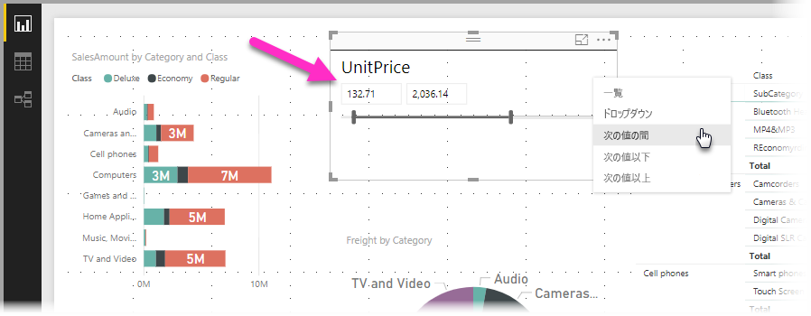
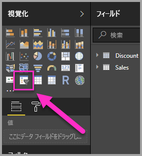
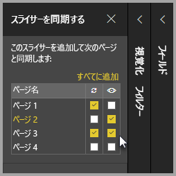
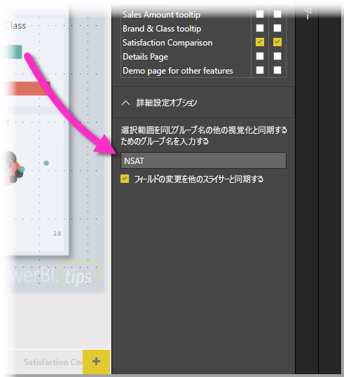

# Power BI Desktop でスライサーを使用する

**Power BI Desktop** で**スライサー**を使用し、レポート ページのビジュアルの結果を絞り込むことができます。 また、スライサーを利用すれば、スライサー自体を操作することで、適用されているフィルターを簡単に調整できます。 また、スライサーの表示方法や操作方法を決めるオプションを指定できます。 次の画像でスライサーを確認できます。*種類*のドロップダウンが表示されています。 

次のいずれかのスライサーが表示されます。

* 一覧
* ドロップダウン
* 次の値の間
* 次の値以下
* 次の値以上

レポートにスライサーを追加できます。**[視覚化]** ウィンドウの**スライサー** ビジュアルをクリックしてください。

**Power BI Desktop** と **Power BI サービス**の両方でスライサーは同じように動作します。 スライサーの使用に関する記事については、「[Power BI サービスのスライサー](power-bi-visualization-slicers.md)」をご覧ください。

## レポート ページ全体でスライサーを同期する

**Power BI Desktop** では、複数のレポート ページ間でスライサーを同期できます。 スライサーを同期するには、リボンの **[表示]** ウィンドウで **[スライサーの同期]** を選択します。 スライサーを同期すると、次の画像のように **[スライサーの同期]** ウィンドウが表示されます。

![[スライサーの同期] ウィンドウの表示](./media/desktop-slicers/desktop-slicers_03.png)

**[スライサーの同期]** ウィンドウでは、レポート ページ全体でのスライサーの同期方法を指定できます。 個々のレポート ページに各スライサーを**適用**するかどうか、個々のレポート ページにスライサーを**表示**するかどうかを指定できます。

たとえば、次の画像のように、レポートの**ページ 2** にスライサーを置くことができます。 それから、選択した各ページにそのスライサーを*適用*するかどうか、レポートで選択した各ページにそのスライサーを*表示*するかどうかを選択できます。 スライサーごとに、さまざまな組み合わせを適用できます。 

このウィンドウで **[すべてに追加]** リンクをクリックすると、選択したスライサーがレポート内の全ページに適用されます。

**[スライサーの同期]** ウィンドウに表示される選択は*選択したスライサー*のみに適用されることに注意してください。 複数のスライサーを複数のページに適用できます。また、このウィンドウでは、レポートのページ全体で個々のスライサーをどのように適用するか定義できます。 

スライサーの選択は同期できますが、スタイル設定、編集、削除など、その他の選択は同期*されません*。 

## スライサーの詳細設定オプション

**[スライサーの同期]** ウィンドウの **[詳細設定オプション]** セクションでスライサーのコレクションに**グループ名**を適用することができ、同じグループを共有するスライサーをページ間で同期することもできます。 

この機能を使うと、スライサーのカスタム グループを作成して同期を保つことができます。 既定の名前が提供されますが、好みに応じて任意の名前を使用できます。 

グループ名を使うとスライサーの柔軟性が増します。 個別のグループを作成して同じフィールドを使用するスライサーを同期したり、異なるフィールドを使用するスライサーを同じグループにしたりできます。 

## スライサーでの選択に対するフィルター処理の影響

スライサーで選択してから、フィルターを適用した場合 (通常、選択項目は削除される)、選択項目はスライサーの項目リストの下部に残ります。 フィルターが削除されても、スライサーには選択項目がまだ存在しています。 スライサーから項目の選択を解除した場合は、リストに表示されなくなることがわかります。

## 次の手順

次の記事にも興味をもたれるかもしれません。

* [Power BI サービスのスライサー](power-bi-visualization-slicers.md)
* [Power BI Desktop で数値範囲スライサーを使用する](../desktop-slicer-numeric-range.md)
* [Power BI Desktop で相対日付のスライサーおよびフィルターを使用する](desktop-slicer-filter-date-range.md)

