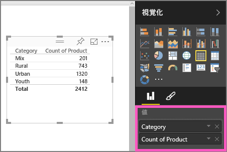
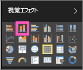

# パート I、Power BI レポートへの視覚化の追加
この記事では、Power BI サービスまたは Power BI Desktop を使用してレポートで視覚化を作成する方法を簡単に説明します。  より高度な内容を調べるには、「[パート II](power-bi-report-add-visualizations-ii.md)」をご覧ください。 Amanda がレポート キャンバスでのビジュアルの作成、編集、書式設定についてさまざまな方法を示します。 このデモの後に、[売上およびマーケティングのサンプル](../sample-datasets.md)を使用して、レポートを作成してみてください。

<iframe width="560" height="315" src="https://www.youtube.com/embed/IkJda4O7oGs" frameborder="0" allowfullscreen></iframe>

## レポートを開き、新しいページを追加します。
1. [レポートを編集表示で](../consumer/end-user-reading-view.md)開きます。 このチュートリアルでは、[売上およびマーケティングのサンプル](../sample-datasets.md)を使います。
2. フィールド ウィンドウが表示されない場合は、矢印アイコンを選んで開きます。 
   
   
3. 空のページをレポートに追加します。

## 視覚化をレポートに追加する
1. 視覚化を作成するため、 **[フィールド]** ウィンドウでフィールドを選びます。  
   
   [SalesFact] > [Sales $] のように、**数値フィールドから始めます**。 Power BI によって、1 つの列のみが含まれた縦棒グラフが作成されます。
   
   
   
   **または、カテゴリ フィールドから始めます** ([Name] や [Product] など)。Power BI によってテーブルが作成され、そのフィールドが **[値]** ウェルに追加されます。
   
   
   
   **もしくは、地理フィールドから始めます** ([Geo] > [City] など)。 Power BI と Bing 地図によって、マップの視覚化が作成されます。
   
   
2. 視覚化を作成し、その種類を変更します。 **[Product] > [Category]** および **[Product] > [Count of Product]** を選び、それらを **[値]** ウェルに追加します。
   
   
3. 視覚化を縦棒グラフに変更するため、縦棒グラフ アイコンを選びます。
   
   
4. レポート内に視覚化を作成するときには、[視覚化をダッシュボードにピン留め](../service-dashboard-pin-tile-from-report.md)します。 視覚化をピン留めするには、ピン アイコン  を選びます。
   
   
  

## 次の手順
 [パート 2: Power BI レポートへの視覚化の追加](power-bi-report-add-visualizations-ii.md)に進む
   
   レポート内の[視覚化を操作する](../consumer/end-user-reading-view.md)
   
   [視覚化に対しその他の操作を実行する](power-bi-report-visualizations.md)
   
   [レポートを保存する](../service-report-save.md)
