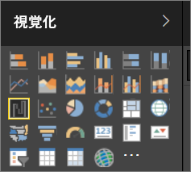

# Power BI レポートでの視覚エフェクト

視覚エフェクト (ビジュアルとも呼ばれる) は、データ内で検出された洞察を表示します。 Power BI レポートは、ビジュアルが 1 つ使用された単一のページのこともあれば、ビジュアルが多数含まれる複数ページから成ることもあります。 Power BI サービスでは、ビジュアルを[レポートからダッシュボードにピン留め](../service-dashboard-pin-tile-from-report.md)することができます。 

レポート*作成者*とレポート *コンシューマー*を区別することが重要です。レポートの作成または変更を担当している場合は、レポート作成者になります。  作成者には、レポートとその基になるデータセットに対して編集のためのアクセス許可が付与されています。 これは、Power BI Desktop では、データ ビューでデータセットを開き、レポート ビューでビジュアルを作成できることを意味し、 Power BI サービスでは、レポート エディターの[編集ビュー](../consumer/end-user-reading-view.md)でデータセットまたはレポートを開くことができることを意味します。 自分がレポートまたはダッシュボードの[共有相手](../consumer/end-user-shared-with-me.md)である場合は、レポート **コンシューマー**となります。 レポートとそのビジュアルを表示および操作することはできますが、変更内容を保存することはできません。

さまざまな種類のビジュアルが Power BI の [視覚化] ウィンドウから直接使用できます。 

この他にも多くのビジュアルが利用できます。[Microsoft AppSource コミュニティ サイト](https://appsource.microsoft.com)にアクセスし、Microsoft およびコミュニティによって提供されている[カスタム ビジュアル](https://appsource.microsoft.com/marketplace/apps?product=power-bi-visuals&page=1)を見つけてダウンロードしてください。    

<iframe width="560" height="315" src="https://www.youtube.com/embed/SYk_gWrtKvM?list=PL1N57mwBHtN0JFoKSR0n-tBkUJHeMP2cP" frameborder="0" allowfullscreen></iframe>

  Power BI を初めて使用する場合や、復習したい場合は、以下のリンクを使用して、Power BI 視覚エフェクトの基本を確認してください。  または、目次 (この記事の左側) を使用して役に立つ情報を見つけます。

## Power BI での視覚化の追加

レポートのページに[視覚エフェクトを作成](power-bi-report-add-visualizations-i.md)します。 [使用できる視覚エフェクトと使用できる視覚エフェクトのチュートリアルの一覧を参照](power-bi-visualization-types-for-reports-and-q-and-a.md)します。 

## カスタムの視覚化をアップロードして Power BI で使用する

自分で作成した、または [Microsoft AppSource コミュニティ サイト](https://appsource.microsoft.com/marketplace/apps?product=power-bi-visuals)で見つけたカスタムの視覚エフェクトを追加します。 自分でカスタマイズする場合は、 ソース コードを調べ、[開発者ツール](../developer/custom-visual-develop-tutorial.md)を使用して新しい視覚エフェクトの種類を作成して、[コミュニティと共有](../developer/office-store.md)してみてください。

## 視覚化の種類の変更

[視覚エフェクトの種類の変更](power-bi-report-change-visualization-type.md)を試して、そのデータに関して最も効果的な視覚エフェクトを確認します。

## 視覚化のピン留め

Power BI サービスでは、希望する視覚エフェクトができたら、タイルとしてその[視覚エフェクトをダッシュボードにピン留め](../service-dashboard-pin-tile-from-report.md)します。 ピン留めした後、レポートで使用されている視覚エフェクトを変更しても、ダッシュボードのタイルは変更されません。つまり、レポート内の視覚エフェクトが折れ線グラフである場合、それをドーナツ グラフに変更しても、視覚エフェクトは折れ線グラフのままです。

## 次の手順

[Power BI での視覚化の種類](power-bi-visualization-types-for-reports-and-q-and-a.md)