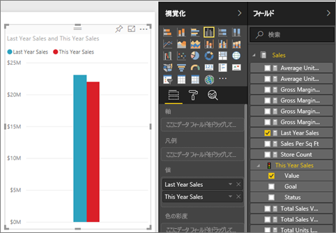
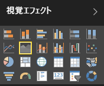

# 基本的な面グラフ
基本的な面グラフ (層グラフとも呼ばれます) は、折れ線グラフに基づいています。 軸と折れ線の間の領域は、量を示すために色で塗りつぶされます。 

面グラフは、時間の経過に伴う変化の大きさを強調し、トレンドの合計値に注目させるために使用できます。 たとえば、時間の経過に伴う利益を表すデータを面グラフにプロットして、総利益を強調することができます。

## 基本的な面グラフを使用すべきケース
基本的な面グラフを選ぶとよい状況を挙げます。

* 時系列全体にわたって量のトレンドを確認および比較する場合 
* 個々の系列が物理的に数えられる集合を表す場合

### 前提条件
 - Power BI サービス
 - 小売りの分析のサンプル

先に進むには、Power BI にサインインして、**[データの取得] \> [サンプル] \> [小売りの分析のサンプル]** を選んでから、**[ダッシュボードに移動]** を選びます。 

## 基本的な面グラフの作成
 

1. [小売りの分析のサンプル] ダッシュボードで、 **\[Total Stores] \(総店舗数)** タイルを選び、[小売りの分析のサンプル] レポートを開きます。
2. **[レポートの編集]** を選んで、編集ビューでレポートを開きます。
3. レポートの下部にある黄色の正符号 [+] アイコンを選んで、新しいページを追加します。
4. 今年の売上と去年の売上を月ごとに表示する面グラフを作成します。
   
   a. [フィールド] ウィンドウで、**[Sales] \> [Last Year Sales]** を選び、**[This Year Sales] > [Value]** を選びます。

   

   b.  [視覚化] ウィンドウの [面グラフ] アイコンを選んで、グラフを基本的な面グラフに変換します。

   
   
   c.  **\[Time] \(時間) \> \[Month] \(月)** を選び、[Month] を **[軸]** に追加します。   
   
   
   d.  月別にグラフを表示するには、(ビジュアルの右上隅にある) 省略記号を選択し、**[Sort by month]** (月別に並べ替え) を選択します。

## 強調表示とクロス フィルター処理
[フィルター] ウィンドウの使い方については、「[Power BI レポートへのフィルターの追加 (編集ビュー)](../power-bi-report-add-filter.md)」をご覧ください。

グラフ内の 1 つの特定の領域を強調表示するには、その領域または上部の境界を選びます。  他の視覚エフェクトの種類とは異なり、同じページに他の視覚エフェクトがある場合、基本的な面グラフを強調表示しても、レポート ページの他の視覚エフェクトはクロス フィルター処理されません。 ただし、面グラフは、レポート ページ上の他の視覚化によってトリガーされたクロス フィルター処理のターゲットになります。 詳しくは、「[Power BI レポートでの視覚化の相互作用](../service-reports-visual-interactions.md)」をご覧ください。

## 考慮事項とトラブルシューティング   
* [障碍を持つユーザーのためにレポートをより使いやすくする](../desktop-accessibility.md)
* 基本的な面グラフは、複数層の面の重なりによって値がわかりにくくなるため、値の比較には有効ではありません。 Power BI では、面の重なりを示すために透過が使用されます。 ただし、透過は 2 つか 3 つの異なる面についてのみうまく機能します。 4 つ以上のメジャーとトレンドを比較する必要がある場合は、折れ線グラフを使用してみてください。 4 つ以上のメジャーと量を比較する必要がある場合は、ツリーマップを使用してみてください。

## 次の手順
[Power BI のレポート](../service-reports.md)  
[Power BI レポートでの視覚化](power-bi-report-visualizations.md)  
[Power BI - 基本的な概念](../service-basic-concepts.md)  
他にわからないことがある場合は、 [Power BI コミュニティを利用してください](http://community.powerbi.com/)。

