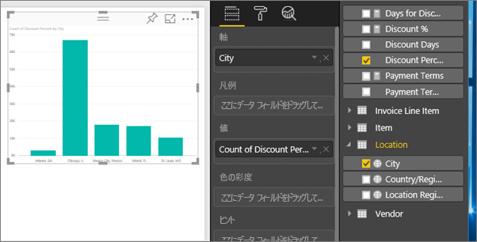
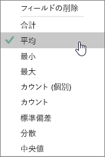
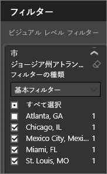
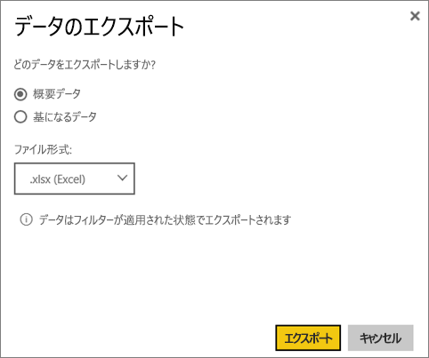
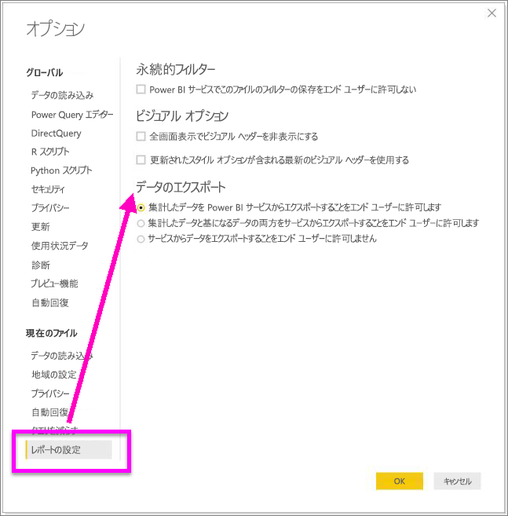

# ビジュアルからデータをエクスポートする
視覚化を作成するのに使うデータを確認したい場合は、Power BI でデータを表示するか、またはデータを Excel に .xlsx または .csv ファイルとしてエクスポートします。 データをエクスポートするオプションを使用するには、Pro ライセンスまたは Premium ライセンスに加えて、データセットとレポートへの編集アクセス許可が必要です。 

Watch では、レポート内のビジュアルの 1 つからデータをエクスポートし、それを .xlsx ファイルとして保存し、Excel で開くことができます。 その後、ビデオで説明されている手順に従って、ご自分でやってみてください。

<iframe width="560" height="315" src="https://www.youtube.com/embed/KjheMTGjDXw" frameborder="0" allowfullscreen></iframe>

## Power BI ダッシュボード上のビジュアルから
1. ビジュアルの右上隅にある省略記号を選択します。

    
2. **[データをエクスポート]** アイコンを選択します。

    
3. データは .csv ファイルにエクスポートされます。 ビジュアルがフィルター処理されている場合は、ダウンロードされるデータもフィルター処理されます。    
4. お使いのブラウザーから、ファイルを保存するように求められます。  保存したら、.csv ファイルを Excel で開きます。

    

## レポート内のビジュアルから
先に進む前に、[調達の分析サンプル レポート](../sample-procurement.md)を[編集ビュー](../consumer/end-user-reading-view.md)で開いてください。 [新しい空のレポート ページを追加](../power-bi-report-add-page.md)します。 その後、手順に従って、集計および視覚化レベルのフィルターを追加します。

1. 新しい縦棒グラフを作成します。  フィールド ウィンドウで、**"Location" > "City"** および **"Invoice" > "Discount Percent"** を選びます。  場合によっては、**"Discount Percent"** も値ウェルに移動する必要があります。 

    
2. "**Discount Percent**" の集計を **[カウント]** から **[平均]** に変更します。 値ウェルで、"**Discount Percent**" ("**Count of Discount Percent**" になっているかもしれません) の右側の矢印を選び、**[平均]** を選びます。

    
3. "**City**" にフィルターを追加して "**Atlanta**" を除去します。

   

   これで、データをエクスポートする両方のオプションを試す準備ができました。 

4. ビジュアルの右上隅にある省略記号を選択します。 **[データをエクスポート]** を選択します。

   
5. Power BI オンラインでは、視覚化に集計がある場合 (一例は、**[カウント]** を *[平均]*、*[合計]*、または *[最小]* に変更した場合)、**[概要データ]** と **[基になるデータ]** の 2 つのオプションがあります。 Power BI Desktop には、**[概要データ]** のオプションのみがあります。 集計について理解するには、「[Power BI での集計](../service-aggregates.md)」を参照してください。
    
6. **[概要データ]** > **[エクスポート]** を選び、.xlsx または .csv を選びます。 データがエクスポートされます。  視覚化にフィルターを適用してある場合、フィルターが適用された状態のデータがエクスポートされます。 **[エクスポート]** を選ぶと、ファイルを保存するように求められます。 保存したら、Excel でファイルを開きます。

   **[概要データ]**: そのビジュアルで表示されている内容のデータをエクスポートする場合、このオプションを選択します。  この種類のエクスポートでは、ビジュアルの作成に選択したデータ (列とメジャー) のみが表示されます。  ビジュアルに集計がある場合、概要データをエクスポートします。 たとえば、4 つの棒を含む横棒グラフがある場合は、4 行のデータが作成されます。 概要データは、.xlsx および .csv で使用できます。

   この例の Excel へのエクスポートでは、都市ごとに 1 つのタイトルが表示されています。 アトランタを除外したので、結果には含まれません。  スプレッドシートの最初の行では、Power BI からデータを抽出するときに使われたフィルターが示されています。

   
7. 次に、**[基になるデータ]** > **[エクスポート]** を選び、.xlsx を選んでみてください。 データがエクスポートされます。 視覚化にフィルターを適用してある場合、フィルターが適用された状態のデータがエクスポートされます。 **[エクスポート]** を選ぶと、ファイルを保存するように求められます。 保存したら、Excel でファイルを開きます。

   >[!WARNING]
   >基になるデータをエクスポートすることで、ユーザーがすべての詳細データ、つまりすべての列のデータを表示できるようになります。 Power BI サービスの管理者は自分の組織に対してこれをオフにできます。 データセットの所有者であれば、デスクトップまたは Power BI サービスのフィールド リストに表示されないよう、所有権列を "非表示" に設定できます。

   **[基になるデータ]**: ビジュアルのデータ***と***モデルからの追加データを表示する場合、このオプションを選択します (詳細は下のグラフをご覧ください)。  視覚化に集計がある場合、*[基になるデータ]* を選択すると集計が削除されます。 **[エクスポート]** を選択すると、データが .xlsx ファイルにエクスポートされ、ファイルを保存するようにブラウザーから求められます。 保存したら、Excel でファイルを開きます。

   この例の Excel エクスポートでは、データセットの 1 つの都市行ごとに 1 つの行が作成され、その 1 つのエントリの割引率が示されます。 つまり、データはフラット化された状態であり、集計されていません。 スプレッドシートの最初の行では、Power BI からデータを抽出するときに使われたフィルターが示されています。  

   

## 基になるデータの詳細をエクスポートする
**[基になるデータ]** を選択したときに表示される内容は変わることがあります。 これらの詳細を理解するには、管理者や IT 部署の助けが必要になることがあります。 Power BI Desktop またはサービスのレポート ビューでは、*メジャー*は Fields リストに表示され、電卓のアイコンが付きます 。 メジャーは Power BI Desktop で作成されますが、Power BI サービスでは作成されません。

| ビジュアルに含まれる内容 |                                                                              エクスポートに表示される内容                                                                              |
|-----------------|-------------------------------------------------------------------------------------------------------------------------------------------------------------------------------------|
|   集計    |                                                 *最初*の集計と、その集計に対してテーブル全体から得られる非表示以外のデータ                                                  |
|   集計    | 関連データ - 集計が含まれるデータ テーブルに*\*\*関連*\*している他のデータ テーブルからのデータがビジュアルで使用されている場合 (そのリレーションシップが \*:1 か 1:1 の場合に限り) |
|    メジャー     |                                      ビジュアルのすべてのメジャー*と*ビジュアルで使用されているメジャーを含むあらゆるデータ テーブルからのすべてのメジャー                                      |
|    メジャー     |                                       そのメジャーを含むテーブルからのすべての非表示以外のデータ (そのリレーションシップが \*:1 か 1:1 の場合に限り)                                       |
|    メジャー     |                                      \*:1 または 1:1 のチェーンを介してメジャーを含むテーブルに関連しているすべてのテーブルからのすべてのデータ                                      |
|  メジャーのみ  |                                                   すべての関連テーブルからのすべての非表示以外の列 (メジャーを拡張する目的で)                                                   |
|  メジャーのみ  |                                                             モデル メジャーのあらゆる重複行に対する概要データ。                                                              |

### エクスポートのオプションを設定する
Power BI レポート デザイナーは、コンシューマーが使用できるデータ エクスポート オプションの種類を制御します。 次の選択肢があります。
- 概要データのみのエクスポートを許可する (これは新しいレポートの既定値です) 
- 概要データと基になるデータのエクスポートを許可する (これは 2018 年 10 月より前の既定値でした) 
- すべてのデータのエクスポートを許可しない  

    > [!IMPORTANT]
    > レポート デザイナーには古いレポートに再度アクセスし、必要に応じてエクスポート オプションを手動でリセットすることをお勧めします。

1. これらのオプションを設定するには、Power BI Desktop で開始します。

2. 左上から **[ファイル]** > **[オプションと設定]** > **[オプション]** を選択します。 

3. **[現在のファイル]** の下にある **[レポートの設定]** を選択します。

    

4. **[データのエクスポート]** ドロップ ダウンから選択します。

Power BI サービスでこの設定を更新することもできます。  

Power BI 管理ポータルの設定がエクスポート データのレポートの設定と競合した場合、管理者の設定の方がエクスポート データの設定よりも優先される点に注意してください。 

## 制限事項と考慮事項
* **Power BI Desktop** および **Power BI サービス**から .csv にエクスポートできる最大行数は 30,000 行です。
* .xlsx にエクスポート可能な行の最大数は 150,000 行です。
* *[基になるデータ]* を使ったエクスポートは、データ ソースが Analysis Services ライブ接続で、バージョンが 2016 より古く、モデルのテーブルに一意キーがない場合は、機能しません。  
* *[基になるデータ]* を使ったエクスポートは、エクスポート対象の視覚エフェクトの *[データのない項目を表示する]* オプションが有効になっている場合は、機能しません。
* DirectQuery を使ってエクスポートできるデータの最大量は 16 MB です。 このため、すべての行をエクスポートできない可能性があります。列の数が多い場合、圧縮が困難なデータの場合、ファイル サイズが大きくなってエクスポートされる行数が減る他の要因がある場合は特にそうです。
* ビジュアルで複数のデータ テーブルからのデータが使用されるとき、データ モデルでそれらのテーブルに対してリレーションシップが存在しない場合、最初のテーブルのデータのみがエクスポートされます。 
* 現在、カスタム ビジュアルと R ビジュアルはサポートされていません。
* 共有のダッシュ ボードを使用している、組織外のユーザーはエクスポート データを使用することができません。 
* Power BI では、フィールドをダブルクリックし、新しい名前を入力するとフィールド (列) の名前を変更できます。  この新しい名前は*エイリアス*と呼ばれています。 Power BI レポートのフィールド名に重複が発生することがありますが、Excel では重複は許可されていません。  そこで、データが Excel にエクスポートされるとき、フィールドのエイリアスが元のフィールド (列) 名に戻ります。  
* .csv ファイルに Unicode 文字がある場合は、Excel でテキストが正しく表示されない場合があります。 ただし、メモ帳で開くと問題なく動作します。 Unicode 文字の例としては、通貨記号と外来語があります。 この回避策は、csv を直接開く代わりに、Excel に csv をインポートすることです。 操作の内容:

  1. Excel を開く
  2. **[データ]** タブで、**[外部データの取り込み]** > **[テキストから]** の順に選択します。
* Power BI 管理者は、データのエクスポートを無効にできます。

## 次の手順
[Power BI のダッシュボード](../consumer/end-user-dashboards.md)  
[Power BI - 基本的な概念](../consumer/end-user-basic-concepts.md)

他にわからないことがある場合は、 [Power BI コミュニティで質問してみてください](http://community.powerbi.com/)。

