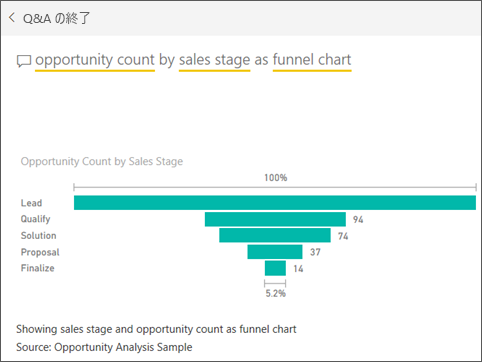

# じょうごグラフ
じょうごグラフは、順番につながっている各段階がある線形プロセスを視覚化するために役立ちます。 たとえば、次のような段階にわたって顧客を追跡する販売のじょうごグラフがあります:リード \> 見込みのあるリード \> 見込顧客 \> 契約 \> 契約の締結。  じょうごの形状は、追跡しているプロセスの正常性がひとめでわかります。

じょうごの各段階は、全体のうちの割合を表します。 そして、ほとんどの場合、じょうごグラフの形は、最初の段階が最も大きく、それ以降の各段階はその前の段階よりも小さくなり、じょうごのような形になります。  洋ナシの形のじょうごグラフも役立ち、プロセスにおける問題を特定することができます。  ただし、通常は「インテーク」段階と呼ばれる最初の段階が最も大きくなります。

## じょうごグラフを使用すべきケース
じょうごグラフは、次のような場合に最適な選択肢になります。

* データが順番に発生し、少なくとも 4 つの段階を経る場合。
* 最初の段階の「項目」の数が最終段階のその数よりも大きいと想定される場合。
* 段階ごとの可能性 (収益額/売上額/契約数など) を計算する場合。
* コンバージョン率および顧客維持率を計算して追跡する場合。
* 線形プロセスのボトルネックを明らかにする場合。
* ショッピング カートのワークフローを追跡する場合。
* クリックスルー広告/マーケティング キャンペーンの進捗と成功を追跡する場合。

## じょうごグラフを使った作業
じょうごグラフ:

* レポートおよび Q&A からピン留めできます。
* 並べ替えられます。
* 倍数をサポートしています。
* 同じレポート ページの他の視覚化による強調表示およびクロス フィルター処理ができます。
* 同じレポート ページの他の視覚化を強調表示およびクロス フィルター処理するために使うことができます。

## 基本的なじょうごグラフを作成する
このビデオでは、売上およびマーケティングのサンプルを使ってじょうごグラフを作成する様子をご覧いただけます。

<iframe width="560" height="315" src="https://www.youtube.com/embed/qKRZPBnaUXM" frameborder="0" allow="autoplay; encrypted-media" allowfullscreen></iframe>

それでは、営業の各段階にある営業案件の数を示す独自のじょうごグラフを作成してみましょう。

次の手順では、営業案件の分析のサンプルを使います。 作業を進めるために、Power BI サービス (app.powerbi.com) または Power BI Desktop の[サンプルをダウンロード](../sample-datasets.md)します。   

1. 空のレポート ページで開始し、**[SalesStage]** \> **[Sales Stage]** フィールドを選びます。 Power BI サービスを使っている場合は、[編集ビュー](../service-interact-with-a-report-in-editing-view.md)でレポートを開いていることを確認します。
   
    
2. [グラフを変換](power-bi-report-change-visualization-type.md)してじょうごグラフにします。 **[Sales Stage]** (売上ステージ) が **[Group]** (グループ) に入っていることをご覧ください。 
3. **[フィールド]** ウィンドウで、**[Fact]** \> **[Opportunity Count]** を選びます。
   
    
4. 横棒の上にポインターを合わせると、以下の情報が表示されます。
   
   * 段階の名前
   * この段階にある現在の営業案件の数
   * 全体のコンバージョン率 (潜在顧客のうちの %) 
   * ある段階から次の段階 (ドロップ率とも呼ばれる): これは、前の段階の件数に占める次の段階の件数の % です (この例の場合、Solution Stage ÷ Proposal Stage になります)
     
     
5. [このじょうごグラフをダッシュボード タイルとして追加](../service-dashboard-tiles.md)します。 
6. [レポートを保存](../service-report-save.md)します。

## 強調表示とクロス フィルター処理
[フィルター] ウィンドウの使用方法については、「[Power BI でのレポートへのフィルターの追加](../power-bi-report-add-filter.md)」をご覧ください。

じょうごグラフ内の横棒を強調表示すると、レポート ページにある他の視覚化がクロス フィルター処理されます。逆の場合も同様です。 作業を進めるために、じょうごグラフを含むレポートページにより多くのビジュアルを追加します。

1. じょうごグラフ上で、横棒の **[Proposal]** を選択します。 これにより、ページ上の他の視覚化がクロス強調表示されます。 複数選択を行うには、Ctrl キーを使用してください。
   
   
2. ビジュアル相互間のクロスフィルター処理とクロス強調表示を設定するには、「[Power BI における視覚エフェクト](../service-reports-visual-interactions.md)」を参照してください。

## Q&A でのじょうごグラフの作成
営業案件分析サンプルのダッシュボード、または営業案件分析サンプルのデータセットからピン留めされた視覚エフェクトを少なくとも 1 つ含む他のダッシュボードを開きます。  Q&A に質問を入力すると、選択したダッシュボードに関連付けられている (タイルがピン留めされている) すべてのデータセット内で回答が検索されます。 詳しくは、「[Power BI - 基本的な概念](../service-basic-concepts.md)」を参照してください。

1. 営業案件分析サンプルのダッシュボードで、Q&A の質問ボックスに質問の入力を開始します。
   
   
   
2. Power BI がユーザーの好みの視覚化の種類を認識できるように、必ず「じょうごグラフで」という語句を追加してください。

## 次の手順

[Power BI のゲージ](power-bi-visualization-radial-gauge-charts.md)

[Power BI での視覚化の種類](power-bi-visualization-types-for-reports-and-q-and-a.md)
