# 主要なインフルエンサの視覚エフェクト
主要なインフルエンサは、関心のあるメトリックを動作させる要因を理解するのに役立ちます。 データを分析し、重要な要因にランクを付け、主要なインフルエンサとして表示します。 たとえば、従業員の離職率 (チャーン) に何が影響するかを把握したいとします。 要因は雇用契約期間である場合や、従業員の年齢である場合があります。 
 
## 主要なインフルエンサを使用するタイミング 
主要なインフルエンサの視覚エフェクトは、次のような場合に最適です。 
- 分析対象のメトリックに影響する要因を確認する。

- これらの要因の相対的重要度を比較する。 短期契約は、長期契約の場合よりもチャーンへの影響が大きくなるかなど。 

## 主要なインフルエンサの要件 
分析対象のメトリックは、カテゴリ別フィールドである必要があります。    

## 主要なインフルエンサの視覚エフェクトの機能

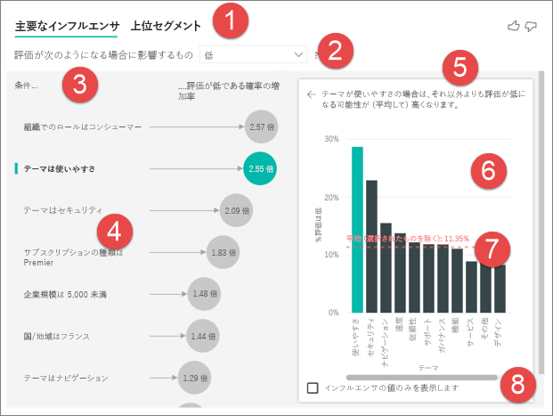    

1. ***タブ*** - タブを選択して、ビューを切り替えます。 主要なインフルエンサでは、選択されたメトリック値に影響した上位の要素が示されます。 上位セグメントでは、選択されたメトリック値に影響した上位のセグメントが示されます。 *セグメント* は、値の組み合わせで構成されます。  たとえば、1 つのセグメントは、西部地域に 20 年以上住んでいる顧客を示している場合があります。 

2. ***ドロップダウン*** - 調査中のメトリックの値。 この例では、メトリック**評価**を確認しており、選択した値は**低**です。    

3. ***修正*** - 左側のウィンドウの視覚エフェクトを解釈するのに役立ちます。 

4. ***左側のウィンドウ*** - 左側のウィンドウには 1 つの視覚エフェクトが含まれています。  この場合、左側のウィンドウには、上位の主要なインフルエンサのリストが示されています。

5. ***修正*** - 右側のウィンドウの視覚エフェクトを解釈するのに役立ちます。

6. ***右側のウィンドウ*** - 右側のウィンドウには 1 つの視覚エフェクトが含まれています。 この場合、縦棒グラフには、**主要なインフルエンサ** (左側のウィンドウで選択されている**テーマ**) のすべての値が表示されています。 左側のウィンドウの特定の値 (**使いやすさ**) は緑で、**テーマ**の他のすべての値は黒で示されています。

7. ***平均線*** - **使いやすさ**を除く、**テーマ**の他のすべての有効な値の平均が計算されています。 したがって、計算は黒のすべての値に適用されています。 低評価となったその他の**テーマ**の割合がわかります。 つまり、顧客は評価時に、評価の理由または**テーマ**を説明することにもなります。 テーマには、使いやすさ、速度、セキュリティなどがあります。**テーマ**は**使いやすさ**は、左側のウィンドウの視覚エフェクトに応じて、低評価の 2 番目に高い主要なインフルエンサとなります。 他のすべてのテーマ、および**低**評価へのその影響度を平均すると、ここに結果が赤で示されます。 他のすべてのテーマのうち、**使いやすさ**よりも高いのは 11.35% のみです。 

8. ***チェックボックス*** - インフルエンサである値のみが表示されます。

## 主要なインフルエンサの視覚エフェクトを作成する 
 
このビデオで主要なインフルエンサの視覚エフェクトの作成方法を確認した後、以下の手順に従って自分で作成してみてください。 

<iframe width="560" height="315" src="https://www.youtube.com/embed/fDb5zZ3xmxU" frameborder="0" allow="accelerometer; autoplay; encrypted-media; gyroscope; picture-in-picture" allowfullscreen></iframe>

プロダクト マネージャーは、顧客がクラウド サービスについて否定的なレビューをした要因を理解する必要があります。  理解するには、Power BI Desktop で[カスタマー フィードバック PBIX ファイル](https://github.com/Microsoft/powerbi-desktop-samples/blob/master/2019/customerfeedback.pbix)を開きます。 [Power BI サービスまたは Power BI Desktop 用のカスタマー フィードバック Excel ファイル](https://github.com/Microsoft/powerbi-desktop-samples/blob/master/2019/customerfeedback.xlsx)をダウンロードすることもできます。 

> [!NOTE]
> カスタマー フィードバック データセットは、[Moro et al., 2014] S. Moro, P. Cortez and P. Rita. A Data-Driven Approach to Predict the Success of Bank Telemarketing. Decision Support Systems, Elsevier, 62:22-31, June 2014 に基づくものです 

1. レポートを開き、主要なインフルエンサのアイコンを選択します。  

    ![[視覚エフェクト] ウィンドウから、主要なインフルエンサのテンプレートを選択する](media/power-bi-visualization-influencers/power-bi-template-new.png)

2. 調査するメトリックを **[分析]** フィールドにドラッグします。 **[分析]** フィールドでは、カテゴリ別の (非連続) 変数のみがサポートされます。 顧客がサービスを**低**と評価した要因を確認したいため、**[顧客テーブル]** > **[評価]** の順に選択します。    
3. 次に、**評価**に影響したと思われるフィードを **[説明]** にもドラッグします。 フィールドは好きな数だけドラッグすることができます。 この場合は、以下から始めます。 
    - 国/地域 
    - 組織でのロール 
    - サブスクリプションの種類 
    - 企業規模 
    - テーマ     
4. 否定的な評価に関心があるため、**[What influences Rating to be]\(評価が次のようになる場合に影響するもの\)** のドロップダウンで **[低]** を選択します。  

    ![ドロップダウンから [低] を選択する](media/power-bi-visualization-influencers/power-bi-key-influencers.png)

分析対象フィールドのテーブル レベルで分析が行われます。 この場合、(各顧客のスコアが高または低である) 顧客レベルで定義されている、**[評価]** メトリックに関心があります。 すべての説明要因は、視覚エフェクトで利用するために顧客レベルで定義する必要があります。 

上記の例では、すべての説明要因にはメトリックと一対一または多対一のリレーションシップがあります。 たとえば、各スコアに関連付けられているテーマ (顧客レビューのメイン テーマ) は 1 つのみとなります。 同様に、顧客は 1 つの国に属しており、その組織には 1 つのメンバーシップの種類と 1 つのロールがあります。 そのため、説明要素は既に顧客の属性であり、変換は必要ありません。視覚エフェクトではそれらをすぐに利用できます。 

チュートリアルの後半で、一対多リレーションシップのより複雑な例を見ていきます。 その場合、分析を行う前に、まず、列を顧客レベルまで集計する必要があります。  

説明要因として使用された測定値と集計値も、**分析**メトリックのテーブル レベルで評価されます。この記事の後半で例をいくつか見ていきます。 

## カテゴリ別の主要なインフルエンサの解釈 
低評価の主要なインフルエンサを見ていきましょう。 

### 低評価の可能性に影響する上位の単一要因

組織には、コンシューマー、管理者、パブリッシャーという 3 つのロールがあります。 コンシューマーが、低評価に影響する上位の要因であることがわかります。 

![[Role in Org is consumer]\(組織でのロールはコンシューマー\) を選択する](media/power-bi-visualization-influencers/power-bi-role-consumer.png)

より正確に言えば、コンシューマーは、否定的なスコアを付ける可能性が 2.57 倍高くなっています。 主要なインフルエンサ グラフの左側のリストには、まず、**[Role in Org is consumer]\(組織でのロールはコンシューマー\)** が示されます。 **[Role in Org is consumer]\(組織でのロールはコンシューマー\)** を選択すると、Power BI の右側のウィンドウに詳細が示されます。つまり、低評価の可能性に対する各**ロール**の影響が比較されます。
  
- 14.93% のコンシューマーが低いスコアを付けています  
- 平均すると、その他のすべてのロールが付けたある時点の低いスコアは 5.78% となります 
- したがって、コンシューマーは、他のすべてのロールと比べて、低いスコアを付ける可能性が 2.57 倍高くなります (緑の棒と赤の点線の違い) 

### 低評価の可能性に影響する 2 番目の単一要因

主要なインフルエンサ視覚エフェクトでは、さまざまな変数からの要因を比較してランクを付けることができます。  2 番目のインフルエンサは、**組織でのロール**とは関係ありません。リストの 2 番目のインフルエンサである **[Theme is usability]\(テーマは使いやすさ\)** を選択します。 

![[Theme is usability]\(テーマは使いやすさ\) を選択する](media/power-bi-visualization-influencers/power-bi-theme.png)

ここで、2 番目に重要な要因が顧客のレビューのテーマに関連していることがわかります。 製品の*使いやすさ* についてコメントした顧客は、信頼性、設計、速度などの他のテーマにコメントした顧客に比べ、低いスコアを付ける可能性が 2.21 倍高くなっています。 

ビジュアルの差で平均 (赤い点線) が 5.78% から 11.34% に変わったことがわかります。 平均は、その他のすべての値の平均に基づいているため動的です。 最初のインフルエンサの場合、平均では顧客ロールが除外され、2 番目の場合、使いやすさのテーマが除外されています。 
 
視覚エフェクトの下部にあるボックスをクリックすると、視覚エフェクトで影響がある値のみにフィルター処理されます (この場合、スコアを低くするロール)。 そのため、12 個のテーマを見てから、Power BI で評価を低くするものとして識別された 4 つのテーマを見ました。 

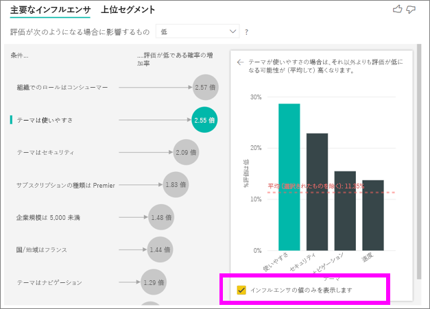

## 他の視覚エフェクトの操作 
 
ユーザーがキャンバス上のスライサー、フィルター、またはその他の視覚エフェクトをクリックするたびに、主要なインフルエンサ視覚エフェクトでは、データの新しい部分の分析が再実行されます。 たとえば、レポートに企業規模をドラッグし、それをスライサーとして使用してみます。 企業の顧客の主要なインフルエンサ (企業規模は 50,000 より大きい) が、一般集団とは異なるかどうかを確認する必要があります。  
 
**[>50,000]** を選択すると、分析が再実行され、インフルエンサが変更されたことがわかります。 大企業の顧客の場合、低評価の上位インフルエンサの**テーマ**は**セキュリティ**に関するものになっています。 さらに調査し、大企業の顧客が不満を持つ特定のセキュリティ機能があるかどうかを確認できます。 

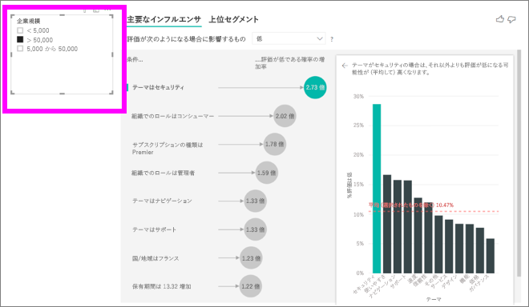

## 継続的な主要なインフルエンサの解釈 
 
これまで、視覚エフェクトを使用して、さまざまなカテゴリ別フィールドが低評価にどのように影響するかを調べました。 継続的な要因 (年齢、高さ、価格など) が [説明] になる可能性もあります。 顧客テーブルから [説明] に [期間] をドロップするとどうなるかを見てみましょう。 期間は、顧客がサービスをどのくらい使用しているかを示します。 
 
**期間**が増えると、より低い評価を受ける可能性も増えることがわかります。 この傾向は、長期顧客が実際に否定的なスコアを付ける可能性が高くなることを示しています。これは興味深い分析情報であり、今後、フォローが必要となる可能性のあるものです。  
 
視覚エフェクトでは、期間が 13.44 か月増えるごとに、平均して、低評価の可能性が 1.23 倍高くなることがわかります。 この場合、13.44 か月は期間の標準偏差を示しています。 したがって、得られた分析情報により、期間が標準量 (期間の標準偏差) だけ増えると、低評価を受ける可能性にどのように影響するかがわかります。 
 
右側の散布図では、期間の値ごとに低評価の平均率がプロットされ、傾きを強調表示する傾向線が含まれます。  

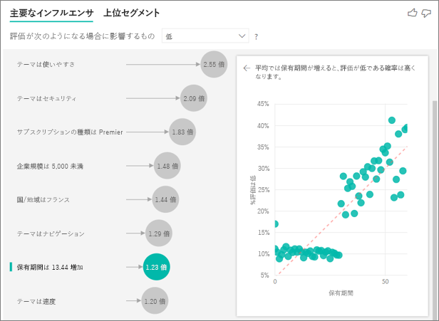

## 測定値/集計値を主要なインフルエンサとして解釈する 
 
最後に、ユーザーは、分析内の説明要因として、測定値と集計値を使用することもできます。 たとえば、顧客サポート チケットの数または開いているチケットの平均期間が、受け取ったスコアにどのような影響を与えるかを確認できます。 
 
この場合、顧客が持つサポート チケットの数が与えるスコアに影響するかどうかを確認する必要があります。 [サポート チケット] テーブルからサポート チケット ID を取り込みます。 顧客は複数のサポート チケットを持つことができるため、ID を顧客レベルに集計する必要があります。 この集計は重要です。顧客レベルで分析を実行し、その細分性のレベルですべての要因を定義する必要があるためです。 
 
ID のカウントを見ていきます (したがって、各顧客の行には、関連付けられているサポート チケットのカウントが含まれます)。 この場合、サポート チケットのカウントが増えると、評価が低くなる可能性が 5.51 倍高くなります。 右側の視覚エフェクトには、(顧客レベルで評価された) 異なる評価値によるサポート チケットの平均数が表示されます。 

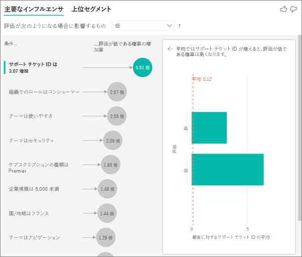

## 結果の解釈: 上位セグメント 
 
[主要なインフルエンサ] タブでは、ユーザーは各要因に個別にアクセスできますが、[上位セグメント] に切り替えて、要因の組み合わせが分析対象のメトリックにどのように影響するかを確認することができます。 
 
上位セグメントでは、最初に、Power BI によって検出されたすべてのセグメントの概要が表示されます。 以下の例では、6 個のセグメントが見つかったことがわかります。 これらのセグメントは、セグメント内の低評価の割合でランク付けされます。 たとえば、セグメント 1 では、低い顧客評価が 74.3% となっています。  バブルの位置が高いほど、低評価の割合が高くなっています。 一方、バブルのサイズはセグメント内の顧客数を表します。 

![[上位セグメント] のタブを選択する](media/power-bi-visualization-influencers/power-bi-top-segments-tab.png)

バブルを選択すると、そのセグメントの詳細が表示されます。 たとえば、セグメント 1 を選択すると、サポート チケットの数が多い (4 枚を超える) 比較的定着した (期間が 29 か月を超える) 顧客で構成されていることがわかります。 これらはパブリッシャーではありません (したがって、コンシューマーか管理者です)。  
 
このグループでは、74.3% が低い評価を付けています。 平均顧客はある時点で 11.7% という低い評価を付けているため、このセグメントの低評価の割合はかなり大きくなっています (63 パーセンテージ ポイント以上)。 また、セグメント 1 には約 2.2% のデータが含まれているため、母集団の指定可能な部分を表していることがわかります。 

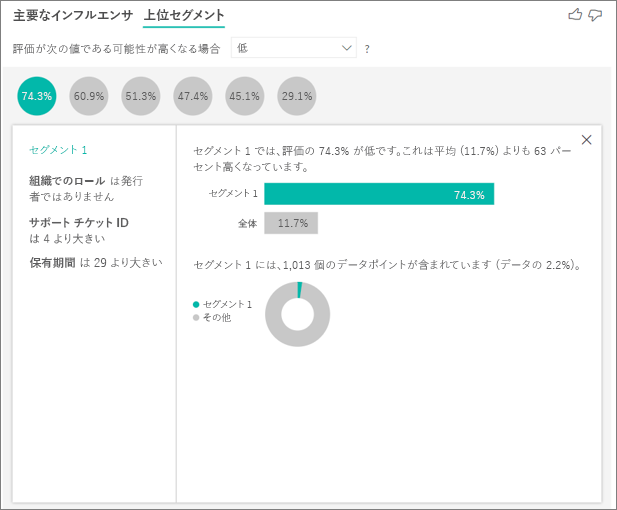

## 考慮事項とトラブルシューティング 
 
**プレビューの制限事項とは** 
 
主要なインフルエンサ視覚エフェクトは現在、パブリック プレビュー段階であり、ユーザーが注意する必要がある制限事項がいくつかあります。 現在、利用できない機能は次のとおりです。 
- 集計値/測定値であるメトリックの分析 
- Power BI Embedded でのビジュアルの使用
- Power BI モバイル アプリでのビジュアルの使用
- RLS サポート 
- 直接クエリのサポート 
- ライブ接続のサポート 
 
**インフルエンサ/セグメントが見つからないというエラーが表示されます。これはなぜですか。**  

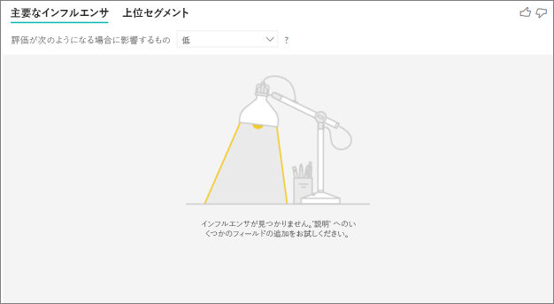

このエラーは、**[説明]** にフィールドは含まれているが、インフルエンサが見つからない場合に発生します。   
- [分析] と [説明] の両方に分析していたメトリックが含まれています (**[説明]** から削除する必要があります) 
- 説明フィールドに含まれる、観測値がほとんどないカテゴリが多すぎます。 これにより、視覚エフェクトでのインフルエンサである要因の特定が困難になります。これは、わずかな観測値に基づいて一般化するのが困難なためです 
- 説明要因には一般化するのに十分な数の観測値はありますが、視覚エフェクトでは報告を返すための意味のある相関関係が見つかっていません 
 
**分析対象のメトリックに分析を行うための十分なデータがないというエラーが表示されます。これはなぜですか。**  

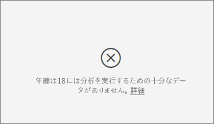

視覚エフェクトは、あるグループ (低く評価した顧客など) と他のグループ (高く評価した顧客など) を比較し、そのデータのパターンを調べることで機能します。 モデル内のデータの観測値が非常に少ない場合、パターンは見つけにくくなります。 視覚エフェクトに意味のあるインフルエンサを見つけるのに十分なデータがない場合、分析を行うにはさらにデータが必要であることが示されます。 選択された状態 (顧客がチャーンしている) について、100 個以上の観測値と、比較に使用する状態 (顧客がチャーンしていない) について、10 個以上の観測値を用意することをお勧めします。  
 
**[説明] 内のフィールドが、分析対象のメトリックを含むテーブルに一意に関係していないというエラーが表示されます。これはなぜですか。**  
 
分析対象フィールドのテーブル レベルで分析が行われます。 たとえば、サービスに関する顧客フィードバックを分析する場合、テーブルに顧客が付けた評価が高いか低いかが示されることがあります。 この場合、顧客テーブルのレベルで分析が行われます。 

メトリックを含むテーブルより詳細なレベルで定義されている関連テーブルがある場合、このエラーが発生します。 これを以下の例に示します。 
 
- 顧客がサービスを低く評価する要因を分析します 
- 顧客がサービスを利用しているデバイスが、その顧客によって与えられたレビューに影響するかどうかを確認したいと思っています 
- 顧客は複数の異なる方法でサービスを利用することができます   
- 次の例では、顧客 10000000 はブラウザーとテーブルの両方を使用して、サービスと対話しています 

説明要因としてデバイス列を使用しようとすると、以下のエラーが表示されます。 

これは、デバイスが顧客レベルで定義されていないためです。1 人の顧客が複数のデバイス上でサービスを利用できます。 視覚エフェクトでパターンを見つける場合、デバイスが顧客の属性になる必要があります。 この場合、ビジネスの理解に応じて、いくつかのソリューションがあります。 
 
- たとえば、顧客が付けるスコアにデバイス数が影響する可能性があると思われる場合は、デバイスの要約をカウントに変更できます 
- デバイス列をピボットすることで、特定のデバイス上でのサービスの利用が顧客の評価に影響するかどうかを確認できます  
 
この例では、データをピボットし、‘ブラウザー、‘モバイルおよび ‘タブレットの新しい列を作成しました。 これで、これらを [説明] で使用できます。 すべてのデバイスを確認した結果、顧客スコアに最も大きく影響するインフルエンサがブラウザーであることがわかりました。 

より正確に言えば、サービスを利用するのにブラウザーを使用していない顧客は、使用している顧客より低いスコアを付ける可能性が 3.79 倍高くなります。 リストの下のほうを見ると、モバイルの場合、その逆の true となっています。 モバイル アプリを使用している顧客が、使用していない顧客より低いスコアを付ける可能性が高くなっています。  

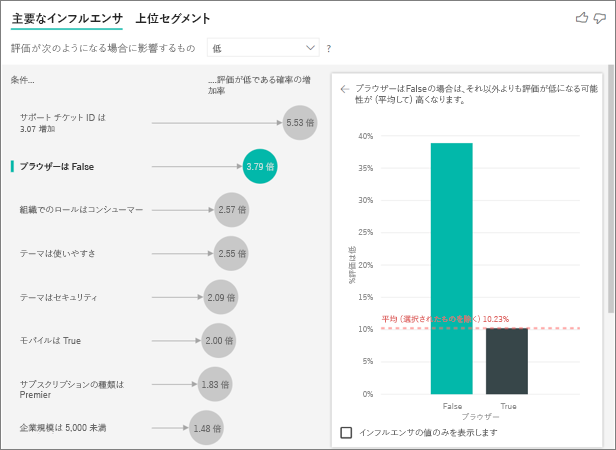

**分析に測定値が含まれていないという警告が表示されます。これはなぜですか。** 

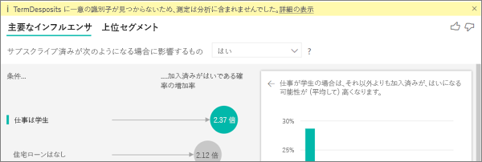

分析対象フィールドのテーブル レベルで分析が行われます。 顧客のチャーンを分析する場合、テーブルに顧客がチャーンしたかどうかが示されることがあります。 この場合、顧客テーブルのレベルで分析が行われます。
 
測定値と集計値は、既定で、そのテーブル レベルで分析されます。 '平均月間支出' の測定値があった場合、それは顧客テーブル レベルで分析されたものです。  

顧客テーブルに一意識別子がない場合、測定値を評価できず、分析で無視されます。 これを回避するには、メトリックを含むテーブル (この場合、顧客テーブル) に一意識別子 (顧客 ID など) があることを確認します。 Power Query を使用してインデックス列を追加するのもとても簡単です。
 
**分析対象のメトリックに 10 個を超える値があり、これが分析の質に影響する可能性があるという警告が表示されます。これはなぜですか。**  

AI 視覚エフェクトは、カテゴリを分析するために最適化されています (チャーンが [はい] または [いいえ] である、顧客満足度が [高]、[中]、または [低] であるなど)。分析するカテゴリの数を増やすことは、カテゴリごとの観測値が少なくなることを意味し、これにより、視覚エフェクトでデータのパターンを見つけにくくなります。 

より強力なインフルエンサを見つけるために、単一ユニットに類似する値をグループ化することをお勧めします。 たとえば、価格のメトリックがある場合、類似する価格を [高]、[中]、[低] バケットなどにグループ化し、また、個々の価格ポイントを使用することで、より良い結果が得られる可能性があります。 

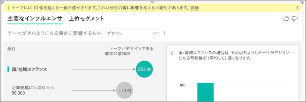

**データに含まれる要因が主要なインフルエンサのように見えますが、そうではありません。どうしてこのようになるのですか。**

次の例では、コンシューマーが低い評価の要因となったことがわかります (14.93% 評価は低)。 興味深いことに、管理者ロールの低評価 (13.42%) の割合も高くなっていますが、インフルエンサと見なされていません。 

この背後にある理由は、視覚エフェクトでインフルエンサの検出時にデータポイントの数も考慮されたことです。 次の例では、コンシューマーの数が 29,000 を超え、管理者はその 10 倍少なくなっています (約 2,900)。 さらに、そのうちの 390 人のみが低く評価しています。 したがって、視覚エフェクトには、一度調べただけで管理者評価のパターンを本当に見つけられたかどうかを判断するために十分なデータがありません。  

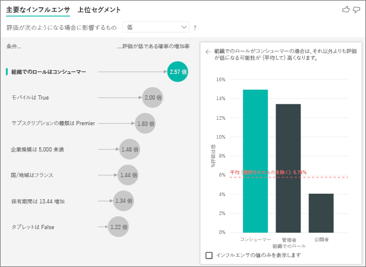

**主要なインフルエンサはどのように計算するのですか。**

AI の視覚化では、バックグラウンドで [ML.NET](https://dotnet.microsoft.com/apps/machinelearning-ai/ml-dotnet) を使用してロジスティック回帰が実行され、主要なインフルエンサが計算されます。 ロジスティック回帰は、さまざまなグループを互いに比較する統計モデルです。 低評価の要因を確認する場合、ロジスティック回帰で、低いスコアを付けた顧客が高いスコアを付けた顧客とどう違うのかを確認します。 複数のカテゴリ (高スコア、中スコア、低スコア) があった場合、低く評価した顧客と、低く評価しなかった顧客がどう違うのか (高評価または中評価を付けた顧客とどう違うのか) を確認します。 
 
ロジスティック回帰では、低く評価した顧客と、高く評価した顧客がどのように違う場合があるのかを確認することで、データのパターンを検索します。 たとえば、より多くのサポート チケットを持っている顧客は、持っているサポート チケットの数が少ない、あるいはサポート チケットを持っていない顧客より、低評価の割合がかなり高くなることがわかる場合があります。
 
ロジスティック回帰では、存在するデータポイントの数も考慮されます。 たとえば、管理者ロールを果たす顧客が比例的により多くの否定的なスコアを付けているが、管理者はごく少数である場合、インフルエンサ要因と見なされません。 これは、パターンを推測するのに使用できる十分なデータポイントがないためです。 要因をインフルエンサと見なすかどうかを判断するには、統計テスト (ワルド検定) を使用します。 視覚エフェクトでは 0.05 の p 値を使用して、しきい値を判断します。 

**セグメントはどのように計算するのですか。**

AI の視覚化では、バックグラウンドで [ML.NET](https://dotnet.microsoft.com/apps/machinelearning-ai/ml-dotnet) を使用してデシジョン ツリーが実行され、興味深いサブグループが発見されます。 デシジョン ツリーの目的は、最終的に、関心のあるメトリックで比較的高いデータポイントのサブグループ (低く評価した顧客など) を見つけることです。 

デシジョン ツリーでは各説明要因を使用し、最適な '分割' 要因の判断を試みます。 たとえば、大企業の顧客のみを含めるようにデータをフィルター処理した場合、それで高く評価する顧客と低く評価する顧客を分けられるでしょうか。 あるいは、セキュリティについてコメントした顧客のみを含めるように、データをフィルター処理したほうがよいのでしょうか。 

デシジョン ツリーでは、分割が行われると、データのそのサブグループ (セキュリティについてコメントした顧客など) を使用して、そのデータのためだけに次に最適な分割要因を確認しようとします。 各分割の後、これを、パターンを推測する元となる代表的なグループとするために十分なデータポイントがあるかどうか、またはデータ内の単なる異常であるため、実際のセグメントではない可能性があるかどうかについても考慮します  (別の統計テストが、0.05 の p 値で、分割条件の統計的有意性を確認するために適用されます)。 

デシジョン ツリーで実行が完了すると、すべての分割 (セキュリティのコメント、大企業) を使用して、Power BI フィルターが作成されます。 このフィルターの組み合わせは、視覚エフェクトのセグメントとしてパッケージ化されます。 
 
**[説明] にさらにフィールドをドラッグすると、特定の要因がインフルエンサになる/インフルエンサでなくなるのはなぜですか。**

視覚エフェクトでは、説明要因をすべてまとめて評価します。 つまり、単独では要因がインフルエンサになる可能性がある場合でも、他の要因と一緒に考慮されると、そうならない可能性があります。 たとえば、説明要因として寝室と家屋のサイズを使用して、家屋の価格を高くする要因を分析したとします。 
- 単独で、寝室を増やすと、家屋の価格を高くする要因になる場合があります 
- 分析に家屋のサイズを含めると、家屋のサイズを一定に保った状態で、寝室がどうなるかを見てみます 
- 家屋のサイズを 1,500 平方フィートに固定した場合、 寝室の数を増やし続けても、家屋の価格が大幅に増える可能性は低くなります。寝室は、家屋のサイズが考慮される前の場合と同じくらい重要な要因ではなくなる可能性があります。 

## 次の手順
[Power BI の複合グラフ](power-bi-visualization-combo-chart.md)

[Power BI での視覚化の種類](power-bi-visualization-types-for-reports-and-q-and-a.md)
