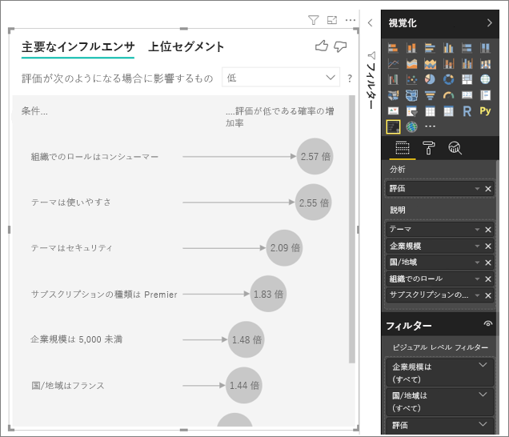
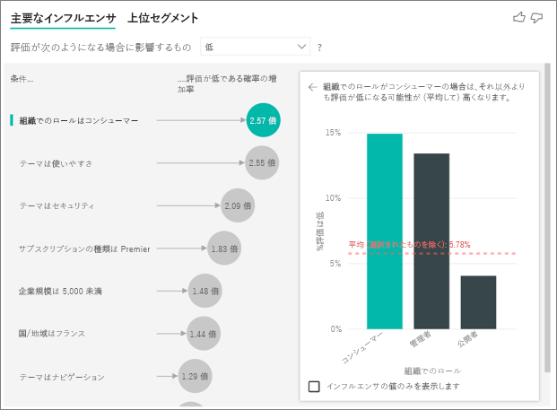
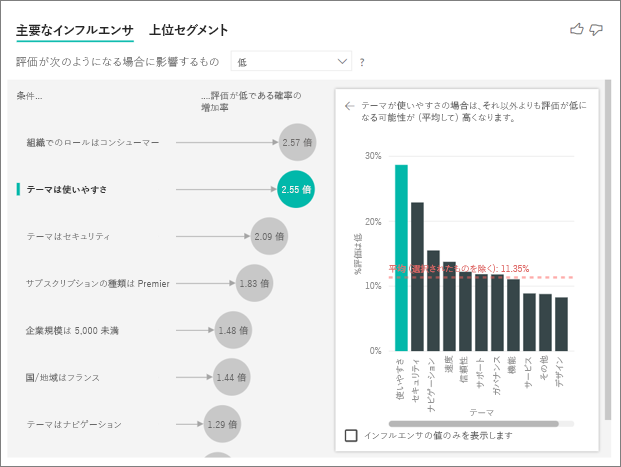
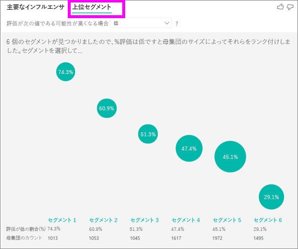

# 主要なインフルエンサの視覚エフェクト
Visual 主要な影響元を使用して、そのドライブに関心があるメトリックの要素を理解するのに役立ちます。 データを分析し、重要な要因にランクを付け、主要なインフルエンサとして表示します。 たとえば、コード チャーンのとも呼ばれますの従業員離職率はどのような影響を把握したいとします。 1 つの要因場合雇用契約の長さと従業員の年齢を他の要因があります。 
 
## 主要な影響元を使用する場合 
主要な影響元のビジュアルは、する場合に最適な選択肢を示します。 
- 分析対象のメトリックに影響を与える要因を参照してください。
- これらの要素の相対的な重要度と比較します。 短期契約は、長期契約の場合よりもチャーンへの影響が大きくなるかなど。 

## 主要なインフルエンサの要件 
分析するメトリックは数値またはカテゴリのいずれかのフィールドである必要があります (集計とメジャーはまだサポートされていません)。

## Visual 主要な影響元の機能

1. **タブ**:ビューを切り替える タブを選択します。 **主要な影響元**選択したメトリックの値に上位の貢献者を表示します。 **セグメントの上位**選択したメトリックの値に影響を与える最上位のセグメントを示します。 *セグメント* は、値の組み合わせで構成されます。 たとえば、1 つのセグメントには、20 年以上の顧客をされているし、西部地域に住んでいるコンシューマーがあります。 

2. **ドロップダウン ボックス**:調査中、メトリックの値。 この例で見てメトリック**評価**します。 選択した値が**低**します。

3. **といった言い換え**:左側のウィンドウでビジュアルを解釈するときに役立ちます。

4. **左側のウィンドウ**:左側のウィンドウには、1 つのビジュアルが含まれています。 この場合は、左側のウィンドウには、最上位の主要な影響元の一覧が表示されます。

5. **といった言い換え**:右側のウィンドウでビジュアルを解釈するときに役立ちます。

6. **右側のウィンドウ**:右側のウィンドウには、1 つのビジュアルが含まれています。 縦棒グラフがキー インフルエンサのすべての値を表示するこの例では、**テーマ**左側のウィンドウで選択されていた。 特定の値の**使いやすさ**左側のウィンドウが緑色で示されています。 他のすべての値**テーマ**黒で表示されます。

7. **平均線**:他のすべての可能な値の平均が計算**テーマ**を除く**ユーザビリティ**します。 したがって、計算は黒のすべての値に適用されています。 他の何パーセントが指示**テーマ**低い評価ができました。 つまり、顧客により評価が与えられた場合、その顧客についても説明します、理由または評価のテーマ。 一部のテーマは、使いやすさ、速度、およびセキュリティです。 

   **テーマは、使いやすさ**は左側のウィンドウで、ビジュアルに従っての低レベルの 2 番目に高いキー インフルエンサです。 その他のすべてのテーマとその貢献度の評価の平均かどうか**低**赤色で表示する結果が得られます。 すべての他のテーマの指定、11.35% のみがより大きい**ユーザビリティ**します。

8. **チェック ボックスをオン**:**な影響元の値のみが表示**します。

## 主要なインフルエンサの視覚エフェクトを作成する 
 
このビデオでは、主要な影響元のビジュアルを作成する方法について説明します。 次の手順を 1 つを作成します。 

<iframe width="560" height="315" src="https://www.youtube.com/embed/fDb5zZ3xmxU" frameborder="0" allow="accelerometer; autoplay; encrypted-media; gyroscope; picture-in-picture" allowfullscreen></iframe>

製品マネージャーは、お客様は、クラウド サービスに関するレビューを負の値のままに潜在顧客の要因を把握することを望んでいます。 理解するには、Power BI Desktop で[カスタマー フィードバック PBIX ファイル](https://github.com/Microsoft/powerbi-desktop-samples/blob/master/2019/customerfeedback.pbix)を開きます。 ダウンロードすることも、[カスタマー フィードバックの Excel ファイルで、Power BI サービスまたは Power BI Desktop](https://github.com/Microsoft/powerbi-desktop-samples/blob/master/2019/customerfeedback.xlsx)します。 

> [!NOTE]
> お客様からのフィードバックのデータセットは、の [Moro 副次的、2014] に基づいて S. Moro、P. Cortez、および P. 運輸です。 「をデータに基づくアプローチ銀行テレマーケティングの成功を予測する。」 *サポート システムを意思決定*Elsevier、62:22-31、2014 年 6 月。 

1. レポートを開くし、選択、**な影響元のキー**アイコン。 

    ![[視覚エフェクト] ウィンドウから、主要なインフルエンサのテンプレートを選択する](media/power-bi-visualization-influencers/power-bi-template-new.png)

2. 調査しメトリックを移動、**分析**フィールド。 **分析**フィールドには、カテゴリ、または、非連続的な変数のみがサポートされています。 顧客を促すものを表示する評価が低い、サービスの選択**Customer テーブル** > **評価**します。 
3. 移動のフィールドに影響を与えると思われる**評価**に、**説明**フィールド。 必要に応じて、同じ数のフィールドを移動できます。 この場合で開始します。
    - 国/地域 
    - 組織でのロール 
    - サブスクリプションの種類 
    - 企業規模 
    - テーマ 
1. 負の値の評価を集中選択**低**で、**する評価に影響** ボックスの一覧。  

    

分析対象フィールドのテーブル レベルで分析が実行されます。 この例では、**評価**メトリック。 このメトリックは、顧客のレベルで定義されます。 顧客ごとには、ハイ スコアまたは低いスコアのいずれかが割り当てられます。 説明のすべての要素は、ビジュアルの顧客レベルで定義する必要がありますそれらを利用します。 

前の例では、一対一または多対一リレーションシップのメトリックのすべての説明の要素があります。 この場合、各スコアには、関連付けられている 1 つのテーマがあります。 このテーマは、カスタマー レビューの主なテーマをしました。 同様に、1 つの国から 1 つのメンバーシップの種類があるし、組織内の 1 つのロールの実行、お客様が付属します。 説明の要素は、顧客の属性で、既にその変換は必要ありません。 ビジュアルにすぐに使用を行うことができます。 

チュートリアルの後半では、一対多のリレーションシップを持つより複雑な例を確認します。 その場合、まず集計顧客レベルまで分析を実行する前に列があります。 

メジャーと集計の説明の要素がテーブル レベルの評価も、使用、**分析**メトリック。 この記事の後半でいくつかの例が表示されます。 

## カテゴリの主要な影響元を解釈します。 
評価が低くの主要な影響元を見ていきましょう。 

### 低い評価が発生する可能性に影響を与える最上位の単一要素

この例では、組織が 3 つのロール: コンシューマー、管理者、およびパブリッシャーです。 コンシューマーは深刻度の低いに貢献する最上位要素です。 

正確には、コンシューマーは、負のスコア、サービスを提供する 2.57 倍可能性があります。 リスト グラフの主要な影響**組織でのロールはコンシューマー**左側の一覧の先頭にします。 選択して**組織でのロールはコンシューマー**、Power BI は、右側のウィンドウで追加の詳細を示しています。 深刻度の低いの公算に応じて各ロールの比較の効果が表示されます。
  
- コンシューマーの 14.93% は、低スコアを付けます。 
- 平均すると、その他のすべてのロールは、% の時間において 5.78 スコアの低い提供します。
- コンシューマーは、その他のすべてのロールと比較して、低スコアを付与する 2.57 倍可能性があります。 これは、緑色のバーを赤色の点線で割ることによって確認できます。 

### 低い評価が発生する可能性に影響する 2 つ目の 1 つの要素

Visual 主要な影響元を比較し、多くの異なる変数からの要因が順位付けされます。 2 番目のインフルエンサとは無関係**組織ロール**します。これは、一覧に 2 つ目の有力者を選択します。**テーマとは、使いやすさ**します。 

最も重要な 2 つ目の要素は、顧客のレビューのテーマに関連しています。 製品の使いやすさについてのコメントをお客様が 2.55 倍、信頼性、デザイン、または速度などの他のテーマにコメントするお客様と比較して、低スコアを付与する可能性があります。 

赤の点線で示されている、平均値は、ビジュアル間、11.34% 5.78% から変更します。 その他のすべての値の平均が基づいているために、平均は動的です。 最初のインフルエンサ平均は customer ロールを除外します。 2 番目のインフルエンサの使いやすさのテーマを除外します。 
 
選択、**な影響元の値のみが表示**影響力のある値のみを使用してフィルター処理する チェック ボックス。 この場合、ドライブのスコアの低いロールです。 12 個のテーマは、Power BI は、低い評価を駆動するテーマとして識別された 4 つに削減されます。 

## その他のビジュアルと対話します。 
 
スライサー、フィルター、または、キャンバス上の他のビジュアルを選択するたびに、visual 主要な影響元には、データの新しい部分に分析が再度実行します。 たとえば、移動**企業規模**レポートにスライサーとして使用します。 これを使用して、企業のお客様の主要な影響元が、一般的な母集団とは異なるかどうか。 Enterprise 会社の規模は、従業員の数が 50,000 より大きいです。
 
選択 **> 50,000**再実行して、分析、な影響元が変更されたことを確認できます。 大企業のお客様の評価が低くトップ インフルエンサはセキュリティに関連するテーマを持ちます。 大規模な顧客は不満が特定のセキュリティ機能がある場合に、さらに参照してください調査したい場合があります。 

## 継続的な主要な影響元を解釈します。 
 
ここまでは、さまざまなカテゴリ別フィールドを表示するビジュアルを使用する方法を確認した低評価に影響します。 ある年齢、高さ、および価格などの継続的な要因をすることも、**説明**フィールド。 動作を見てみましょうとき**在職**に customer テーブルから移動**説明**。 在職は顧客がどのくらいの時間を示していますが、サービスを使用します。 
 
在職が多いほど、低い評価を受信する危険性が向上します。 この傾向は、長期的な顧客が負のスコアを与える可能性の高いことをお勧めします。 この情報は興味深く、もう 1 つは、後でフォローすることもできます。 
 
たびに在職は 13.44 か月が、平均で低い評価が発生する可能性が増加する 1.23 時間ごと、視覚化を示しています。 この場合、13.44 か月は期間の標準偏差を示しています。 方法を次の情報を得ることが表示されたら在職在職の標準偏差は、標準の合計を増やす低い評価を受信する可能性に影響を与えます。 
 
右側のウィンドウで散布在職の各値に対して評価が低くの割合の平均値がプロットされます。 傾向線の傾きが強調表示されます。

## 主要な影響元としてメジャーと集計を解釈します。 
 
分析中説明要因として、メジャーと集計を使用できます。 たとえば、受信のサポート チケットの顧客の数またはオープンのチケットの平均実行時間が、スコアがどのような影響を与えるを表示する可能性があります。 
 
この場合、顧客サポート チケットの数が、これらは、スコアに影響かどうかを参照してください。 します。 表示するようになりました**サポート チケット ID**サポート チケットのテーブルから。 顧客が複数のサポート チケットを持てないために、顧客のレベルに ID を集計します。 レベルの粒度のすべてのドライバーを定義する必要がありますので、分析が レベルのカスタマイズで実行されるので、集計が重要です。 
 
Id の数を見てみましょう。 各顧客の行が、関連付けられている、サポート チケットの数。 この場合は、サポート チケットが増えると、数として評価される可能性は低 5.51 時間を移動します。 右側のビジュアルでは、サポート チケットの平均数を示しますによって異なる**評価**顧客レベルで評価される値。 

## 結果を解釈します。上位セグメント 
 
使用することができます、**な影響元のキー**  タブを個別に各要素を評価します。 使用できます、**セグメントを上位** タブの要因の組み合わせによるを分析して、メトリックの影響を確認します。 
 
最上位のセグメントは、最初に Power BI が検出されたすべてのセグメントの概要を説明します。 次の例では、6 つのセグメントが検出されたことを示します。 これらのセグメントは、セグメント内で評価が低くの割合で順位付けされます。 セグメント 1、たとえば、74.3% 顧客の評価が不足しているが。 バブルの位置が高いほど、低評価の割合が高くなっています。 バブルのサイズは、顧客の数が、セグメント内を表します。 

バブルを選択すると、そのセグメントの詳細が表示されます。 セグメントの 1 を選択した場合などが見つかったら比較的確立された顧客の構成されています。 29 か月以上のお客様はすでにまた複数の 4 つのサポート チケットがあります。 最後に、していない発行元、消費者または管理者のいずれかになるようです。 
 
このグループで、74.3% 以上の深刻度の低い説明しました。 顧客平均評価のためこのセグメントは低評価の大きな割合を占めています 11.7% の時間、低い説明しました。 高い 63 のパーセント ポイントになります。 セグメントが 1 では、母集団のアドレス指定可能な部分を表すため、データの約 2.2% も含まれます。 

## 数値データの使用

数値フィールドに移動する場合、**分析**フィールドがあるシナリオを処理する方法。 移動して、ビジュアルの動作を変更することができます、**書式設定ウィンドウ**との間の切り替え**カテゴリ Analysis 型**と**継続的な分析の種類**します。

A**カテゴリ Analysis 型**前述のように動作します。 たとえば場合は、1 から 10 までのアンケート スコアを見て、質問を入力できます 'アンケート スコア 1 に影響しますか?'

A**連続する種類の分析**質問を継続的なものに変更します。 上記の例では、新しい質問なります ' 拡大/縮小にアンケート スコアに影響' でしょうか。

この区別は、分析するフィールドに多数の一意の値がある場合に非常に便利です。 次の例で住宅価格に注目します。 '156,214 を家の価格影響しますか?' を要求する非常に意味がありません。 非常に固有と私たちはパターンを推測するための十分なデータにない可能性があります。

代わりに 'を増やす家の価格に影響' 依頼する可能性がありますか。 これにより、住宅価格を個別の値よりも範囲として扱うことができます。

## 結果を解釈します。主要なインフルエンサ 

このシナリオでは 'を増やす家の価格に影響' に注目します。 さまざまななどの家の価格に影響する要因の説明、見て**年が構築された**(年、家がビルドされた)、 **KitchenQual** (キッチン品質) と**YearRemodAdd**(年、家に組み込んで再モデル化されました)。 

次の例で、トップ インフルエンサされるすばらしいキッチン品質であるに注目します。 結果は、いくつかの重要な相違点のカテゴリのメトリックを分析しましたされたときに非常に似ています。

- 右側の棒グラフはパーセンテージではなく、平均で探しています。 そのため表示優れた台所に家の家の平均価格は (緑色バー) 優れたキッチン (点線) なしの家の家の平均価格と比較
- バブル パケットの数は、赤い点線と緑色のバーの違いですが、数値で表されます ($158。 49 K)、尤度ではなく (1.93 x)。 平均などの優れた台所の家はほぼ $160 K 優れた台所せず家よりも高価です。

影響を見て次の例では、継続的な要因 (年は家に組み込んで再モデル化された) は家の価格があります。 カテゴリ別のメトリックの継続的な影響元を分析する方法と比較して相違点は次のとおりです。

-   右側のウィンドウで"散布図"年を組み込んで再モデル化の個別の値の平均住宅価格がプロットされます。 
-   バブルの値、平均家の量によって、価格を増加を示しています (この場合は $2 87 k) ときに、家が年組み込んで再モデル化の増加の標準偏差 (ここで 20 年間) で。

最後に、メジャーの平均の年を対象にしている場合、家を構築しました。 ここで、分析は次のとおりです。

-   右側のウィンドウで、散布図は、テーブルの個別の値の平均住宅価格をプロットします。
-   バブルの値、平均家の量によって、価格を増加を示しています (この場合は $1 35 K) 平均年がその標準偏差 (ここでは 30 年間) ずつ増加する場合。

## 結果を解釈します。最上位のセグメント

上のセグメントの数値のターゲットは、家が平均価格のグループを表示が、全体的なデータセットでよりも高くなります。 たとえば、次のことを確認できます**セグメント 1**家から成る場所**GarageCars** (ガレージに収まる車の数) が 2 より大きいと**RoofStyle** Hip は。 これらの特性を持つ家がある平均価格の $355 K 180 K ドルであるデータの全体的な平均と比較します。

## 考慮事項とトラブルシューティング 
 
**プレビューの制限事項とは** 
 
Visual 主要な影響元は現在パブリック プレビューであり、いくつかの制限。 現在は利用できない機能があります。 
- 集計またはメジャーにはメトリックを分析します。
- Power BI Embedded でビジュアルを使用します。
- Power BI モバイル アプリでビジュアルを使用します。
- RLS をサポートします。
- 直接クエリのサポート。
- ライブ接続のサポート。

**な影響元のまたはセグメントが見つかりませんするエラーが表示されます。これはなぜですか。** 

このエラーは、内のフィールドが含まれているときに発生します。**説明**がな影響元が見つかりません。 
- 両方の分析されたメトリックが含まれている**分析**と**説明**します。 削除**説明**します。 
- 説明フィールドに含まれる、観測値がほとんどないカテゴリが多すぎます。 このような状況では、ハード要因が影響を判断するには、視覚化できます。 いくつかの観測値のみに基づいてを一般化するは困難です。 数値フィールドを分析する場合からの切り替えたい**カテゴリ Analysis**に**継続的な分析**で、**書式設定ウィンドウ**下、 **分析**カード。
- 説明、要因は、汎用化するための十分な観測が視覚エフェクトはレポートに意味のある、相関関係を検出しませんでした。
 
**分析メトリックは、分析を実行するための十分なデータがあるエラーが表示されます。これはなぜですか。** 

視覚エフェクトは、他のグループと比較して 1 つのグループのデータのパターンを調べることで機能します。 たとえば、高評価を行った顧客を比較低い評価を行った顧客を検索します。 モデル内のデータにいくつかの観測値のみがある場合は、パターンは見つけにくいです。 意味のあるな影響元を検索するためのデータが、視覚化、分析を実行するより多くのデータが必要であることを示します。 

選択された状態の観測を 100 以上であることをお勧めします。 この場合、状態は、顧客チャーンが。 比較のために使用する状態を少なくとも 10 個の観測も必要です。 この場合、比較結果の状態には、コード チャーンのないユーザー customers です。

数値フィールドを分析する場合からの切り替えたい**カテゴリ Analysis**に**継続的な分析**で、**書式設定ウィンドウ**下、 **分析**カード。

**エラーが表示する内のフィールド*説明*分析メトリックを含むテーブルに一意に関連がありません。これはなぜですか。**
 
分析対象フィールドのテーブル レベルで分析が実行されます。 たとえば、サービスのお客様からのフィードバックを分析する場合は、顧客が高評価または低い評価を指定するかどうかを示すテーブルがあります。 この場合は、顧客テーブル レベルで、分析が実行されています。 

メトリックを含むテーブルよりも詳細なレベルで定義されている関連テーブルがあれば、このエラーを参照してください。 次に例を示します。 
 
- サービスの評価が低くするための顧客を促すものを分析します。
- これらでは、レビューに影響を与えますかどうか、顧客が、サービスの使用は、デバイスを表示するには。
- 顧客は、複数の異なる方法でサービスを利用することができます。
- 次の例では、顧客 10000000 は、サービスと対話する、ブラウザーとタブレットの両方を使用します。

説明の要素としてデバイス列を使用しようとすると、次のエラーが表示されます。 

デバイスが、顧客のレベルで定義されていないために、このエラーが表示されます。 1 人の顧客は、複数のデバイスでサービスを使用できます。 この視覚エフェクトがパターンを見つけるには、デバイスは、顧客の属性である必要があります。 これには、ビジネスの理解に依存しているいくつかのソリューションがあります。 
 
- カウントするデバイスの概要作成を変更できます。 たとえば、デバイスの数では、顧客のスコアに影響する可能性がある場合は、count を使用します。 
- かどうか、顧客の評価に影響を特定のデバイスでサービスを使用してデバイスの列をピボットすることができます。
 
この例では、データが、モバイル ブラウザーの新しい列を作成し、タブレットにピボットされました。 これらの特定のデバイスを使えるようになりました**説明**。 さらにすべてのデバイスに影響力を持つ、し、ブラウザーが顧客のスコアに最も大きな影響します。

正確には、サービスを使用するブラウザーを使用していないお客様は、3.79 倍行う顧客よりも低いスコアを与える可能性があります。 Mobile 逆関数は、一覧の下部では、true です。 モバイル アプリを使用しているお客様がないお客様よりも低いスコアを付与する可能性が高くなります。 

**メジャーが、分析に含まれていないことの警告を表示します。これはなぜですか。** 

分析対象フィールドのテーブル レベルで分析が実行されます。 顧客離れを分析する場合、顧客がかどうかを頻繁かどうかを示すテーブルがあります。 この場合は、顧客テーブル レベルで、分析が実行されます。
 
メジャーと集計は、既定では、テーブル レベルで分析されます。 平均月間支出のメジャーがある場合は、顧客テーブル レベルで分析されるは。 

Customer テーブルには、一意の識別子が割り当てられていない、メジャーを評価することはできませんし、分析によって無視されます。 このような状況を回避するために、メトリックのテーブルには、一意識別子になっていることを確認します。 この場合、これは、顧客テーブルと一意識別子が顧客 id です。 Power Query を使用してインデックス列を追加する簡単です。
 
**分析、メトリックが 10 個を超える一意の値であると、この量が、分析の質に影響を与える警告を表示します。これはなぜですか。** 

AI の視覚エフェクトには、カテゴリ別フィールドおよび数値フィールドを分析できます。 カテゴリ別のフィールドの場合、例がありますチャーンはいまたは No 顧客満足度が高、中、低とします。 分析するカテゴリの数を増やすことがカテゴリごとの少ない観測を意味します。 このような状況により、データのパターンを検索する視覚エフェクトが困難です。 

カテゴリ データの場合と同じ分析を実行する、後者を数値フィールドのテキストのように扱うことの間の選択肢がある数値フィールドを分析するときに (**カテゴリ Analysis**)。 スイッチに、分析をすることが推奨値個別の多くがある場合**継続的な分析**ようにパターンと個別の値を扱うことはなく、数値が増加または減少からも推測できることを意味します。 切り替えることができます**カテゴリ Analysis**に**継続的な分析**で、**書式設定ウィンドウ**下、 **Analysis**カード。

強力な影響元を検索するには、1 つの単位のような値をグループ化することをお勧めします。 たとえば、価格のメトリックがある場合のような価格をグループ化を高、中、低のカテゴリと、個々 の価格ポイントを使用して、良い結果を取得する可能性が高いできました。 

**データを主要な影響元、必要があるように見える要因があるはありません。どうしてこのようになるのですか。**

次の例では、コンシューマーであるお客様は、評価が低く、14.93% が不足している評価をドライブします。 管理者ロールにも評価が低く、13.42% の大部分が人物が人員と見なされない。 

この決定の理由は、な影響元を見つけたときに、視覚エフェクトがそのデータ ポイントの数も考慮します。 次の例は、29,000 複数のコンシューマーと 2,900 約 10 倍少なくなります管理者がします。 それらの唯一の 390 深刻度の低い説明しました。 管理者の評価を得たのパターンが見つかったかどうか、機会だけあるかを判断するためのデータが、ビジュアルを検索します。 

**カテゴリの分析のための主要な影響元を計算するにはどうするでしょうか。**

AI の視覚エフェクトを使用して、バック グラウンドで[ML.NET](https://dotnet.microsoft.com/apps/machinelearning-ai/ml-dotnet)主要な影響元を計算するロジスティック回帰を実行します。 ロジスティック回帰は、さまざまなグループを互いに比較する統計モデルです。 

低い評価を促すものを表示する場合は、ロジスティック回帰、低スコアを付けた顧客の違いは、ハイ スコアを付けた顧客から見ていきます。 低い評価を提供しなかったお客様からの低い評価を行った顧客の違いを確認する、高、中立、低スコアなどの複数のカテゴリがある場合。 この場合は、低スコアを付けた顧客の違いを高く評価またはニュートラルの評価を行った顧客からでしょうか。 
 
ロジスティック回帰は、データのパターンを検索し、高い評価を行った顧客から低い評価を行った顧客が異なる場合がある方法を探します。 あります、たとえば、詳細のサポート チケットのお客様がほとんどまたはまったくサポート チケットの顧客よりも低い評価の割合が高いを与えること。
 
ロジスティック回帰は、データ ポイント数が存在するも考慮されます。 たとえば、管理者ロールを再生するお客様がそれに比例してより負のスコアを与えるいくつかの管理者のみがある場合は、この要素に影響と見なされますはありません。 この決定には、使用パターンを推測するための十分なデータ ポイントがないためが行われます。 Wald 氏がテストと呼ばれる統計テストを使用して、係数は人物と見なされるかどうかを決定します。 視覚エフェクトでは 0.05 の p 値を使用して、しきい値を判断します。 

**数値の分析のための主要な影響元を計算するにはどうするでしょうか。**

AI の視覚エフェクトを使用して、バック グラウンドで[ML.NET](https://dotnet.microsoft.com/apps/machinelearning-ai/ml-dotnet)主要な影響元を計算する線形回帰を実行します。 線形回帰は、統計を分析するフィールドの結果がどのように変化するかになりますが、説明の要因に基づくモデルです。

たとえば、住宅価格を分析している、線形回帰は、優れたキッチンが家の価格に与える影響のことになります。 優れた台所の家は一般に、優れた台所せず家と比較して下位または上位の住宅価格をありますか。

線形回帰では、データ ポイントの数も考慮されます。 たとえば、テニス裁判所で家がより高い価格を持つテニス裁判所がある非常にいくつかの家がある場合は、この係数は影響は考慮されません。 この決定には、使用パターンを推測するための十分なデータ ポイントがないためが行われます。 Wald 氏がテストと呼ばれる統計テストを使用して、係数は人物と見なされるかどうかを決定します。 視覚エフェクトでは 0.05 の p 値を使用して、しきい値を判断します。 

**セグメントはどのように計算するのですか。**

AI の視覚エフェクトを使用して、バック グラウンドで[ML.NET](https://dotnet.microsoft.com/apps/machinelearning-ai/ml-dotnet)興味深いサブグループを検索するデシジョン ツリーを実行します。 デシジョン ツリーでは、最終的にデータ ポイントのサブグループに関心があるメトリックで比較的高いをします。 これは、評価が低い顧客または高価格が家です。

どの要因により、最適な理由と各説明の要素は、デシジョン ツリー*分割*します。 たとえば、大企業のお客様のみを含めるデータをフィルター処理する場合を分割する場合は深刻度の低いと、高い評価を行った顧客でしょうか。 または、おそらくセキュリティについてのコメントを顧客のみを含めるデータをフィルター処理する方がでしょうか。 

デシジョン ツリーは、分割後、データのサブグループを受け取りし、そのデータの [次へ] の最適な分割を決定します。 この場合、サブグループは、セキュリティに対するコメントのお客様が。 それぞれの分割後にも考慮から、パターンまたはデータと実際のセグメントではないに異常があるかどうかを推測するのに十分な担当者にするには、このグループの場合は、十分なデータ ポイントがあるかどうか。 P の値は 0.05 の分割条件の統計的有意性を確認するもう 1 つの統計テストが適用されます。 

デシジョン ツリーの実行が完了した後、セキュリティ コメントや大企業は、すべての分割の受け取りを Power BI のフィルターを作成します。 このフィルターの組み合わせは、視覚エフェクトのセグメントとしてパッケージ化されます。 
 
**理由は特定の要因になるな影響元かな影響元をされている他のフィールドに移動すると停止、*説明*フィールドでしょうか。**

視覚エフェクトでは、説明要因をすべてまとめて評価します。 いませんが他の要因と見なされるとが要因では、単独で人物があります。 家の価格が高く、ベッドルームと説明の要因と家のサイズを促すものを分析するとします。

- 自体は、複数ベッドルームにドライバーが高く、住宅価格の可能性があります。
- などの家サイズ分析では、一定のサイズの家に部屋はどう見てようになりましたを意味します。
- 家のサイズは固定で 1,500 の平方フィート、ベッドルーム数で継続的な増加の家の価格が大幅に増加する可能性はありません。 
- ベッドルームを家のサイズのものと見なされました前に、と、要素の重要なことができない可能性があります。 

## 次の手順
- [Power BI の複合グラフ](power-bi-visualization-combo-chart.md)
- [Power BI での視覚化の種類](power-bi-visualization-types-for-reports-and-q-and-a.md)
