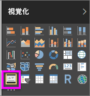
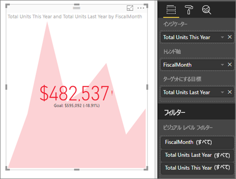

# KPI ビジュアル
主要業績評価指標 (KPI) は、測定可能な目標に対する進捗状況を視覚的に伝える方法の 1 つです。 KPI の詳細については、[Microsoft Developer Network](https://msdn.microsoft.com/library/hh272050) を参照してください。

Power BI にサインアップしていない場合は、[無料の試用版にサインアップ](https://app.powerbi.com/signupredirect?pbi_source=web)してください。

## 前提条件
* [Power BI Desktop - 無料](https://powerbi.microsoft.com/en-us/get-started/)
* [小売りの分析のサンプル PBIX ファイル](http://download.microsoft.com/download/9/6/D/96DDC2FF-2568-491D-AAFA-AFDD6F763AE3/Retail%20Analysis%20Sample%20PBIX.pbix)

## KPI を使用する場合
KPI は、次のような場合に最適です。

* 進行状況 (目標より進んでいるか遅れているか) を測定する
* 目標までの距離 (どの程度進んで、または遅れているか) を測定する   

## KPI の要件
主要業績評価指標 (KPI) は特定のメジャーに基づいており、現在の値と、定義された対象に対するメトリックの状態を評価するのに役立つよう設計されています。 したがって、KPI ビジュアルには、値に対して評価される*基本*メジャー、*ターゲット*となるメジャーまたは値、および*しきい値*または*目標*が必要です。

現時点では、KPI データセットには KPI の目標値が含まれている必要があります。 データセットに目標が含まれていない場合、目標を作成できます。目標が含まれる Excel シートをデータ モデルまたは PBIX ファイルに追加します。

## KPI を作成する方法
理解するには、「[小売りの分析のサンプルの .PBIX ファイル](http://download.microsoft.com/download/9/6/D/96DDC2FF-2568-491D-AAFA-AFDD6F763AE3/Retail%20Analysis%20Sample%20PBIX.pbix)」を Power BI Desktop で開きます。 売上目標に対する進行状況を測定する KPI を作成します。

Will が単一のメトリック ビジュアル、ゲージ、カード、KPI を作成するところをご覧ください。

<iframe width="560" height="315" src="https://www.youtube.com/embed/xmja6EpqaO0?list=PL1N57mwBHtN0JFoKSR0n-tBkUJHeMP2cP" frameborder="0" allowfullscreen></iframe>

1. レポート ビューでレポートを開き、黄色のタブを選択して新しいページを追加します。    
2. [フィールド] ウィンドウで、**[Sales]\(売上\)、[Total Units This Year]\(今年の合計単位\)** の順に選択します。  これがインジケーターになります。
3. **[時間] > [FiscalMonth]** を追加します。  これはトレンドを表します。
4. 重要:**FiscalMonth** 単位でグラフを並べ替えます。 ビジュアルを KPI に変換すると、並べ替えオプションはなくなります。

    
5. [視覚化] ウィンドウから [KPI] アイコンを選択して、ビジュアルを KPI に変換します。
   
    
6. 目標を追加します。 昨年の売上を目標として追加します。 **\[Total Units Last Year] \(昨年の合計単位)** を **[ターゲットにする目標]** にドラッグします。
   
    
7. 必要に応じて、ペイント ローラー アイコンを選んで [形式] ウィンドウを開きます。
   
   * **インジケーター** - インジケーターの表示単位と小数点以下の表示桁数を制御します。
   * **トレンド軸** - **[オン]** に設定すると、トレンド軸が KPI ビジュアルの背景として表示されます。  
   * **目標** - **[オン]** に設定すると、ビジュアルに目標、および目標からの距離がパーセンテージとして表示されます。
   * **[色の設定] > [方向]** - 一部の KPI では高い値が "*良好な*" 値と見なされ、別の KPI では低い値が "*良好な*" 値と見なされます。 たとえば、前者の例としては収益があり、後者の例としては待機時間があります。 通常、収益では高い値が良好であり、待機時間の高い値は逆の意味です。 **[高いと良好]** を選び、必要に応じて色の設定を変更します。

KPI は、Power BI サービスとモバイル デバイスでも使用できます。これにより、常にビジネスの心臓部とつながっていることができます。

## 考慮事項とトラブルシューティング
* KPI が上記のようにならない場合、会計月で並べ替える必要がある場合もあります。 KPI には並べ替えオプションがないため、視覚エフェクトを KPI に変換する*前*に会計月単位で並べ替える必要があります。

## 次の手順

[Power BI の基本のマップ](power-bi-map-tips-and-tricks.md)

[Power BI での視覚化の種類](power-bi-visualization-types-for-reports-and-q-and-a.md)