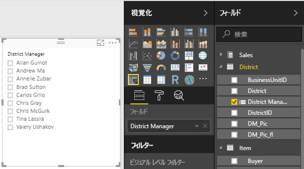
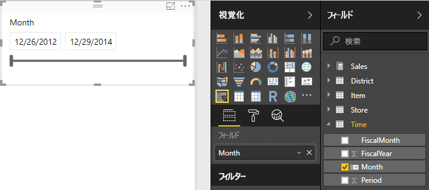
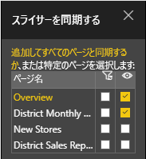
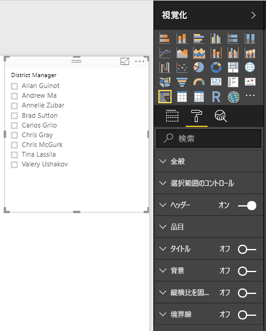
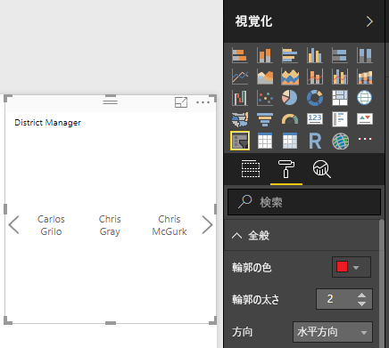
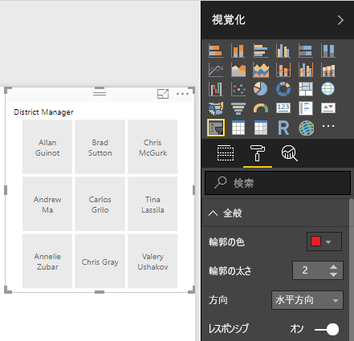
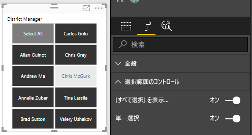
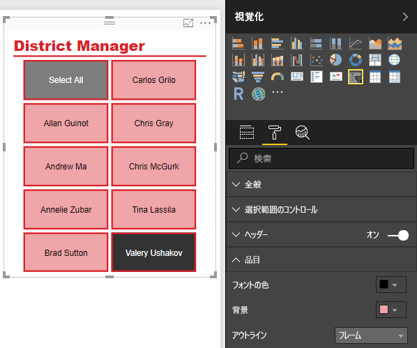

# Power BI のスライサー
レポートを見る人が売り上げ全体の指標を調べることができるだけでなく、個々の地域マネージャーや異なる期間の実績に注目することもできるようにしたい場合があります。 個別レポートや比較グラフを作成してもかまいませんが、スライサーを使用することもできます。 スライサーはフィルターの代わりになる手段であり、レポートの他の視覚化に表示されるデータセットの一部を絞り込むことができます。 

このチュートリアルでは、無料の[小売りの分析のサンプル](../sample-retail-analysis.md)を使って、リスト スライサーと日付範囲スライサーを作成、書式設定、使用する手順について説明します。 スライサーを書式設定して使用する方法がわかります。 

## スライサーを使用する場合
スライサーは、次のような場合に最適です。

* レポート キャンバスによく使うフィルターまたは重要なフィルターを表示してアクセスしやすくする。
* ドロップダウン リストを開くことなく、現在のフィルターされた状態を簡単に表示する。 
* データ テーブルで不要な非表示の列でフィルター処理する。
* 重要なビジュアルの隣にスライサーを配置することにより、レポートを絞り込む。

Power BI のスライサーには次の制限があります。

- スライスは入力フィールドをサポートしません。
- スライサーはダッシュボードに固定表示することはできません。
- スライサーはドリルダウンでサポートされていません。
- スライサーは、ビジュアル レベル フィルターをサポートしていません。

## スライサーを作成する

新しいスライサーを作成するには、スライサー アイコンを選んでから、フィルターを適用するデータ フィールドを選びます (または、データ フィールドを **[視覚化]** ウィンドウの **[フィールド]** ボックスにドラッグします)。または、先にデータ フィールドを選ぶかドラッグして視覚エフェクトを作成した後、スライサー アイコンを選んで視覚エフェクトをスライサーに変更することもできます。 データ型が異なると異なる種類のスライサーが作成され、効果とオプションも異なります。 

初めてレポートを変更する際は、**[既定値にリセット]** のボタンが点灯します。 これは、元のレポート設定に変更を加えたことを知らせるためのものです。 レポートから移動する場合、その変更内容は保存 (保持) されます。 レポートに戻ったときに、レポートを再スライスする必要はありません。  ただし、レポートを作成者の既定の設定にリセットする場合は、上部のメニューバーから **[既定値にリセット]** ボタンを選択します。

> [!NOTE]
> **[既定値にリセット]** ボタンが無効のままの場合、レポート作成者がレポートの機能を無効にしているか、レポートにカスタム ビジュアルが含まれていることを意味します。 ボタンの上にマウスを置くだけで、説明を示すヒントが表示されます。 

**District Manager でデータをフィルター処理する新しいスライサーを作成するには**

1. Power BI Desktop または Power BI サービスで、[小売りの分析のサンプル](../sample-retail-analysis.md)を開きます (Power BI サービスの場合は、左上の **[レポートの編集]** を選びます)。
2. **[Overview]** ページを開き、キャンバスで何も選択されていない状態で、**[視覚化]** ウィンドウの **[スライサー]** アイコン ![[スライサー] アイコン](./media/power-bi-visualization-slicers/slicer-icon.png) を選択して新しいスライサーを作成します。 
3. 新しいスライサーを選択し、**[フィールド]** ウィンドウの **[District]** で **[District Manager]** を選択して、スライサーを設定します。 新しいスライサーは、名の前に選択ボックスの付いたリストです。 
    
    
    
4. キャンバス上のスライサーと他の要素をサイズ変更およびドラッグして、スライサーのスペースを確保します。 スライサーを小さくしすぎると、スライサーの項目が切れてしまうので注意してください。 
5. スライサーの名前を選択し、ページ上の他の視覚エフェクトに与える影響を確認します。 名前を再び選んで選択を解除した後、**Ctrl** キーを押しながらの複数の名前を選びます。 すべての名前を選ぶと、何も選ばない場合と同じ効果になります。 

>[!TIP]
>リスト スライサーの項目は、既定では英数字の昇順で並べられます。 並べ替え順序を逆の降順にするには、スライサーの右上隅にある省略記号 **[...]** を選択し、ドロップダウン リストで **[District Manager で並べ替え]** を選択します。 

**日付範囲でデータをフィルター処理する新しいスライサーを作成するには**

1. キャンバスを何も選択されていない状態にして、[フィールド] ウィンドウの **[Time]** ドロップダウンの **[Month]** (Power BI サービスの場合は **[Date]**) を [視覚化] ウィンドウの **[値]** ボックスにドラッグして、新しい視覚エフェクトを作成します。
2. 新しい視覚エフェクトを選択した状態で、**[スライサー]** アイコンを選択して、新しい視覚エフェクトをスライサーに変換します。 このスライサーは、日付範囲が設定されたスライダー コントロールです。
    
    
    
4. キャンバス上のスライサーと他の要素をサイズ変更およびドラッグして、スライサーのスペースを確保します。 スライサーのサイズに合わせてスライダーのサイズも変化しますが、スライサーを小さくしすぎるとスライダーが消えて日付の表示が切れるので注意してください。 
4. 異なる日付範囲を選択するには、スライダーを使うか、日付フィールドを選択して値を入力するか、カレンダーを表示して正確に選択します。 ページ上の他の視覚化に対する影響を確認してください。
    
    >[!NOTE]
    >データ型が数値および日付/時刻の場合は、既定で範囲スライダーのスライサーが生成されます。 2018年 2 月の Power BI の更新以降、整数データ型の範囲スライダーは整数値にスナップされ、小数点以下は表示されなくなっています。 

>[!TIP]
>**[Month]** データ フィールドでは、既定で **[指定の値の間]** 範囲スライダー スライサーの種類が生成されますが、他のスライサーの種類および選択オプションに変更できます。 スライサーの種類を変更するには、スライサーを選択した状態で、スライサーの右上隅の領域をマウスでポイントし、表示されるカレットをドロップダウンして、**[一覧]** や **[次の値より前]** などの他のいずれかのオプションを選択します。 スライサーの外観と選択オプションが変化することを確認してください。 

日付と数値の範囲スライサーの作成について詳しくは、次のビデオおよび「[Power BI Desktop で数値範囲スライサーを使用する](../desktop-slicer-numeric-range.md)」をご覧ください。
<iframe width="560" height="315" src="https://www.youtube.com/embed/zIZPA0UrJyA" frameborder="0" allowfullscreen></iframe> 

## スライサーによって影響を受けるページ ビジュアルを制御する
既定では、レポート ページ上のスライサーは、他のスライサーも含めて、そのページ上にある他のすべての視覚エフェクトに影響します。 作成したリスト スライサーと日付スライダーで値を選択して、他の視覚エフェクトへの影響を確認してください。 フィルター選択されるデータは、両方のスライサーで選択した値の積集合です。 

**[ビジュアル対話]** を使うと、一部のページ視覚エフェクトを他のスライサーの影響から除外できます。 **[Overview]** ページの [Total Sales Variance by FiscalMonth and District Manager] グラフには、月ごとの District Manager の全体的な比較データが表示されており、これは常に表示しておく必要があります。 **[ビジュアル対話]** を使用して、スライサーを選択してもこのグラフがフィルター処理されないようにすることができます。 

1. [District Manager] スライサーを選択した状態で、次のようにします。
    - Power BI Desktop では、**[ビジュアル ツール]** の **[書式]** を選択して **[相互作用を編集]** を選択します。
    - Power BI サービスでは、メニュー バーの **[ビジュアル対話]** を選択して **[相互作用を編集]** をオンにします。 
   
   ページの他のすべてのビジュアルの上に、フィルター コントロール  が表示されます。 最初は、すべてで **[フィルター]** アイコンが選択されています。
   
2. **[Total Sales Variance by FiscalMonth and District Manager]** グラフの上の **[なし]** アイコンを選択して、スライサーのフィルター処理を停止します。 
3. **[Month]** スライサーを選択し、**[Total Sales Variance by FiscalMonth and District Manager]** グラフの上の **[なし]** アイコンを再び選択して、このスライサーのフィルター処理を停止します。 これで、スライサーで名前や日付範囲を選択しても、[Total Sales Variance by FiscalMonth and District Manager] グラフは変更されません。 

相互作用の編集については、「[Power BI レポートでの視覚化の相互作用](../consumer/end-user-interactions.md)」をご覧ください。

## 他のページでスライサーを同期して使用する
Power BI の 2018 年 2 月更新以降では、スライサーを同期し、レポートの任意のページまたはすべてのページで使用できます。 

現在のレポートでは、**[District Monthly Sales]** ページにも **[District Manager]** スライサーがありますが、**[Overview]** ページで作成したスライサーとは同期していません (2 つのスライサーで異なる項目を選択できます)。 **[New Stores]** ページには、**[Store Name]** スライサーだけがあります。 新しい **[District Manager]** スライサーをこれらのページと同期して、いずれかのページでのスライサーを選択すると、3 つのページすべての視覚エフェクトに反映されるようにすることができます。 

1. **[ビュー]** メニューで、**[スライサーの同期]** (Power BI Desktop の場合) または **[スライサー ウィンドウの同期]** (Power BI サービスの場合) を選択します。 **[スライサーの同期]** ウィンドウが表示されます。 
2. **[Overview]** ページで、**[District Manager]** スライサーを選択します。 **[District Monthly Sales]** ページにも[ District Manager] スライサーがあるので、このページの **[表示]** 列は既に選択されていますが、**[同期]** 列は選択されていません。 
    
    
    
3. **[同期]** 列で **[New Stores]** ページと **[District Monthly Sales]** ページを選択し、**[Overview]** のスライサーをこれらのページと同期します。 
    
3. **[表示]** 列では、**[New Stores]** ページを選択し、**[District Monthly Sales]** ページは選択したままにします。 
4. スライサーの同期の効果を観察し、他のページで表示されるようにします。 **[District Monthly Sales]** ページの **[District Manager]** スライサーには、**[Overview]** ページのスライサーと同じ選択が表示されるようになります。 **[New Stores]** ページでは、**[District Manager]** スライサーでの選択により、**[Store Name]** スライサーで使用可能な選択が影響を受けます。 
    
    >[!TIP]
    >同期されたページのスライサーは、最初は元のページと同じサイズおよび位置に表示されますが、各ページで個別に、同期されたスライサーを移動したり、サイズや書式設定を変更したりできます。 

>[!NOTE]
>他のページへのスライサーの同期だけを設定して、表示を設定しない場合でも、他のページで行われたスライサーの選択により、そのページのデータがフィルター処理されます。
 
## スライサーの書式設定
スライサーの種類に応じて、異なる書式設定オプションを使用できます。 **横**方向、**レスポンシブ** レイアウト、および**項目**の色分けを使用して、標準の一覧項目ではなくボタンやタイルを生成し、異なる画面サイズやレイアウトに合わせてスライサー項目のサイズが変化するようにできます。  

1. いずれかのページで **[District Manager]** スライサーを選択した状態で、**[視覚化]** ウィンドウで **[書式]** アイコン  を選択して書式設定コントロールを表示します。 
    
    
    
2. 各カテゴリの横にあるドロップダウン矢印を選択してオプションを表示し、編集します。 

### [全般] オプション
1. **[輪郭の色]** で赤を選び、**[輪郭の太さ]** を "2" に変更します。 ヘッダーと項目の輪郭または下線 (有効になっている場合) の色と太さが設定されます。 
2. **[方向]** の既定値は **[縦]** です。 **[横]** を選択すると、タイルやボタンが横方向に配置され、スライサーに収まらない項目にアクセスするためのスクロール矢印が付いた、スライサーが作成されます。
    
    
    
3. ViewScreen とスライサーのサイズに応じて、スライサーの項目のサイズと配置を変更するには、**[レスポンシブ]** レイアウトをオンにします。 リスト スライサーの場合、レスポンシブ レイアウトは横方向でのみ使用でき、小さい画面で項目が切り取られるのを防ぎます。 範囲スライダー スライサーのレスポンシブ書式設定では、スライダーのスタイルが変更されて、より柔軟なサイズ変更を提供します。 どちらの種類のスライサーも、非常に小さいサイズではフィルター アイコンになります。 
    
    
    
    >[!NOTE]
    >レスポンシブ レイアウトの変更により、ユーザーが設定した特定の見出しと項目の書式設定がオーバーライドされることがあります。 
    
4. **[X 方向の位置]**、**[X 方向の位置]**、**[幅]**、**[高さ]** でスライサーの位置とサイズを数値で指定するか、キャンバス上で直接スライサーを移動およびサイズ変更します。 項目のサイズと配置を変えてテストし、それに従ってレスポンシブ書式設定がどのように変化するかを確認してください。  

    

横方向およびレスポンシブのレイアウトについては、「[Power BI でサイズを変更することが可能なレスポンシブ スライサーの作成](../power-bi-slicer-filter-responsive.md)」をご覧ください。

### [選択範囲のコントロール] のオプション (リスト スライサーのみ)
1. **[[すべて選択] オプションを表示する]** は既定では **[オフ]** になっています。 すべての項目の選択と選択解除を切り替える **[すべて選択]** 項目をスライサーに追加するには、**[オン]** にします。 すべての項目を選択してから 1 つの項目をクリックまたはタップして選択を解除すると、"is-not" タイプのフィルターを使用できます。 
    
    
    
2. **[単一選択]** は既定では **[オン]** になっています。 各項目をクリックまたはタップするとその項目が選択され、**Ctrl** キーを押しながらクリックまたはタップすると複数の項目を選択できます。 **Ctrl** キーを押さなくても複数の項目を選択できるようにするには、**[単一選択]** を **[オフ]** にします。 各項目を再度クリックまたはタップすると選択が解除されます。 

### [ヘッダー] のオプション
**[ヘッダー]** は既定では **[オン]** になっており、スライサーの上部にデータ フィールドの名前が表示されます。 
1. ヘッダー テキストの書式を設定し、**[フォントの色]** を赤、**[テキスト サイズ]** を 14 pt、**[フォント ファミリ]** を Arial Black にします。 
2. **[全般]** オプションで設定したサイズと色で下線を生成するには、**[アウトライン]** で **[下端のみ]** を選択します。 

### [項目] のオプション (リスト スライサーのみ)
1. 項目のテキストと背景の書式を設定し、**[フォントの色]** を黒、**[背景]** を薄い赤、**[テキスト サイズ]** を 10 pt、**[フォント ファミリ]** を Arial にします。 
2. **[全般]** オプションで設定したサイズと色で各項目を境界線で囲むには、**[アウトライン]** で **[フレーム]** を選択します。 
    
    
    
    >[!TIP]
    >- **[方向] > [横]** の場合、選択されていない項目は指定したテキスト色と背景色で表示され、選択された項目はシステムの既定値 (通常は黒い背景と白いテキスト) を使用します。
    >- **[方向] > [縦]** の場合、項目は常に指定した色で表示され、選択ボックスはオンの場合は常に黒で表示されます。 

### 日付/数値入力とスライダーのオプション (範囲スライダー スライサーのみ)
- 日付/数値入力のオプションは、**[アウトライン]** または下線がないことを除けば、リスト スライサーの **[項目]** オプションと同じです。
- [スライダー] オプションでは、範囲スライダーの色を設定でき、スライダーを **[オフ]** にすると数値入力だけが表示されます。

### その他の書式設定オプション
その他の書式設定オプションは既定ではオフです。 **オン**にすると次のようになります。 
- **[タイトル]**: スライサーの上部に (ヘッダーとは別に) タイトルを追加して書式設定します。 
- **[背景]**: スライサー全体に背景色を追加し、透過性を設定します。
- **[縦横比を固定する]**: スライサーのサイズを変更するときに形状を維持します。
- **[罫線]**: スライサーの周囲に 1 ピクセルの枠線を追加し、その色を設定します (このスライサーの枠線は、[全般] の [アウトライン] の設定とは別であり影響を受けません)。 

## 次の手順
[無料試用版にサインアップ](https://powerbi.microsoft.com/get-started/)

Power BI を改善する方法について、ご意見がありましたら、 [コメントを送信](https://ideas.powerbi.com/forums/265200-power-bi-ideas)してください。

他にわからないことがある場合は、 [Power BI コミュニティを利用してください](http://community.powerbi.com/)。

[視覚化をレポートに追加する](power-bi-report-add-visualizations-i.md)

[Power BI での視覚化の種類](power-bi-visualization-types-for-reports-and-q-and-a.md)

[Power BI - 基本的な概念](../consumer/end-user-basic-concepts.md)

