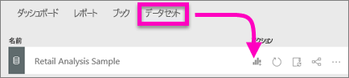
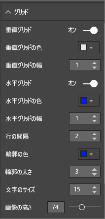
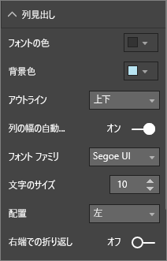
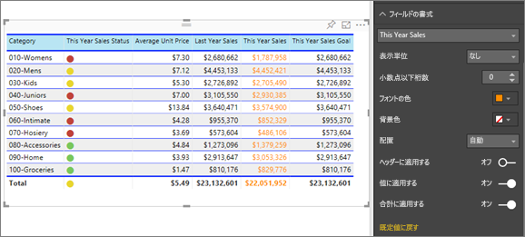
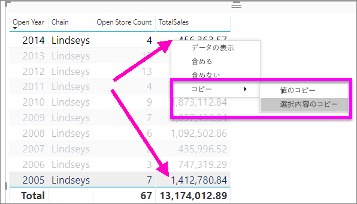

# Power BI のレポートとダッシュボードのテーブル
テーブルは、関連性のあるデータが論理的な一連の行と列に格納されたグリッドです。 ヘッダーと合計行が含まれる場合もあります。 テーブルは、1 つのカテゴリの多くの値を調べるときの定量的な比較で役に立ちます。 たとえば、次の表には**カテゴリ**に対する 5 つの異なるメジャーが表示されています。

レポート内でテーブルを作成し、そのテーブル内の要素を、同じレポート ページ上の他のビジュアルを使用してクロス強調表示します。  また、行、列、さらには個々のセルを選択して、クロス強調表示することができます。 個々のセルおよび複数のセルの選択範囲をコピーして他のアプリケーションに貼り付けることができます。

## テーブルを使う場合
テーブルは、次のような場合に最適です。

* 詳細なデータと正確な値を表示および比較する場合 (視覚的な表現ではなく)
* 表形式でデータを表示する場合
* カテゴリ別に数値データを表示する場合   

> [!NOTE]
> テーブルの値が多すぎる場合は、マトリックスに変換したり、ドリルダウンを使うことを検討してください。 テーブルで表示されるデータ ポイントの最大数は 3,500 です。

## 前提条件
- Power BI サービスまたは Power BI Desktop
- 小売りの分析のサンプル

## テーブルを作成する
上の図のようなテーブルを作成し、品目カテゴリ別に売上高の値を表示するテーブルを作成します。 先に進むには、Power BI サービスにサインインして、 **[データの取得] \> [サンプル] \> [小売りの分析のサンプル] > [接続]** の順に選択し、 **[ダッシュボードに移動]** を選びます。 視覚エフェクトを作成するには、データセットとレポートへの編集アクセス許可が必要です。 Power BI のサンプルはすべて編集できます。 他のユーザーから共有を受けているレポートの場合は、レポートで視覚エフェクトを作成できません。

1. 左側のナビゲーション ウィンドウから **[ワークスペース] > [マイ ワークスペース]** を選択します。    
2. [データセット] タブを選択し、追加した小売りの分析のサンプル データセットまでスクロールします。  **レポートの作成**アイコンを選択します。

    
2. レポート エディターで **[項目]**  >  **[カテゴリ]** を選択します。  すべてのカテゴリを一覧表示するテーブルが自動的に作成されます。

    
3. **[Sales] > [Average Unit Price]** 、 **[Sales] > [Last Year Sales]** 、および **[Sales] > [This Year Sales]** を選び、3 つのオプション ([Value]、[Goal]、[Status]) をすべて選びます。   
4. 視覚化ウィンドウで **[値]** ウェルを探し、グラフの列の順序がこのページの最初の図と一致するまで、値をドラッグ アンド ドロップします。  [値] ウェルは次のように表示されています。

    ![[値] ウェル](media/power-bi-visualization-tables/power-bi-table2.png)
5. ピン アイコンを選んで、ダッシュボードにテーブルをピン留めします。  

     

## テーブルの書式を設定する
テーブルの書式を設定する方法は実にさまざまな方法があるため、ここではごく一部を紹介します。 他の書式設定オプションの詳細については、[書式設定] ウィンドウ (ペイント ローラー アイコン ) を開いて確認することをお勧めします。

* テーブル グリッドの書式を設定してみましょう。 ここでは、青色の垂直グリッドを追加し、行にスペースを追加し、アウトラインとテキスト サイズを少し増やしました。

    

    
* 列ヘッダーについては、背景色を変更し、アウトラインを追加し、フォント サイズを増やしました。 

    

    

* 個々の列および列ヘッダーに書式設定を適用することもできます。 最初に **[フィールドの書式]** を展開し、ドロップダウン リストから書式を設定する列を選びます。 列の値に応じて、[フィールドの書式] では表示単位、フォントの色、小数点以下の桁数、背景、配置などを設定できます。 設定を調整した後は、同じ設定をヘッダーや合計行にも適用するかどうかを決定します。

    

* その他の書式をいくつか設定すると、次のようなテーブルが完成します。 書式設定オプションは多数あるため、使い方を学ぶには、既定の書式設定から始めて、[書式設定] ウィンドウ  を開き、調べてみることをお勧めします。 

    

### 条件付き書式設定
書式設定の一種として *条件付き書式設定* があり、Power BI サービスまたは Power BI Desktop の **[値]** のフィールドだけでなく、 **[視覚化]** ウィンドウにも適用されます。 

テーブルで条件付き書式を使用すると、グラデーション カラーの使用など、セルの値に基づいてカスタマイズされたセルの背景色とフォントの色を指定できます。 

1. Power BI サービスまたは Power BI Desktop の **[視覚化]** ウィンドウで、書式設定する **[値]** ウェルの値の横にある下向きの矢印を選択します (または、フィールドを右クリックします)。 条件付き書式を管理できるのは、 **[フィールド]** ウェルの **[値]** 領域のフィールドだけです。

    ![[バックグラウンドのカラー スケール] へのパス](media/power-bi-visualization-tables/power-bi-conditional-formatting-background.png)
2. **[バックグラウンドのカラー スケール]** を選びます。 表示されるダイアログ ボックスでは、色や、*最小*と*最大*の値を構成できます。 **[左右逆方向]** ボックスをオンにした場合は、オプションの*中央*値も構成できます。

    ![[バックグラウンドのカラー スケール] 画面](media/power-bi-visualization-tables/power-bi-conditional-formatting-background2.png)

    カスタムの書式設定をいくつか [Average Unit Price] 値に適用してみましょう。 **[左右逆方向]** を選択し、いくつか色を追加し、 **[OK]** を選択します。 

    
3. 正と負の値両方があるテーブルに新しいフィールドを追加します。  **[Sales]、[Total Sales Variance]** の順に選択します。 

    
4. **[Total Sales Variance]** の横にある下向きの矢印を選択して、データ バーの条件付き書式を追加し、 **[条件付き書式]、[データ バー]** の順に選択します。

    ![[データ バー] を選択するパス](media/power-bi-visualization-tables/power-bi-conditional-formatting-data-bars.png)
5. 表示されるダイアログで **[正のバー]** と **[負のバー]** の色を設定し、 **[バーのみを表示]** をオンにします。また、必要に応じて他の変更を行います。

    ![[バーのみを表示] のチェックマーク](media/power-bi-visualization-tables/power-bi-data-bars.png)

    **[OK]** を選択すると、データ バーによってテーブル内の数値が置き換えられ、スキャンしやすくなります。

    
6. 視覚化から条件付き書式を削除するには、再度フィールドを右クリックし、 **[条件付き書式の削除]** を選択します。

> [!TIP]
> 条件付き書式は、[書式設定] ウィンドウ (ペイントローラー アイコン) からも使用できます。 値を選択して書式を設定し、 **[カラー スケール]** または **[データ バー]** を **[オン]** に設定して既定の設定を適用するか、設定をカスタマイズして **[詳細コントロール]** を選択します。
> 
## Power BI のテーブルから値をコピーして他のアプリケーションで使用する

ご利用のテーブルまたはマトリックスには、Dynamics CRM レポート、Excel レポート、さらにはその他の Power BI レポートなど、他のアプリケーションで使用したいコンテンツが含まれている場合があります。 Power BI で右クリックすると、単一のセルまたはセルの選択範囲をクリップボードにコピーして、他のアプリケーションに貼り付けることができます。

* 単一のセルの値をコピーするには、セルを選択し、右クリックしてから、 **[値のコピー]** を選択します。 書式設定されていセル値がクリップボード上にある場合でも、その値を別のアプリケーションに貼り付けることができるようになりました。

    

* 複数のセルをコピーするには、セルの範囲を選択するか、または Ctrl キーを使用して 1 つまたは複数のセルを選択します。 コピーには、列および行のヘッダーが取り込まれます。

    

    コピーには列および行のヘッダーが含まれています。

    

## テーブルの列の幅を調整する
Power BI では、レポートまたはダッシュボードの列見出しが切り捨てられることがあります。 列名全体を表示するには、見出しの右側の空白部分をポイントして二重矢印を表示し、選んでドラッグします。

## 考慮事項とトラブルシューティング
* 列の書式設定を適用する場合、選択できる配置オプションは 1 列あたり 1 つのみです:自動、左、中央、右。 通常、列に含まれるのはテキストのみか、数値のみであり、混在することはありません。 ただし、列に数値とテキストの両方が含まれる場合、 **[自動]** ではテキストは左に、数値は右に配置されます。 この動作は、左から右に読む言語をサポートします。   

## 次の手順

[Power BI のツリーマップ](power-bi-visualization-treemaps.md)

[Power BI での視覚化の種類](power-bi-visualization-types-for-reports-and-q-and-a.md)