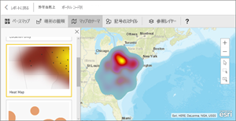
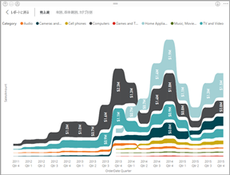
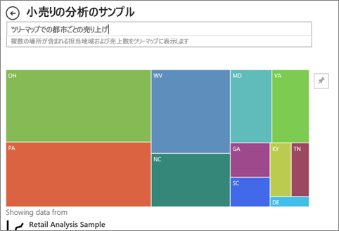

# Power BI での視覚化の種類
## Power BI の視覚化
新しい視覚化が追加されます。お待ちください。

また、[Microsoft AppSource](https://appsource.microsoft.com/marketplace/apps?product=power-bi-visuals) を参照してください。このサイトには、[カスタム ビジュアル](../power-bi-custom-visuals.md)が追加されており、ダウンロードしてダッシュボードやレポートに使用することができます。 自分でカスタマイズする場合は、 [独自の視覚エフェクトを作成する方法を学習し、このコミュニティ サイトに追加してみてください](../developer/office-store.md)。  

## Power BI で利用可能な視覚化の一覧
これらすべての視覚化は、Power BI レポートに追加し、Q&A で指定し、ダッシュボードにピン留めできます。

### 面グラフ:基本 (階層) と積み上げ

>[!TIP]
>基本的な面グラフは、折れ線グラフに基づいており、軸と線の間の範囲が塗りつぶされます。

詳細については、「[Basic Area chart](power-bi-visualization-basic-area-chart.md)」 (基本的な面グラフ) を参照してください。

### 横棒グラフおよび縦棒グラフ

 

>[!TIP]
>横棒グラフは、異なるカテゴリの特定の値を調べるときの標準的なグラフです。

### カード:複数行

### カード:単一数値

詳しくは、[カードの作成 (大きな数字のタイル)](power-bi-visualization-card.md) に関するトピックをご覧ください。

### 複合グラフ

>[!TIP]
>複合グラフは、縦棒グラフと折れ線グラフを組み合わせたものです。 *[折れ線グラフおよび積み上げ縦棒グラフ]* と *[折れ線グラフおよび集合縦棒グラフ]* から選びます。

詳しくは、「[Combo charts in Power BI](power-bi-visualization-combo-chart.md)」 (Power BI の複合グラフ) をご覧ください。

### ドーナツ グラフ

>[!TIP]
>ドーナツ グラフは円グラフと似ています。  どちらのグラフも全体とその一部との関係を表します。

詳しくは、「[Doughnut charts in Power BI](power-bi-visualization-doughnut-charts.md)」 (Power BI のドーナツ グラフ) をご覧ください。

### じょうごグラフ

>[!TIP]
>じょうごグラフは、段階と 1 つの段階から順番にフローする項目を持つプロセスを視覚化するのに役立ちます。  潜在顧客で始まり、購入の完了で終わる営業プロセスなど、段階ごとに順番のフローがある場合にじょうごを使用します。

詳しくは、[Power BI のじょうごグラフ](power-bi-visualization-funnel-charts.md)に関するページを参照してください。

### ゲージ グラフ

>[!TIP]
>目標のコンテキストにおける現在の状態を表示します。

詳しくは、[Power BI でのゲージ グラフ](power-bi-visualization-radial-gauge-charts.md)に関するページを参照してください。

### 主要なインフルエンサのグラフ

主要なインフルエンサのグラフは、選択した結果または値の主な要因を示しています。

詳しくは、[Power BI の主要なインフルエンサのグラフ](power-bi-visualization-influencers.md)に関するページを参照してください

### KPI

>[!TIP]
>測定可能な目標に向けた進行状況を表示します。

詳しくは、[Power BI の KPI](power-bi-visualization-kpi.md) に関するページを参照してください。

### 折れ線グラフ

>[!TIP]
>通常、時間の経過に伴う一連の値すべての全体的な形を強調します。

### マップ:基本マップ

>[!TIP]
>空間的な場所におけるカテゴリと数量の両方の情報を関連付けるのに使用されます。

詳しくは、「[Power BI マップの視覚エフェクトに関するヒントとテクニック](power-bi-map-tips-and-tricks.md)」をご覧ください。

### マップ:ArcGIS マップ

詳しくは、[Power BI の ArcGIS マップ](power-bi-visualization-arcgis.md)に関するページを参照してください。

### マップ:塗り分け地図 (コロプレス)

>[!TIP]
>色が濃いほど値が大きくなります。

詳しくは、[Power BI の塗り分け地図](power-bi-visualization-filled-maps-choropleths.md)に関するページを参照してください。

### マップ:図形マップ

>[!TIP]
>地域を色別に比較します。

詳しくは、[Power BI の図形マップ](desktop-shape-map.md)に関するページを参照してください。

### マトリックス

詳しくは、[Power BI のマトリックス マップ](desktop-matrix-visual.md)に関するページを参照してください。

### 円グラフ

円グラフでは、全体に対する部分の関係が示されます。 

### リボン グラフ

リボン グラフでは、どのデータ カテゴリが最高ランク (最大値) かが示されます。 リボン グラフでは、ランクの変化を効果的に確認できます。各期間を対象に、最高位の範囲 (値) が常に一番上に表示されます。

### 散布図およびバブル チャート

>[!TIP]
>2 (散布) または 3 (バブル) 個の数量メジャーの間の関係を表示します (真偽、順序など)。

詳しくは、[Power BI の散布図](power-bi-visualization-scatter.md)に関するページを参照してください。

### 高密度散布図

>[!TIP]
>ビジュアルのデータ ポイントが多すぎると見づらくなる可能性があるため、視覚エフェクトの精度を確保するために高度なサンプリング アルゴリズムが使用されます。

詳細については、[Power BI の高密度散布図](desktop-high-density-scatter-charts.md)に関するページを参照してください。

### スライサー

詳しくは、「[Slicers in Power BI](power-bi-visualization-slicers.md)」 (Power BI のスライサー) をご覧ください。

### スタンドアロン画像

詳しくは、「[ダッシュボードへのイメージ ウィジェットの追加](../service-dashboard-add-widget.md)」をご覧ください。

### テーブル

>[!TIP]
>カテゴリの多い項目における数量の比較に適しています。

詳しくは、「[Power BI のレポートとダッシュボードでのテーブルの使用](power-bi-visualization-tables.md)」をご覧ください。

### ツリーマップ

詳しくは、「[Treemaps in Power BI](power-bi-visualization-treemaps.md)」 (Power BI のツリーマップ) をご覧ください。

>[!TIP]
>サイズが値を示す色付きの四角形を使ったグラフです。  メインの四角形内で入れ子になった四角形では階層的になることがあります。

### ウォーターフォール グラフ

>[!TIP]
>ウォーターフォール グラフは、値が加算または減算される際の累計を示します。

詳しくは、「[Waterfall charts in Power BI](power-bi-visualization-waterfall-charts.md)」 (Power BI のウォーターフォール グラフ) をご覧ください。

## 使用する視覚化を Q&A で指定する
Power BI Q&A で自然言語クエリを入力するときに、クエリ内で視覚化の種類を指定できます。  例:

***ツリー マップでの都市ごとの売り上げ***

## 次の手順
[Power BI レポートでの視覚化](power-bi-report-visualizations.md)    
[sqlbi.com の正しい視覚エフェクト参照](http://www.sqlbi.com/wp-content/uploads/videotrainings/dashboarddesign/visuals-reference-may2017-A3.pdf)