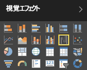
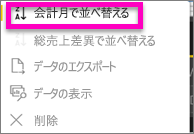
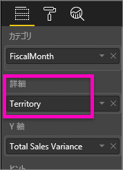
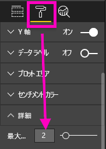

# Power BI のウォーターフォール図
ウォーターフォール図では、値が加算または減算された際の累計 (現在の合計) が示されます。 一連の加算と減算の変化によって、初期値 (たとえば、純利益) が、どのように影響を受けるかを理解するために役立ちます。

各縦棒が色分けされるため、ひと目で増減を識別できます。 最初と最後の値の縦棒は、通常[横軸を起点](https://support.office.com/article/Create-a-waterfall-chart-in-Office-2016-for-Windows-8de1ece4-ff21-4d37-acd7-546f5527f185#BKMK_Float "横軸を起点")としますが、中間値の縦棒は浮動縦棒です。 この外観から、ウォーターフォール図はブリッジ図と呼ばれることもあります。

<iframe width="560" height="315" src="https://www.youtube.com/embed/qKRZPBnaUXM" frameborder="0" allow="autoplay; encrypted-media" allowfullscreen></iframe>

## ウォーターフォール図を使用すべきケース
ウォーターフォール図は、次のような場合に最適な選択肢です。

* 時系列やさまざまなカテゴリにわたりメジャーに変化がある場合
* 合計値に影響を与える大きな変化を監査する場合
* 収益のさまざまな要因を示すことによって、会社の年間利益をプロットして、総利益 (または損) に到達するよう表示する場合
* 会社のある年の年始と年末の社員数をグラフに示す場合
* 毎月の収入と支出、および口座の現在の残高を視覚化する場合 

## ウォーターフォール図の作成
ここでは、月別の売上差異 (予想売上高と実際の売上高の差異) を示すウォーターフォール図を作成します。 先に進むには、Power BI にサインインして、**[データの取得] \> [サンプル] \> [小売りの分析のサンプル]** を選びます。 

1. **[データセット]** タブを選択し、新しい [小売りの分析のサンプル] データセットまでスクロールします。  **レポートの作成**アイコンを選択し、レポート編集ビューでデータセットを開きます。 
   
    
2. **[フィールド]** ウィンドウで、**[セールス] \> [Total Sales Variance]** (総売上差異) を選択します。 **[Total Sales Variance]** (総売上差異) が **[Y 軸]** 領域内にない場合、そこにドラッグします。
3. グラフを **ウォーターフォール**に変換します。 
   
    
4. **[時刻]** \> **[FiscalMonth]** を選択して、[Total Sales Variance] を **[カテゴリ]** に追加します。 
   
    
5. 時系列でウォーターフォール図を並べ替えます。 図の右上にある省略記号 [...] を選択し、**[FiscalMonth]** を選択します。
   
    
   
    
6. さらに調べると、月別の変化の要因がわかります。 **[Store]** > **[Territory]** を **[詳細]** バケットにドラッグします。
   
    
7. Power BI の既定では、月別の増減に寄与した上位 5 個の要素が追加されます。 ただし、ここでは上位 2 個の要素にのみ興味があります。  [書式設定] ウィンドウで **[詳細]** を選択し、**[最大値]** を 2 に設定します。
   
    
   
    ウォーターフォール図をざっと見ると、オハイオ州とペンシルバニア州の地域が売上の増減に最も大きく貢献していることがわかります。 
   
    
8. これは興味深い発見です。 オハイオ州とペンシルバニア州の売上が他の地域よりもはるかに高いため、この 2 つの州がこのように重大な影響を及ぼしているのでしょうか。  このようなことも確認するには、 地域別の売上を表示するマップを作成します。  
   
    
   
    このマップはこの理論をサポートしています。  これら 2 つの地域は、昨年 (バブルのサイズ) と今年 (バブルの網掛け) の売上値が最高だったことが示されています。

## 強調表示とクロス フィルター処理
[フィルター] ウィンドウの使用方法については、「[Power BI でのレポートへのフィルターの追加](../power-bi-report-add-filter.md)」をご覧ください。

ウォーターフォール図内の縦棒を強調表示すると、レポートのページ上の他の視覚化がクロス フィルター処理されます。逆の場合も同様です。 ただし、[合計] の縦棒では強調表示がトリガーされることも、クロス フィルター処理に反応することもありません。

## 次の手順
[Power BI のレポート](../service-reports.md)

[Power BI での視覚化の種類](power-bi-visualization-types-for-reports-and-q-and-a.md)

[Power BI レポートでの視覚化](power-bi-report-visualizations.md)

[Power BI - 基本的な概念](../service-basic-concepts.md)

他にわからないことがある場合は、 [Power BI コミュニティを利用してください](http://community.powerbi.com/)。

