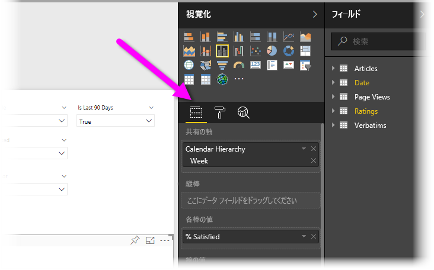
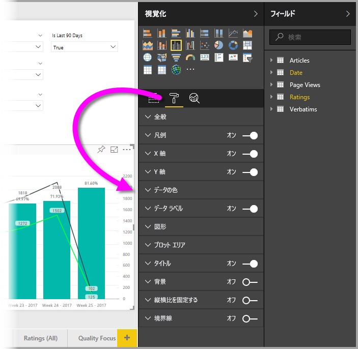
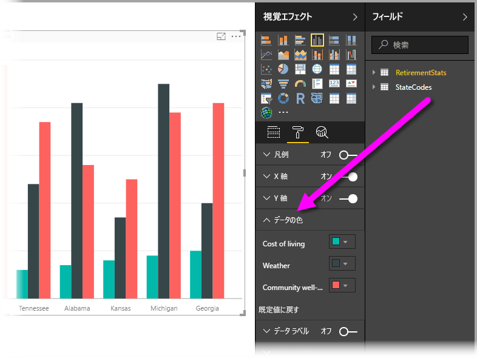
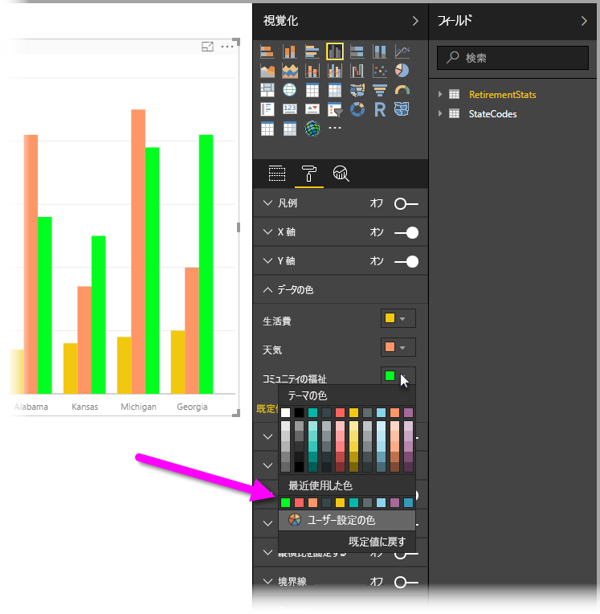
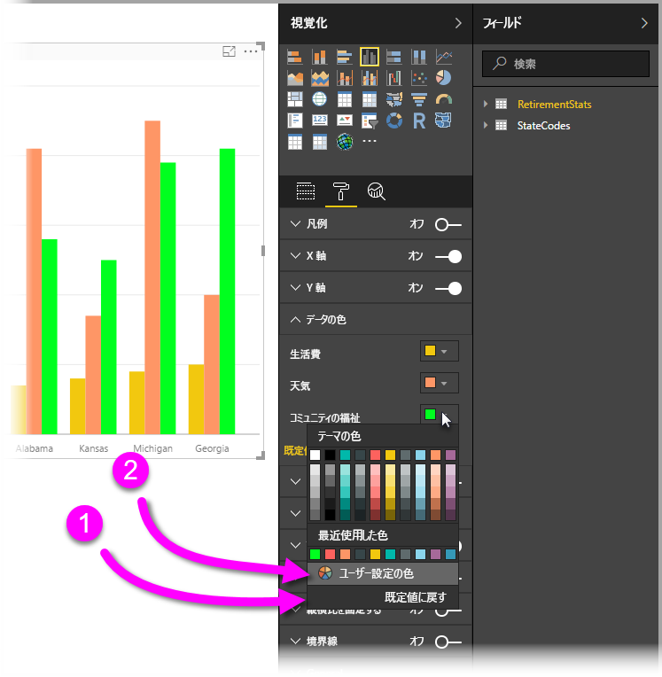
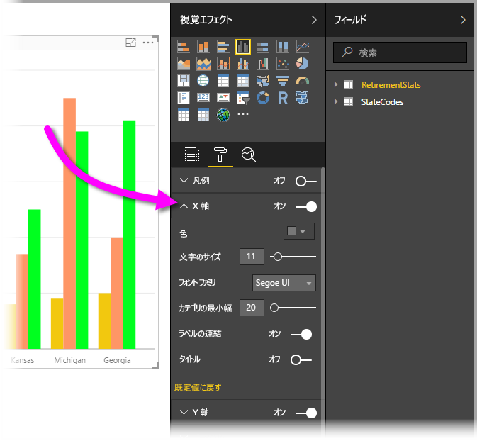

# 色の書式設定と軸のプロパティの概要
**Power BI** では、データ系列、データ ポイント、そして視覚化の背景の色も変更できます。 また X 軸と Y 軸の表示方法を変更することもでき、ダッシュボードとレポートの表示方法を完全に制御できます。

開始するには、 **[マイ ワークスペース]** ウィンドウの **[レポート]** を選択します。 次に、上部のメニュー領域にある **[レポートの編集]** を選択します。  

レポートの編集中に視覚化を選択すると、 **[視覚化]** ウィンドウが表示され、そこで視覚化を追加したり変更したりできます。 使用できる視覚化のすぐ下には、**[フィールド]** アイコン (横並びの縦棒)、**[書式]** アイコン (ペイント ブラシ)、**[分析]** アイコン (虫眼鏡) という 3 つのアイコンがあります。 次の図では、 **[フィールド]** アイコンが選択されていることが、アイコンの下に黄色のバーによって示されています。

**[書式]** を選択すると、アイコンの下の領域に、現在選択されている視覚化に対して設定できる色と軸のカスタマイズが表示されます。  

それぞれ視覚化のさまざまな要素をカスタマイズすることができます:

* 凡例
* X 軸
* Y 軸
* データの色
* データ ラベル
* 図形
* プロット エリア
* タイトル
* 背景
* 縦横比を固定する
* 罫線

> [!NOTE]
>  
> 視覚化のすべての種類でこれらすべての要素が表示されるわけではありません。 選択した視覚化によって、設定できるカスタマイズは異なります。たとえば、円グラフを選択すると、X 軸は表示されません。円グラフに X 軸がないためです。

また視覚化を何も選択しないと、アイコンの代わりに**フィルター**が表示されます。これにより、ページ上のすべての視覚化にフィルターを適用できます。

2 つの例を見てみましょう。1 つは色を扱い、もう 1 つは軸のプロパティを変更します。 この例を参考にすれば、色、軸、ラベルのカスタマイズができるようになるでしょう。

## 色の扱い

グラフの色をカスタマイズするために必要な手順を段階的に見てみましょう。

1. レポート キャンバスから **[集合縦棒グラフ]** を選択します。
2. 次に、 **[書式]** アイコンを選択し、設定できるカスタマイズを表示します。
3. さらに、**[データの色]** カスタマイズ設定の左にある小さな下矢印を選択します。 ここでは、[データの色] をカスタマイズする方法を示します。表示されるオプションは、選択した視覚化に固有のものです。
4. **[データの色]** を下に展開すると、設定できるカスタマイズが表示されます。  
   

いくつかの変更を加えてみましょう。 対象の色の隣にある下矢印を選択して、利用できる各データ系列に変更を加えることができます。 **[生活費]** を黄色に、**[天気]** をオレンジ色に、 **[地域社会の福祉]** を緑色にします。 次の画面は、最後の手順、つまり **[生活費]** を変更しているところです。  

以下のイメージは変更後を示しています。 明るいグラフになりました。 色を扱う際に注意すべきいくつかの要素があります。 次のリストにある番号は以下の画面にも示されていて、こうした役立つ要素にアクセスしたり変更したりできる場所を示しています。

1. 色が気に入りませんか? 問題ありません。**[既定値に戻す]** を選択するだけで、選択箇所が既定の設定に戻ります。 この操作は 1 色にも、視覚化全体にも行えます。
2. パレットにない色を使いたいですか? **[ユーザー設定の色]** を選択し、スペクトルからを選択します。  
   

直前に行った変更が気に入りませんか? いつものように **CTRL + Z** を使用すると、元に戻すことができます。

## 軸のプロパティの変更

X 軸または Y 軸を変更すると役立つ場合がよくあります。 色を扱う場合と同様、次のイメージに示されているように、変更対象の軸の左にある下矢印を選択して軸を変更できます。  

**[X 軸]** オプションを折りたたむ場合、 **[X 軸]** の横にある上矢印アイコンを選択します。

X 軸ラベルを完全に削除するには、 **[X 軸]** の横にあるラジオ ボタンを切り替えます。 また、 **[タイトル]** の横にあるラジオ ボタンを選択して、軸タイトルのオン/オフを切り替えることができます。  

あらゆる種類の色から選ぶことができ、さらに多くのカスタマイズをPower BI レポートとダッシュボードに適用することができます。

> [!NOTE]
>  
> 上記の色、軸、関連するカスタマイズは、**[書式]** アイコンが選ばれている場合に使用できます。また、Power BI Desktop でも使用できます。

## テキスト値からの色の設定

**Power BI Desktop** の 2018 年 8 月更新プログラム以降では、特定のレポート要素に対してテキスト値または 16 進コードによって色を設定することができます。 詳細については、「[テーブルでの条件付き書式設定](../desktop-conditional-table-formatting.md)」を参照してください。

## 次の手順
詳しくは、次の資料を参照してください。  

* [Power BI における色の書式設定に関するヒントとコツ](service-tips-and-tricks-for-color-formatting.md)  
* [テーブルでの条件付き書式設定](../desktop-conditional-table-formatting.md)

