# 展開して、Power BI Premium 容量を管理します。

**概要:** Power BI Premium は、組織内のすべてのユーザーに対して一貫したパフォーマンス、大きなデータ ボリュームのサポートとセルフ サービスおよび enterprise の統合 BI プラットフォームの柔軟性を提供します。 この 300 レベルのテクニカル ホワイト ペーパーでは、Power BI 管理者とコンテンツの作成者と発行元を具体的には書き込まれました。 これは、目標は、Power BI Premium では、可能性を理解するために、設計、展開、監視、およびスケーラブルなソリューションのトラブルシューティングを行う方法について説明します。

**作成者:** [Peter Myers](https://www.linkedin.com/in/peterjsmyers) (データ プラットフォームの MVP、およびビットごとのソリューションと独立系の BI 専門家)

**技術校閲者:** Adam Saxton、Akshai Mirchandani、Bhavik マーチャント、David Magar、Josh Caplan、Michael Blythe、Nimrod Shalit、Olivier Matrat、Swati Gupta

**適用対象:** Power BI サービス、Power BI Premium および Azure Power BI Embedded の容量

> [!NOTE]
> ブラウザーで **[印刷]** を選択して **[PDF として保存]** を選択することで、このホワイト ペーパーを保存または印刷できます。

## Power BI の紹介

Power BI は、高速で十分な情報に基づいて意思決定を有効にする洞察を提供するように設計、ビジネス分析サービスです。 2015 のリリース以来、瞬く間に小規模の組織のソリューションを大規模に実現するために使用する人気のあるサービス企業です。

2 つの方法で使用されます。クラウド サービスとオンプレミス レポート ソリューションという名前の**Power BI Report Server**します。 \[[1](#endnote-01)\]

クラウド サービスはサービスとしてのソフトウェア-、-(SaaS) と、power BI \[ [2](#endnote-02)\]します。 開発、展開、管理、ビジネスを監視するソリューションを共有する組織を有効にするサービスとアプリケーションのセットを表します。

Power BI サービスの包括的な説明を提供するこのホワイト ペーパーの目的ではありません。 代わりに、Power BI Premium のサブジェクトに関連するトピックに焦点を当てます。 Power BI の詳細については、包括的なを参照してください[Power BI ドキュメント](service-admin-premium-multi-geo.md)します。 パフォーマンスの高いエンタープライズ展開を実現するために重点を置いて、Power BI サービスの詳細については、包括的なを参照してください[Power BI のエンタープライズ展開の計画](https://aka.ms/pbienterprisedeploy)ホワイト ペーパー。

このホワイト ペーパーのサブジェクトのコンテキスト内では、ここが導入されていて、容量、Power BI コンテンツの種類、モデル、ストレージ モードおよびライセンスについて説明します。 これらのトピックについては、正常に展開し、Power BI Premium を管理する必要があります。

### 容量

**容量**コンテンツをホストし、Power BI の配信に使用されるリソース (記憶域、プロセッサおよびメモリ) のセットを表す主要な Power BI の概念が。 容量は、共有または、専用です。 A**共有された容量**が中に他のマイクロソフトの顧客と共有される、**専用容量**は、単一の顧客に完全にコミットします。 専用の容量がで導入された、 [Premium 容量](#premium-capacities)トピック。

共有された容量では、ワークロードは、他の顧客と共有計算リソースで実行します。 容量とリソースを共有する必要があります、"公正 play"、モデルの最大サイズ (1 GB) と最大の日次更新頻度 (8 回 1 日あたり) などのようにする制限が課されます。

### ワークスペース

Power BI のワークスペースが容量内に存在され、セキュリティ、コラボレーション、および展開のコンテナーを表します。 Power BI ユーザーごとに、個人用のワークスペースと呼ばれる**マイ ワークスペース**します。 コラボレーションと展開を有効にするその他のワークスペースを作成することができ、呼ばれます**アプリ ワークスペース**します。 既定では、(個人のワークスペースを含む) のワークスペースは、共有された容量に作成されます。

### Power BI コンテンツの種類

Power BI Premium のトピックを紹介するには、開始の基本的なコンテンツの種類を含む Power BI のアーキテクチャの徹底的に検討する必要があります。

Power BI のすべてのコンテンツが格納され、Power BI コンテンツのコンテナーとなるワークスペース内で管理します。 各 Power BI ユーザーは自分の個人用ワークスペースでは、しましたが、一般的なベスト プラクティスは、アプリ ワークスペースを作成します。 アプリ ワークスペースには、共同で所有するコンテンツとコンテンツで共同作業する機能が有効にします。 ステージング アプリとして幅広い対象ユーザーにコンテンツを配布する機能も提供します。

次の Power BI コンテンツは、ワークスペースに格納されます。

- データフロー
- データセット
- ブック
- レポート
- ダッシュボード

#### データフロー

Power BI のデータフローは、さまざまなソースからデータを統一する組織を支援します。 レポートのソースとして直接使用することはできませんただし準備され、モデルでは、使用するためのステージング データとして検討できます。 オンプレミスとクラウド ベースのデータ ソースからのデータの取り込みを有効にすると、Microsoft のデータ コネクタの豊富なコレクションを活用できます。

データフローはのみ作成され、アプリのワークスペースで管理されているし、Azure Data Lake ストレージ Gen2 で一般的なデータ モデル (CDM) 内のエンティティとして格納されます。 通常、最新のデータを格納する、定期的に更新する予定です。

詳細についてを参照してください、[セルフ サービスのデータ準備の Power BI (プレビュー) で](service-dataflows-overview.md)ドキュメント。

#### データセット

Power BI のデータセットは、データの準備レポートと視覚化のためのソースを表します。 によって作成されたデータセットの多くの種類があります。

- Power BI の容量でホストされていない、既存のデータ モデルへの接続
- モデルを含む Power BI Desktop ファイルをアップロードします。
- (1 つまたは複数の Excel テーブルやブックのデータ モデルを含む)、Excel ブックをアップロードまたはコンマ区切り値 (CSV) ファイルをアップロードします。
- Power BI サービスを使用して、プッシュ、ストリーミングまたはハイブリッドのストリーミング データセットを作成するには

ストリーミング データセットを除く\[ [3](#endnote-03)\]データセットが Analysis Services の成熟したモデリング テクノロジを利用してデータ モデルを表します。

ドキュメントについては、場合によって、用語のデータセットとモデルを交換できますに注意してください。 一般に、Power BI サービスの観点から、呼びます、**データセット**と呼ばれますが、開発の観点から、**モデル**します。 このホワイト ペーパーのコンテキストでそれらはほとんど同じことを意味します。

##### モデルの外部でホストされています。

インストールでは、外部でホストされているモデルへの接続、 [、オンプレミス データ ゲートウェイ](service-gateway-onprem.md)は、オンプレミスまたは VM でホストされるサービスとしてのインフラストラクチャ-、-(IaaS) かどうか、SQL Server の Analysis Services に接続します。 Azure Analysis Services では、ゲートウェイは必要ありません。 このシナリオでは意味が多くの場合、により、通常のエンタープライズ データ ウェアハウス (EDW) の一部を形成の既存のモデルへの投資が存在する場合。 Power BI を実行することができます、**ライブ接続**(LC) Analysis Services には、Power BI レポートのユーザーの id を使用してデータのアクセス許可を適用することも、します。 SQL Server Analysis services、多次元モデル (キューブ) と表形式モデルの両方がサポートされています。 次の図に示すようにライブ接続データセットは外部でホストされたモデルにクエリを渡します。

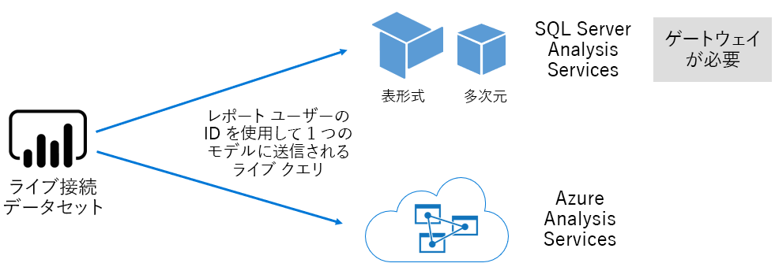

##### Power BI Desktop で開発されたモデル

Power BI Desktop のため、Power BI 開発クライアント アプリケーションでは、Analysis Services 表形式モデルでは効果的にモデルを開発する使用できます。 他のデータ ソースと統合することができますのデータフローからデータをインポートすることによって、モデルを開発できます。 モデリングを実現する方法の詳細は、このホワイト ペーパーのスコープ外は 3 つ異なる型またはモードの Power BI Desktop を使用して開発できるモデルを理解しておく必要があります。 これらのモードでは、データは、モデルにインポートするかどうか、またはデータ ソースに残っているかどうかを決定します。 3 つのモードは次のとおりです。インポート、DirectQuery、および合成。 各モードの詳細についてで説明、[モデルは、ストレージ モード](#model-storage-modes)トピック。

モデルの外部でホストされていると Power BI desktop で開発されたモデルは、特定のユーザーの取得できるデータを制限する行レベル セキュリティ (RLS) を適用できます。 たとえば、営業担当者のセキュリティ グループに割り当てられたユーザーはレポート データが割り当てられている販売地域ののみを表示できます。 RLS の役割は、動的または静的に指定できます。 **動的ロール**レポートのユーザーによってフィルター中**静的ロール**ロールに割り当てられているすべてのユーザーに同じフィルターを適用します。

##### Excel ブックのモデル

Excel ブックまたは CSV に基づくデータセットを作成するファイルが、モデルの自動作成時に発生します。 Excel ブックのデータ モデルは、Power BI モデルを作成するが入れ換わります中に、モデルのテーブルを作成する、Excel のテーブルと CSV データがインポートされます。 すべてのケースでは、ファイル データがモデルにインポートされます。

違いは、次に、モデルを表すデータセットを Power BI の詳細について変更できます。

- Power BI サービスでホストされるか、または Analysis Services でホストされる外部
- インポートしたデータを格納できるかを発行するためパススルー クエリ要求を基になるデータ ソース、または両方の組み合わせ

モデルを表すデータセットを Power BI に関する重要な事実の概要を次に示します。

- ホストされている SQL Server Analysis Services モデルには、LC のクエリを実行するゲートウェイが必要があります。
- Power BI でホストされているデータをインポートするモデル
  - クエリを実行できるように完全にメモリに読み込まれる必要があります。
  - 現在、データを保持する更新を必要とし、インターネット経由で直接ソース データにアクセスできない場合、ゲートウェイを含む必要があります
- DirectQuery (DQ) ストレージ モードを使用する power BI でホストされているモデルでは、ソース データへの接続が必要です。 モデルが照会されたときに、Power BI は現在のデータを取得するソース データにクエリを発行します。 このモードは、インターネット経由で直接ソース データにアクセスできない場合、ゲートウェイを伴う必要があります。
- モデルが特定のユーザーへのデータ アクセスを制限するフィルターを適用する、RLS のルールを適用すること

正常に展開し、Power BI Premium の管理をモデルがホストされている場所、ストレージ モード、ゲートウェイ、インポートされたデータのサイズへの依存関係を理解し、種類と頻度を更新します。 これらはすべてに大きな影響を与える、Power BI Premium のリソース。 さらに、自体のデータ準備のクエリおよび計算を含むモデルのデザインは、考慮事項のミックスに追加できます。

モデルがスケジュールに従って更新またはする Power BI でホストされているインポートには、Power BI サービス内のユーザーによってオンデマンドでトリガーされるかを理解しておく必要もできます。

このテクニカル ホワイト ペーパーの後半で説明が最適化されたモデルのデザイン、[最適化モデル](#optimizing-models)トピック。

#### ブック

Power BI ブックは Power BI コンテンツの種類\[ [4](#endnote-04)\]します。 これらは、Excel ブックを Power BI サービスにアップロードされているデータセット (モデル) を作成するアップロードされた Excel ブックに混同しない必要があります。 ブックのコンテンツの種類は、Power BI サービスにアップロードできないか、または OneDrive または SharePoint Online のクラウド ストレージに残りますブックへの接続を表します。

このコンテンツの種類が Power BI データ視覚エフェクトのデータ ソースとして使用できないことを理解しておく必要があります。 代わりに、Excel Online を使用して、Power BI サービス内のブックとして開くあることができます。 このコンテンツの種類の主な目的は、Power BI ダッシュ ボードにピン留めするには、そのデータ ビジュアライゼーションを許可して、Power BI サービス内からアクセスできるように、従来の Excel ブック レポートを許可します。

詳細についてを参照してください、 [Excel ブック ファイルからデータを取得](service-excel-workbook-files.md)ドキュメント。

#### レポート

2 つの種類のレポートがあります。Power BI レポートと改ページ調整されたレポート。

**Power BI レポート**対話型のデータの視覚エフェクトの 1 つのデータセットのみに接続するエクスペリエンスを提供します。 レポートのユーザーへの参加の機能は、次の特別な配列と対話することをお勧めするデザイン多くの場合、フィルター処理し強調表示、ドリル アップ、ドリルダウン、ドリルスルー、Q & a 自然にクロス フィルター処理、スライスを含む言語が疑問視されること、重点を置いて、ページ ナビゲーション、スポット ライト、表示のブックマークです。

このホワイト ペーパーのコンテキストで理解しておく必要が、Power BI のアーキテクチャでは、Power BI レポートのデザインとユーザーの相互作用できますすべてに影響を与える Power BI サービスのリソースに対する方法。

- インポート モデルに基づいてレポートの対話を読み込んでに、モデルが (Power BI サービスでホストされている、または外部でホストされている) かどうか、メモリに読み込まれた完全に必要
- 各レポートのビジュアルは、モデルのクエリを実行してデータを取得するクエリを発行します。
- 一般に、フィルターとスライサーの相互作用は、モデルのクエリを実行する必要があります。 たとえば、スライサーの選択を変更する - - 既定でが必要になります ページには、各ビジュアルを再度読み込んで\[ [5](#endnote-05)\]
- Power BI レポートは現在のデータの表示は保証されませんし、レポート ページとそのビジュアルを再読み込みするレポートを更新するユーザーを必要があります。
- ユーザーが、Q で取り組むことができます (&) に質問したり、Power BI レポートのデザインを提供する自然言語の機能が許可されていると、データセットが Power BI でホストされているデータ モデルをインポートまたは Q & A を有効にするように構成 LC データセットを表します

**ページ分割されたレポート**パブリケーションを許可して、SQL Server Reporting Services (SSRS) レポートのレンダリング (\*.rdl 形式)。 その名前からわかるように、要件に基づき、固定ページ サイズへの出力が必要である場合、またはデータを完全に展開する必要がありますの変数のリストがある場合にページ分割されたレポートが通常使用されます。 (ビジュアル内でスクロールするのではなく) 複数ページ表示用に設計された請求書、および印刷します。

2 つのサポートされているレポートの種類の選択肢を提供するレポート作成者は、種類を選択することができますの要件に基づいてし、使用を対象としています。 一般に、Power BI レポートは、ユーザーを探索し、ページ分割されたレポートがパラメーターに基づくページ レイアウトをより適切なときに、データから洞察を許可する対話型エクスペリエンスに最適です。

レポートの種類に関係なく (フィルターまたはパラメーターが変更された) ときに、応答性の高いレポートの読み込みとデータの更新プログラムを実現するために、信頼性とパフォーマンスの高いユーザー エクスペリエンスを提供する必要があります。

#### ダッシュボード

Power BI ダッシュ ボードは監視エクスペリエンスを提供するためのものでは、概念的には、Power BI レポートから非常に異なる。 ダッシュ ボードは 1 つのウィンドウに表示するタイルの値とデータの視覚エフェクトを表現するに設計されています。 一般に、ダッシュ ボードは、相互作用が必要ない一部のダッシュ ボードのデザインと Power BI のレポートよりも少ないの相互作用エクスペリエンスを提供します。 たとえば、ダッシュ ボードが自動であることをサーバー ルームで非タッチ画面に表示されます。 もう 1 つの重要な違いは、ダッシュ ボードが Power BI の中に、複数のデータセットからのソース データは 1 つのデータセットに基づいてのみを報告するタイルを起こす可能性があります。

ダッシュ ボードがすばやく表示するように設計して、常に最新のデータ (Power BI サービスに) すべての express を理解しておく必要があります。 タイルのクエリの結果をキャッシュすることによって、これを行うし、これは各ダッシュ ボードにします。 実際には、動的 RLS が設定されているモデルに基づいているダッシュ ボードにアクセス権を持つユーザーごとにこれを行う、必要があります。

Power BI サービスは、Power BI でホストされているインポート モデルが更新された後すぐに自動的にダッシュ ボードのクエリ キャッシュを更新します。 LC と DQ のモデルの場合は、データセットの所有者は、Power BI サービスが 15 分ごとに、頻繁としてまたは週 1 回、最多として構成することができます、キャッシュを更新する頻度を制御の程度を持ちます。 LC クエリ キャッシュの更新プログラムは最初に、前回のキャッシュの更新後にモデルの更新が発生したし、更新が以降発生していないときに、キャッシュを更新するには行われませんかどうかを判断するモデルのメタデータにクエリに注意してください。 DQ モデルの場合、このチェックはできません、ためキャッシュの更新がソース データが変更されたかどうかを実行するされます。

ダッシュ ボードのクエリ キャッシュはに基づいて DQ を更新し、LC モデルに Power BI サービス リソースと外部データ ソースの両方に大きく影響します。 動的 RLS を強制し、1 時間ごとに更新してこのダッシュ ボードは、100 人のユーザーと共有されている Azure Analysis Services モデルに基づくすべての 20 のタイルをダッシュ ボードを検討してください。 データセットは 1 時間ごとの更新を構成する場合これになります (20 x 100) を 2000 には少なくとも LC クエリ。 これは、Power BI サービスと、外部データ ソースに非常に多くの負荷を配置できも使用可能なリソースに対する制限を超えています。 容量リソースおよび制限については説明、[容量ノード](#capacity-nodes)トピック。

ユーザーは、Power BI サービスのリソースを必要とすると、さまざまな方法でダッシュ ボードと対話できます。 具体的には、設定できます。

- Power BI でホストされているデータ インポートの関連するすべてのモデルのオンデマンドで更新されることがダッシュ ボードのタイルの更新をトリガーします。
- Q & 自然言語機能 (ダッシュ ボードのデザインが許可されていると、データセットが Power BI でホストされているデータ モデルをインポートまたは Q & A を有効にするように構成 LC データセットを提供) の質問と情報交換します。
- 使用して、Power BI クイック インサイト機能は、基になるデータセット、およびビジュアルを表示し、(タイルが Power BI でホストされているデータ モデルのインポートは、データセットに基づいていることを提供) を説明する応答からの洞察を得てください。
- おそらくの頻度で 1 時間ごとの値を並べて表示して、しきい値を超えた場合にユーザーに通知するしきい値を比較する Power BI サービスを必要とするダッシュ ボードのタイルにアラートを構成する (タイルが 1 つの数値を表示して、に基づいてを提供する、Power BI でホストされているデータ モデルのインポートは、データセット)

### モデルのストレージ モード

Power BI Desktop により、3 つのモードのいずれかでモデルを作成することを思い出してください。 各データ モデルのストレージ モードおよび Power BI サービスのリソースに対する影響の"the rationale"を理解しておく必要があります。 このセクションでは、すべての 3 つのモードについて説明します。 これらについては、モデルの最適化のトピックでこのホワイト ペーパーの後半で詳しく説明します。

#### インポート モード

インポート モードは非常に高速にクエリを実行、柔軟にデザインをモデル管理者では、使用可能なメモリ内に関連付けられているパフォーマンスのためのモデルの開発し、Power BI サービスの特定の機能 (Q & A、クイック分析情報をサポートするために使用する最も一般的なモード、など。)。 これは、Power BI Desktop の新しいソリューションを作成するときに既定モードです。

インポートされたデータが常に格納されていることを理解することが重要ディスクし、クエリを実行または更新するメモリに完全に読み込まれる必要があります。 1 回インポート モデルをメモリに非常に高速のクエリの結果が得られます。 メモリに部分的に読み込まれているモデルのインポートの概念がないことを理解しておく必要もできます。

更新されると、データは圧縮されと最適化されて、VertiPaq ストレージ エンジンによってディスクに格納されます。 ディスクからメモリに読み込まれると、10 倍の圧縮を参照することは、これは約 1 GB のサイズを 10 GB のソース データを圧縮できることを期待します。 ディスク上のストレージ サイズこれを行う上での 20% 削減します。 \[[6](#endnote-06)\]

次の 3 つの方法では、デザインの柔軟性を実現できます。 データ モデラーは次のとおりです。

- データ ソースの種類と形式に関係なく、複数のデータ ソースからデータをキャッシュすることによってデータを統合します。
- データ準備のクエリを作成するときに、Power Query 数式言語が (非公式 M と呼ばれます) 関数のセット全体を活用します。
- ビジネス ロジック、計算列、計算テーブルとメジャーを使って、モデルを強化する際に、Data Analysis Expressions (DAX) 関数のセット全体を活用します。

次の図に示すように、モデルのインポートはサポートされているデータ ソースの種類の任意の数からデータを統合できます。

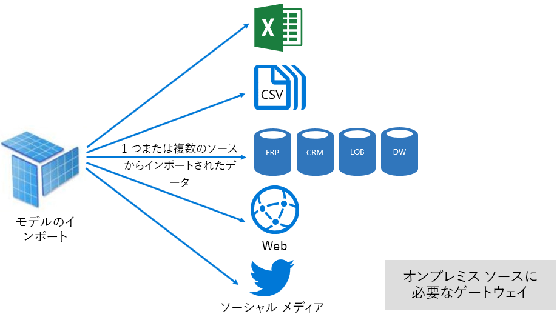

ただし、インポート モデルに関連付けられている魅力的な利点があるときにデメリットがありますすぎます。

- モデル全体は、Power BI は、モデルのサイズと数の拡大に伴い、使用可能なリソースに負荷を配置できるモデルにクエリを実行する前に、メモリに読み込む必要があります。
- モデル データが最新の更新で最新では、インポートのモデルがこれを定期的に可能であれば、更新する必要があります。
- 完全な更新はすべてのテーブルからすべてのデータを削除し、データ ソースから再読み込みします。 これは、時間と、Power BI サービスとデータ ソースのリソースの観点から非常に高価なことができます。 Power BI は切り捨てと再ロード全体のテーブルを避けることができます、増分更新のサポートがあり、これについては、 [Optimizing Power BI-Hosted モデル](#optimizing-power-bi-hosted-models)トピック。

Power BI サービス リソースの観点からインポート モデルが必要です。

- 十分なメモリが照会されるか更新されるときに、モデルを読み込む
- リソースとデータを更新する追加のメモリ リソースの処理

#### DirectQuery モード

モデルの DirectQuery (DQ) モードでの開発では、データはインポートされません。 代わりに、メタデータのみの構成時に問題のネイティブ クエリを基になるデータ ソースに対してクエリを実行します。

DQ モデルの開発を検討する 2 つの主な理由があります。 最初の理由は、データ ボリュームが大きすぎて - 削減メソッドのデータが適用されました - 場合でも、モデルに読み込みまたは更新では実質的に場合です。 2 番目の理由は、レポートとダッシュ ボードは、"ほぼ"リアルタイム データ、スケジュールされた更新の制限 (48 時間、日の専用容量) 内で何が実現できるを超えてを配信する必要がある場合です。

DQ モデルに関連付けられているいくつかの利点があります。

- インポート モデル サイズの制限は適用されません。
- モデルに更新が必要としません。
- レポート ユーザーは、レポート フィルターとスライサーを操作するときに、最新のデータが表示し、現在のデータを取得するレポート全体を更新できます
- ダッシュ ボード タイル、DQ のモデルに基づいている場合は、15 分ごとのように頻繁に自動的に更新できます。

ただし、ある多数の欠点と DQ モデルに関連付けられている制限事項。

- モデルは、1 つのサポートされているデータ ソースに基づく必要があり、そのため、データ統合達成しなければならない既にデータ ソースでします。 サポートされているデータ ソースは、多くの人気のあるデータ ストアのサポートにより、リレーショナルおよび分析システム\[ [7](#endnote-07)\]します。
- パフォーマンスを非常に遅く、(クエリでは、CPU を大量に消費して指定できます。)、Power BI サービスとデータ ソース (これは、分析クエリの最適化されていない可能性があります) に可能性のある悪影響を与えることができます。
- Power Query のクエリは、過度に複雑にすることはできず、ネイティブ クエリがデータ ソースで認識することができますが入れ換わる M 式と関数に制限されています
- DAX 関数はできますが、データ ソースで認識されるネイティブ クエリに入れ換わるものに限定されており、計算テーブルまたは組み込みのタイム インテリジェンス機能はサポートされていません
- 既定では、100万以上の行の取得を必要とするモデルのクエリは失敗します
- データ ソースが揮発性である場合に特には、レポートと複数のビジュアルとダッシュ ボードから矛盾した結果に表示することができます。
- Q & A、クイック分析情報がサポートされていません

Power BI サービス リソースの観点からは、DQ モデルが必要です。

- 最小限のメモリ モデル (メタデータのみ) を読み込むときの照会
- 大幅なプロセッサ リソースを生成し、データ ソースに送信されるクエリの処理

詳細についてを参照してください、 [Power BI Desktop で直接クエリを使用する](desktop-use-directquery.md)ドキュメント。

#### 複合モード

複合モードで開発されたモデルでは、個々 のモデルのテーブルの保存モードの構成を許可します。 そのため、さまざまなインポートおよび DQ テーブルをサポートします。 計算テーブルの (DAX で定義) と複数の DQ データ ソースもサポートしています。

テーブルのストレージ モードは、Import、DirectQuery またはデュアルとして構成できます。 2 つのストレージ モードとして構成されているテーブルがインポートと DirectQuery の両方と、これにより、最も効率的なクエリのクエリごとに使用するモードを決定する Power BI サービス。

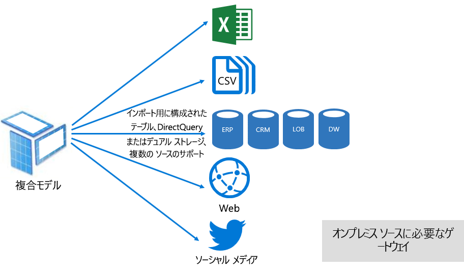

複合モデルは、インポートと DirectQuery モードの提供に努めています。 適切に構成されている場合は、ほぼリアルタイムのデータのデータ ソースから取得することとインメモリ モデルでの高いクエリ パフォーマンスを組み合わせて、できます。

複合モデルを開発しているデータ モデラーは、DirectQuery モードでのインポート] または [デュアルのストレージ モードとファクトの種類のテーブルでテーブルをディメンションの種類を構成する可能性があります。 たとえば、デュアル モードと DirectQuery モードでは売上ファクトの種類のテーブルで、製品ディメンションの種類のテーブルがモデルを検討してください。 Product テーブル照会可能であれば効率的かつ簡単にレポートのスライサーを表示するためにメモリ内から。 Sales テーブルは、関連の製品テーブルに結合する DirectQuery モードで、クエリを実行できます。 後者のクエリには、製品と売上のテーブルとスライサーの値でフィルター処理を結合する 1 つの効率的なネイティブ クエリの生成が有効にする可能性があります。

一般に、長所と短所、各モデルのモードに関連付けられているを考慮複合モデルでテーブルのストレージ モードに適用することができます。

詳細についてを参照してください、[複合モデルを使用して、Power BI Desktop で](desktop-composite-models.md)ドキュメント。

### ライセンス

Power BI では、次の 3 つのライセンスがあります。

- Power BI 無料版
- Power BI Pro
- Power BI Premium

**Power BI Free**ライセンスにより、個々 の Power BI サービスにサインインし、モデルとレポートを発行することによって、個人用ワークスペースで作業します。 このライセンスを使用して Power BI コンテンツを共有することはできませんを理解しておく必要があります。 このライセンスでは、その名前からわかるようには無料です。

**Power BI Pro**ライセンスでは、コンテンツの作成しアプリ ワークスペースで共同作業および共有、および Power BI を配布する個人ができます。 自動的にデータを保持する、現在、オンプレミス データ ソースを含むデータセットの更新を構成することもできます。 さらに、監査し、データにアクセスし、使用する方法を制御することができます。 このライセンスは、ユーザーが Power BI Premium 専用容量に関連付けられていない限り、他のユーザーから共有のコンテンツを受信するために必要です。

**Power BI Premium**ライセンスは、テナント レベルのライセンス、およびについては、 [Power BI Premium の導入](#introducing-power-bi-premium)セクション。

Power BI のライセンスに関する詳細についてを参照してください、 [Power BI の価格](https://powerbi.microsoft.com/pricing/)ページ。

## Power BI Premium の概要

Power BI Premium は、スケール、信頼性の高いパフォーマンス、予測可能なコストとの統合されたセルフ サービスとエンタープライズ BI プラットフォームを提供します。 主に、これを組織の Power BI サービスを実行する専用のリソースを提供することで実現します。

さらに、Power BI Premium は、多数のエンタープライズ機能を提供します。

- コスト効率の高いコンテンツ配信、外部ユーザーを含む、無制限の Power BI Free ユーザーに Power BI コンテンツの共有を有効にします。
- 大きなデータセットのサイズのサポート\[ [8](#endnote-08)\]
- データフローおよびデータセット (1 日あたり最大 48 時間) のリフレッシュ レートが高い
- データフローとデータセットの増分更新
- データ フローには、エンティティ、および変換の並列実行がリンクされています。
- ページ分割されたレポート
- オンプレミス レポート用の power BI Report Server
- アプリのユーザー (PaaS) の代わりにアプリにコンテンツを埋め込む機能

これらの機能の多くを活用することで、効率的でスケーラブルなエンタープライズ ソリューションを提供し、記載されています、 [Premium 容量の最適化](#optimizing-premium-capacities)セクション。

### サブスクリプションとライセンス

Power BI Premium は、2 つの SKU (Stock Keeping Unit) ファミリで利用可能なテナント レベルの Office 365 サブスクリプションを示します。

- **EM** Sku (EM1 から EM3) 埋め込みには月単位で課金年間コミットメントでは、必要とします。
- **P**月間または年間コミットメントを必要とする埋め込みと enterprise の機能の Sku (P1 から P3) が毎月課金し、オンプレミスで Power BI Report Server をインストールするライセンスが含まれています

その他の方法を 1 つの SKU ファミリを持つ Azure Power BI Embedded のサブスクリプションを購入することです。**A**の埋め込みとテスト目的専用容量の Sku (A1 A6)。

すべての Sku 配信 v コア容量の作成に\[ [9](#endnote-09)\]、EM Sku がより小さいスケールを埋め込むため制限されているがします。 このホワイト ペーパーの焦点は、P Sku では、A Sku にも関係については説明の多くがもできます。

Premium サブスクリプションとは対照的にコミットメントが必要としない Sku、Azure Sku と 1 時間ごとに課金されます。 これらのスケールを有効にする完全な柔軟性を提供、スケール ダウン、一時停止、再開および削除します。

Azure Power BI Embedded は、このホワイト ペーパーの対象外主ですが、テストおよびワークロードを測定する実践的かつ経済的なオプションとしてテストする方法のトピックで説明しました。

Azure Sku についてを参照してください、 [Azure Power BI Embedded のドキュメント](/azure/power-bi-embedded/)します。

Power BI Premium のサブスクリプションは、Microsoft 365 管理センターの管理者を購入します。 具体的には、Office 365 のグローバル管理者または課金管理者だけは、Sku を購入できます。

を購入すると、テナントの容量に割り当てる仮想コアの対応する番号を受信すると呼ばれます**仮想コア プール**します。 たとえば、P3 SKU を購入には、32 v コアを持つテナントが提供されます。

詳細についてを参照してください、 [Power BI Premium の購入方法](service-admin-premium-purchase.md)ドキュメント。

### Premium 容量

他の顧客と共有されるコンピューティング リソースでワークロードを実行している、共有された容量とは異なり、**専用容量**組織によって排他的に使用されます。 ホストされるコンテンツの信頼性と一貫性のあるパフォーマンスを提供する専用のコンピューティング リソースと分離されます。

このホワイト ペーパーの焦点は**Premium 容量**、EM または P Sku のいずれかに関連付けられてことを意味します。

#### 容量ノード

サブスクリプションとライセンスのトピックで説明されている、としては、2 つの Power BI Premium SKU ファミリがあります。EM クラスタ リングと P.すべての Power BI Premium Sku は、プロセッサ、メモリ、ストレージで構成されるリソースのセットの量を表すで容量ノードを利用できます。 リソースに加えて、各 SKU では、運用上の制限を 1 秒あたりの DirectQuery (DQ) とライブ接続 (LC) の接続の数にして、並列のモデルの数を更新します。

処理は、設定された数の v コア、バックエンドとフロント エンド間で均等に分割によって実現されます。

**バックエンド v コア**処理、キャッシュ管理、R services、モデルの更新、自然言語処理 (Q & A)、およびレポートとイメージのサーバー側のレンダリングを実行しているクエリを含む、コアの Power BI 機能を担当します。 バックエンド v コアには、固定量がプライマリ アクティブ データセットとしても参照されるモデルをホストするために使用されるメモリが割り当てられます。

**フロント エンド v コア**web サービス、ダッシュ ボードとレポート ドキュメント管理、アクセス権の管理、スケジューリング、Api、アップロードしダウンロード、および一般に、ユーザーに関連するすべてのエクスペリエンスを担当します。

ストレージは、容量ノードごとに 100 TB に設定されます。

リソースと各 Premium SKU の制限 (および A SKU を同じサイズ) は次の表で説明します。

| 容量ノード | 合計 v コア数 | バックエンド v コア数 | RAM 容量 (GB) | フロントエンド v コア数 | DQ/LC (単位は秒) | モデルの更新の並列処理 |
| --- | --- | --- | --- | --- | --- | --- |
| EM1/A1 | 1 | 0.5 | 2.5 | 0.5 | 3.75 | 1 |
| EM2/A2 | 2 | 1 | 5 | 1 | 7.5 | 2 |
| EM3/A3 | 4 | 2 | 10 | 2 | 15 | 3 |
| P1/A4 | 8 | 4 | 25 | 4 | 30 | 6 |
| P2/A5 | 16 | 8 | 50 | 8 | 60 | 12 |
| P3/A6 | 32 | 16 | 100 | 16 | 120 | 24 |
| | | | | | | |

#### ワークロードの容量

ワークロードの容量は、ユーザーが利用できるサービスです。 既定は、Premium と Azure の容量は、無効にすることはできませんが、Power BI クエリの実行に関連付けられているデータセット ワークロードのみをサポートします。

改ページ調整されたレポート、データフロー、および AI には、追加のワークロードを有効にできます。 各追加のワークロードでは、ワークロードで使用できる最大メモリ (使用可能なメモリの合計のパーセンテージ) を構成する必要があります。

#### 容量の機能

常に、Power BI サービスは、容量に適用される制限を超えていないときに、キャパシティ リソースの最大限の活用を行うよう努めています。

容量の操作は、いずれかに分類されます。 対話型またはバック グラウンドします。 対話型操作には、要求を表示し、ユーザーの操作 (フィルター処理、Q & A クエリなど) への応答が含まれます。 一般に、インポート モデルのクエリはメモリ リソースを消費する、LC/DQ モデルのクエリは CPU 負荷の高いです。 バック グラウンド操作では、データ フローを含めるし、モデルの更新、およびダッシュ ボードのクエリのキャッシュをインポートします。

対話型操作が最良のユーザー エクスペリエンスを実現するバック グラウンド操作を常に優先順位付けことを理解しておく必要があります。 リソース不足がある場合は、バック グラウンド操作がリソースを解放するときに処理するためにキューに追加されます。 データセットの更新や AI 関数など、バック グラウンド操作では、Power BI サービスで処理中、停止していることができ、キューに追加します。

インポート モデルに対してクエリを実行または更新できるように完全にメモリに読み込まれる必要があります。 Power BI サービスでは、メモリ使用量を使用して、洗練されたアルゴリズムを使用可能なメモリの最大使用および、容量をオーバー コミットを実現できますを管理します。可能ですが、多くのインポートを格納する容量モデルの (Premium 容量ごとに最大 100 TB)、結合ディスク ストレージがサポートされているメモリを超えています (と追加のメモリがクエリを実行して更新の必要です)、することはできませんのすべてでメモリに読み込まれました。同時にします。

インポート モデルはそのため - に読み込まれの使用量に応じてメモリから削除します。 照会 (対話型操作) の場合とされていないメモリ、または更新するとき、モデルのインポートが読み込まれる (バック グラウンド操作)。

メモリからモデルの削除と呼ばれる**削除**、Power BI は、モデルのサイズによってはすばやく実行できる操作であるとします。 容量に任意のメモリ不足が発生していない場合、モデルはメモリに読み込まれます、まま残り。 \[[10](#endnote-10) \]ただし、メモリ不足がモデルを読み込むために利用できる場合、Power BI サービスする必要がありますメモリを解放します。 過去 3 分間で使用されていないモデルを取得することで非アクティブになったモデルを検出することによってメモリが解放される\[ [11](#endnote-11)\]、し、それらを削除します。 削除する非アクティブなモデルがない場合は、バック グラウンド操作の読み込まれたモデルを削除し、Power BI サービスを目指しています。 これには、AI ワークロードなどのバック グラウンドのワークロードの削除があります。 失敗した試行の 30 秒後に、最後の手段\[ [11](#endnote-11)\]、対話型の操作に失敗します。 この場合、レポート ユーザーはエラーをすぐにもう一度お試しください修正候補の適切に通知されます。

データセットの削除が標準と、予期された動作を明確にするために重要です。 読み込みとアンロードの合計サイズが使用可能なメモリを超えるモデルによるメモリ使用量を最大化が図られています。 これは仕様では、レポートのユーザーに完全に透過的です。 削除が高率は、必ずしも、容量がないリソースが十分にします。 問題は、クエリまたは更新の応答性が高い削除率により問題の発生している場合、ただしになることができます。

インポートのモデルの更新は、モデルをメモリに読み込む必要があるし、追加のメモリは、処理に必要なメモリ集中型では常に。 完全な更新は、モデルに必要なメモリ量の約 2 倍を使用できます。 これにより、処理されている場合でも、モデルを照会できます (クエリは、更新が完了し、新しいモデル データが使用されるまでに、既存のモデルに送信されます)。 注意してください、増分更新より少ないメモリが必要になりますと高速で済ませるため大幅に短縮できるリソースの容量の不足。 更新には、CPU を消費することができます。 モデルについては、特に複雑な Power Query の変換、または計算テーブル/列またはされている複雑な大規模なテーブルに基づきます。

クエリ - と同様に、更新は、モデルをメモリに読み込むことが必要です。 Power BI サービスは、非アクティブなモデルを削除しようとして十分なメモリがある場合と、これができない場合 (すべてのモデルがアクティブ)、更新ジョブがキューに置かれます。 更新は通常、CPU を大量に消費、その場合でもよりクエリよりもします。 このため、容量の 1.5 倍バックエンド v コア、切り上げの数に設定、同時実行の更新の数の制限があります。 多数の同時更新がある場合は、スケジュールされた更新をキューに登録されます。 このような状況が発生すると、更新を完了するのに時間がかかります。 (ユーザーの要求または API 呼び出しによってトリガーされます)、オンデマンドの更新を 3 回再試行ことに注意してください\[ [11](#endnote-11)\]としていないのに十分なリソースがまだ失敗します。

## Power BI Premium の管理

Power BI Premium を管理するには、サブスクリプションを購入し、作成、管理、および Premium 容量を監視する必要があります。

### 作成と容量の管理

**容量設定**のページ、 **Power BI 管理者**購入した仮想コアの数と使用可能なポータルに表示されます (つまり、容量に割り当てるにはまだ) し、Premium 容量を一覧表示します。 ページには、Office 365 のグローバル管理者または Power BI サービス管理者から使用可能な v コア、Premium 容量を作成するか、既存の Premium 容量を変更するができます。

Premium 容量を作成するときに定義する、管理者が必要です。

- 容量名 (テナント内で一意)
- 容量管理者
- 容量のサイズ
- データの保存場所のリージョン\[ [12](#endnote-12)\]

少なくとも 1 つの容量管理者を割り当てる必要があります。 容量管理者として割り当てられているユーザーは次のとおりです。

- 容量にワークスペースを割り当てる
- 追加の容量管理者または (容量にワークスペースの割り当てを有効にする) を割り当てのアクセス許可を持つユーザーを追加する、ユーザーのアクセス許可を管理します。
- 改ページ調整されたレポートとのデータフローのワークロードの最大メモリ使用量を構成するのには、ワークロードを管理します。
- システムのオーバー ロードが発生した場合、すべての操作をリセットする、容量を再起動\[ [13](#endnote-13)\]

容量管理者は、(ワークスペースのアクセス許可を明示的に割り当てられている) 場合を除き、ワークスペースのコンテンツにアクセスできないしがないすべての Power BI 管理領域へのアクセス (明示的に割り当てられている) 場合を除き、利用状況の指標、監査ログまたはテナントの設定などです。 重要なは、容量管理者には、新しい容量を作成または既存の容量をスケールへのアクセス許可がありません。 割り当てられている、容量ごと、のみできることを確認を表示および管理の容量が割り当てられます。

プールで使用可能な仮想コアの数によっては制約付き一覧の SKU のオプションに利用可能な容量のサイズを選択する必要があります。 1 つをソースとする可能性がありますプールから複数の容量を作成することや Sku を購入の詳細です。 P3 SKU ではたとえば、(32 仮想コア) が次の 3 つの容量の作成にされる可能性があります。 1 つの P2 (16 仮想コア)、および 2 つの P1 (2 x 8 仮想コア)。 小さなサイズの容量を作成することによって達成強化されたパフォーマンスとスケールと、このトピックでは、後ほど、 [Premium 容量の最適化](#optimizing-premium-capacities)セクション。 次の図は、5 つの Premium 容量で構成される架空の Contoso 組織のセットアップの例 (P1、および 2 x 3 x P3) 含んでいる各アプリ ワークスペース、および共有された容量で複数のワークスペース。

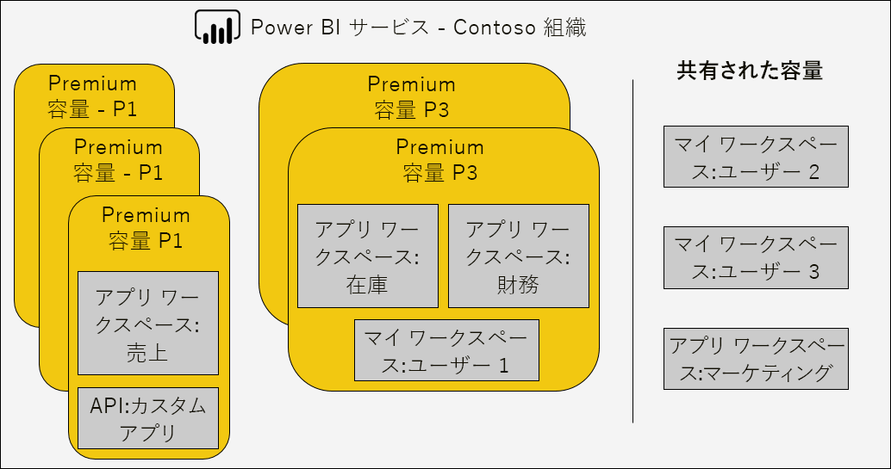

Premium 容量は、(定義済みの地理的リージョン) 内でどのデータ センター経由で Power BI コンテンツが存在する管理機能を提供することで、Power BI テナントのホーム リージョン以外のリージョンに割り当てることができます。 \[[12](#endnote-12)\]

Power BI サービス管理者と Office 365 のグローバル管理者は、Premium 容量を変更できます。 具体的には、設定できます。

- スケール アップまたはスケール ダウンのリソース容量のサイズを変更します。 ただし、P SKU を EM SKU にダウン グレードまたはその逆にアップグレードすることはできません。
- 追加または削除の容量管理者
- ユーザーの割り当てのアクセス許可が追加または削除
- 追加またはその他のワークロードを削除します。
- リージョンを変更します。

割り当てのアクセス許可は、特定の Premium 容量にワークスペースを割り当てる必要があります。 組織全体、特定のユーザーまたはグループには、アクセス許可を付与できます。

既定では、Premium 容量は、Power BI のクエリの実行に関連付けられているワークロードをサポートします。 次の 3 つの追加ワークロードもサポートしています。**ページ分割されたレポート**、**データフロー**、および**AI**します。 各ワークロードでは、ワークロードで使用できる最大メモリ (使用可能なメモリの合計のパーセンテージ) を構成する必要があります。 最大メモリ割り当てを増やすことができますをホストできる、有効なモデルの数と更新のスループットに影響されることを理解しておく必要があります。

メモリはデータフローに動的に割り当てられていますが、ページ分割されたレポートには静的に割り当てられています。 最大メモリを静的に割り当てることの理由は、容量の場合は、セキュリティで保護された包含領域内でページ分割されたレポートを実行することです。 設定は、モデルを読み込むには、使用可能なメモリが緩和されると、レポートのメモリをページ分割されたときに、十分に注意してください。

|                     | EM3                      | P1                       | P2                      | P3                       |
|---------------------|--------------------------|--------------------------|-------------------------|--------------------------|
| ページ分割されたレポート | N/A | 20% (既定値)、10% (最小値) | 20% (既定値)、5% (最小値) | 20% (既定値)、2.5% (最小値) |
| データフロー | 20% (既定値)、8% (最小値)  | 20% (既定値)、4% (最小値)  | 20% (既定値)、2% (最小値) | 20% (既定値)、1% (最小値)  |
| AI | N/A | 既定の 20% です。最小の 20%  | 20% (既定値)、10% (最小値) | 20% (既定値)、5% (最小値)  |
| | | | | |

Premium 容量を削除することができますし、そのワークスペースとコンテンツの削除はされません。 代わりに、共有された容量に割り当てられているワークスペースに移動されます。 Premium 容量を別のリージョンで作成したとき、ワークスペースは、ホーム領域の共有された容量に移動されます。

### ワークスペースを容量に割り当てる

Premium 容量にワークスペースを割り当てることができます、 **Power BI 管理者** **ポータル**またはアプリ ワークスペースの - で、**ワークスペース**ウィンドウ。

容量管理者は、Office 365 のグローバル管理者または Power BI サービス管理者を一括でワークスペースを割り当てる、 **Power BI 管理者** **ポータル**します。 割り当てられている一括を適用できます。

- **ユーザー別のワークスペース**:個人のワークスペースを含む、それらのユーザーによって所有されているすべてのワークスペースが Premium 容量に割り当てられます。 別の Premium 容量に既に割り当てられている場合は、ワークスペースの再割り当てが含まれます。 さらに、ユーザーには、ワークスペース割り当てアクセス許可も割り当てられます。

- **特定ワークスペース**
- **組織全体のワークスペース**:個人のワークスペースを含む、すべてのワークスペースが Premium 容量に割り当てられます。 さらに、現在および将来のすべてのユーザーには、ワークスペース割り当てアクセス許可が割り当てられます。 \[[14](#endnote-14)\]

使用して Premium 容量にワークスペースを追加することができます、**ワークスペース**ウィンドウで、ユーザーに提供するワークスペース管理者し、割り当てのアクセス許可を持ちます。

ワークスペース管理者は、割り当てのアクセス許可を必要とせず、(共有された容量) に、容量からワークスペースを削除できます。 専用容量からワークスペースを削除すると、実質的には、共有された容量にワークスペースを再配置します。 サポートされている上限の総計を超えたときにライセンスされたユーザー、またはスケジュールされた更新の中断の Premium 容量からワークスペースを削除すると結果、たとえば、Power BI 無料版を利用できなくなる共有のコンテンツに悪影響が生じる場合がありますに注意してください。容量を共有します。

Power BI サービスでは、Premium 容量に割り当てられているワークスペースが簡単にワークスペース名を表示する、ひし形のアイコンで識別されます。

### 容量の監視

Premium 容量を監視すると、容量を実行する方法の概要と、管理者が提供します。 使用して容量を監視することができます、 [Power BI Premium 容量メトリック アプリ](service-admin-premium-monitor-capacity.md)または[Power BI 管理ポータル](service-admin-premium-monitor-portal.md)します。

#### メトリックを解釈します。

リソースの使用状況とワークロードの状態の基準について理解を確立するためにメトリックを監視する必要があります。 容量が低速になるを監視するメトリックを理解することが重要と結論行うことができます。

理想的には、クエリは、レポート ユーザーに応答性の高いエクスペリエンスを提供しより高いクエリのスループットを有効にする 1 秒以内に完了する必要があります。 これは通常小さい問題 (更新を含む) - バック グラウンド プロセスを完了する時間が長くなる場合です。

一般に、低速のレポートは、暖房が過剰な量を示す値を指定できます。 レポートは、読み込みに失敗する場合、これは過剰過熱の容量を示します。 いずれの場合、根本原因をなど、さまざまな要因に起因する可能性があります。

- **クエリ失敗**間違いなく、メモリ不足とメモリにモデルを読み込むことができませんでした。 Power BI サービスは、失敗するまで 30 秒のモデルをロードしようとしています。

- **過剰クエリ待機時間**できるいくつかの理由が考えられます。
  - 最初に Power BI サービスの必要性は、モデルを削除し、照会されるモデル (高いデータセット削除率だけではないことの容量のストレスを示す値メモリ スラッシングを示すクエリ待機時間が長く、しない限り、思い出してください) をロード
  - モデルの読み込み時間 (特に大規模なモデルをメモリに読み込む待機)
  - 実行時間の長いクエリ
  - (容量の上限の超過) LC\DQ の接続が多すぎます
  - CPU の飽和
  - (各ビジュアルがクエリを思い出してください)、ページ上のビジュアルの数が多すぎると複雑なレポートのデザイン
- **期間を時間の長いクエリ**をモデルのデザインが最適化されていない、特に複数のデータセットは、容量でアクティブなやデータセットの 1 つだけの期間を時間の長いクエリが生成する場合を示すことができます。 これは、こと、容量が十分なリソース、および質問でデータセットが最適または低速だけを示しています。 時間の長いクエリを実行している問題となることが他のプロセスに必要なリソースへのアクセスをブロックすることができます。
- **待機時間の長い更新または AI 呼び出しの待機時間**メモリ不足のためのメモリ、多くのアクティブなモデルを指定または (並列の更新制限を超えている) を更新する問題のある更新をブロックしているその他。

メトリックを使用する方法の詳細な説明については、次に、 [Premium 容量の最適化](#optimizing-premium-capacities)セクション。

## Premium 容量の最適化

Premium 容量のパフォーマンスの問題が発生したときに、一般的な最初の方法は、最適化するか、許容される応答時間を復元する展開済みのソリューションを調整するは。 オーバーライドする根拠正当化できる場合を除き、追加の Premium 容量の購入を回避することです。

追加の Premium 容量が必要な場合は、このセクションで後で説明する 2 つのオプションがあります。

- Premium 容量をスケール アップします。
- 新しい Premium 容量を追加します。

最後に、アプローチと Premium 容量のサイズ変更をテストには、このセクションでは最後します。

### 一般的なベスト プラクティス

最適に実現するために使用率とパフォーマンスのによって、一般的な推奨事項として、ボード上に取得できるいくつかのベスト プラクティスがされます。 次のようなものが含まれます。

- 個人用ワークスペースではなく、アプリ ワークスペースを使用します。
- さまざまな容量にビジネスに不可欠とセルフ サービス BI (SSBI) を分離すること

  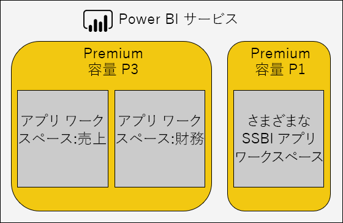

- Power BI Pro ユーザーにのみコンテンツを共有している場合がありますしない専用容量でコンテンツを格納する必要があります。
- 特定の更新時間を実現するために検索するときに、または特定の機能が必要なたとえば大規模なデータセットまたはレポート ページ分割されたときに、専用容量の使用

### 一般的な質問への対応

Power BI Premium の展開を最適化することは、ワークロードの要件、使用可能なリソースとその効果的な使用の理解に関連する複雑なトピックです。

このトピックでは、考えられる問題と説明については、および特定し、それらを解決する方法について説明する、7 つの一般的なサポート質問を説明します。

#### 非常に遅く、容量がある理由と、何ができますか。

低速な Premium 容量に投稿できる多くの理由があります。 この質問は、さらに低速で意味を理解する情報に必要です。 レポートは、読み込みに時間がかかるでしょうか。 または、読み込みに失敗しているでしょうか。 レポートのビジュアルは、読み込むか更新するユーザーがレポートと対話するときに時間がかかるでしょうか。 更新が必要ですが、または発生した場合よりも長くなることでしょうか。

理由の理解を得られることを調査し、開始できます。 次の 6 つの質問への応答に詳細に対処する際に役立つ特定の問題。

#### コンテンツは、容量を使用しますか。

使用することができます、 **Power BI Premium 容量メトリック**アプリを可能でフィルター処理して、ワークスペースのコンテンツのパフォーマンス メトリックを確認します。 Premium 容量内に格納されているすべてのコンテンツの過去 7 日間の時間単位でパフォーマンス メトリックとリソースの使用法を確認することになります。 これは、Premium 容量のパフォーマンスに関する一般的な問題のトラブルシューティング時に実行する最初の手順では多くの場合。

主要なメトリックを監視する次のとおりです。

- 平均 CPU 時間と高い使用率カウント
- メモリ使用率が高い数、および特定のデータセット、データフローおよびページ分割されたレポートのメモリ使用量を平均します。
- メモリに読み込まれたアクティブなデータセット
- クエリの平均値と最大期間
- クエリの平均待機時間
- 更新時間の平均のデータセットとデータ フロー
- 平均 AI 回呼び出すし、待機時間

また、Power BI Premium 容量メトリック アプリ、アクティブなメモリは過去 3 分間で使用されているために、削除されることはできませんが、レポートに割り当てられたメモリの総量を示します。 更新の待機時間で高スパイクは、大規模なまたはアクティブなデータセットと関連付ける可能性があります。

「Top 5 で平均所要時間」のグラフには、上位 5 つのデータセット、ページ分割されたレポート、データフロー、および容量のリソースを消費する AI 呼び出しが強調表示されます。 上位 5 つのリスト内のコンテンツは、調査と考えられる最適化の候補です。

#### 速度の遅いレポートはなぜですか。

次の表は、考えられる問題とを識別して、それらを処理する方法を示します。

##### リソースの容量が不足しています

| 可能性のある説明 | 識別する方法 | 解決する方法 |
| --- | --- | --- |
| 高の合計アクティブなメモリ (モデルには過去 3 分間で使用されているために削除できません)   クエリの待機時間で複数の高スパイク   更新の待機時間で複数の高スパイク | メモリ メトリックを監視\[ [18](#endnote-18)\]、および削除数\[ [19](#endnote-19)\] | モデルのサイズを小さくか、DirectQuery モードに変換する-を参照してください、[最適化モデル](#optimizing-models)このセクションのトピック   容量をスケール アップします。   コンテンツを別の容量に割り当てる |

##### 非効率的なレポートのデザイン

| 可能性のある説明 | 識別する方法 | 解決する方法 |
| --- | --- | --- |
| レポート ページには、多数のビジュアル (対話型のフィルター処理をトリガーできるビジュアルごとに少なくとも 1 つのクエリ) が含まれています   ビジュアルが必要以上のデータを取得します。 | レポートのデザインを確認してください。   レポートとやり取りする方法を理解するレポートのユーザーへのインタビューします。   データセット クエリのメトリックを監視\[ [20](#endnote-20)\] | 1 ページあたりの数のビジュアルでレポートを再設計 |

##### データセットは、(特にときにレポートを実行していたも) が遅い

| 可能性のある説明 | 識別する方法 | 解決する方法 |
| --- | --- | --- |
| ますます膨大な量のデータのインポート   RLS の役割を含む、複雑な非効率的な計算ロジック   完全に最適化されたモデル   (DQ/LC)ゲートウェイの待機時間   低速の DQ ソース クエリの応答時間 | モデルの設計を確認してください。   ゲートウェイのパフォーマンス カウンターを監視します。 | 参照してください、[最適化モデル](#optimizing-models)このセクションのトピック |

##### 高い同時実行のレポートの利用状況

| 可能性のある説明 | 識別する方法 | 解決する方法 |
| --- | --- | --- |
| 高いクエリ待機時間   CPU の飽和   DQ LC/接続の制限を超えています | CPU 使用率を監視\[ [21](#endnote-21)\]、クエリの待機時間と使用率の DQ/LC \[ [22](#endnote-22) \]メトリック + クエリ期間 – は変動する場合同時実行の問題を示します | スケール アップ、容量、またはコンテンツを別の容量に割り当てる   1 ページあたりの数のビジュアルでレポートを再設計 |

#### レポートはなぜ読み込まれていませんか?

レポートを読み込むことに失敗したときに、最悪のシナリオと、容量がメモリ不足と、過剰過熱はことを意味します。 これは、読み込まれたすべてのモデルがアクティブに照会しているため削除できるは、され、ときに、更新操作が一時停止または遅延に発生します。 Power BI サービスは、30 秒間に、データセットを読み込むしようし、提案をすぐにもう一度試すと、エラーのユーザーに通知が正常にします。

現在のレポートの読み込みエラーを監視するメトリックはありません。 監視のシステム メモリ、具体的には最高の使用率および使用率を最大の時間によっては、この問題が発生する可能性を特定できます。 高データセット立ち退き数とデータセットの更新の平均待機時間長は、この問題が発生している提案でした。

非常にときどきこの場合、このことがありますは考慮されません優先度の問題。 レポート ユーザーには、サービスがビジー状態、短時間の後に再試行すべきことが通知されます。 頻度が高すぎるこのような場合、Premium 容量のスケール アップによって、またはコンテンツを別の容量に割り当てることで、問題を解決できます。

容量の管理者 (と Power BI のサービス管理者) を監視できます、**クエリが失敗した**これが行われるタイミングを決定するメトリックです。 容量は、システムのオーバー ロードが発生した場合、すべての操作をリセットするを再起動することもできます。

#### 理由の更新を開始していませんスケジュールででしょうか。

スケジュールされた更新の開始時刻とは限りません。 Power BI サービスがバック グラウンド操作をよりで対話型操作を優先は常にことを思い出してください。 更新は、2 つの条件が満たされたときに発生するバック グラウンド操作を示します。

- 十分なメモリがあります。
- Premium 容量の同時更新がサポートされている数を超えていません。

条件が満たされていないときに、条件が有利になるまで、更新がキューにします。

完全な更新では、データセットの現在のメモリ サイズを少なくとも 2 倍のリコールが必要です。 十分なメモリが利用できない場合は、メモリが解放されるモデルの削除 - つまり、1 つまたは複数のデータセットが非アクティブになり削除できるまでに遅延が発生するまで、更新は開始できません。

サポートされている最大の同時実行更新数が 1.5 倍、バックエンド v コア、切り上げに設定されていることを思い出してください。

[次へ] のスケジュールされた更新が開始する前に、開始ことはできません、スケジュールされた更新は失敗します。 UI から手動でトリガーをオンデマンドでの更新は失敗するまでに最大 3 回を実行しようとします。

容量の管理者 (と Power BI のサービス管理者) を監視できます、**平均更新待機時間 (分)** スケジュールされた時刻と操作の開始の間の平均遅延を決定するメトリックです。

通常は時刻のデータに影響を与える、管理用の優先順位を更新、する間は、十分なメモリが使用できることを確認します。 これは、既知のための十分なリソースと容量にデータセットを分離するが含まれる可能性があります。 Admins でした時差を設定する、競合を最小限に抑えるの定期データ更新の時間を短縮したりするデータセットの所有者を連携することもできます。 管理者は、キュー更新を表示したり、データセットのスケジュールを取得することはできませんに注意してください。

#### 低速の更新はなぜですか。

更新には、低速、または (以前の一般的な質問アドレス) と低速であるユーザーの体感を指定できます。

更新が実際には低速のときは、いくつかの理由が考えられますことができます。

- CPU が不足しています (更新は非常に CPU を消費するを指定できます)
- メモリ不足のため、結果として更新を一時停止する (これは、最初からやり直す場合の条件に recommence に有利な更新が必要)
- 非容量の理由から、データ ソース システムの応答性、ネットワーク待機時間、無効なアクセス許可、またはゲートウェイのスループットを含む
- データ ボリュームの増分を構成する正当な理由を更新、以下に示した

容量の管理者 (と Power BI のサービス管理者) を監視できます、**平均更新期間 (分)** 時間の経過と共に、比較のためのベンチマークを決定するメトリックと**平均更新待機時間 (分)** 間の平均遅延を決定するメトリックの平均、スケジュールされた時刻と操作の開始の間遅延します。

増分更新では、特に大規模なモデルのテーブルのデータを更新するための所要時間を大幅に短縮できます。 これには増分更新に関連付けられている 4 つの利点があります。

- **更新は高速**:テーブルのサブセットのみに読み込み、削減の CPU およびメモリの使用が必要があり、複数のパーティションを更新するときに、並列処理が高くなることが
- **必要な場合にのみ更新が発生する**:増分更新ポリシーを構成して、データが変更されたときのみを読み込む
- **更新はより信頼性の高い**:揮発性データのソース システムに短い実行中の接続が切断されたときに受けにくくなります
- **モデルのままトリム**:増分更新ポリシーは、時間のスライディング ウィンドウ外の履歴を自動的に削除するように構成できます。

詳細についてを参照してください、[は Power BI Premium の増分更新](service-premium-incremental-refresh.md)ドキュメント。

#### 完了していないを更新するデータはなぜですか。

データ更新では、開始が完了に失敗した場合は、いくつかの理由が考えられますことができます。

- メモリ不足、Premium 容量で 1 つのみのモデルがある場合でもつまりモデルのサイズが非常に大きい
- 非容量の理由から、データを含むソースのシステムが切断されたとき、無効なアクセス許可、またはゲートウェイのエラー

容量の管理者 (と Power BI のサービス管理者) を監視できます、**メモリ不足により更新エラー**メトリック。

#### AI の呼び出しはなぜ失敗しているでしょうか。

AI の呼び出しは、複数の理由により失敗します。 最低限のメモリが必要なは、AI を開始するワークロードには、5 GB ですがいくつかの入力データセットに対して十分なしないことが考えられます。 たとえば、自動の machine learning のモデルのトレーニングが必要です 2 回以上、および場合によっては複数回入力データセットのサイズ。 また、2 時間よりも時間がかかる場合、AI の呼び出しは終了します。 自動化されたマシンのこれら 2 つの時間の最適なモデルの 2 時間で完了しないモデルのトレーニング呼び出しの学習が返されます。  AI の呼び出しは、優先順位が高く、対話型の要求によって中断されることができますも。

管理者は、他の要求よりも優先の兆候の AI の待機時間を監視します。 管理者は、十分なメモリが入力データ サイズの基準とした AI ワークロードに使用できることも確認できます。 容量が十分なリソースに AI ワークロードを分離する必要があります。 管理者は、時差を設定する、競合を最小限に抑えるのデータ フローの更新時間を短縮したりするデータ フローの所有者と調整こともできます。 管理者用の AI の呼び出しのキューを表示するに注意してください。

### モデルの最適化

最適なモデルのデザインは効率的でスケーラブルなソリューションを提供するために重要です。 ただし、完全なディスカッションを提供するこのホワイト ペーパーの範囲を超えては、 代わりに、このセクションでは、主要な分野の考慮事項のモデルを最適化するときにします。

#### Power BI でホストされているモデルの最適化

データ ソースとモデル レイヤーでは、Premium 容量でホストされている最適化モデルを実現できます。

モデルのインポートの最適化の可能性を考慮してください。

データ ソース層。

- 最速の可能な更新を確実にデータの事前統合、適切なインデックスを適用することや、増分更新期間に合致するテーブルのパーティションを定義する計算を具体化することで最適化できますリレーショナル データ ソース (の代わりに計算されます。テーブルと列をモデル化) または計算ロジックをビューに追加します。
- 非リレーショナル データ ソースはリレーショナル ストアと事前統合できます。
- ゲートウェイがあるための十分なネットワーク帯域幅とデータ ソースの近くに専用のマシンであれば、十分なリソースを確認します。

モデル層。

- 電源クエリのクエリの設計では、最小限に抑えるしたり、複雑な変換と特にマージ (データ ウェアハウスこれを実現する、抽出-変換-読み込みステージ中に) さまざまなデータ ソースを削除することができます。 また、適切なデータ ソースのプライバシー レベルが設定されていることを確認、これを回避できますを複数のクエリで結合された結果を生成するために完全な結果を読み込み、Power BI を必要とします。
- モデル構造では、読み込むデータを決定し、モデルのサイズに直接影響を及ぼします。 これは、(特に履歴データ) の行を削除する列を削除することで、または (ただし、詳細なデータの読み込み) の集計データを読み込むことによって、不要なデータの読み込みを回避するために設計できます。 非常に効率よく圧縮または保存しないでください (特にテキスト列) が高カーディナリティで列を削除することで、大きなサイズの縮小を実現できます。
- 双方向のフィルター処理を許可する特別な理由がない限り、一方向のリレーションシップを構成することによって、モデルのクエリ パフォーマンスを向上できます。 双方向のフィルター処理ではなく CROSSFILTER 関数の使用も検討してください。
- 集計テーブルは、これには、更新に時間がかかるのモデルと結果のサイズが増えますが、読み込むことによって応答の事前集計データを高速なクエリを実現できます。 一般に、非常に大規模なモデルや複合モデル デザインの集計テーブルを予約する必要があります。
- 計算テーブルおよび列は、モデルのサイズを増やすし、更新に時間がかかると。 一般に、ストレージ サイズを小さくと更新時間の短縮を実現できます、データが具体化またはデータ ソースで計算されます。 それができない場合は、Power Query のカスタム列を使用すると強化されたストレージの圧縮を提供できます。
- メジャーおよびおそらく高価な数式を回避するためのロジックを書き直し、RLS のルールの DAX 式を調整する機会がある可能性があります。
- 増分更新は大幅に更新時間を短縮し、メモリと CPU の節約します。 トリム モデルのサイズを保持する履歴データを削除する、増分更新を構成することもできます。
- さまざまなと競合しているクエリのパターンがある場合に、2 つのモデルとしてモデルを再設計でした。 たとえば、レポートの一部がすべての履歴、およびが存在する高度な集計が 24 時間の待機時間を許容します。 他のレポートは、今日のデータとしていて、個々 のトランザクションへのきめ細かいアクセスを必要があります。 デザインではなく、すべてのレポートを満たすために 1 つのモデルは、各要件用に最適化された 2 つのモデルを作成します。

DirectQuery モデルの最適化の可能性を検討してください。 モデルは、基になるデータ ソースにクエリ要求を発行、データ ソースの最適化が応答性の高いモデルのクエリを配信するために重要です。

 

データ ソース層。

- データ ソースを最適化する確実に、最も高速な可能なクエリを実行する (データ モデル レイヤーでことはできません)、適切なインデックスを適用することを事前に統合することによって、具体化、テーブルのパーティションを定義する (インデックス付きビューの場合) を使用してデータを集計し、計算の量を最小限に抑えます。 パススルー クエリは、のみをフィルター処理し、インデックス付きのテーブルまたはビューの間の内部結合を実行する必要がある場合、最適なエクスペリエンスが実現されます。
- ゲートウェイがあるための十分なネットワーク帯域幅とは、データ ソースの近くに専用のマシンであれば、十分なリソースを確認します。

モデル層。

- Power Query のクエリの設計が可能であればは適用されません変換 - 最小の絶対パスへの変換を保持しようとするはそれ以外の場合
- 双方向のフィルター処理を許可する特別な理由がない限り、一方向のリレーションシップを構成することによって、モデルのクエリ パフォーマンスを向上できます。 (このような場合) ときに参照整合性が適用されると仮定するリレーションシップをモデル化を構成することも、(外部結合) ではなくより効率的な内部結合を使用してデータ ソースのクエリが発生します。
- Power Query のクエリのカスタム列または計算列のモデルを作成しないように - 可能であれば、データ ソースでこれらの具体化
- メジャーおよびおそらく高価な数式を回避するためのロジックを書き直し、RLS のルールの DAX 式を調整する機会がある可能性があります。

複合モデルの最適化の可能性を検討してください。 複合モデルのインポートと DirectQuery テーブルの両方でできることを思い出してください。

- 一般に、インポートと DirectQuery モデルは、最適化のトピックでは、これらのストレージ モードを使用する複合モデル テーブルに適用されます。
- 通常、努めてディメンションの種類のテーブル (ビジネス エンティティを表す) を構成することによってバランスの取れたデザインを実現するために 2 つのストレージ モードとファクトの種類のテーブル (多くの場合、大規模なテーブル、運用上の点を表す) として DirectQuery ストレージ モードとしています。 デュアル ストレージ モードは、両方をインポートおよび DirectQuery ストレージ モード、およびこれにより、Power BI サービスのパススルー ネイティブ クエリを生成するときに使用する最も効率的なストレージ モードを確認するのには意味します。
- ゲートウェイがあるための十分なネットワーク帯域幅とデータ ソースの近くに専用のマシンであれば、十分なリソースを確認します。
- 集計のテーブルには、インポートのストレージ モードは、DirectQuery ストレージ モードのファクトの種類のテーブルの集計に使用するときに劇的なクエリ パフォーマンスの機能強化を実現できますが構成されています。 この場合は、集計のテーブルにより、モデルのサイズが向上し、更新時刻、および多くの場合は、許容可能なトレードオフの高速なクエリ。

#### 外部でホストされているモデルの最適化

説明した多くの最適化の可能性、 [Optimizing Power BI-Hosted モデル](#optimizing-power-bi-hosted-models)トピックでは、Azure Analysis Services と SQL Server Analysis Services を使用して開発モデルにも適用されます。 消去の例外は、現在サポートされていないなどの複合モデルの集計テーブルを特定の機能です。

データセットの外部でホストされている別の考慮事項は、Power BI サービスとの関連をホストしているデータベースです。 Azure Analysis Services、Power BI テナント (ホーム リージョン) と同じリージョンに Azure リソースを作成することを意味します。 SQL Server Analysis services、iaas、これは、同じリージョン内の VM をホストしていることを意味し、オンプレミスのことには、効率的なゲートウェイ セットアップの確認を意味します。

余談ですが、Azure Analysis Services データベースと SQL Server Analysis Services 表形式データベースは、そのモデルがメモリに完全に読み込まれている必要があり、クエリをサポートするために常にあることがありますすべてのことに注意してくださいに関心のある可能性があります。 Power BI サービスのようにする場合は、更新中に、モデルがオンライン状態を維持する必要がありますを更新するための十分なメモリが必要です。 Power BI サービスとは異なりは、概念モデルが使用量に応じてメモリとの間に自動的に期限切れことはありません。 Power BI Premium では、そのため、モデルがメモリ使用量を削減を使用したクエリを最大化するより効率的なアプローチを提供します。

### 容量計画

Premium 容量のサイズには、その使用可能なメモリおよびプロセッサ リソースと容量に制限が決定します。 Premium 容量の数は、の考慮事項もワークロードを互いの特定の容量に役立つ複数の Premium を作成します。 1 つのノードの容量、ストレージ容量は 100 TB 以上のすべてのワークロードに十分である可能性があることに注意してください。

Premium 容量の数とサイズを決定することは容易で特にの初期容量を作成する場合。 容量のサイズ変更は、ワークロードの平均を表すかを理解するときに、最初の手順では、毎日の使用状況が必要です。 すべてのワークロードが等しいことを理解しておく必要があります。 例: -、スペクトルの一方の end 100 の同時実行ユーザーが 1 つのビジュアルを含む 1 つのレポート ページへのアクセスが簡単に行えます。 まだ - - スペクトルのもう一方の端に 100 の同時実行ユーザーが 100 のさまざまなレポートへのアクセス レポート ページで、100 のビジュアルで各します。 リソースの容量の需要を非常に異なる。

容量管理者は、そのため、環境、コンテンツと予想される使用状況に固有の多くの要因を考慮する必要があります。 オーバーライドする目的は、一貫性のあるクエリ時間、許容される待機時間、および削除率を提供する一方、容量使用率を最大化します。 考慮すべき要因を含めることができます。

- **サイズとデータの特性をモデル化**:インポート モデルの照会や更新を許可するメモリに完全に読み込まれる必要があります。 LC/DQ データセットには、大量のプロセッサの時間と複雑なメジャーまたは RLS のルールを評価する可能性がある重大なメモリを要求できます。 メモリとプロセッサのサイズ、LC/DQ クエリのスループットは、容量のサイズによって制限されます。
- **同時実行の有効なモデル**:インポートのさまざまなモデルの同時実行クエリは配信応答性とパフォーマンスを最適なメモリ内にあるときにします。 最新の更新を許可する追加のメモリと、頻繁にクエリするすべてのモデルをホストするための十分なメモリが必要です。
- **モデルの更新をインポート**:更新の種類 (フルまたは増分)、期間、および Power Query のクエリとテーブル/列の計算ロジックの複雑さについては、メモリとプロセッサ使用率が特にに影響します。 同時更新は、容量のサイズ (1.5 x backend v コア、切り上げ) によって制限されます。
- **同時実行クエリ**:により、多くの同時実行クエリに応答した場合に報告プロセッサまたは LC/DQ 接続容量の上限を超えています。 これは、さまざまなビジュアルを含むレポート ページの場合、特にです。
- **データフローには、レポート、および AI 機能が改ページ調整された**:データフロー、改ページ調整されたレポート、および容量のメモリが構成可能な最大パーセンテージを必要とするたびに、AI 関数をサポートするために、容量を構成できます。 メモリのデータフローを動的に割り当てが、ページ分割されたレポートと AI のワークロードに静的に割り当てられています。

これらの要因では、容量管理者は複数の容量の作成を検討できます。 複数の容量は、ワークロードの分離に使用して、優先度のワークロードのリソースが保証されることを確認するように構成できます。 たとえば、セルフ サービス BI (SSBI) ワークロードからビジネス クリティカルなワークロードを分離する 2 つの容量を作成できます。 IT 部門にのみ与えられるアクセスのオーサリングの保証されたリソースを提供する大規模な企業のモデルを分離する、ビジネスに不可欠な容量を使用できます。 ビジネス アナリストに与えられるアクセス権を持つ多数の小さなモデルをホストする SSBI 容量を使用できます。 SSBI 容量は、許容可能であるクエリまたは更新の待機にあります。

時間の経過と共に容量管理者は容量をスケール アップまたはスケール ダウンすることによって、ワークスペース、または、容量間ワークスペース間でコンテンツを移動することによって、容量にワークスペースを分散できます。 一般より大きなをホストするモデルをスケール アップおよびスケールのより高い同時実行するスケール アウトします。

V コアを持つテナントの提供にライセンスを購入していることを思い出してください。 購入、 **P3**に従って作成するか、最大で 4 つの Premium 容量では、サブスクリプションを使用できます P3、または P2、x 2 または 4 x 1 つまり x P1 します。 また、アップサイズ P2 容量 P3 容量を前に考慮対象としてを指定できる仮想コアを分割 P1 の 2 つの容量を作成します。

### テスト アプローチ

容量サイズを終えたら、制御された環境を作成してテストを実行できます。 実践的かつ経済的なオプションは作成 P1 容量が、p2、A4 容量と同じサイズであるかを示す、Azure (A Sku) のキャパシティと P3 容量、A5、A6 容量と同じサイズそれぞれします。 Azure の容量は、簡単に作成でき、時間単位で課金されます。 そのため、テストが完了すると簡単に削除するコストを止めるにします。

テストのコンテンツ容量は、Azure で作成されたワークスペースに追加することができ、1 人のユーザーとしては実行クエリの現実的な代表的なワークロードを生成するレポート。 インポート モデルがある場合は、各モデルの更新も実行する必要があります。 監視ツールは、リソース使用率を理解するすべてのメトリックを確認し、使用できます。

テストが反復可能である必要があります。テストを複数回を実行して毎回同じ結果を約、配信する必要があります。 推定は true。 運用環境の条件下でのワークロードを推定するこれらの結果の平均を使用できます。

ストレス テストを生成するには、負荷テスト現実的なワークロードをシミュレートするためにアプリケーションの開発を検討してください。 これを実現する方法の詳細については、このホワイト ペーパーの範囲外です。 さらに、コード サンプルについてを参照してください、 [Visual Studio ロード テストを使用した Power BI アプリケーション テスト負荷](https://blogs.msdn.microsoft.com/charles_sterling/2018/04/04/webinar-load-testing-power-bi-applications-with-visual-studio-load-test/)ウェビナー。

## 実際のシナリオの調査

このセクションでは、一般的な問題または課題を特定し、方法、およびそれらを解決するための方法を説明するいくつかの実際のシナリオが導入される予定します。

- [データセットを常に最新の状態に保つ](#keeping-datasets-up-to-date)
- [データセットの速度の遅い応答を識別します。](#identifying-slow-responding-datasets)
- [散発速度の遅い-応答の原因を特定するデータセット](#identifying-causes-for-sporadically-slow-responding-datasets)
- [十分なメモリがあるかどうかを決定します。](#determining-whether-there-is-enough-memory)
- [十分な CPU があるかどうかを決定します。](#determining-whether-there-is-enough-cpu)

グラフとテーブルの例も、手順は、 **Power BI Premium 容量メトリック アプリ**(アプリ) には、Power BI 管理者がアクセスするには、します。

### 日付にデータセットを維持する方法

このシナリオで、調査は、レポート データは、「古い」にすることもあります登場したユーザーが訴えていましたときにトリガーされました。

管理者の対話、アプリで、**更新**してデータセットを並べ替え、visual、**最大待機時間**降順で統計情報。 これにより、データセットを持つ最も長い待機時間、ワークスペース名によるグループ化を表示したりします。

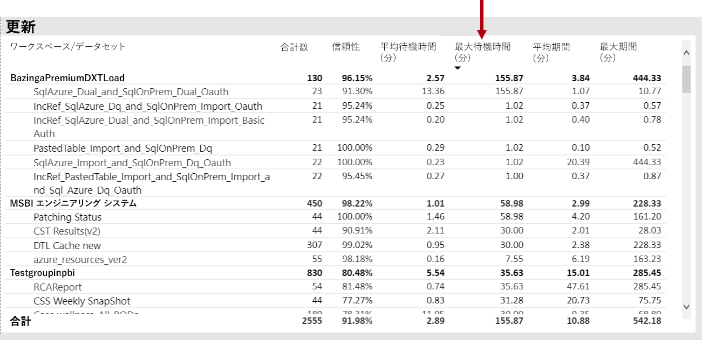

さらに、、 **1 時間あたり平均更新待機時間**更新の待機時間は約 4 PM 毎日でピーク一貫した方法がわかりますがビジュアルでは、します。

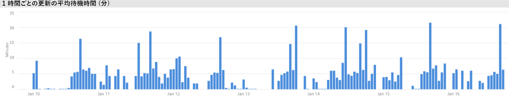

これらの結果の可能性のあるいくつかの説明があります。

- 更新の回数が多すぎることが発生するいると同時に、容量ノード (既定のメモリ割り当てで、P1 での 6 個同時実行の更新) によって課される上限の超過

- データセットを更新するのには、(少なくとも 2 倍の完全な更新に必要なメモリが必要)、使用可能なメモリに収まるようには大きすぎる可能性があります。
- Power Query の非効率的なロジックは、データセットの更新中にメモリ使用量の急増に結果可能性があります。 容量はビジー状態でこのことができますに到達する、更新が失敗し、可能性のある、容量の他のレポート ビューの操作に影響は、物理的な制限。
- メモリに常駐させる必要があるデータセットを頻繁に照会される使用可能なメモリの制限により、更新するその他のデータセットの機能に影響する可能性

これを調査するには、Power BI 管理者はことができますを探します。

- 使用可能なメモリが 2 倍を更新するデータセットのサイズより小さい場合、データ更新時に使用可能なメモリの不足
- データセットをまだが更新されていないと、更新する前にメモリに含まれている、負荷の高い更新時間中に対話型のトラフィックを表示するが開始します。 データセットの領域のデータセットがメモリに読み込まれる任意の時点で、Power BI を表示する管理者が確認できます**データセット**の横棒の 1 つをクリックして特定の時点にアプリとクロス フィルター タブで、 **1 時間ごとデータセットの数が読み込まれる**します。 (次の図に示すように) ローカルのスパイクが複数のデータセットが、スケジュールされた更新の開始を遅らせることがメモリに読み込まれるときに 1 時間を示します
- 増加データセット立ち退き数より前の更新の時間が多すぎるのさまざまな対話型レポートを提供しているによる高いメモリ負荷があったことを示すを開始するデータの更新がスケジュールされているときに配置します。 **1 時間ごとのデータセットの立ち退き数とメモリ消費量**visual が立ち退き数の急増を明確に示すことができます。

次の図では、ローカルのスパイクは、読み込まれたデータセットで、更新の開始対話型クエリを実行することが遅延します。 期間を選択すると、 **1 時間ごとの読み込まれたデータセット カウント**ビジュアルがクロス フィルター、**データセット サイズ**visual します。

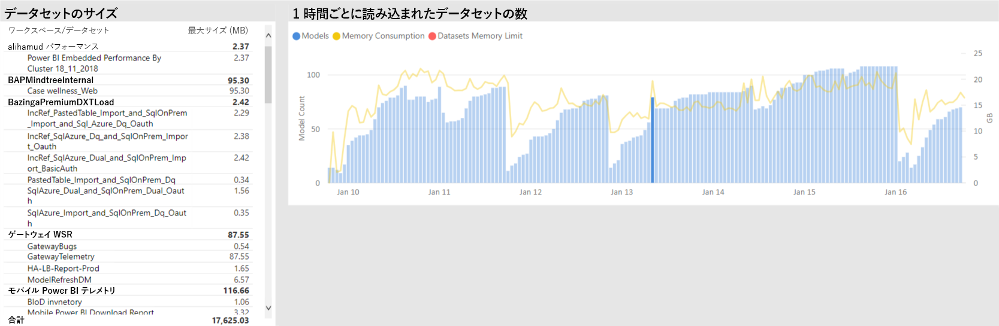

Power BI 管理者は、十分なメモリがまずデータの更新に使用できることを確認する手順を実行して問題を解決する試行します。

- データセットへの接続に時差を設定して、データを空間の所有者とするよう求める更新スケジュール
- データセットを減らすことの不要なダッシュ ボードまたはダッシュ ボードを削除することによってクエリの負荷を並べて表示、特に行レベル セキュリティを適用します。
- Power Query のロジックを最適化することによって、データの更新を与えたり、モデルの計算列またはテーブルには、データセットのサイズを減らすか、構成データの増分を実行する大規模なデータセットの更新

### データセットの速度の遅い応答を識別します。

このシナリオで、調査がトリガーされたときに、ユーザーは、特定のレポートが開くに長い時間を要した訴えていました時点がハングします。

アプリでは、Power BI 管理者が使用できます、**クエリ期間**データセットを降順で並べ替えることでパフォーマンスの低いデータセットを決定する visual**の平均実行時間**します。 このビジュアルも説明データセット クエリの数のデータセットをクエリする頻度を確認できるようにします。

Power BI 管理者を参照できます、**クエリ期間分布**バケット化クエリのパフォーマンスの全体的な分布を示すビジュアルでは、(< = 30、0 ~ 100 ミリ秒など) のフィルター選択された期間。 クエリの take 1 秒または以下と見なされる応答性の高いほとんどのユーザーによって一般に、長い時間がかかるクエリは、パフォーマンスが低下したという認識を作成する傾向があります。

**1 時間あたりのクエリ期間分布**と容量のパフォーマンスでしたが認識されていた 1 時間の期間を識別するために、Power BI 管理者は、低下として visual します。 大きいほど、バー セグメントを表すクエリを実行する、1 秒、大きい方の期間ユーザーがパフォーマンスの低下を感じることのリスクです。

ビジュアルは対話型、および、バーのセグメントを選択すると、対応する**クエリ期間**ビジュアル、レポート ページ上の表は、クロス フィルター処理を表すデータセットを表示します。 このクロス フィルターにより、簡単に識別するために、Power BI 管理者のデータセットからの応答が緩やかに変化します。

次の図は、ビジュアルでフィルター処理された**クエリ期間の 1 時間あたりのディストリビューション**、1 時間のバケットでパフォーマンスの低いデータセットにフォーカスします。 

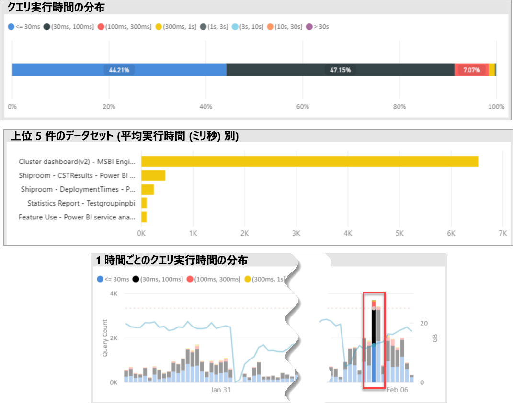

特定の 1 時間の期間で不適切なパフォーマンスのデータセットが識別されると、Power BI 管理者はパフォーマンスの低下が、オーバー ロードされた量が原因で発生やが不十分なため、データセットまたはレポートを設計するかどうかを調査できます。 これを実現するを参照していることができます、**クエリの待機時間**visual、および平均クエリの待機時間の降順で並べ替えデータセット。 クエリの大部分が待機している場合、データセットの高い需要はこの、多くのクエリが待機の原因である可能性があります。 平均のクエリは、時間を待機している場合は、大きな (> 100 ミリ秒)、その価値があります、データセットとレポートを最適化できるかどうかは表示して確認します。 たとえば、おそらく少ないビジュアル レポート ページまたはを指定、DAX 式の最適化。

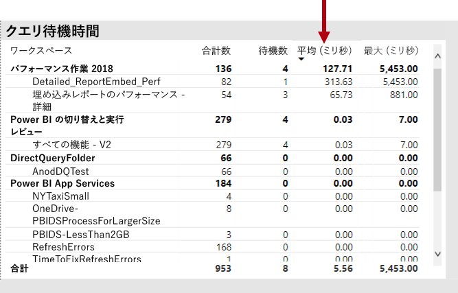

データセットをクエリ待機時間ビルドのいくつかの理由があります。

- 最適なモデル設計、メジャーの式またはレポートも設計 - すべての状況に役立つ高レベルの CPU を消費するクエリの実行時間が長い。 これにより、新しいクエリを待つ CPU スレッドが使用可能になるし、営業時間中によく見られますコンボイ効果 (紙詰まりを考えてみてくださいトラフィック) を作成することができます。 **クエリが待機**データセットに高の平均クエリの待機時間があるかどうかを決定する主なリソースがページになります。
- 多数の同時実行の容量のユーザー (数百数千から) 同じレポートまたはデータセットを使用します。 同時実行のしきい値を超えていますが正しくないでも適切に設計されたデータセットを実行できます。 これは通常、他のデータセットの表示よりもクエリの数の大幅な向上値を示す 1 つのデータセットによって示されます (つまり 300 K クエリと比較して 1 つのデータセットの < その他のすべてのデータセットに対するクエリを 30 K)。 クエリを調整するには、このデータセットは開始に表示されるを待機する時点で、**クエリ期間**ビジュアル。
- 多く異種クエリされるデータセット同時に、データセットが頻繁にメモリとの間サイクル スラッシングの原因です。 これにより、データセットがメモリに読み込まれると、パフォーマンスの低下が発生しているユーザー。 これには、Power BI 管理者を参照できます、 **1 時間ごとのデータセットの立ち退き数とメモリ消費量**ビジュアルでは、多数のデータセットがメモリに読み込まれることであることを示す、繰り返し無効になっています。

### 散発速度の遅い-応答の原因を特定するデータセット

このシナリオで、調査がユーザーには、それ以外の時間が許容応答性がレポートのビジュアルが感じたことがありますの反応が遅いか、応答しなくなる可能性がありますが説明されているときにトリガーされました。

アプリで、**クエリ期間**セクションは、次のようにその原因データセットの検索に使用されました。

- **クエリ期間**visual 管理者 (最上位にクエリされるデータセットから始まります) データセットでデータセットをフィルター処理、調査のクロス フィルター処理された横棒、**クエリの 1 時間あたりのディストリビューション**ビジュアル。
- 1 つの 1 時間バーがそのデータセットの場合は、他の 1 時間バーとすべてのクエリ期間のグループ間の比率で大幅な変更を表示するときに (つまり、色の間の比率を変更大幅に)、このデータセットで散発的な変更の説明になります。パフォーマンス。
- パフォーマンスの低いクエリ、の不規則な部分を示す、1 時間のバーには、そのデータセットが他のデータセットのアクティビティに起因、ノイズの多い近隣の効果を受ける timespan が示されます。

1 時間で 1 月 30 日に、次のイメージ、データセットのパフォーマンスに重要な修正が発生場所によって示される、バケットのサイズ"(3,10s]"の実行期間。 その 1 時間バーをクリックすると、すべてのデータセット期間中、メモリに読み込まれるため迷惑な隣人の効果を原因と候補の原因としてデータセットをもたらしますが表示されます。

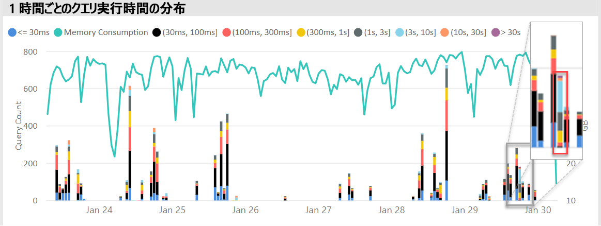

問題のある期間が (つまり中に 1 月 30 日上の図に) 識別されると、Power BI 管理者はデータセット フィルターをすべて削除し、データセットがこの期間中にアクティブに照会されましたかを判断するには、その timespan でのみフィルター処理できます。 迷惑な隣人効果の原因データセットは、最上位のクエリのデータセットまたは平均クエリ時間が最長の実行時間のいずれかのいずれかでは通常は。

この問題を解決は、別の Premium 容量、またはデータセットのサイズ、使用量の要件、およびデータ更新のパターンと共有された容量別のワークスペースにデータセットがサポートされている原因を配布できます。

逆はも true 可能性があります。 Power BI 管理者は、データセット クエリのパフォーマンスが劇的に向上させる回数を確認し、何が消えてを探しますでした。 特定の情報がその時点で不足している場合は、原因となる問題をポイントするヘルプ可能性があります。

### 確認するかどうかがメモリ不足

容量のワークロードを完了するのに十分なメモリがあるかどうかを確認するのには、Power BI 管理者を参照できます、**消費されるメモリの割合**で visual、**データセット**アプリのタブ。 **すべて**(合計) のメモリがかどうかは積極的にクエリを実行、または処理に関係なく、メモリに読み込まれるデータセットによって消費されるメモリを表します。 **アクティブな**メモリがアクティブに処理されているデータセットによって消費されるメモリを表します。

正常な容量のビジュアルはすべて (合計) 間のギャップを示す、このようになりますが、アクティブなメモリ。

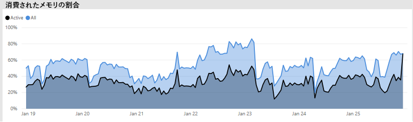

メモリ不足が発生している容量を同じビジュアルはアクティブなメモリと合計のメモリが収束してであり、その時点で追加のデータセットをメモリに読み込むことはできません明確に表示されます。 この場合、Power BI 管理者をクリックして**容量再起動**(で**オプションの高度な**管理者ポータルの容量設定領域の)。 メモリからフラッシュされ、(クエリまたはデータの更新) を必要に応じてメモリに再読み込みすることができますにされているすべてのデータセットで容量の結果を再起動しています。

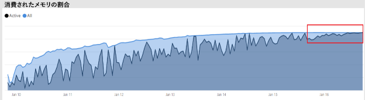

### 確認するかどうかがあるのに十分な CPU

一般に、80% を下回る容量の平均 CPU 使用率のままです。 この値を超える CPU の飽和が容量に近づいているを意味します。

CPU の飽和の効果は、多くの CPU コンテキストの切り替えを実行するすべての操作を処理しようとする容量によりする必要がありますよりも時間がかかって操作によって表現されます。 これは高いクエリによって示されますが、同時実行クエリ数が高、Premium 容量内の待機時間。 高いクエリ待機時間の結果とは、通常よりも低速の応答性です。 Power BI 管理者は、簡単に表示することで、CPU が飽和状態とを識別できます、**時間クエリ待機時間のディストリビューション**ビジュアル。 ピーク時に定期的なクエリは待機時間のカウントが潜在的な CPU の飽和を示すためです。

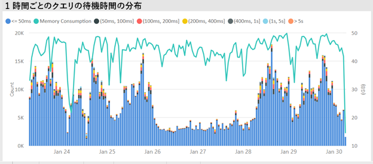

同様のパターンは CPU の飽和に寄与している場合、バック グラウンド操作で検出場合があります。 Power BI 管理者は、(おそらく他の継続的なデータセットの更新や対話型クエリを使用して) のために CPU の飽和を示すことができます、特定のデータセットの更新時間で定期的な急増を検索できます。 この場合を参照する、**システム**アプリ ビュー必ずしも CPU が 100% であります。 **システム**1 時間あたりの平均値が表示されますが、CPU できます飽和状態になったの数分間の負荷の高い操作では、待機時間で急増として表示します。

CPU の飽和の効果を表示する複数の微妙な差異があります。 待機クエリの数は重要ですが、クエリの待機時間はある程度はっきりパフォーマンスの低下を発生させることがなく常に実行されます。 (クエリの平均時間を長く、複雑かサイズを示す) によるデータセットの一部が他よりも CPU の飽和の効果をやすい。 これらのデータセットを簡単に識別するには、Power BI 管理者を確認のバーの色の構成の変更について、**時間単位の待機時間の分布**ビジュアル。 外れ値のバーを発見した後は検索クエリの待機期間中に含まれていたデータセットとクエリの実行時間の平均と比較して平均クエリの待機時間を見てもできます。 これら 2 つのメトリックは同じ大きさであり、データセットのクエリ ワークロードは容易ではときに、CPU が不足していますが、データセットが影響を受ける可能性が高いです。

この影響は、結果の各バースト中に CPU の飽和状態 (つまり、トレーニング セッションの場合) で複数のユーザーごとの頻度の高いクエリの短いバーストで、データセットが使用されるときに、特によくわかります。 この場合、このデータセットで重要なクエリの待機時間の場合は、容量 (迷惑な隣人影響) で他のデータセット上に影響を与えるとが発生することができます。

Power BI 管理者には、場合によっては、データセットの所有者が、以下を作成することを要求できます揮発性のクエリ ワークロードをレポートではなく (任意のデータセットを定期的にクエリがキャッシュされたタイルの更新) ダッシュ ボードを作成します。 これにより、ダッシュ ボードが読み込まれるときにスパイクを防ぐのに役立ちます。 このソリューション可能性がありますことができるとは限りませんの特定のビジネスの要件が、データセットに変更を加えずに、CPU の飽和を回避するために効果的な方法であることができます。

## まとめ

Power BI Premium は、組織内のすべてのユーザーに対して一貫したパフォーマンス、大きなデータ ボリュームのサポートとセルフ サービスおよび enterprise の統合 BI プラットフォームの柔軟性を提供します。 この 300 レベルのテクニカル ホワイト ペーパーでは、Power BI 管理者とコンテンツの作成者と発行元を具体的には書き込まれました。 これは、目標は、Power BI Premium では、可能性を理解するために、設計、展開、監視、およびスケーラブルなソリューションのトラブルシューティングを行う方法について説明します。

展開し、Power BI Premium 容量を管理する、管理者および開発者がモデルに必要に方法を非常に良好な理解容量関数、方法、管理し、監視、およびどのモデルを最適化できますに適切に応答するにはパフォーマンスの問題やボトルネックが発生する必要があります。

## 最後の注意事項

\[1\]テクニカル ペーパーでは、Power BI クラウド サービスでのみサポートされている Power BI Premium と Power BI Report Server ではない、スコープ以外、ライセンスのインストールに必要な状態に Power BI Report Server は一部に含まれていますPower BI Premium Sku。

\[2\]アプリケーション ユーザーの代わりにコンテンツを埋め込むために使用する場合は、クラウド サービスとしての power BI は、プラットフォームとしてのサービス (PaaS) です。 この型の埋め込みは、Power BI Premium は、その 1 つ、2 つの別の製品で実現できます。

\[3\]プッシュ、ストリーミング、およびハイブリッドのデータセットは、Premium の容量に格納されていないと、展開、管理、および Premium の容量を監視するには注意がそのためです。

\[4\] Power BI コンテンツの種類として Excel ブックは、Premium の容量に格納されていないと、デプロイ、管理、または Premium 容量の監視には注意がそのためです。

\[5\]ビジュアルは、スライサーの相互作用を無視するように構成できます。 詳細についてを参照してください、 [Power BI レポートで視覚化の相互作用](service-reports-visual-interactions.md)ドキュメント。

\[6\]サイズの違いは、ファイルのタスク マネージャーのメモリ使用して Power BI Desktop ファイルのサイズを比較することで決定できます。

\[7\] SQL Server、Azure Databricks、Azure HDInsight Spark (ベータ)、Azure SQL Database および Azure SQL Data Warehouse にデータ ソースの Microsoft のサポートが含まれます。 追加のソースについてを参照してください、 [Power BI で直接クエリでサポートされるデータ ソース](desktop-directquery-data-sources.md)ドキュメント。

\[8\] power BI Premium は、最大サイズで 10 GB までの Power BI Desktop (.pbix) ファイルのアップロードをサポートしています。 アップロードされると、データセットは、12 GB まで更新結果のサイズを拡張できます。 アップロードの最大サイズは、SKU によって異なります。 詳細についてを参照してください、[大規模なデータセットを Power BI Premium のサポート](service-premium-large-datasets.md)ドキュメント。

\[9\] Sku の 4 つの v コアは、専用インフラストラクチャでは実行されませんよりも少ない。 これには、EM1、EM2、A1、A2 Sku が含まれます。

\[10\]まれなことですはそのモデルがサービス操作により、メモリから読み込まれてない可能性があります。

\[11\]これらのタイミングはいつでも変更される可能性が。

\[12\]これを現在プレビュー段階の multi-geo と呼びます。 複数の地理的なデプロイの"the rationale"は、一般企業や政府機関のコンプライアンスではなくパフォーマンスとスケール。 レポートとダッシュ ボードの読み込みは、メタデータのホーム リージョンへの要求も必要です。 詳細についてを参照してください、 [Power BI Premium (プレビュー) のサポートを複数の地理的リージョン](service-admin-premium-multi-geo.md)ドキュメント。

\[13\]ユーザーのユーザーがパフォーマンスの問題がジョブで、Power BI サービスのオーバー ロード、過度に複雑なクエリの作成、循環参照を作成することができます。

\[14\]を組織全体のワークスペースを割り当てるオプションは使用しないで、および対象を絞ったアプローチをお勧めします。 一般に、運用環境のコンテンツの個人ワークスペースを使用するベスト プラクティスではありません。

\[15\] Power BI 管理ポータルではなくが、アプリ、または Azure portal の A Sku を監視することができます。 A Sku を監視するには、アプリがリソースの reader ロールに追加されていない場合、レポートの更新は失敗します。 詳細についてを参照してください、[モニター Power BI Premium および Power BI Embedded 容量](service-admin-premium-monitor-capacity.md)ドキュメント。

\[16\]を開始するための十分な CPU またはメモリがないときに更新を待つことができます。

\[17\]メモリ内のデータセットのサイズは最大 20% でディスク上のサイズより大きくすることができます。

\[18\]平均メモリ使用量 (GB) と最大のメモリ消費量 (GB)

\[19\]データセット立ち退き数

\[20\]データセット クエリ、データセットの平均クエリ実行時間 (ミリ秒) データセット待機の数、およびデータセットの平均待機時間 (ミリ秒)

\[21\]高使用率の CPU 数と使用率の高い (過去 7 日間) の CPU 時間

\[22\] DQ/LC 高使用率カウントと使用率の高い (過去 7 日間) の DQ/LC 時刻