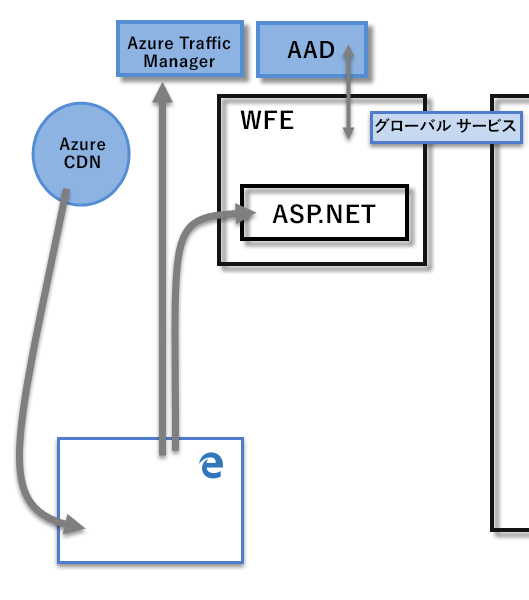
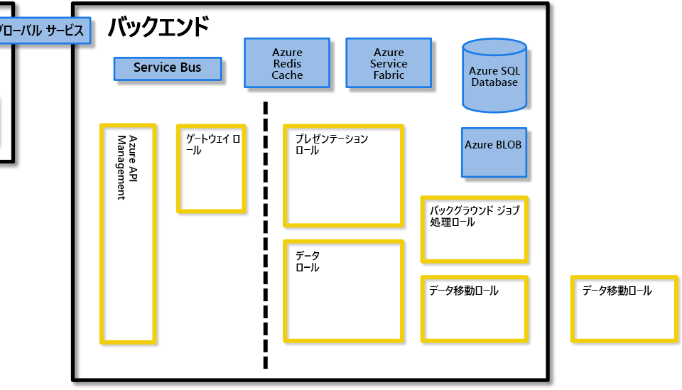
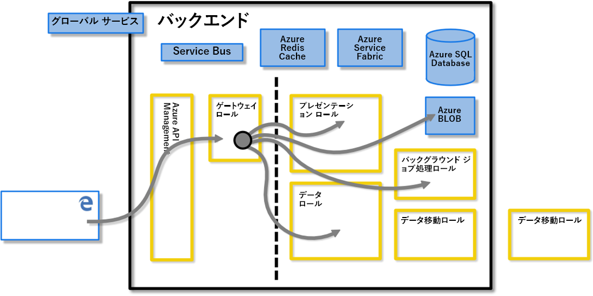
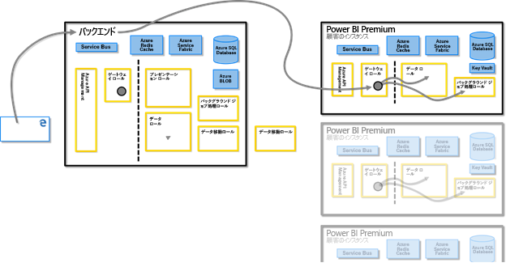
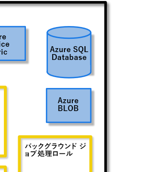
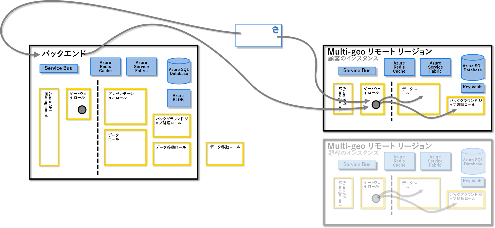
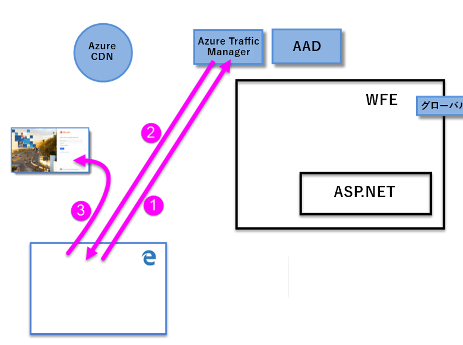
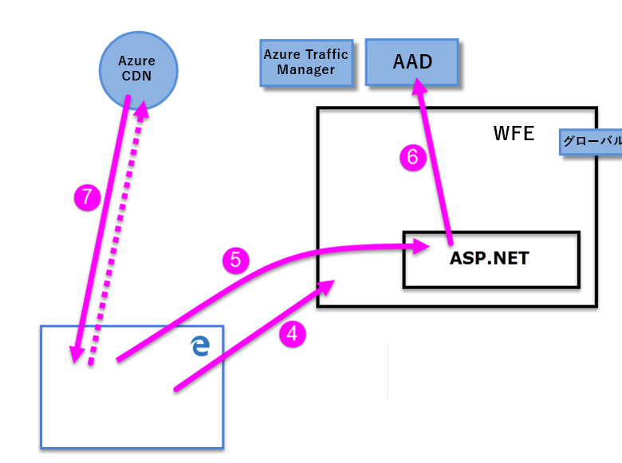

# Power BI のセキュリティに関するホワイトペーパー

**概要:** Power BI は、Microsoft のオンライン ソフトウェア サービス (*SaaS*、またはサービスとしてのソフトウェア) オファリングであり、セルフサービスのビジネス インテリジェンス ダッシュボード、レポート、データセット、および視覚エフェクトを、簡単かつ迅速に作成することができます。 Power BI では、多くの異なるデータ ソースに接続し、それらの接続からのデータを組み合わせて整形した後、他のユーザーと共有できるレポートやダッシュボードを作成することができます。

**執筆者:** David Iseminger

**技術校閲者:** Pedram Rezaei、Cristian Petculescu、Siva Harinath、Tod Manning、Haydn Richardson、Adam Wilson、Ben Childs、Robert Bruckner、Sergei Gundorov、Kasper de Jonge

**適用対象:** Power BI SaaS、Power BI Desktop、Power BI Embedded、Power BI Premium

> [!NOTE]
> ブラウザーで **[印刷]** を選択して **[PDF として保存]** を選択することで、このホワイト ペーパーを保存または印刷できます。

## 概要

**Power BI** は、Microsoft のオンライン ソフトウェア サービス (_SaaS_、またはサービスとしてのソフトウェア) オファリングであり、セルフサービスのビジネス インテリジェンス ダッシュボード、レポート、データセット、および視覚エフェクトを、簡単かつ迅速に作成することができます。 Power BI では、多くの異なるデータ ソースに接続し、それらの接続からのデータを組み合わせて整形した後、他のユーザーと共有できるレポートやダッシュボードを作成することができます。

Power BI サービスは、[Microsoft Online Services の使用条件](http://www.microsoftvolumelicensing.com/DocumentSearch.aspx?Mode=3&amp;DocumentTypeId=31)および [Microsoft Enterprise のプライバシーに関する声明](http://www.microsoft.com/privacystatement/OnlineServices/Default.aspx)によって管理されます。 データ処理の場所で、Microsoft Online Services の使用条件のデータ処理の場所の使用条件を参照してください。 コンプライアンスについては、[Microsoft セキュリティ センター](https://www.microsoft.com/trustcenter)が Power BI に関する主要なリソースです。 Power BI チームは、お客様に最新の技術革新と生産性を届けようと懸命に取り組んでいます。 Power BI は現在、[Office 365 コンプライアンス フレームワーク](http://go.microsoft.com/fwlink/p/?LinkID=618494)のレベル D です。

この記事では、Power BI のセキュリティについて、Power BI のアーキテクチャ、ユーザーが Power BI に対して認証を行う方法とデータ接続が確立される方法、Power BI でサービスによりデータが格納および移される方法の順に説明します。 最後のセクションでは、セキュリティに関する質問にお答えします。

## Power BI のアーキテクチャ

**Power BI** サービスは、Microsoft の[クラウド コンピューティング プラットフォーム](http://azure.microsoft.com/overview/what-is-azure/)である **Azure** 上に構築されています。 Power BI は現在、世界の多くのデータセンターにデプロイされています。リージョン内のお客様が利用できるようにデータセンターによって提供されている多数のアクティブなデプロイだけでなく、各アクティブなデプロイのバックアップとして提供されるパッシブなデプロイも同じくらい多く存在します。

Power BI の各デプロイは、Web フロントエンド (**WFE**) クラスターと**バックエンド** クラスターという 2 つのクラスターで構成されています。 次の図はこれら 2 つのクラスターを示したものであり、この記事の残りの部分の背景になります。 

Power BI では、アカウントの認証と管理に Azure Active Directory (**AAD**) が使用されています。 また、Power BI では、認証プロセスと静的コンテンツやファイルのダウンロードのために最も近いデータセンターにユーザー トラフィックを送信するために、**Azure Traffic Manager (ATM)** も使用されます。この送信先は、接続しようとしているクライアントの DNS レコードに基づいて決定されます。 Power BI では、**Azure Content Delivery Network (CDN)** を使用して、必要な静的コンテンツとファイルが、地理的なロケールに基づいてユーザーに効率的に配布されます。

### WFE クラスター

**WFE** クラスターは、Power BI への最初の接続と認証のプロセスを管理します。AAD を使用してクライアントを認証し、Power BI サービスへのそれ以降のクライアント接続に対してトークンを提供します。

ユーザーが Power BI サービスに接続しようとすると、クライアントの DNS サービスは **Azure Traffic Manager** と通信して、Power BI がデプロイされている最も近いデータセンターを見つけます。 このプロセスについて詳しくは、[Azure Traffic Manager による高パフォーマンスのトラフィック ルーティング方法](https://azure.microsoft.com/documentation/articles/traffic-manager-routing-methods/#performance-traffic-routing-method)に関する記事をご覧ください。

ユーザーに最も近い WFE クラスターによって、ログインと認証のシーケンス (この記事の後半で説明します) が管理され、認証が成功するとユーザーに AAD トークンが提供されます。 WFE クラスター内の ASP.NET コンポーネントでは、要求が解析されて、ユーザーが属している組織が特定された後、Power BI の**グローバル サービス**に対して問い合わせが行われます。 グローバル サービスは、全世界の WFE クラスターとバックエンド クラスターによって共有される単一の Azure テーブルであり、ユーザーと顧客組織がその Power BI テナントを格納するデータセンターにマップされています。 WFE では、組織のテナントが格納されているバックエンド クラスターが、ブラウザーに対して指定されます。 ユーザーが認証されると、それ以降のクライアントの対話はバックエンド クラスターとの間で直接行われ、WFE によって要求が仲介されることはありません。

### Power BI のバックエンド クラスター

**バックエンド** クラスターは、認証されたクライアントが Power BI サービスと対話する方法を決定します。 **バックエンド** クラスターは、視覚化、ユーザー ダッシュボード、データセット、レポート、データ ストレージ、データ接続、最新の情報への更新をはじめ、Power BI サービスと対話するためのさまざまな側面を管理します。

**ゲートウェイ ロール** は、ユーザーの要求と Power BI サービス間のゲートウェイとして機能します。 ユーザーは、ゲートウェイ ロール以外のすべてのロールと直接対話することはありません。

**重要:** Azure API Management (**APIM**) ロールとゲートウェイ (**GW**) ロール "_のみ_" が、パブリック インターネットを使用してアクセスされることに注意してください。 これらのロールは、認証、承認、DDoS に対する保護、スロットル、負荷分散、ルーティングなどの機能を提供します。

上記の**バックエンド** クラスターの図で、点線は、ユーザーがアクセス可能なただ 2 つのロール (点線の左側) と、システムだけがアクセスできるロールの境界を明確に示しています。 認証されたユーザーが Power BI サービスに接続したとき、クライアントからの接続とすべての要求は、**ゲートウェイ ロール**と **Azure API Management** によって受け入れられて管理されます。その後は、これらがユーザーに代わって Power BI サービスの残りの部分と対話します。 たとえば、クライアントがダッシュボードを表示しようとすると、**ゲートウェイ ロール**がその要求を受け入れ、それとは別に**プレゼンテーション ロール**に要求を送り、ブラウザーでダッシュボードを表示するために必要なデータを取得します。

### Power BI Premium

**Power BI Premium** では、Power BI のアクティビティに専用のリソースを必要とするサブスクライバーに、プロビジョニング済みでパーティション分割された専用のサービス ワークスペースが提供されます。 お客様が Power BI Premium サブスクリプションにサインアップすると、**Azure Resource Manager** によって Premium 容量が作成されます。 そのサブスクリプションのロールアウトでは、Power BI テナントがホストされているデータセンターで、サブスクリプション レベルに応じた一連の仮想マシンが割り当てられ (後で説明するように、Multi-Geo 環境は除きます)、**Azure Service Fabric** のデプロイとして開始されます。

作成された後は、Premium クラスターとのすべての通信は、クライアント専用の **Power BI Premium** サブスクリプション仮想マシンへの接続が確立されている、Power BI バックエンド クラスターを介してルーティングされます。

### データ ストレージのアーキテクチャ

Power BI では、データの格納と管理に 2 つの主要なリポジトリが使用されます。ユーザーからアップロードされるデータは通常、**Azure Blob** Storage に送信され、システムそのものに関するすべてのメタデータとアーティファクトは **Azure SQL Database** のファイアウォールの内側に格納されます。

たとえば、ユーザーが Excel ブックを Power BI サービスにインポートすると、メモリ内に Analysis Services の表形式データベースが作成され、最大 1 時間 (または、システムでメモリ不足が発生するまで)、データはメモリ内に格納されます。 データは、**Azure Blob** Storage にも送信されます。

ダッシュボード、レポート、最近使用したデータ ソース、ワークスペース、組織の情報、テナントの情報、システムに関するその他のメタデータなど、ユーザーの Power BI サブスクリプションについてのメタデータは、**Azure SQL Database** に格納されて更新されます。 Azure SQL Database に格納されるすべての情報は、[Azure SQL の Transparent Data Encryption](https://msdn.microsoft.com/library/dn948096.aspx) (TDE) テクノロジを使用して完全に暗号化されます。 Azure Blob Storage に格納されるすべてのデータも暗号化されます。 データの読み込み、格納、移動のプロセスについて詳しくは、「**データ ストレージと移動**」セクションで説明されています。

## テナントの作成

テナントは、組織が Azure、Microsoft Intune、Power BI、Office 365 などの Microsoft クラウド サービスにサインアップすると受け取って所有する、Azure AD サービスの専用インスタンスです。 各 Azure AD テナントは独立しており、他の Azure AD テナントとは切り離されています。

テナントには、企業内のユーザーと、ユーザーについての情報 (パスワード、ユーザー プロファイル データ、アクセス許可など) が格納されています。 また、組織とそのセキュリティに関連するグループ、アプリケーション、その他の情報も含まれます。 詳しくは、「[Azure AD テナントとは](https://msdn.microsoft.com/library/azure/jj573650.aspx#BKMK_WhatIsAnAzureADTenant)」をご覧ください。

Power BI テナントは、Office 365 または Power BI サービスが最初にプロビジョニングされるときに Azure Active Directory のテナントに対して提供された、国 (または地域) および州や都道府県などの情報に最も近いと見なされるデータセンターに作成されます。 現在、Power BI テナントはそのデータセンターの場所からは移動されません。

### 複数の地域 (Multi-Geo) - プレビュー

一部の組織では、ビジネス ニーズに基づいて複数の地域 (またはリージョン) に Power BI が存在することが必要になります。 たとえば、Power BI テナントは米国内にあるけれども、オーストラリアなどの他の地理的地域でもビジネスを行っており、そのリモート リージョンにも Power BI サービスとデータが存在する必要があるような場合があります。  2018 年後半以降、適切にプロビジョニングすると、テナントがある地理的な場所とは異なる場所の Power BI リソースにもアクセスできるようになっています。 この機能は便宜的に **Multi-Geo** と呼ばれ、このドキュメントでもそれが使用されています。

異なる地理的な場所で運用するときは注意すべき技術的な影響があり、このドキュメント全体でそのことが明記されています。 次のような重要な考慮事項があります。

- リモート リージョンに格納されているキャッシュされたクエリはそのリージョンに保存されていますが、転送される他のデータは複数の地域の間を行き来する可能性があります。
- Power BI に発行されたリモート リージョン内の PBIX または XLSX ファイルのレポートは、Power BI の Azure Blob Storage にコピーまたはシャドウ コピーとして格納され、その過程で、データは Azure Storage Service Encryption (SSE) を使用して暗号化されます。
- Multi-Geo 環境においてデータがリージョン間で移動されると、データ移動元のリージョンではガベージ コレクションが 7 から 10 日以内に行われ、その時点で、元のリージョンから移動されたデータのコピーは破棄されます。

次の図では、Multi-Geo 環境のリモート リージョンで提供されている Power BI サービスが、クライアントのリモート Power BI サブスクリプションの仮想マシンへの接続が確立されている **Power BI のバックエンド** クラスターによってルーティングされる方法が示されています。

### データセンターとロケール

Power BI は、リージョンのデータセンターで Power BI クラスターがデプロイされている場所に基づいて、特定のリージョンで提供されます。 Power BI のインフラストラクチャはさらに多くのデータセンターに展開される予定です。

次のリンクでは、Azure データセンターに関する追加情報が提供されています。

- [Azure リージョン](http://azure.microsoft.com/regions/) – Azure のグローバル プレゼンスと場所についての情報
- [リージョンごとの Azure サービス](http://azure.microsoft.com/regions/#services) – 各リージョンで Microsoft から利用できる Azure サービスの完全な一覧 (インフラストラクチャ サービスとプラットフォーム サービスの両方)。

現在、Power BI サービスは、以下のリージョンで使用でき、示されている主要なデータセンターで提供されています。

- 米国
  - 米国東部
  - 米国東部 2
  - 米国中北部
  - 米国中南部
  - 米国西部
  - 米国西部 2
- カナダ
  - カナダ中部
  - カナダ東部
- イギリス
  - 英国西部
  - 英国南部
- ブラジル
  - ブラジル南部
- ドイツ
  - ドイツ中部
  - ドイツ北東部
- ヨーロッパ
  - 北ヨーロッパ
  - 西ヨーロッパ
- 日本
  - 東日本
  - 西日本
- インド
  - インド中部
  - インド南部
  - インド西部
- アジア太平洋
  - 東アジア
  - 東南アジア
- オーストラリア
  - オーストラリア東部
  - オーストラリア南東部

ソブリン クラウドに対するデータセンターも提供されています。 ソブリン クラウドで利用可能な Power BI サービスについて詳しくは、[Power BI ソブリン クラウド](https://powerbi.microsoft.com/clouds/)に関する記事をご覧ください。

データが格納される場所とその使用方法について詳しくは、[Microsoft セキュリティ センター](https://www.microsoft.com/TrustCenter/Transparency/default.aspx#_You_know_where)でご確認ください。 保存時の顧客データの場所に関するコミットメントは、[Microsoft Online Services 規約](http://www.microsoftvolumelicensing.com/DocumentSearch.aspx?Mode=3&amp;DocumentTypeId=31)の**データ処理規約**で指定されています。

## ユーザーの認証

Power BI サービスに対するユーザーの認証は、ユーザーのブラウザーと Power BI サービスまたは Power BI で使用される Azure サービスの間で行われる、一連の要求、応答、リダイレクトで構成されます。 そのシーケンスでは、Power BI でのユーザー認証のプロセスが示されています。 組織のユーザー認証モデル (サインイン モデル) のオプションについて詳しくは、「[Choosing a sign-in model for Office 365 (Office 365 のサインイン モデルの選択)](https://blogs.office.com/2014/05/13/choosing-a-sign-in-model-for-office-365/)」をご覧ください。

### 認証シーケンス

Power BI サービスでのユーザー認証シーケンスは、以下の手順で説明するように行われます。次の図はそれを示したものです。

1. ユーザーは、ブラウザーでアドレス バーに Power BI のアドレスを入力することによって (例: https://app.powerbi.com)、または Power BI のランディング ページ (https://powerbi.microsoft.com) で _[サインイン]_ を選択することによって、Power BI サービスへの接続を始めます。 接続は TLS 1.2 と HTTPS を使用して確立され、それ以降にブラウザーと Power BI サービスの間で行われるすべての通信には HTTPS が使用されます。 要求は **Azure Traffic Manager** に送信されます。

2. **Azure Traffic Manager** では、ユーザーの DNS レコードを調べて Power BI がデプロイされている最も近いデータセンターを決定し、ユーザーを送信する必要がある WFE クラスターの IP アドレスで DNS に応答します。

3. その後、WFE でユーザーは Microsoft Online Services のログイン ページにリダイレクトされます。

    

1. 認証されたユーザーは、ログイン ページから、前に決定された最も近い Power BI サービスの **WFE クラスター**にリダイレクトされます。

2. ブラウザーからは、Microsoft Online Services への正常なログインで取得された Cookie が送信され、**WFE クラスター**の内部の **ASP.NET サービス**によって Cookie が検査されます。

3. WFE クラスターでは、**Azure Active Directory** (**AAD**) サービスによるチェックが行われて、ユーザーの Power BI サービス サブスクリプションが認証され、AAD セキュリティ トークンが取得されます。 AAD からユーザーの認証が成功したことと AAD セキュリティ トークンが返されると、WFE クラスターでは、テナントとその Power BI バックエンド クラスターの場所の一覧が保持されている **Power BI グローバル サービス**に問い合わせが行われて、ユーザーのテナントが含まれる Power BI サービス クラスターが特定されます。 その後、WFE クラスターでは、ユーザーのテナントが存在する Power BI クラスターにユーザーがリダイレクトされ、次の項目のコレクションがユーザーのブラウザーに返されます。

      - **AAD セキュリティ トークン**
      - **セッション情報**
      - ユーザーが通信して対話できる**バックエンド** クラスターの Web アドレス

1. その後、ユーザーのブラウザーは、指定された Azure CDN (一部のファイルについては WFE) にアクセスして、ブラウザーと Power BI サービスが対話できるために必要な、指定された共通ファイルのコレクションをダウンロードします。 その後、Power BI サービス ブラウザー セッションの間、ブラウザーのページには、AAD トークン、セッション情報、関連付けられたバックエンド クラスターの場所、Azure CDN と WFE クラスターからダウンロードされたファイルのコレクションが含まれるようになります。

以上の項目が完了すると、ブラウザーでは指定されたバックエンド クラスターとの接続が開始され、ユーザーと Power BI サービスとの対話が始まります。 それ以降、Power BI サービスのすべての呼び出しは指定されたバックエンド クラスターとの間で行われ、すべての呼び出しにはユーザーの AAD トークンが含まれます。 AAD トークンのタイムアウトは 1 時間です。ユーザーのセッションが開かれたままの場合は、アクセスを維持するため、WFE によってトークンが定期的に更新されます。

## データ ストレージと移動

Power BI サービスでのデータの状態は、"_保存中_" (現在は処理されておらず、Power BI ユーザーが使用可能なデータ)、または "_処理中_" (例: クエリ実行中、データ接続とモデルの処理中、データやモデルが Power BI サービスにアップロード中、アクティブにアクセスまたは更新されているデータに対してユーザーまたは Power BI サービスが他の操作を実行中) のいずれかです。 処理が行われているデータは、"_処理中データ_" と呼ばれます。 Power BI の保存データは暗号化されています。 転送中のデータ、つまり Power BI サービスによって送信または受信されているデータも、暗号化されています。

Power BI サービスによるデータの管理方法は、データが **DirectQuery** によってアクセスされているか "_否か_" によっても異なります。 したがって、Power BI のユーザー データには、DirectQuery によってアクセスされるデータと、DirectQuery によってアクセスされないデータの、2 つのカテゴリがあります。

**DirectQuery** では、Power BI ユーザーのクエリが、Microsoft の Data Analysis Expressions (DAX) 言語 (Power BI および他の Microsoft 製品によってクエリの作成に使用される言語) から、データ ソースのネイティブなデータ言語 (T-SQL や、他のデータベースのネイティブ言語など) に変換されます。 DirectQuery に関連付けられたデータは、参照によってのみ格納されます。つまり、DirectQuery がアクティブでないとき、ソース データは Power BI に格納されません (ダッシュボードやレポートを表示するために使用される視覚化データを除きます、後の_処理中データ (データ移動)_ に関するセクションを参照)。 代わりに、DirectQuery データへの参照が格納され、それによって DirectQuery が実行されるとそのデータにアクセスできます。 DirectQuery には、データ ソースへの接続に使用される接続文字列や資格情報など、クエリを実行するために必要なすべての情報が含まれ、それにより DirectQuery は含まれるデータ ソースにアクセスして自動更新を行うことができます。 DirectQuery では、基になるデータ モデルの情報が DirectQuery に組み込まれます。

DirectQuery を**使用しない**クエリは、基になるデータ ソースのネイティブ言語に直接変換 "_されない_" DAX クエリのコレクションで構成されます。 DirectQuery を使用しないクエリには基になるデータの資格情報は含まれず、基になるデータが Power BI サービスに読み込まれます。ただし、[Power BI Gateway](https://powerbi.microsoft.com/documentation/powerbi-gateway-enterprise/) を通してアクセスされるオンプレミスのデータは例外で読み込まれず、クエリではオンプレミス データへの参照のみが格納されます。

DirectQuery と他のクエリの違いによって、Power BI サービスによる保存データの処理方法と、クエリ自体が暗号化されるかどうかが決まります。 以下のセクションでは、保存データと移動中のデータ、および暗号化、場所、データを処理するプロセスについて説明します。

### 保存データ

データが保存されているときの、Power BI サービスによるデータセット、レポート、ダッシュボードのタイルの格納は、次のサブセクションで説明する方法で行われます。 前に説明したように、Power BI の保存データは暗号化されています。 以下のセクションで出てくる ETL は、Extract (抽出)、Transform (変換)、Load (読み込み) の頭文字です。

#### 暗号化キー

- Azure BLOB キーに対する暗号化キーは、暗号化されて Azure Key Vault に格納されます。
- Azure SQL Database の TDE テクノロジ用の暗号化キーは、Azure SQL 自体によって管理されます。
- データ移動サービスおよびオンプレミス データ ゲートウェイに対する暗号化キーは、次の場所に格納されます。
  - お客様のインフラストラクチャ上のオンプレミス データ ゲートウェイ内 – オンプレミスのデータ ソースの場合
  - データ移動ロール内 – クラウドベースのデータ ソースの場合

Windows Azure Blob Storage の暗号化に使用されるコンテンツ暗号化キー (CEK) は、ランダムに生成された 256 ビット キーです。 CEK によるコンテンツの暗号化に使用されるアルゴリズムは、AES\_CBC\_256 です。

CEK の暗号化に使用されるキー暗号化キー (KEK) は、事前に定義された 256 ビット キーです。 CEK を暗号化するための KEK によるアルゴリズムは、A256KW です。

復旧キーに基づくゲートウェイ暗号化キーは、オンプレミスのインフラストラクチャから外に出ることはありません。 Power BI では、暗号化されたオンプレミスの資格情報の値にアクセスできず、これらの資格情報をインターセプトすることはできません。Web クライアントでは、通信相手の特定のゲートウェイに関連付けられた公開キーで資格情報が暗号化されます。

クラウドベースのデータ ソースでは、データ移動ロールによって [Always Encrypted](https://msdn.microsoft.com/library/mt163865.aspx) のメソッドを使用して暗号化キーが暗号化されます。 [Always Encrypted データベースの機能](https://msdn.microsoft.com/library/mt163865.aspx)の詳細をご覧ください。

#### データセット

1. メタデータ (テーブル、列、メジャー、計算、接続文字列など)
      
    a. オンプレミスの Analysis Services では、暗号化されて Azure SQL に格納されるデータベースへの参照を除き、サービスには何も格納されません。
 
    b. ETL、DirectQuery、およびプッシュ データに対する他のすべてのメタデータは、暗号化されて Azure Blob Storage に格納されます。

1. 元のデータ ソースに対する資格情報
  
      a. オンプレミスの Analysis Services – 資格情報は必要なく、そのため、資格情報は保存されません。

      b. DirectQuery - これはモデルがサービス内で直接作成されるかどうかによって異なります。直接作成される場合、それは接続文字列内に格納され Azure Blob で暗号化されます。モデルが Power BI Desktop からインポートされる場合、資格情報はデータ移動の Azure SQL Database で暗号化されて格納されます。 暗号化キーは、顧客のインフラストラクチャ上でゲートウェイを実行しているコンピューターに格納されます。

      c. プッシュされたデータ - 適用できません

      d. ETL

      - **Salesforce** または **OneDrive** の場合 – 更新トークンは、Power BI サービスの Azure SQL Database で暗号化されて格納されます。
      - それ以外の場合: 
        - データセットが更新の対象として設定されている場合、資格情報はデータ移動の Azure SQL Database で暗号化されて格納されます。 暗号化キーは、顧客のインフラストラクチャ上でゲートウェイを実行しているコンピューターに格納されます。
        - データセットが更新の対象として設定されていない場合は、データ ソースの資格情報は格納されません。

1. 入力

    a. オンプレミスの Analysis Services と、DirectQuery – Power BI サービスでは何も格納されません。

    b. ETL – Azure Blob ストレージで暗号化されます。しかし、Power BI サービスの Azure Blob ストレージに現在あるすべてのデータに [Azure Storage Service Encryption (SSE)](https://docs.microsoft.com/azure/storage/common/storage-service-encryption) (サーバー側の暗号化とも呼ばれる) が使用されます。 Multi-Geo でも SSE が使用されます。

    c. プッシュ データ v1 – Azure Blob ストレージで暗号化されて格納されます。しかし、Power BI サービスの Azure Blob ストレージに現在あるすべてのデータに [Azure Storage Service Encryption (SSE)](https://docs.microsoft.com/azure/storage/common/storage-service-encryption) が使用されます (サーバー側の暗号化とも呼ばれる)。 Multi-Geo でも SSE が使用されます。

    d. プッシュ データ v2 – Azure SQL で暗号化されて格納されます。

Power BI では、クライアント側の暗号化の手法 (暗号ブロック チェーン (CBC) と Advanced Encryption Standard (AES) を組み合わせて使用) を使用してその Azure Blob ストレージが暗号化されます。 クライアント側の暗号化の詳細については、[こちら](https://azure.microsoft.com/documentation/articles/storage-client-side-encryption/)を参照してください。

Power BI では、次の方法でデータ整合性の監視が実現されます。

* Azure SQL の保存データの場合、Power BI では、SQL のネイティブ オファリングの一部として dbcc、TDE、およびコンスタント ページ チェックサムが使用されます。

* Azure Blob ストレージの保存データの場合、Power BI では、クライアント側の暗号化と、ストレージにデータを転送するための HTTPS が使用されます。これにはデータの取得中の整合性チェックが含まれます。 Azure Blob ストレージのセキュリティの詳細については、[こちら](https://azure.microsoft.com/documentation/articles/storage-security-guide/)を参照してください。

#### レポート

1. メタデータ (レポートの定義)

   a. レポートは、Excel for Office 365 レポートまたは Power BI レポートのいずれかとすることができます。 レポートの種類に基づいて、メタデータには次が適用されます。

       a. Excel Report metadata is stored encrypted in SQL Azure. Metadata is also stored in Office 365.
       
       b. Power BI reports are stored encrypted in Azure SQL database.

2. 静的データ

   静的データには、背景イメージやカスタム ビジュアルなどの成果物が含まれます。

    a. Excel for Office 365 で作成されたレポートの場合は、何も格納されません。

    b. Power BI レポートの場合、静的データは Azure Blob ストレージで暗号化されて格納されます。

3. キャッシュ a  Excel for Office 365 で作成されたレポートの場合は、何もキャッシュされません。

    b. Power BI レポートの場合、表示されるビジュアルのデータは Azure SQL Database で暗号化されてキャッシュされます。
 

4. Power BI に発行される元の Power BI Desktop (.pbix) または Excel (.xlsx) ファイル

    場合によっては、.xlsx または .pbix ファイルのコピーまたはシャドウ コピーは、Power BI の Azure Blob ストレージに格納され、その格納時にデータの暗号化が行われます。 Power BI サービスで Azure Blob ストレージに格納されるすべてのそのようなレポートでは、[Azure Storage Service Encryption (SSE)](https://docs.microsoft.com/azure/storage/common/storage-service-encryption) (サーバー側の暗号化とも呼ばれる) が使用されます。 Multi-Geo でも SSE が使用されます。

#### ダッシュボードおよびダッシュボード タイル

1. キャッシュ – ダッシュ ボード上のビジュアルによって必要とされるデータは、通常、Azure SQL Database で暗号化されてキャッシュおよび格納されます。 Excel または SQL Server Reporting Services (SSRS) からのピン留めされたビジュアルなど、他のタイルは、イメージとして Azure Blob に格納され、暗号化も行われます。

2. 静的データ – Azure Blob ストレージに暗号化された状態で格納される背景イメージやカスタム ビジュアルなどの成果物が含まれます。

使用されている暗号化の方法に関係なく、Microsoft はシークレット ストアまたは Azure Key Vault のいずれかによってキーの暗号化をお客様に代わって管理します。

### 非揮発性デバイスに一時的に格納されたデータ

非揮発性デバイスに一時的に格納されたデータについて以下に説明します。

#### データセット

1. メタデータ (テーブル、列、メジャー、計算、接続文字列など)

2. スキーマに関連する一部の成果物は、計算ノードのディスク上に一定の時間、格納することができます。 また、一部の成果物は、Azure REDIS Cache に暗号化されていない状態で一定の時間、格納できます。

3. 元のデータ ソースに対する資格情報

    a. オンプレミスの Analysis Services - 何も格納されません

    b. DirectQuery - これはモデルがサービス内で直接作成されるかどうかによって異なります。直接作成される場合、それは、(暗号化された情報と共に) 同じ場所にクリア テキストで格納された暗号化キーを使用する暗号化形式で、接続文字列内に格納されます。モデルが Power BI Desktop からインポートされる場合、資格情報は非揮発性デバイス上に格納されません。

    c. プッシュされたデータ - なし (適用できません)

    d. ETL - なし (計算ノードには何も格納されず、また上記の「**保存データ**」セクションの説明と違いはありません)
4. 入力

    一部のデータ成果物は、計算ノードのディスク上に一定の時間、格納することができます。

### 処理中のデータ

データがユーザーによって活発に使用またはアクセスされている場合、データは処理中です。 たとえば、ユーザーがデータセットにアクセスし、ダッシュ ボードまたはレポートを修正または変更しているとき、更新が行われているとき、またはその他の考えられるデータ アクセス アクティビティが行われているとき、データは処理中です。 それらのイベントのいずれかが発生し、データが処理中の状態になると、Power BI サービスの**データ ロール**によってインメモリ Analysis Services (AS) データベースが作成され、そのインメモリ Analysis Services (AS) データベースにデータセットが読み込まれます。 データセットが DirectQuery に基づいているかどうかに関係なく、AS データベースに読み込まれるデータは暗号化が解除されるので、**データ ロール**によるデータへのアクセスが可能になります。そのデータは、Power BI サービスで不要になるまで、次のアクセスに備えてメモリ内に保持されます。 Power BI Premium サブスクリプションを持つお客様の場合、お客様の個別にプロビジョニングされた Power BI 仮想マシンのコレクションにメモリ内 Analysis Services (AS) データベースが作成されます。

データが操作されると (Power BI へのデータの最初の読み込みを含む)、データセットが DirectQuery に基づいているかどうかに関係なく、Power BI サービスでは視覚エフェクト データが暗号化された **Azure SQL データベース**でキャッシュされる場合があります。

処理中のデータのデータ整合性を監視するために、Power BI では HTTPS、TCP/IP、および TLS を使用して、転送中にデータが暗号化され、整合性が維持されていることを確認します。

## データ ソースのユーザー認証

各データ ソースに対して、ユーザーは自分のログインに基づいて接続を確立し、データにその資格情報を使用してアクセスします。 次にユーザーは基になるデータに基づいてクエリ、ダッシュボード、およびレポートを作成することができます。

ユーザーがクエリ、ダッシュ ボード、レポート、または視覚エフェクトを共有する場合、そのデータと該当する視覚エフェクトへのアクセスは、基になるデータ ソースによってロール レベルのセキュリティ (RLS) がサポートされているかどうかによって異なります。

基になるデータ ソースによって **Power BI の *** ロール レベルのセキュリティ (RLS)** がサポートされている場合、Power BI サービスによってそのロール レベルのセキュリティが適用されるので、その基になるデータにアクセスするのに十分な資格情報を持っていないユーザーは (ダッシュボード、レポート、その他のデータ成果物で使用されるクエリの場合が考えられる)、自分が十分な権限持っていないデータについては表示することがことができません。 基になるデータへのユーザーのアクセスが、ダッシュボードまたはレポートを作成したユーザーとは異なる場合、視覚エフェクトおよびその他の成果物では、ユーザーがデータに対して持つアクセスのレベルに基づいて該当するデータのみが表示されます。

データ ソースによって RLS が適用**されない**場合、Power BI ログイン資格情報が基になるデータ ソースに適用されます。あるいは接続中に他の資格情報が与えられた場合、それらの与えられた資格情報が適用されます。 ユーザーが非 RLS データ ソースから Power BI サービスにデータを読み込む場合、このドキュメントの「**データ ストレージと移動**」セクションに説明したように、データは Power BI で格納されます。 非 RLS データ ソースについては、データが他のユーザーと共有された場合 (ダッシュ ボードやレポートを介するなどして)、またはデータの更新が発生した場合、元の資格情報を使用してデータへのアクセスまたはデータの表示が行われます。

RLS データ ソースと非 RLS データ ソースを比較対照する簡単な例としては、Sam がレポートとダッシュボードを作成し、それを Abby および Ralph と共有する場合を想像してください。 レポートとダッシュ ボード内で使用されるデータ ソースが、RLS をサポート**していない**データ ソースからのものである場合、Abby と Ralph は両方とも Sam がダッシュボードに含めたデータ (Power BI サービスにアップロードされたデータ) を見ることができ、さらに Abby と Ralph は両方ともデータを操作することができます。 これに対し、Sam が RLS をサポートしているデータ ソースからレポートおよびダッシュ ボードを作成して、それを Abby および Ralph と共有した場合、Abby がダッシュ ボードを表示しようとすると、次のことが発生します。

1. ダッシュ ボードは RLS データ ソースから作成されたものであるので、Power BI サービスがデータ ソースに対してクエリを実行して、ダッシュボードの基になるクエリに関連付けられた接続文字列内に指定された現在のデータセットを取得している間、ダッシュボードの視覚エフェクトには少しの間、&quot;読み込み中&quot;を表すメッセージが表示されます。

2. データは Abby の資格情報とロールに基づいてアクセスおよび取得され、Abby が十分な認可を所持しているデータのみがダッシュボードとレポートに読み込まれます。

3. ダッシュ ボードとレポート内の視覚エフェクトは、Abby のロール レベルに基づいて表示されます。

共有されたダッシュ ボードまたはレポートに Ralph がアクセスする場合も、Ralph が持つロール レベルに基づいて同じ順序で処理が行われます。

## Power BI と ExpressRoute

Power BI と ExpressRoute を使用すると、組織から Power BI へのプライベート ネットワーク接続を作成して (または ISP の共用施設を使用して) インターネットを迂回することにより、機密性の高い Power BI データおよび接続のセキュリティを高めることができます。

ExpressRoute は、(Power BI が存在する) Azure データセンターとオンプレミスのインフラストラクチャとの間または Azure データセンターとコロケーション環境との間にプライベート接続を作成することを可能にする Azure サービスです。 詳細については、「[Power BI と ExpressRoute](https://powerbi.microsoft.com/documentation/powerbi-admin-power-bi-expressroute/)」の記事を参照してください。

## Power BI Mobile

Power BI Mobile は、次の主要な 3 つのモバイル プラットフォーム用に設計されたアプリのコレクションです。Android、iOS、および Windows Mobile。 Power BI Mobile アプリのセキュリティに関する考慮事項は、2 つのカテゴリに分類されます。

* デバイスの通信
* デバイス上のアプリケーションとデータ

**デバイスの通信**に関しては、すべての Power BI Mobile アプリケーションは Power BI サービスと通信し、このホワイト ペーパーで既に詳しく説明したとおり、ブラウザーで使用されるものと同じ接続と認証シーケンスを使用します。 Power BI との通信チャンネルを確立するため、iOS と Android の Power BI Mobile アプリケーションはそのアプリケーション内でブラウザー セッションを開始し、Windows のモバイル アプリケーションはブローカーを開始します。

次の表は、モバイル デバイス プラットフォームに基づく Power BI Mobile の証明書ベースの認証 (CBA) のサポートを示したものです。

| **CBA サポート** | **iOS** | **Android** | **Windows** |
| --- | --- | --- | --- |
| **Power BI** (サービスにサインイン) | サポートされている | サポートされている | サポートされていません |
| **SSRS ADFS** (SSRS サーバーに接続) | サポートされていません | サポートされている | サポートされていません |

Power BI Mobile アプリは、積極的に Power BI サービスと通信します。 利用統計情報はモバイル アプリの利用統計情報や類似のデータの収集に使用され、利用状況とアクティビティを監視するために使用するサービスに転送されます。個人を特定できる情報 (PII) が利用統計情報とともに送信されることは一切ありません。

**デバイス上の Power BI アプリケーション**は、アプリの利用を支援するデバイス上にデータを格納します。

* Azure Active Directory と更新トークンは、業界標準のセキュリティ対策を使用して、デバイス上の安全なメカニズムに格納されます。

* データはデバイス上のストレージにキャッシュされ、アプリケーション自体によって直接暗号化されません。

* 設定も暗号化されていない状態でデバイスに格納されますが、実際のユーザー データは一切格納されません。

Power BI Mobile からのデータ キャッシュは 2 週間、あるいは、アプリが削除されるまで、ユーザーが Power BI Mobile からサインアウトするまで、またはユーザーがサインインに失敗するまで (トークンの有効期限イベントやパスワードの変更など)、デバイス上に残ります。 データ キャッシュには、以前 Power BI Mobile アプリからアクセスしたダッシュボードとレポートが含まれます。

Power BI Mobile アプリケーションは、デバイス上のフォルダーは参照しません。 Power BI Mobile アプリ内のオフライン データの詳細については、[こちら](https://powerbi.microsoft.com/documentation/powerbi-mobile-offline-android/)を参照してください。

Power BI Mobile が使用可能な 3 つのプラットフォームすべてで、モバイル デバイスとアプリケーションの管理を提供するソフトウェア サービスである、Microsoft Intune をサポートしています。 Intune を有効にして構成すると、モバイル デバイス上のデータが暗号化され、Power BI アプリケーション自体を SD カードにインストールすることができません。 Microsoft Intune の詳細については、[こちら](http://www.microsoft.com/cloud-platform/microsoft-intune)を参照してください。

## Power BI のセキュリティに関する質問と回答

以下に示すのは、Power BI に関する一般的なセキュリティの質問と回答です。 このホワイトペーパーに追加された時期を基準に並べられているため、このペーパーが更新されたときに最新の質問と回答を簡単に見つけることができます。 最新の質問は、このリストの末尾に追加されます。

**ユーザーが Power BI を使用しているとき、データ ソースにどのように接続、アクセスするのですか?**

* **Power BI の資格情報とドメインの資格情報:** ユーザーはメール アドレスを使用して Power BI にログインします。ユーザーがデータ ソースに接続しようとすると、Power BI へのログインに使用したメール アドレスが資格情報として渡されます。 ドメイン接続されたリソース (オンプレミスまたはクラウドベース) の場合、ディレクトリ サービスによって、ログインに使用したメール アドレスが_ユーザー プリンシパル名_ ([UPN](https://msdn.microsoft.com/library/windows/desktop/aa380525(v=vs.85).aspx)) とマッチングされます。 作業ベースのメール アドレスを使用して Power BI にログインしている組織の場合 (_david@contoso.com_ など、作業リソースへのログインに使用するメール アドレスと同じもの)、マッピングはシームレスに行われます。作業ベースのメール アドレスを使用しなかった組織の場合 (_david@contoso.onmicrosoft.com_ など)、Power BI ログイン資格情報でのオンプレミス リソースへのアクセスを可能にするため、ディレクトリ マッピングを確立する必要があります。

* **SQL Server Analysis Services と Power BI:** Power BI では、オンプレミス SQL Server Analysis Services を使用している組織に対し、Power BI オンプレミス データ ゲートウェイ (これは、前のセクションで説明したとおり、**ゲートウェイ**です) を提供しています。  Power BI オンプレミス データ ゲートウェイは、データ ソースに対してロールレベルのセキュリティ (RLS) を適用できます。 RLS の詳細については、この文書の前半にある「**データ ソースに対するユーザー認証**」を参照してください。 [Power BI Gateway](https://powerbi.microsoft.com/documentation/powerbi-gateway-enterprise/)に関する記事で、より詳しい情報を確認することもできます。

  さらに、組織は**シングル サインオン** (SSO) に Kerberos を使用し、SQL Server、SAP HANA、Teradata などのオンプレミス データ ソースに Power BI からシームレスに接続することができます。 詳細な情報、特定の構成要件については、[**Power BI からオンプレミス データ ソースへの SSO での Kerberos の使用**](https://docs.microsoft.com/power-bi/service-gateway-kerberos-for-sso-pbi-to-on-premises-data)に関する記事を参照してください。

* **ドメインに参加していない接続**:ドメインに参加していない、ロール レベル セキュリティ (RLS) 非対応のデータ接続の場合、ユーザーは接続シーケンスの間に資格情報を提供する必要があります。データ接続を確立するため、Power BI がその資格情報をデータ ソースに渡します。 アクセス許可が十分な場合は、データ ソースから Power BI サービスにデータが読み込まれます。

**データはどのように Power BI に転送されるのですか?**

* Power BI により要求され転送されたデータはすべて、データ ソースから Power BI サービスに接続するため、転送中に HTTPS を使用して暗号化されます。 データ プロバイダーによって安全な接続が確立され、一度接続が確立されれば、データがネットワーク上を通過します。

**Power BI はどのようにレポート、ダッシュボード、モデル データをキャッシュするのですか? また、それは安全ですか?**

* データ ソースがアクセスされたとき、Power BI サービスは、このドキュメントの前半にある「**データ ストレージと移動**」セクションに記述されたプロセスに従います。

**クライアントは Web ページ データをローカルにキャッシュしますか?**

* ブラウザー クライアントが Power BI にアクセスすると、Power BI Web サーバーは _Cache-Control_ ディレクティブを _no-store_に設定します。 _no-store_ ディレクティブはブラウザーに対して、ユーザーが表示中の Web ページをキャッシュしないよう、またクライアントのキャッシュ フォルダーにその Web ページを保存しないよう、指示します。

**ロールベース セキュリティ、レポートやダッシュボードの共有、データ接続について教えてください。データ アクセス、ダッシュボード表示、レポート アクセスまたは更新において、どのように機能しますか?**

* **ロールレベル セキュリティ (RLS) 以外**が有効なデータ ソースの場合、ダッシュボード、レポート、またはデータ モデルが他のユーザーと Power BI を介して共有されている場合、そのデータは表示と対話処理のために共有されているユーザーが利用可能となります。 Power BI はデータの元のソースに対するユーザーの再認証を*行いません*。データが一度 Power BI にアップロードされたら、ソース データに対して認証されているユーザーが、どのユーザーとグループがそのデータを表示可能であるかを管理する責任があります。

  **RLS** 対応のデータ ソース (Analysis Services データ ソースなど) に対してデータ接続が行われた場合、ダッシュボード データのみが Power BI 内にキャッシュされます。 RLS 対応のデータ ソースからのデータを使用する Power BI でレポートまたはデータセットが表示またはアクセスされるたびに、Power BI サービスはそのデータ ソースにアクセスし、ユーザーの資格情報に基づいてデータを取得します。十分なアクセス許可がある場合は、データがそのユーザーのレポートまたはデータ モデルに読み込まれます。 認証に失敗した場合、エラーが表示されます。

  詳細については、この文書の前半にある「**データ ソースに対するユーザー認証**」セクションを参照してください。

**私たちのユーザーは同じデータ ソースに常に接続しています。そのなかには、ドメイン資格情報とは異なる資格情報が必要なものがあります。** データに接続するたびにこのような資格情報を入力することを避けるためには、どうしたらいいでしょうか?

* Power BI が提供する [Power BI Personal Gateway](https://support.powerbi.com/knowledgebase/articles/649846) という機能を使用すると、ユーザーは複数の異なるデータ ソースに対する資格情報を作成し、それらのデータ ソースにアクセスするときにその資格情報を自動的に使用することができるようになります。 詳細については、[Power BI Personal Gateway](https://support.powerbi.com/knowledgebase/articles/649846)に関する記事を参照してください。

**Power BI グループについて教えてください。**

* Power BI グループを使用すると、ユーザーは確立されたチーム内で簡単かつスピーディーに、ダッシュボード、レポート、データ モデルの作成を共同で行うことができます。 たとえば、直属チームのメンバー全員が含まれている Power BI グループがあれば、Power BI からそのグループを選ぶことで、チーム全員と簡単に共同作業を行うことができます。 Power BI グループは、Office 365 ユニバーサル グループ ([詳細情報](https://support.office.com/Article/Find-help-about-Groups-in-Office-365-7a9b321f-b76a-4d53-b98b-a2b0b7946de1)、[作成方法](https://support.office.com/Article/View-create-and-delete-Groups-in-the-Office-365-admin-center-a6360120-2fc4-46af-b105-6a04dc5461c7)、[管理方法](https://support.office.com/Article/Manage-Group-membership-in-the-Office-365-admin-center-e186d224-a324-4afa-8300-0e4fc0c3000a)) と同じものです。また、データのセキュリティ保護のため、Azure Active Directory で使用されている認証メカニズムと同じものが使用されています。 [Power BI でグループを作成](https://support.powerbi.com/knowledgebase/articles/654250)することも、Office 365 管理センターでユニバーサル グループを作成することもできます。どちらの場合でも同じようにグループが Power BI に作成されます。

  Power BI グループで共有されているデータは、Power BI で共有されているその他のデータすべてと同じセキュリティに関する考慮事項が適用されることに注意してください。 **RLS 非対応**のデータ ソースの場合、Power BI はデータの元のソースに対するユーザーの再認証を**行いません**。データが一度 Power BI にアップロードされたら、ソース データに対して認証されているユーザーが、どのユーザーとグループがそのデータを表示可能であるかを管理する責任があります。 詳細については、この文書の前半にある「**データ ソースに対するユーザー認証**」セクションを参照してください。

  Power BI 内のグループに関する詳細については、[こちら](https://support.powerbi.com/knowledgebase/articles/654247)を参照してください。

**オンプレミス データ ゲートウェイと個人用ゲートウェイで使用されるポートは何ですか?接続のために許可する必要があるドメイン名はありますか?**

* この質問に対する詳細な回答は、次のリンクで入手できます: [https://powerbi.microsoft.com/documentation/powerbi-gateway-enterprise](https://powerbi.microsoft.com/documentation/powerbi-gateway-enterprise)

**オンプレミス データ ゲートウェイを使用している場合、回復キーはどのように使用され、どこに格納されるのですか?また、安全な資格情報管理について教えてください。**

* ゲートウェイのインストールと構成中に、管理者はゲートウェイの**回復キー**を入力します。 その**回復キー**は、さらに強力なキーの 2 つのセットを生成するために使用されます。

  - **RSA** 非対称キー
  - **AES** 対称キー

  これらの生成されたキー (**RSA** と **AES** ) は、ローカル コンピューター上のファイルに格納されます。 そのファイルも、暗号化されます。 ファイルのコンテンツは、特定の Windows コンピューターと特定のゲートウェイ サービス アカウントでのみ、暗号化を解除することができます。

  Power BI サービスの UI でユーザーがデータ ソースの資格情報を入力すると、その資格情報はブラウザーによって、公開キーを使用して暗号化されます。 ゲートウェイが AES 対称キーを使用してその暗号化された資格情報をさらに暗号化した後に、そのデータが Power BI に保存されます。 このプロセスでは、Power BI サービスは暗号化されていないデータへはアクセスできません。

**オンプレミス データ ゲートウェイで使用される通信プロトコルは何ですか? また、どのようにセキュリティ保護されていますか?**

* ゲートウェイでは、次の 2 つの通信プロトコルがサポートされています。

  - **AMQP 1.0 – TCP + TLS** :このプロトコルでは、発信のために、ポート 443、5671-5672、9350-9354 を開く必要があります。 このプロトコルは、通信のオーバーヘッドが少なくなるため、推奨されます。

  - **HTTPS – WebSockets over HTTPS + TLS** :このプロトコルは、ポート 443 のみを使用します。 WebSocket は、1 つの HTTP CONNECT メッセージによって開始されます。 一度チャンネルが確立されると、通信は基本的に TCP+TLS となります。 [On-Premises ゲートウェイ](https://powerbi.microsoft.com/documentation/powerbi-gateway-onprem/)に関する記事で説明されているように設定を変更すると、ゲートウェイでこのプロトコルを使用するよう強制することができます。

**Power BI での Azure CDN の役割は何ですか?**

* 前述したとおり、Power BI は **Azure Content Delivery Network (CDN)** を使用して、必要な静的コンテンツとファイルを地理的なロケールに基づいてユーザーに効率的に配布します。 さらに詳細な処理のため、Power BI サービスは複数の **CDN** を使用して、必要な静的コンテンツとファイルをパブリック インターネット経由でユーザーに効率的に配布します。 これらの静的ファイルには、製品ダウンロード (**Power BI Desktop**、**オンプレミス データ ゲートウェイ**、さまざまな独立系サービス プロバイダーから提供される Power BI アプリなど)、その後に Power BI サービスとの接続を開始および確立するためのブラウザー構成ファイル、および初期のセキュリティで保護された Power BI ログイン ページが含まれます。

  Power BI サービスへの初期接続時に提供された情報に基づいて、ユーザーのブラウザーは指定の Azure **CDN** (一部のファイルの場合は **WFE** ) に接触し、ブラウザーの Power BI サービスとの対話処理を有効化するために必要な指定の共通ファイルのコレクションをダウンロードします。 その後ブラウザーのページには AAD トークン、セッション情報、関連する**バック エンド** クラスターの場所、Azure **CDN** と **WFE** クラスターからダウンロードされたファイルのコレクションが、Power BI サービス ブラウザー セッションの間含まれるようになります。

**カスタム ビジュアルの場合、Microsoft ではカスタム ビジュアル コードのセキュリティまたはプライバシーの評価を、ギャラリーへのアイテムの発行前に行いますか?**

* いいえ。 カスタム ビジュアル コードが信頼に値するかどうかを確認して決定するのは、お客様の責任となります。 カスタム ビジュアルの誤ったコードが Power BI サービスの残りの部分に悪影響を及ぼさないよう、すべてのカスタム ビジュアル コードはサンド ボックス環境で運用されます。

**自社のネットワークの外部に情報を送信する、その他の Power BI ビジュアルはありますか?**

* はい。 Bing 地図と ESRI ビジュアルは、これらのサービスを使用するビジュアルに関して、Power BI サービスの外部にデータを送信します。 Power BI 外部テナント トラフィックに関する詳細な情報については、「[**Power BI と ExpressRoute**](https://powerbi.microsoft.com/documentation/powerbi-admin-power-bi-expressroute/)」を参照してください。

**データ主権について教えてください。データが国境を超えないよう、特定の地域内にあるデータ センター内のテナントをプロビジョニングすることはできますか?**

* 一部の特定の地域のお客様には、データ ストレージと処理が他のすべてのデータセンターから分離されているソブリン クラウドにテナントを作成できるオプションが用意されています。 ソブリン クラウドには若干異なる種類のセキュリティが適用されています。別のデータ トラスティが、ソブリン クラウド Power BI サービスを Microsoft の代理で運営するためです。

  または、お客様も特定の地域にテナントをセット アップすることができます。ただしそのようなテナントには Microsoft からの別のデータ トラスティは存在しません。 ソブリン クラウドの価格は、一般の商用 Power BI サービスと異なります。 ソブリン クラウドに対する Power BI サービスの可用性の詳細については、[Power BI ソブリン クラウド](https://powerbi.microsoft.com/clouds/)に関するページを参照してください。

**Power BI Premium サブスクリプションをお持ちのお客様に対して、Microsoft は接続をどのように扱いますか?これらの接続は、Premium 以外の Power BI サービス用に確立されたものとは異なるのでしょうか?**

* Power BI Premium のサブスクリプションをお持ちのお客様に対して確立された接続は、アクセス制御と承認を有効にする Azure Active Directory (AD) を使用して、[Azure 企業間取引 (B2B)](https://docs.microsoft.com/azure/active-directory/active-directory-b2b-what-is-azure-ad-b2b) 承認プロセスを実装します。 Power BI は、その他の Azure AD ユーザーの場合と同様に、Power BI Premium のサブスクライバーから Power BI Premium のリソースへの接続を処理します。

## まとめ

Power BI サービスのアーキテクチャは、Web フロントエンド (WFE) クラスターとバック エンド クラスターという 2 つのクラスターに基づいています。 WFE クラスターは、Power BI サービスへの最初の接続と認証を担当します。認証が完了した後は、その後のユーザーとの対話をすべてバックエンドが処理します。 Power BI では、Azure Active Directory (AAD) を使用してユーザー ID を格納および管理し、データとメタデータの格納については、それぞれ Azure BLOB と Azure SQL Database を使用して管理します。

Power BI でのデータ ストレージとデータの処理は、データが DirectQuery を使用してアクセスされるかどうか、またクラウドまたはオンプレミスのどちらにデータ ソースが存在するかによって、異なります。 Power BI では、ロール レベル セキュリティ (RLS) の適用も可能であり、オンプレミス データへのアクセスを提供するゲートウェイとの対話処理も行います。

## フィードバックと提案

お客様からのフィードバックをお待ちしております。 このホワイトペーパーに関する改善点、追加点、不明点に関する提案、そして Power BI に関するその他のコンテンツに関する提案を是非お聞かせください。 送信先: [pbidocfeedback@microsoft.com](mailto:pbidocfeedback@microsoft.com)

## その他のリソース

Power BI に関するその他の詳細については、次のリソースを参照してください。

- [Power BI 内のグループ](https://support.powerbi.com/knowledgebase/articles/654247)
- [Power BI Desktop の概要](https://support.powerbi.com/knowledgebase/articles/471664)
- [Power BI Gateway](https://powerbi.microsoft.com/documentation/powerbi-gateway-enterprise/)
- [Power BI REST API の概要](https://msdn.microsoft.com/library/dn877544.aspx)
- [Power BI API リファレンス](https://msdn.microsoft.com/library/mt147898.aspx)
- [オンプレミス データ ゲートウェイ](https://powerbi.microsoft.com/documentation/powerbi-gateway-onprem/)
- [Power BI と ExpressRoute](https://powerbi.microsoft.com/documentation/powerbi-admin-power-bi-expressroute/)
- [Power BI ソブリン クラウド](https://powerbi.microsoft.com/clouds/)
- [Power BI Premium](https://aka.ms/pbipremiumwhitepaper)
- [Power BI からオンプレミス データ ソースへの SSO での Kerberos の使用](https://docs.microsoft.com/power-bi/service-gateway-kerberos-for-sso-pbi-to-on-premises-data)